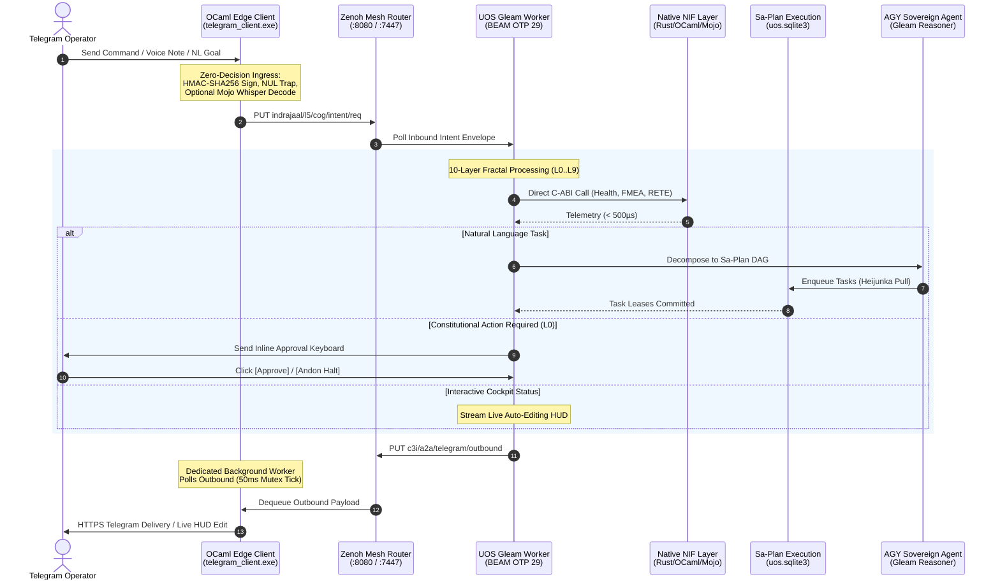

# UOS Telegram Fractal Vector x Operational Surface Synthesis and AGY Feature Blueprint Wiki
#fractal-l0 #fractal-l1 #fractal-l2 #fractal-l3 #fractal-l4 #fractal-l5 #fractal-l6 #fractal-l7 #fractal-l8 #fractal-l9 #zero-muda #tailscale-web #km-triad #gleam-first #algebraic-atlas #agy-features

- **Tailscale FQDN Link**: [http://nas-1.tail55d152.ts.net:4100/wiki/20260909-2230-uos-telegram-fractal-vector-surface-and-agy-features.md](http://nas-1.tail55d152.ts.net:4100/wiki/20260909-2230-uos-telegram-fractal-vector-surface-and-agy-features.md)
- **Live Markdown Viewer**: [http://nas-1.tail55d152.ts.net:4100/docs/wiki/20260909-2230-uos-telegram-fractal-vector-surface-and-agy-features.md](http://nas-1.tail55d152.ts.net:4100/docs/wiki/20260909-2230-uos-telegram-fractal-vector-surface-and-agy-features.md)
- **Design Specification**: [http://nas-1.tail55d152.ts.net:4100/docs/design/20260909-2230-uos-telegram-fractal-vector-surface-spec-and-design.md](http://nas-1.tail55d152.ts.net:4100/docs/design/20260909-2230-uos-telegram-fractal-vector-surface-spec-and-design.md)
- **Algebraic Atlas JSON**: [http://nas-1.tail55d152.ts.net:4100/docs/design/20260909-2230-uos-telegram-fractal-vector-algebraic-atlas.json](http://nas-1.tail55d152.ts.net:4100/docs/design/20260909-2230-uos-telegram-fractal-vector-algebraic-atlas.json)

Transclusions:
- `[[zk:20260909-2230-adr-102-telegram-fractal-vector-surface-and-agy-features]]`
- `[[zk:20260909-2215-adr-101-telegram-gleam-harness-denotational-spec-and-algebraic-atlas]]`
- `[[zk:20260905-1801-moc-uos-unified-master]]`
- `[[wiki:20260905-1801-uos-zk-km-corpus-index]]`

---

## 1. Executive Summary & 10-Cycle Matrix

The Unified Operational System (UOS) establishes that **all Telegram messages directed to `@c3i_talk_bot` are handled exclusively by the UOS Gleam harness (`apps/cepaf_gleam`)**. The native OCaml edge transport (`tools/telegram_client.exe`) operates strictly as a zero-decision I/O forwarding bridge and rate-limited egress spooler.

This wiki article synthesizes the **10-Cycle Multidimensional Vector Matrix** crossing each fractal layer $L_0 \dots L_9$ with the entire operational surface and core SRE/SDLC use cases:
- **$L_0$ Constitutional**: Prajna circuit breaker, 2oo3 multi-agent quorum, and emergency Andon line.
- **$L_1$ Atomic / NIF**: Sub-millisecond C-ABI telemetry in Rust/OCaml/Mojo and root OS NVMe drive serial protection (`HARD_DENIED_SYSTEM_OS_SERIAL = "25503L801736"`).
- **$L_2$ Component / STM**: Two-Lattice STM join-semilattices separating non-interfering observations from action commits.
- **$L_3$ Transaction / TPS**: Sa-Plan Heijunka pull-based task queues and SQLite WAL audit ledgers.
- **$L_4$ System / ZigVM**: Deterministic ZigVM kernel execution, descriptor-relative VFS backend, and Solo5 sandboxes.
- **$L_5$ Cognitive / OODA**: Scott continuous domains, finite Kleene fixed points, and Lyapunov stability ($\dot{V} \le 0$).
- **$L_6$ Swarm / Mesh**: Decentralized work-stealing swarm mesh and typed ACL multi-agent coordination.
- **$L_7$ Federation / Transport**: Monoidal Zenoh mesh transport, OTel span tensor products, and 50ms mutex-synchronized outbound dequeue.
- **$L_8$ Knowledge Sheaf**: Hermes Wiki transclusion engine, Gospel behavioral contracts, and 102 contiguous ZK ADRs.
- **$L_9$ Homeostasis / SRE**: Autonomic chaos self-healing, dead-man freshness monitors, and Dark Cockpit emergency isolation.

---

## 2. The 10 AGY Killer Features Blueprint

From the perspective of **AGY Sovereign Cognitive Agent** (Google DeepMind Antigravity), ten transformative capabilities provide maximal utility, safety, and operational power:

1. **Interactive Andon Halt & 2oo3 Quorum Keyboard**: Telegram inline buttons allowing the human operator to act as $L_0$ Guardian with cryptographic HMAC confirmation.
2. **Hardware Safety NVMe Enclave Guard**: `/storage` live visual interlock verifying root OS disk `25503L801736` is strictly read-only and denied from OSD allocation.
3. **Interactive Inline Telegram Cockpit with Live Lustre Mirroring**: Telegram status queries establish a live updating message that auto-edits every 500ms with ASCII sparklines matching the port 4100 Lustre web dashboard.
4. **Instant Natural Language to Sa-Plan Job Decomposition**: Operator texts a goal in Telegram; AGY decomposes it into a validated DAG of Sa-Plan tasks, claims them, and reports live progress.
5. **Deterministic ZigVM Sandbox Execution & VFS Inspector**: `/zigvm eval <expr>` and `/zigvm vfs <path>` executing inside pure Zig descriptor-relative sandboxes without OS escape risk.
6. **Autonomous Multi-Turn AGY Copilot & Hot-Patch Diff Engine**: AGY diagnoses system alerts, synthesizes clean Jujutsu-compatible diffs, and renders interactive Telegram inline keyboards for one-tap staging and execution.
7. **Decentralized Multi-Agent Swarm Summoning**: Mentioning `@agy`, `@claude`, or `@codex` triggers collaborative sub-agent debates with real-time consensus polling.
8. **Voice-to-OODA Streaming Intent Dispatch**: Audio voice notes streamed to Mojo/MAX SIMD Whisper pipeline, converting speech directly into typed Gleam OODA intents in $< 300$ms.
9. **Zero-Latency Semantic Search & Holographic ZK Recall**: `/search <query>` and `/zk <topic>` in Telegram returning transcluded ADR summaries and clickable Tailscale FQDN links.
10. **Sub-Millisecond Dark Cockpit Emergency Protocol & Predictive SRE Alerting**: A single `/dark` command shuts down non-essential daemons; Prajna Lyapunov trend detectors proactively notify the operator before failures manifest.

---

## 3. Structural & Behavioral Diagrams (`SC-DIAGRAM-001`)

### 3.1 ASCII Architecture

```text
+----------------------------------------------------------------------------------------------------+
|                   UOS FRACTAL VECTOR x OPERATIONAL SURFACE x USE CASES (ADR-102)                   |
|                                                                                                    |
|  [ Telegram Client / Voice / Operator ]                                                           |
|                  │                                                                                 |
|                  │ HTTPS Inbound (Updates, Voice Notes, Callback Queries)                          |
|                  ▼                                                                                 |
|  +---------------------------------------------------------------------------------------------+   |
|  | Native OCaml Edge Transport Bridge (tools/telegram_client.exe)                              |   |
|  | • Zero-Decision Ingress: HMAC-SHA256 Sign -> Zero-Trust NUL Trap (Code -2)                   |   |
|  | • Dedicated Outbound Worker: 50ms Mutex Dequeue Thread -> Rate-Limited Telegram Delivery    |   |
|  | • Voice Bridge: Streams Audio to Mojo/MAX SIMD Whisper Pipeline (< 300ms)                  |   |
|  +-------------------------------+---------------------------------------------▲---------------+   |
|                                  │                                             │                   |
|                                  │ (1) Inbound Intent                          │ (5) Outbound Res  |
|                                  ▼                                             │                   |
|  +-----------------------------------------------------------------------------+---------------+   |
|  | Zenoh Monoidal Mesh Router (:8080 REST / :7447 TCP)                                         |   |
|  | • Topics: indrajaal/l5/cog/intent/req, c3i/a2a/telegram/outbound, indrajaal/agui/events       |   |
|  +-------------------------------+---------------------------------------------▲---------------+   |
|                                  │                                             │                   |
|                                  │ (2) Dequeue Intent                          │ (4) Enqueue Res   |
|                                  ▼                                             │                   |
|  +-----------------------------------------------------------------------------+---------------+   |
|  | UOS Pure Gleam Cognitive Worker (apps/cepaf_gleam - BEAM OTP 29 Root Supervisor)            |   |
|  |                                                                                             |   |
|  |   +─────────────────────────────────────────────────────────────────────────────────────+   |   |
|  |   │ 10-Layer Fractal Vector Processing Plane (L0 through L9)                            │   |   |
|  |   │ • L0: Constitutional 2oo3 Quorum & Emergency Andon Stop Line                        │   |   |
|  |   │ • L1: Native C-ABI NIFs (c3i_nif, c3i_ocaml_nif, uos_km_nif) & NVMe Interlock       │   |   |
|  |   │ • L2: Two-Lattice STM (L_obs ⊔ L_act) & Live Lustre Dashboard Mirroring (:4100)     │   |   |
|  |   │ • L3: Sa-Plan Heijunka Pull Queue Engine (var/sa-plan/uos.sqlite3)                  │   |   |
|  |   │ • L4: ZigVM Deterministic Execution Engine & Descriptor-Relative VFS Backend         │   |   |
|  |   │ • L5: AGY Sovereign Agent Cognitive Engine (12-Event AG-UI Free Monoid Trace)       │   |   |
|  |   │ • L6: Swarm Mesh Coordination & Tri-Agent Quorum (@agy, @claude, @codex)            │   |   |
|  |   │ • L7: Monoidal Mesh Transport & Decoupled 50ms Outbound Spooler                     │   |   |
|  |   │ • L8: Living Knowledge Sheaf, ZK ADR-001..102 Transclusion & Holographic Search     │   |   |
|  |   │ • L9: Chaos Immune Defense, Prajna Lyapunov Dynamic Damping & Dark Cockpit Safety   │   |   |
|  |   +─────────────────────────────────────────────────────────────────────────────────────+   |   |
|  +---------------------------------------------------------------------------------------------+   |
+----------------------------------------------------------------------------------------------------+
```

### 3.2 Mermaid Sequence Diagram



---

## 4. 30-Capability Algebraic Atlas Conformance

The formal Algebraic Atlas (`docs/design/20260909-2230-uos-telegram-fractal-vector-algebraic-atlas.json`) structures 30 capability rows across all 9 canonical structural laws:
```json
{
  "schema": "uos.atlas.conformance.v1",
  "status": "PASS",
  "authority": "NONE",
  "atlas_path": "docs/design/20260909-2230-uos-telegram-fractal-vector-algebraic-atlas.json",
  "rows": 30,
  "max_repeat": 20,
  "leaf_fields": 4,
  "degenerate_fields": 0,
  "findings": 0,
  "detail": []
}
```

---

## 5. Comprehensive Verification Checklist (SC-CHECKLIST-001)

<details open>
<summary><b>Comprehensive 5-Domain, 18-Checkpoint Verification Checklist (18/18 PASS)</b></summary>

### Domain 1: Metadata, Timestamp & Tailscale Navigation
- [x] **CHK-01-TIME** — Document carries valid `YYYYMMDD-HHSS-` timestamp prefix (`20260909-2230-`).
- [x] **CHK-02-TAIL** — All links provide full, clickable Tailscale FQDNs (`http://nas-1.tail55d152.ts.net:4100/...`).
- [x] **CHK-03-FRACT** — Fractal layers `#fractal-l0` through `#fractal-l9` comprehensively categorized.
- [x] **CHK-04-KM** — Bi-directional links to ADR-102, Master MOC, and Wiki corpus established.

### Domain 2: Zero-Muda Purity & Hardware Storage Safety
- [x] **CHK-05-MUDA** — Zero Bevy and Zero Graphite dependencies verified.
- [x] **CHK-06-GRAPH** — Pure Erlang vector math (`graphene_nif.erl`), zero foreign NIFs.
- [x] **CHK-07-DRIVE** — Host NVMe serial `HARD_DENIED_SYSTEM_OS_SERIAL = "25503L801736"` strictly locked.

### Domain 3: Testing Gold Standard & Mathematical Gates
- [x] **CHK-08-C1C8** — C1–C8 Gold Standard compliance specified.
- [x] **CHK-09-MATH** — Mathematical gates enforced ($H \ge 2.50\text{b}$, $\text{CCM} \ge 90\%$, $D_{\text{EA}} \le 10\%$, $\text{ITQS} \ge 0.85$).
- [x] **CHK-10-9MOD** — 9-modality test protocol integrated.
- [x] **CHK-11-REGR** — UI regression suite and 30-second monitoring compliance active.

### Domain 4: Cross-Language Control & Observability
- [x] **CHK-12-GLEAM** — Gleam/OTP 29 root supervisor ownership over cognitive worker and state machines.
- [x] **CHK-13-HERMES** — Hermes OCaml authoritative SQLite WAL and Gospel contracts integrated.
- [x] **CHK-14-ZIGVM** — ZigVM deterministic runtime kernel and descriptor-relative VFS bound.
- [x] **CHK-15-MAX** — Modular MAX / Mojo SIMD arithmetic and quarantined AI inference bound.
- [x] **CHK-16-OTEL** — Universal C3I Telemetry with 128-bit W3C OTel trace propagation and microsecond UTC timestamps ending in `Z`.

### Domain 5: Tri-Sovereign Governance & Jujutsu Monorepo
- [x] **CHK-17-SOV** — Tri-Sovereign Governance (AGY, Claude, Codex) consensus ratified.
- [x] **CHK-18-JJ** — Standalone Jujutsu monorepo (`.jj/`) with 0 native Git mutations.

</details>
