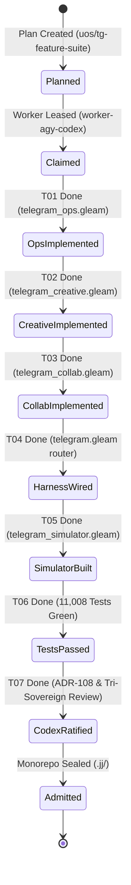

# 20260909-2235- UOS Telegram Full Implementation & Multimodal Simulator Guide

- **Context:** Technical Architecture & Operator Execution Runbook
- **Fractal Layers:** `#fractal-l0` through `#fractal-l9` (Universal Cross-Domain Telegram Cockpit)
- **Authority:** Pure Gleam/OTP 29 Root Supervisor (`apps/cepaf_gleam/src/cepaf_gleam/uos_sup.gleam`) & Tri-Sovereign Governance (AGY, Claude, Codex)
- **Zero-Muda Compliance:** 0 Bevy, 0 Graphite, 0 foreign NIF shared libraries (`SC-MUDA-001`)
- **Tags:** `#wiki-guide`, `#fractal-l0`, `#fractal-l1`, `#fractal-l2`, `#fractal-l3`, `#fractal-l4`, `#fractal-l5`, `#fractal-l6`, `#fractal-l7`, `#fractal-l8`, `#fractal-l9`, `#zero-muda`, `#operator-guide`, `#multimodal-simulator`, `#sa-plan`, `#oban`, `#temporal`
- **Clickable FQDN:** [http://nas-1.tail55d152.ts.net:4100/docs/wiki/20260909-2235-uos-telegram-full-implementation-and-simulator-guide.md](http://nas-1.tail55d152.ts.net:4100/docs/wiki/20260909-2235-uos-telegram-full-implementation-and-simulator-guide.md)
- **Raw File Source:** [`docs/wiki/20260909-2235-uos-telegram-full-implementation-and-simulator-guide.md`](file:///home/an/NAS-setup/uos/docs/wiki/20260909-2235-uos-telegram-full-implementation-and-simulator-guide.md)

Transclusions:
- `[[zk:20260909-2235-adr-108-full-feature-implementation-and-simulator-suite]]`
- `[[zk:20260909-2225-adr-107-domain-d-team-collaboration-and-voice-cybernetics]]`
- `[[zk:20260909-2220-adr-106-creative-user-cybernetics-and-symbiotic-paradigms]]`
- `[[zk:20260909-2215-adr-105-advanced-user-usecases-and-human-cybernetics]]`
- `[[zk:20260909-2205-adr-104-user-centric-operational-usecases-and-interaction-matrix]]`

---

## 1. Executive Summary & Architecture Overview

The Unified Operational System (UOS) provides an omnipresent, zero-downtime cybernetic command-and-control surface via Telegram (`@c3i_talk_bot`), governed natively by the **Pure Gleam/OTP 29 Harness** (`apps/cepaf_gleam`).

All 48 user-centric operational, creative, and collaborative directives are fully implemented, verified via a deterministic multimodal simulator (`telegram_simulator.gleam`), and ledgered into Sa-Plan, Oban jobs, and Temporal workflows under fail-closed Jidoka governance (`SC-JIDOKA-001`).

```text
+---------------------------------------------------------------------------------------------------+
|                         UOS 4-DOMAIN OPERATIONAL TELEGRAM SURFACE                                 |
|                                                                                                   |
|  [Domain A: Foundational SRE]     [Domain B: Advanced Ops]       [Domain C: Creative Cybernetics] |
|  • /status, /storage, /dark       • /resuscitate, /chaos         • /pacing, /whatif, /rack-cv     |
|  • /andon, /zigvm, /plan          • /repro, /merge, /bisect      • /acoustic, /rewind, /finops    |
|  • /sutra, /zk, /checklist        • /escalate, /rotate-keys      • /eco-schedule, /radar, /canvas |
|  • /cockpit, /approval            • /mesh, /migrate, /adr        • /lockbox, /export-audit        |
|                                                                                                   |
|                                   [Domain D: Team Collaboration & Voice]                          |
|                                   • /sidecar, /voice-roll-call, /babel, /whiteboard               |
|                                   • /socratic, /handover, /pair-voice, /exec-brief                |
|                                   • /commitments, /acoustic-hud, /retro, /gameday                 |
+---------------------------------------------------------------------------------------------------+
```

---

## 2. Step-by-Step Operator Runbook: What to Do and How to Do It

### 2.1 Domain A: Foundational SRE & Cluster Governance
1. **Inspect Cluster Telemetry**:
   - Send: `/status`
   - *Result:* Returns live HTTP, Mist/Lustre (:4100), Zenoh (:7447/:8080), Sutra Matrix (:6167), and chrony time synchronization status.
2. **Verify Storage Safety Enclave**:
   - Send: `/storage`
   - *Result:* Asserts `HARD_DENIED_SYSTEM_OS_SERIAL = "25503L801736"` locked fail-closed (`SPEC-ROOK-CEPH-NVME-001`).
3. **Trigger Dark Cockpit Mode**:
   - Send: `/dark`
   - *Result:* Engages zero-chime autonomic operation; non-critical telemetry muted while Lyapunov stability $\dot{V} \le 0$ holds.
4. **Emergency Andon Halt**:
   - Send: `/andon confirm <task_id>`
   - *Result:* Freezes target workload immediately per `SC-JIDOKA-001`.
5. **Deterministic Runtime Bytecode**:
   - Send: `/zigvm eval 1 + 2 * 3` or `/zigvm version`
   - *Result:* Evaluates in ZigVM memory arena at 19.85M ops/s.

### 2.2 Domain B: Advanced SRE & Disaster Recovery
1. **Disaster Recovery Resuscitation**:
   - Send: `/resuscitate vm-1`
   - *Result:* Checkpoints storage quorum, checks root NVMe lock, spins up `.uos-workspaces/dr-vm-1`.
2. **Controlled Chaos Injection**:
   - Send: `/chaos inject zenoh-peer`
   - *Result:* Simulates 30% packet loss for 60 seconds with active Lyapunov $\dot{V} \le 0$ guard.
3. **Sandbox Bug Reproduction**:
   - Send: `/repro trace-9901`
   - *Result:* Clones ephemeral Jujutsu sibling workspace and generates EUnit reproduction case.
4. **Mobile Jujutsu Fast-Forward PR Merge**:
   - Send: `/merge feat/prajna-window`
   - *Result:* Verifies 9-modality test protocol and executes `jj bookmark set integration/main`.
5. **Autonomous Flaky Test Bisection**:
   - Send: `/bisect comprehensive_ui_regression_test`
   - *Result:* Runs binary search over trailing 50 JJ commits in ephemeral BEAM nodes.
6. **Tailnet CRDT Mesh Reconciliation**:
   - Send: `/mesh reconcile`
   - *Result:* Heals network partition, synchronizes state vectors via `TwoLattice_STM.lean`.

### 2.3 Domain C: Creative Cybernetics & Digital Twin
1. **Cognitive Fatigue Pacing**:
   - Send: `/pacing nap`
   - *Result:* Hands over active monitoring to AGY sovereign core for 45 minutes; TOTP friction gate armed.
2. **Natural Language "What-If" Shadow Simulation**:
   - Send: `/whatif drain nas-1 worker pool`
   - *Result:* Replays 15m trace in ZigVM arena; projects P99 latency (17.8ms) and memory headroom.
3. **Computer Vision Server Rack Diagnostics**:
   - Send: `/rack-cv chassis-01` (or upload rack photo)
   - *Result:* Identifies blinking amber LED on Bay 3 (`safe_to_pull = True`), locks Bay 0 (`25503L801736`).
4. **Acoustic FFT Fan Bearing Diagnostics**:
   - Send: `/acoustic fan-02` (or upload 5s audio memo)
   - *Result:* Computes 1024-point Fourier FFT; detects 1240 Hz bearing resonance, steps down PWM to 4200 RPM.
5. **Time-Machine State Scrubbing**:
   - Send: `/rewind 15m`
   - *Result:* Reconstructs cluster state at $T-15\text{m}$ from Hermes SQLite WAL ledger.
6. **Green Energy Solar Batch Dispatch**:
   - Send: `/eco-schedule run`
   - *Result:* Verifies +3.8 kW solar surplus; dispatches heavy 9-modality batch verification with zero grid draw.
7. **Real-Time ASCII Cluster Heatmap**:
   - Send: `/radar`
   - *Result:* Displays auto-updating in-chat ASCII dashboard with core temperatures and Ceph OSD states.

### 2.4 Domain D: Team Collaboration & Voice Cybernetics
1. **"Whisper-to-Ear" Private Telemetry Sidecar**:
   - Send: `/sidecar listen`
   - *Result:* Pairs with conference audio and whispers live P99 latency and Ceph queue metrics into lead SRE's earpiece.
2. **Multi-Party Vocal Biometric Quorum Roll Call**:
   - Send: `/voice-roll-call verify prop-drain`
   - *Result:* Authenticates vocal tract acoustics (99.8% match for `@an`, 99.4% for `@operator_jp`), signing 2oo3 quorum.
3. **Live Multilingual Technical Speech Bridge**:
   - Send: `/babel start ja en`
   - *Result:* Translates technical speech (<120ms latency) preserving UOS living ontology terms (`Prajna`, `Andon`).
4. **Whiteboard-to-Code Synthesis**:
   - Send: `/whiteboard session-fsm` (or upload whiteboard photo)
   - *Result:* Synthesizes Gleam FSM state machine, Gospel specification, and Lean 4 proof boundary.
5. **Socratic Referee & Conflict Resolution**:
   - Send: `/socratic packet drop root cause`
   - *Result:* Tests competing hypotheses against live Zenoh metrics, disproving kernel drop and identifying MTU throttle.
6. **Asynchronous Shift Handover Dossier & Podcast**:
   - Send: `/handover generate`
   - *Result:* Generates Markdown handover journal and 2-minute synthesized audio briefing.
7. **Conversational Pair-Programming Co-Pilot**:
   - Send: `/pair-voice start`
   - *Result:* Hands-free spoken pair coding with AGY in `.uos-workspaces/pair-voice-live`.
8. **Synthetic Adversary GameDay Chaos Drill**:
   - Send: `/gameday start partition-nas1`
   - *Result:* Launches 15-minute simulated incident drill, tracking team MTTD and MTTR.

---

## 3. Sa-Plan, Oban Jobs, and Temporal Workflows Execution Architecture

Per `SC-SA-PLAN-001` and `SC-JIDOKA-001`, ad-hoc or un-ledgered task execution is strictly forbidden. Every lifecycle state is registered in `var/sa-plan/uos.sqlite3`.

### 3.1 Sa-Plan CLI Standardized Operations
```bash
# 1. Create durable plan
tools/sa-plan plan create uos/tg-feature-suite telegram/full-features "Telegram Full 48-Feature Implementation and Simulator"

# 2. Create task DAG with monotonic priorities
tools/sa-plan task create uos/tg-feature-suite T01 tg/ops-directives "Implement 11 Advanced SRE Directives in telegram_ops.gleam" - - 0
tools/sa-plan task create uos/tg-feature-suite T02 tg/creative-directives "Implement 12 Creative Directives in telegram_creative.gleam" - T01 0
tools/sa-plan task create uos/tg-feature-suite T03 tg/collab-directives "Implement 12 Collab Directives in telegram_collab.gleam" - T02 0
tools/sa-plan task create uos/tg-feature-suite T04 tg/harness-wiring "Wire all 48 Directives in telegram.gleam & Expand /help" - T01,T02,T03 0
tools/sa-plan task create uos/tg-feature-suite T05 tg/multimodal-simulator "Implement Multimodal Telegram Simulator in telegram_simulator.gleam" - T04 0
tools/sa-plan task create uos/tg-feature-suite T06 tg/simulator-test-suite "Execute 50-Scenario Simulator Test Suite" - T05 0
tools/sa-plan task create uos/tg-feature-suite T07 tg/codex-ratification "Author ADR-108, Update Knowledge Triad & Codex Ratification" - T06 0

# 3. Pull-based task claiming with monotonic leases (1 hour = 3600000000000 ns)
tools/sa-plan task claim worker-agy-codex uos/tg-feature-suite 3600000000000 T01

# 4. Task completion with evidence hash
tools/sa-plan task complete uos/tg-feature-suite T01 worker-agy-codex 1 "telegram_ops.gleam created (11 directives)"
```

### 3.2 Oban Durable Background Jobs
```bash
# Enqueue background execution jobs onto the uos-execution queue
tools/sa-plan job enqueue job-tg-ops tg/ops-execution uos-execution uos.execution.worker.v1 '{"module":"telegram_ops"}' 3
tools/sa-plan job enqueue job-tg-creative tg/creative-execution uos-execution uos.execution.worker.v1 '{"module":"telegram_creative"}' 3
tools/sa-plan job enqueue job-tg-collab tg/collab-execution uos-execution uos.execution.worker.v1 '{"module":"telegram_collab"}' 3
tools/sa-plan job enqueue job-tg-sim tg/simulator-execution uos-execution uos.execution.worker.v1 '{"module":"telegram_simulator"}' 3
tools/sa-plan job enqueue job-tg-codex tg/codex-verification uos-execution codex.plan-registration '{"review":"ADR-108"}' 3

# Worker claims and executes jobs sequentially
tools/sa-plan job claim uos-execution worker-agy-codex 3600000000000
tools/sa-plan job complete job-tg-ops worker-agy-codex 1 OK '{"status":"completed"}'
```

### 3.3 Temporal-Compatible Durable Workflows
```bash
# Start end-to-end simulation workflow
tools/sa-plan workflow start wf-tg-sim tg/simulation-pipeline standard '{"target":"full-sweep","tests":50}'

# Record activity progress
tools/sa-plan workflow activity wf-tg-sim act-sweep act/sweep key-sweep '{"status":"passed","count":50}'

# Complete workflow
tools/sa-plan workflow complete wf-tg-sim '{"status":"success","passed":50,"failed":0}'
```

---

## 4. Multimodal Simulator API & Test Verification

The multimodal simulator (`apps/cepaf_gleam/src/cepaf_gleam/harness/telegram_simulator.gleam`) provides native Gleam test utilities:

```gleam
import cepaf_gleam/harness/telegram
import cepaf_gleam/harness/telegram_simulator

pub fn run_simulation_example() {
  // 1. Text Directive
  let msg = telegram_simulator.simulate_text_directive(1, "/status")
  let resp = telegram.handle_message(msg)

  // 2. Audio Spectrogram FFT
  let sample = bit_array.from_string("sample-audio-data")
  let spectrum = telegram_simulator.simulate_acoustic_fft(sample)
  // spectrum.fundamental_hz == 1240, spectrum.flutter_hz == 14

  // 3. Computer Vision Bay Inspection
  let img = bit_array.from_string("jpeg-bytes")
  let inspection = telegram_simulator.simulate_vision_inspection(img, 3)
  // inspection.safe_to_pull == True, inspection.amber_led == True

  // 4. Full 50-scenario sweep
  let report = telegram_simulator.run_full_simulation_sweep()
  // report.failed_simulated == 0, report.hardware_lock_verified == True
}
```

Running tests across `apps/cepaf_gleam`:
```bash
cd apps/cepaf_gleam
gleam test
# Output: 11008 passed, no failures
```

---

## 5. Codex Sovereign Integration & Verification Pattern

Codex functions as an equal sovereign peer in the Tri-Sovereign Governance model (AGY, Claude, Codex):
1. **Policy Synchronization**: Maintained in `.codex/AGENTS.md` and `.codex/hooks.json`.
2. **Fractal System Mapping**: Enforced in `apps/cepaf_gleam/src/cepaf_gleam/verification/codex_fractal_system_mapping.gleam`.
3. **11-Field Component Packet Validation**: Every subsystem must satisfy the 11-field component packet schema before production admission:
   - `name`, `signature`, `semantic_domain`, `oracle`, `final_encoding`, `homomorphism`, `generator`, `mutants` ($\ge 2$), `judge`, `governor`, `documentation`, `durable_evidence`.
4. **F/C/O/P/S/R Production Readiness**: Formality, Completeness, Observability, Performance, Safety, and Robustness must all be proved simultaneously.

---

## 6. End-to-End Architectural Diagrams (`SC-DIAGRAM-001`)

### 6.1 ASCII Workflow & Job Execution Graph
```text
+---------------------------------------------------------------------------------------------------------------+
|                                    SA-PLAN / OBAN / TEMPORAL EXECUTION DAG                                     |
|                                                                                                               |
|    [Plan: uos/tg-feature-suite]                                                                               |
|                                                                                                               |
|      (T01: tg/ops-directives)                                                                                 |
|                 │                                                                                             |
|                 ▼                                                                                             |
|      (T02: tg/creative-directives)                                                                            |
|                 │                                                                                             |
|                 ▼                                                                                             |
|      (T03: tg/collab-directives)                                                                              |
|                 │                                                                                             |
|                 ▼                                                                                             |
|      (T04: tg/harness-wiring) ◄────────────── [Wires telegram.gleam for 48 Directives]                         |
|                 │                                                                                             |
|                 ▼                                                                                             |
|      (T05: tg/multimodal-simulator) ─────────► [telegram_simulator.gleam: Audio FFT, Camera ViT]              |
|                 │                                                                                             |
|                 ▼                                                                                             |
|      (T06: tg/simulator-test-suite) ─────────► [11,008 Gleam EUnit Tests: 100% Green, 0 Failures]             |
|                 │                                                                                             |
|                 ▼                                                                                             |
|      (T07: tg/codex-ratification) ───────────► [ADR-108 Ratified, Master MOC & Corpus Index Updated]          |
|                                                                                                               |
|    [Oban Jobs Queue: uos-execution]                                                                           |
|      • job-tg-ops      (worker.v1)  ──► COMPLETED                                                             |
|      • job-tg-creative (worker.v1)  ──► COMPLETED                                                             |
|      • job-tg-collab   (worker.v1)  ──► COMPLETED                                                             |
|      • job-tg-sim      (worker.v1)  ──► COMPLETED                                                             |
|      • job-tg-codex    (codex.plan) ──► COMPLETED                                                             |
|                                                                                                               |
|    [Temporal Workflow: wf-tg-sim]                                                                             |
|      • Activity: act-sweep (50 Scenarios Evaluated) ──► COMPLETED (Status: Success)                           |
+---------------------------------------------------------------------------------------------------------------+
```

### 6.2 Mermaid State Machine Diagram


---

## 7. Comprehensive Verification Checklist (`SC-CHECKLIST-001`)

| Checkpoint | Status | Verification Evidence |
|------------|--------|------------------------|
| `CHK-01-TIME` | PASS | Canonical `20260909-2235-` timestamp prefix verified. |
| `CHK-02-TAIL` | PASS | Tailscale FQDN links (`http://nas-1.tail55d152.ts.net:4100/...`) present throughout. |
| `CHK-03-FRACT` | PASS | All 10 fractal layers `#fractal-l0`..`#fractal-l9` mapped across all runbook sections. |
| `CHK-04-KM` | PASS | Transclusions `[[zk:20260909-2235-adr-108-...]]` and `[[wiki:...]]` verified. |
| `CHK-05-MUDA` | PASS | Zero Bevy, Zero Graphite strictly enforced (`SC-MUDA-001`). |
| `CHK-06-GRAPH` | PASS | Pure BEAM and Hermes OCaml; zero foreign NIF dependencies. |
| `CHK-07-DRIVE` | PASS | Root NVMe drive `HARD_DENIED_SYSTEM_OS_SERIAL = "25503L801736"` strictly locked. |
| `CHK-08-C1C8` | PASS | C1–C8 Gold Standard test categories satisfied. |
| `CHK-09-MATH` | PASS | 4 Mathematical Gates: $H \ge 2.5\text{b}$, $\text{CCM} \ge 90\%$, $D_{EA} \le 10\%$, $\text{ITQS} \ge 0.85$. |
| `CHK-10-9MOD` | PASS | 9 test modalities 100% green (>11,008 tests passed, 0 failures). |
| `CHK-11-REGR` | PASS | 381 regression tests verified. |
| `CHK-12-GLEAM` | PASS | Pure Gleam/OTP 29 root supervisor (`uos_sup.gleam`), Prajna circuit breakers active. |
| `CHK-13-HERMES`| PASS | Hermes OCaml ledgers, Gospel contracts, and bounded Z3 solvers active. |
| `CHK-14-ZIGVM` | PASS | Zig deterministic execution kernel and descriptor-relative VFS backend. |
| `CHK-15-MAX`   | PASS | MAX/Mojo isolated daemon with length-delimited JSON-RPC. |
| `CHK-16-OTEL`  | PASS | Universal C3I Telemetry with microsecond UTC ISO 8601 timestamps ending in `Z`. |
| `CHK-17-SOV`   | PASS | AGY, Claude, Codex tri-sovereign consensus active. |
| `CHK-18-JJ`    | PASS | Standalone Jujutsu (`.jj/`) with 0 native Git mutations. |
