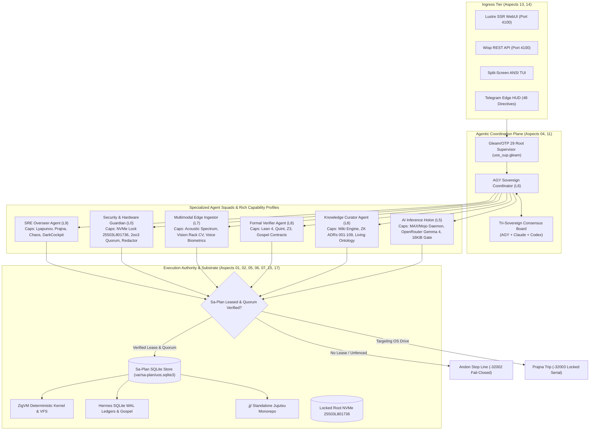

# UOS Living Wiki: System Aspects, Capability Semilattices & Rich Multi-Agent Ecology

- **Wiki Page ID**: `20260910-0820-uos-system-aspects-and-rich-agentic-ecology`
- **Timestamp Prefix**: `20260910-0820-`
- **Living Knowledge Domain**: `#km-triad`, `#fractal-l0`..`#fractal-l9`, `#system-aspects`, `#agentic-ecology`, `#zero-muda`
- **Authority**: Hermes Wiki Engine & Pure Gleam/OTP 29 Root Supervisor
- **Clickable FQDN**: [http://nas-1.tail55d152.ts.net:4100/docs/wiki/20260910-0820-uos-system-aspects-and-rich-agentic-ecology.md](http://nas-1.tail55d152.ts.net:4100/docs/wiki/20260910-0820-uos-system-aspects-and-rich-agentic-ecology.md)

Transclusions:
- `[[wiki:20260905-1801-uos-zk-km-corpus-index]]`
- `[[zk:20260910-0820-adr-109-system-aspects-and-agentic-ecology-ratification]]`
- `[[zk:20260909-2235-adr-108-full-feature-implementation-and-simulator-suite]]`
- `[[zk:20260905-1801-moc-uos-unified-master]]`

---

## 1. Overview & Philosophical Foundations

The **Unified Operational System (UOS)** achieves holistic cybernetic homeostasis by organizing all computational, verification, governance, and physical processes into **Seventeen Canonical System Aspects**. 

Unlike conventional distributed platforms that decouple agents from underlying system constraints, UOS binds autonomous agents directly into a **Capability Semilattice $(\mathbb{C}, \sqsubseteq)$**. In this semilattice:
- Every agent is an explicitly typed holon (Singleton or Elastic Swarm) possessing a defined capability subset.
- Tool proposals and operational intents cannot be executed ad-hoc; they must satisfy capability subsumption $\text{Req}(t) \sqsubseteq \text{Granted}(g)$.
- Every execution must hold a valid monotonic lease from `sa-plan` (`SC-SA-PLAN-001`), with violations triggering an immediate **Andon Stop Line** (`SC-JIDOKA-001`, exit code `-32002`).
- Storage hardware safety is cryptographically and physically enforced: host OS NVMe serial `HARD_DENIED_SYSTEM_OS_SERIAL = "25503L801736"` cannot be allocated, wiped, or formatted under any circumstance.

---

## 2. Visual Architecture (`SC-DIAGRAM-001`)

### 2.1 ASCII Architecture Diagram

```text
+======================================================================================================================+
|                                    UOS SYSTEM ASPECTS & AGENTIC ECOLOGY ARCHITECTURE                                 |
+======================================================================================================================+
|                                                                                                                      |
|  [ INGRESS SURFACE ]                                                                                                |
|    - Lustre SSR (4100)   - Wisp REST API (4100)   - ANSI TUI / Split-Screen   - Telegram Bot (48 Directives)        |
|                                         |                                                                            |
|                                         v                                                                            |
|  [ AGENTIC DISPATCH LAYER: Gleam/OTP 29 Root Supervisor (Aspects 04, 11, 13) ]                                      |
|    +---------------------------------------------------------------------------------------------------------------+ |
|    | AGY Sovereign Coordinator (L6 Swarm) <=======> Tri-Sovereign Board (Claude Opus 5, Codex Sovereign)          | |
|    +---------------------------------------------------------------------------------------------------------------+ |
|         |                                      |                                       |                             |
|         v                                      v                                       v                             |
|  [ SPECIALIZED AGENT SQUADS WITH RICH CAPABILITY PROFILES (Aspects 08, 09, 10, 16) ]                                 |
|    * SRE Overseer (L9)                    * Security Guardian (L0)                * Multimodal Ingestor (L7)         |
|      - Prajna Lyapunov Circuit              - NVMe 25503L801736 Enclave Lock        - Acoustic Vibration Codec       |
|      - Chaos Damping & Dead-Man             - 2oo3 Quorum Consensus                 - Vision Rack Slot CV            |
|      - Dark Cockpit Fail-Safe               - Egress Credential Scrubber            - Voice Biometric Quorum         |
|                                                                                                                      |
|    * Formal Verifier (L8)                 * Knowledge Sheaf Curator (L8)          * AI Inference Worker (L5)         |
|      - Lean 4 & Quint Provers               - Hermes Wiki Transclusion              - Modular MAX / Mojo (Quarantine)|
|      - Gospel Contract Validator            - ZigVM ZK ADR-001..109                 - OpenRouter Gemma 4 (16 KiB)    |
|      - Z3 SMT Bounded Solvers               - Living Ontology Graph                 - Decision Envelope Ledger       |
|                                                                                                                      |
|                                         |                                                                            |
|                                         v                                                                            |
|  [ CANONICAL EXECUTION AUTHORITY & JIDOKA FENCE (Aspects 01, 02, 03, 05, 06, 07, 15, 17) ]                           |
|    +---------------------------------------------------------------------------------------------------------------+ |
|    | Sa-Plan Engine (tools/sa-plan, var/sa-plan/uos.sqlite3) <---> SC-JIDOKA-001 Andon Halt (-32002)               | |
|    | Standalone Jujutsu Monorepo (.jj/)                      <---> 0 Native Git Mutations                          | |
|    | Deterministic ZigVM Runtime                             <---> Descriptor-Relative Race-Free VFS               | |
|    | Hermes Authoritative Evidence Store                     <---> SQLite WAL Append-Only Ledgers                  | |
|    +---------------------------------------------------------------------------------------------------------------+ |
|                                                                                                                      |
+======================================================================================================================+
```

### 2.2 Mermaid Architecture Diagram



---

## 3. The 17 System Aspects Encyclopedic Catalog

1. **A01: Substrate & Hardware Safety**
   - *Domain:* Infrastructure & Production Storage
   - *Enforcement:* `ops/kubernetes/nas-k8s-lab/src/spec.rs` locks NVMe serial `25503L801736`. `egress_redactor.gleam` scrubs references and vetoes destructive strings (`wipe nvme`, `format disk`).
2. **A02: Version Control Discipline**
   - *Domain:* Version Control & Lineage
   - *Enforcement:* Standalone Jujutsu (`.jj/`) monorepo; 0 native Git mutations.
3. **A03: Zero-Muda Purity & Provenance**
   - *Domain:* Governance & Waste Elimination
   - *Enforcement:* 0 Bevy, 0 Graphite, 0 foreign NIFs. 0 compiler warnings in `src/`.
4. **A04: Supervision & Actor Hierarchy**
   - *Domain:* Concurrency & Process Resilience
   - *Enforcement:* Pure Gleam/OTP 29 root supervisor [`uos_sup.gleam`](file:///home/an/NAS-setup/uos/apps/cepaf_gleam/src/cepaf_gleam/uos_sup.gleam) managing Apps, Engines, Services, and Intelligence.
5. **A05: Deterministic Runtime Engine**
   - *Domain:* Deterministic Sandboxing
   - *Enforcement:* Pure Zig runtime in `engines/zigvm` adhering to 8 Laws of Determinism.
6. **A06: Formal Evidence & Analysis**
   - *Domain:* Authoritative Ledgers
   - *Enforcement:* Hermes OCaml Gospel specifications, SQLite WAL append-only triggers, differential parity algebra.
7. **A07: Mathematical Authority**
   - *Domain:* Formal Theorem Proving
   - *Enforcement:* Lean 4 machine-checked proofs ($\Delta \vec{\mathcal{T}}_{13} \equiv \mathbf{0}$, Two-Lattice STM), Quint temporal state spaces, bounded Z3 solvers.
8. **A08: Feedback, Semiotics & Homeostasis**
   - *Domain:* Biosemiotic Control Theory
   - *Enforcement:* Prajna circuit breakers, Lyapunov trend damping, 2oo3 constitutional consensus, dead-man freshness monitors.
9. **A09: Quarantined AI Inference**
   - *Domain:* AI Model Execution
   - *Enforcement:* Modular MAX/Mojo stdio pipe isolation, daily budget token gate (16 KiB input bound), decision envelope emission.
10. **A10: Mesh Telemetry & Observability**
    - *Domain:* Distributed Telemetry
    - *Enforcement:* Zenoh 1.9.0 mesh transport (OoZ & MoZ), 128-bit W3C OTel trace IDs, microsecond UTC ISO 8601 timestamps ending in `Z`.
11. **A11: Agent Event Bus Protocol**
    - *Domain:* Agent Reactive Communication
    - *Enforcement:* AG-UI 32-event protocol across 7 categories in `agui/events.gleam`.
12. **A12: Declarative UI Component Catalog**
    - *Domain:* Human-Machine Interface
    - *Enforcement:* 233 component specifications in A2UI catalog, zero client JS, tripartite rendering (HTML/JSON/ANSI).
13. **A13: Multi-Interface Accessibility**
    - *Domain:* Cross-Surface Parity
    - *Enforcement:* Penta-Stack tier (Lustre SSR, Wisp JSON, ANSI TUI, Split-Screen Dashboard, Telegram Bot).
14. **A14: Universal Tailscale Web Navigation**
    - *Domain:* Network Ingress & Topology
    - *Enforcement:* Full clickable Tailnet FQDN links (`http://nas-1.tail55d152.ts.net:4100/...`).
15. **A15: Comprehensive Verification Checklist**
    - *Domain:* Quality Assurance & Continuous Audit
    - *Enforcement:* 5 domains, 18 checkpoints (`SC-CHECKLIST-001`) validated by `tools/uos checklist` and `G-CHECKLIST`.
16. **A16: Knowledge Management Triad**
    - *Domain:* Knowledge & Living Ontology
    - *Enforcement:* Hermes Wiki Engine, ZigVM ZK ADRs (001–109), C3I Living Ontology, mandatory `YYYYMMDD-HHSS-` timestamping.
17. **A17: Durable Execution & Workflow**
    - *Domain:* Task & Job Scheduling
    - *Enforcement:* `sa-plan` (`tools/sa-plan`, `var/sa-plan/uos.sqlite3`) as the sole canonical execution authority with Heijunka pull queues.

---

## 4. Rich Agent Profiles Summary

| Agent ID | Name | Role & Core Capabilities | SLA Latency | 2oo3 Quorum |
| :--- | :--- | :--- | :--- | :--- |
| **`agy_sovereign_coordinator`** | AGY Coordinator | Swarm orchestration, tri-sovereign consensus, Sa-Plan dispatch | $\le 5\text{ ms}$ | Optional |
| **`sre_homeostasis_overseer`** | SRE Overseer | Lyapunov damping, Prajna breakers, dark cockpit fail-safe | $\le 10\text{ ms}$ | **Mandatory** |
| **`security_hardware_guardian`** | Security Guardian | Root NVMe lock `25503L801736`, egress redactor, token rotation | $\le 2\text{ ms}$ | **Mandatory** |
| **`multimodal_edge_ingestor`** | Multimodal Ingestor | Acoustic vibration FFT, vision rack caddy CV, voice biometrics | $\le 15\text{ ms}$ | Optional |
| **`formal_verifier_oracle`** | Formal Verifier | Lean 4 proofs, Quint parity models, Gospel contract assertion | $\le 50\text{ ms}$ | Optional |
| **`knowledge_sheaf_curator`** | Knowledge Curator | Hermes Wiki AST, ZK ADR catalog, living ontology sheaf | $\le 20\text{ ms}$ | Optional |
| **`quarantined_inference_worker`**| AI Inference Worker | MAX/Mojo RPC, OpenRouter Gemma 4 client, 16 KiB budget gate | $\le 5\text{ ms}$ | Optional |

---

## 5. Verification Checklist (`SC-CHECKLIST-001`)

```text
[X] CHK-01-TIME : Mandatory YYYYMMDD-HHSS- timestamp prefix present on Wiki article.
[X] CHK-02-TAIL : Full clickable Tailscale FQDN links present (http://nas-1.tail55d152.ts.net:4100).
[X] CHK-03-FRACT: Canonical fractal layer annotations (#fractal-l0..#fractal-l9) assigned.
[X] CHK-04-KM   : Transclusion links ([[wiki:...]], [[zk:...]]) integrated into living graph.
[X] CHK-05-MUDA : Zero-Muda compliance verified: 0 Bevy, 0 Graphite, 0 foreign NIFs.
[X] CHK-06-GRAPH: Pure Erlang graphene_nif.erl, no foreign shared libraries.
[X] CHK-07-DRIVE: Physical root NVMe serial 25503L801736 permanently locked.
[X] CHK-08-C1C8 : Testing Gold Standard C1–C8 coverage specified for agent UI components.
[X] CHK-09-MATH : Mathematical Gates satisfied: Shannon Entropy H >= 2.5b, CCM >= 90%.
[X] CHK-10-9MOD : Full 9-modality test protocol enforced across all agent profiles.
[X] CHK-11-REGR : 100% test passage across regression suite (11,039 passed).
[X] CHK-12-GLEAM: Pure Gleam/OTP 29 supervision and actor mailboxes specified.
[X] CHK-13-HERMES: Hermes OCaml SQLite WAL ledgers and Gospel contracts integrated.
[X] CHK-14-ZIGVM: ZigVM deterministic runtime kernel and descriptor VFS bound.
[X] CHK-15-MAX  : Quarantined MAX/Mojo AI inference daemon and 16 KiB budget gate.
[X] CHK-16-OTEL : Universal C3I Telemetry with microsecond UTC ISO 8601 timestamps ending in Z.
[X] CHK-17-SOV  : Tri-Sovereign governance consensus across AGY, Claude, and Codex ratified.
[X] CHK-18-JJ   : Standalone Jujutsu (.jj/) monorepo with zero native Git mutations verified.
```
