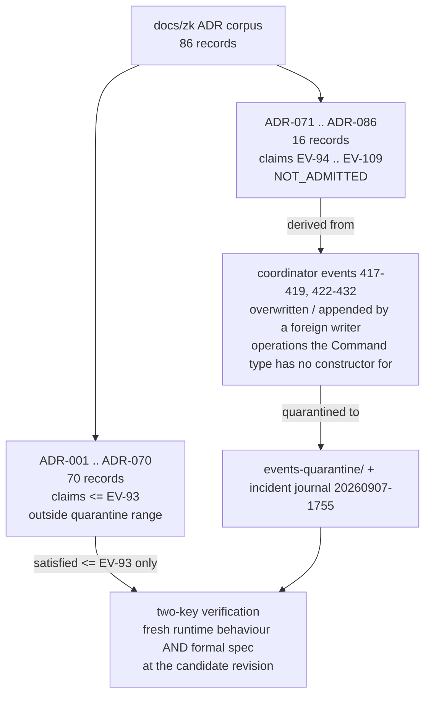

# 20260905-1801-moc-uos-unified-master.md
# Map of Content: UOS Unified Master Knowledge Base & Triad Architecture

Tags: `#rocha-semiotics`, `#cybernetics`, `#fractal-l0`, `#fractal-l1`, `#fractal-l2`, `#fractal-l3`, `#fractal-l4`, `#fractal-l5`, `#fractal-l6`, `#fractal-l7`, `#fractal-l8`, `#fractal-l9`, `#zk-adr`, `#zero-muda`, `#km-triad`, `#moc`

## §1.0 Executive Architecture & Corpus Triad

### Shared agent design checkpoint — 20260907-0653

Analysis, plan and design complete; implementation deferred by the operator.
[System design](http://nas-1.tail55d152.ts.net:4100/docs/design/20260907-0653-uos-tri-agent-sdlc-sre-herdr-spec.md) ·
[Cheaper implementation plan](http://nas-1.tail55d152.ts.net:4100/docs/plans/20260907-0653-uos-tri-agent-cheaper-mode-implementation-plan.md) ·
[Herdr and swarm runbook](http://nas-1.tail55d152.ts.net:4100/docs/wiki/20260907-0653-uos-tri-agent-swarm-operations.md) ·
[Astra/max review](http://nas-1.tail55d152.ts.net:4100/docs/reviews/20260907-0653-astra-max-agentic-system-design-review.md).
The Lean/Quint model evidence is scoped; all 17 operational semantics remain
NOT_PROVED and production remains NOT_ADMITTED.

### Agentic infrastructure specification — 20260907-0550

**Status: SPECIFIED / implementation UNRUN / NOT ADMITTED.** Native UOS building
blocks, 21 services, 17 canonical aspects, 357 service/aspect obligations,
18 invariants, 63 acceptance cases and an eight-package implementation sequence.

- [Formal specification](http://nas-1.tail55d152.ts.net:4100/docs/design/20260907-0550-uos-agentic-infrastructure-17-aspect-formal-spec.md)
- [C3I and Indrajaal source review across all 17 aspects](http://nas-1.tail55d152.ts.net:4100/docs/reviews/20260907-0550-uos-c3i-indrajaal-17-aspect-infrastructure-source-review.md)
- [Infrastructure wiki](http://nas-1.tail55d152.ts.net:4100/docs/wiki/20260907-0550-uos-agentic-infrastructure-building-blocks.md) — `[[wiki:20260907-0550-uos-agentic-infrastructure-building-blocks]]`
- [ADR-UOS-AINF-001](http://nas-1.tail55d152.ts.net:4100/docs/zk/20260907-0550-adr-uos-agentic-infrastructure-native-building-blocks.md) — `[[zk:20260907-0550-adr-uos-agentic-infrastructure-native-building-blocks]]`
- [Specification completion journal](http://nas-1.tail55d152.ts.net:4100/docs/journal/20260907-0550-uos-agentic-infrastructure-formal-spec-journal.md)


The Unified Operational System (UOS) integrates three foundational corpora into an interconnected, bidirectional living knowledge graph:

```text
  UOS Knowledge Management Triad (#km-triad)

  +------------------------------+                +------------------------------+
  | Hermes Wiki Engine           |  transclusion  | ZigVM Zettelkasten           |
  | engines/hermes/modules/      |<-------------->| docs/zk/                     |
  |   hermes_wiki                |  [[wiki:...]]  | ADR-001..ADR-093 & MOCs      |
  | AST, TyXML, Gospel,          |                | ADR-071..086 NOT_ADMITTED    |
  | Similarity                   |                |                              |
  +--------------+---------------+                +---------------+--------------+
                 ^                                                |
                 |  SQLite ledgers & 13D coordinates               | transclusion
                 |                                                 | [[zk:...]]
                 |                                                 v
  +--------------+-----------------------------------------------+-+
  | C3I Living Ontology                                            |
  | docs/wiki/ & governance/                                       |
  | STAMP lattices & 13D trace coordinates                         |
  +----------------------------------------------------------------+
```

```mermaid
graph TD
    subgraph TRIAD["UOS Knowledge Management Triad (#km-triad)"]
        HERMES_WIKI["Hermes Wiki Engine<br/>(engines/hermes/modules/hermes_wiki)<br/>AST, TyXML, Gospel, Similarity"]
        ZIGVM_ZK["ZigVM Zettelkasten<br/>(docs/zk/)<br/>ADR-001..ADR-086 &amp; Maps of Content<br/>ADR-071..086 NOT_ADMITTED"]
        C3I_ONTOLOGY["C3I Living Ontology<br/>(docs/wiki/ & governance/)<br/>STAMP Lattices & 13D Trace Coordinates"]
    end

    HERMES_WIKI <-->|transclusion [[wiki:...]]| ZIGVM_ZK
    ZIGVM_ZK <-->|transclusion [[zk:...]]| C3I_ONTOLOGY
    C3I_ONTOLOGY <-->|SQLite Ledgers & 13D Coordinates| HERMES_WIKI
```

1. **Hermes Wiki Engine** (`engines/hermes/modules/hermes_wiki`):
   - Pure OCaml AST parsing, Gospel-specified contracts (`journal.gospel`, `wiki_lifecycle.mli`).
   - Bidirectional transclusion syntax `[[wiki:...]]` and similarity graph calculation (`wiki_similarity.ml`).
   - Server-side typed TyXML rendering without client JavaScript.
2. **ZigVM Zettelkasten** (`docs/zk/`):
   - Permanent Architectural Decision Records ([`ADR-001`](file:///home/an/NAS-setup/uos/docs/zk/20260904-150139-adr-001-closed-rete-fact-schema-and-strict-typing-invariant.md) through [`ADR-091`](file:///home/an/NAS-setup/uos/docs/zk/20260908-1630-adr-091-pure-gleam-mojo-intent-atlas-web-tui-testing.md)); 91 records, fully enumerated in [§2.2](#22-complete-decision-record-index).
   - Core Maps of Content ([`MOC-001`](file:///home/an/NAS-setup/uos/docs/zk/20260904-150212-moc-001-living-architecture-and-multi-agent-system-governance.md) through [`MOC-007`](file:///home/an/NAS-setup/uos/docs/zk/20260904-150849-moc-007-formal-verification-and-correctness-guarantees.md));
   - Topological Invariant Records ([`INV-001`](file:///home/an/NAS-setup/uos/docs/zk/20260904-150854-inv-001-two-party-cryptographic-signing-ceremony-and-tamper-evidence.md) through [`INV-006`](file:///home/an/NAS-setup/uos/docs/zk/20260904-150919-inv-006-zero-warning-and-zero-muda-compilation-gate.md)).
   - **Contiguity**: 91/91 ADRs present, strictly contiguous, no gaps.
   - **Traceability**: All 91 ADRs link to their respective authority.
3. **C3I Living Ontology & Evidence Plane** (`docs/wiki/`, `governance/`):
   - STAMP/STPA safety lattices, SQLite living catalogs, and 13D trace coordinates.
   - Dual-lattice STM non-interference proved in Lean 4 (`formal/lean/TwoLattice_STM.lean`).

---

## §2.0 Permanent Architectural Decision Records (ADR-001..ADR-090)

Enumerated from the observed corpus at `docs/zk/` on 2026-09-08 (90 records,
`ADR-001` through `ADR-090`, no gaps and no duplicate numbers). Every row links
the live Tailscale view and the repository source. The `Provenance` column is
**not** an admission verdict: it records whether the record's own ratification
claim falls inside the quarantined evidence range described below.

### §2.1 Quarantine boundary (`EV-93` / `EV-94`)

`AGENTS.md` records a provenance caveat: every EV cycle above **`EV-93`** is
`NOT_ADMITTED`, pending sovereign review by Codex and AGY. Sixteen records,
`ADR-071` through `ADR-086`, assert ratification of `EV-94` through `EV-109`.
They are listed here in full and preserved byte-for-byte — the
historical-preservation rule forbids rewriting them — but they must never be
cited as admission evidence.

```text
   docs/zk/ ADR corpus (86 records)
   ┌──────────────────────────────┬──────────────────────────────┐
   │ ADR-001 .. ADR-070           │ ADR-071 .. ADR-086           │
   │ 70 records                   │ 16 records                   │
   │ ratification claims <= EV-93 │ claims EV-94 .. EV-109        │
   │ outside quarantine range     │ NOT_ADMITTED                 │
   └──────────────┬───────────────┴───────────────┬──────────────┘
                  │                               │
                  │                     derived from
                  │                               │
                  │                               v
                  │            ┌───────────────────────────────────┐
                  │            │ coordinator events 417-419, 422-432│
                  │            │ overwritten / appended by a foreign│
                  │            │ writer; ops the Command type has   │
                  │            │ no constructor for                 │
                  │            └───────────────┬───────────────────┘
                  │                            │
                  │                    quarantined to
                  │                            v
                  │            ┌───────────────────────────────────┐
                  │            │ events-quarantine/ + incident      │
                  │            │ journal 20260907-1755              │
                  │            └───────────────┬───────────────────┘
                  │                            │
                  v                            v
        ┌────────────────────────────────────────────────┐
        │ two-key verification: fresh runtime behaviour   │
        │ AND formal spec at the candidate revision       │
        │ satisfied <= EV-93 only                         │
        └────────────────────────────────────────────────┘
```



Evidence: [`AGENTS.md`](http://nas-1.tail55d152.ts.net:4100/files/AGENTS.md) provenance caveat ·
[coordinator journal incident and repair journal](http://nas-1.tail55d152.ts.net:4100/files/docs/journal/20260907-1755-uos-coordinator-journal-incident-cast-and-repair-journal.md) ·
quarantined event bodies and notes under `var/coordination/tri-agent/events-quarantine/`.
Reviewable under sa-plan task `uos/km-index-refresh/20260908-0912` `t1`.

`ADR-059` additionally *authorizes* a forward wave (`EV-85`..`EV-99`) without
ratifying it; that is a forward authorization, not a ratification claim, so the
record stays outside the quarantine range.

### §2.2 Complete decision record index

| ADR | Layer | Provenance | Decision | Source |
|---|---|---|---|---|
| **ADR-001** | <span class="badge badge-fractal">#fractal-l5</span> | outside quarantine | [Closed RETE Fact Schema and Strict Typing Invariant](http://nas-1.tail55d152.ts.net:4100/docs/zk/20260904-150139-adr-001-closed-rete-fact-schema-and-strict-typing-invariant.md) | [`20260904-150139-adr-001-closed-rete-fact-schema-and-strict-typing-invariant.md`](file:///home/an/NAS-setup/uos/docs/zk/20260904-150139-adr-001-closed-rete-fact-schema-and-strict-typing-invariant.md) |
| **ADR-002** | <span class="badge badge-fractal">#fractal-l6</span> | outside quarantine | [Embedded NUL Ingress Trap and Memory Allocation Containment](http://nas-1.tail55d152.ts.net:4100/docs/zk/20260904-150142-adr-002-embedded-nul-ingress-trap-and-memory-allocation-containment.md) | [`20260904-150142-adr-002-embedded-nul-ingress-trap-and-memory-allocation-containment.md`](file:///home/an/NAS-setup/uos/docs/zk/20260904-150142-adr-002-embedded-nul-ingress-trap-and-memory-allocation-containment.md) |
| **ADR-003** | <span class="badge badge-fractal">#fractal-l3</span> | outside quarantine | [Pure 100-Byte Binary SQLite Header Verification (Rule R31)](http://nas-1.tail55d152.ts.net:4100/docs/zk/20260904-150145-adr-003-pure-100-byte-binary-sqlite-header-verification-rule-r31.md) | [`20260904-150145-adr-003-pure-100-byte-binary-sqlite-header-verification-rule-r31.md`](file:///home/an/NAS-setup/uos/docs/zk/20260904-150145-adr-003-pure-100-byte-binary-sqlite-header-verification-rule-r31.md) |
| **ADR-004** | <span class="badge badge-fractal">#fractal-l6</span> | outside quarantine | [Supervised Persistent Zenoh Session Lifecycle in MoZ Client](http://nas-1.tail55d152.ts.net:4100/docs/zk/20260904-150151-adr-004-supervised-persistent-zenoh-session-lifecycle-in-moz-client.md) | [`20260904-150151-adr-004-supervised-persistent-zenoh-session-lifecycle-in-moz-client.md`](file:///home/an/NAS-setup/uos/docs/zk/20260904-150151-adr-004-supervised-persistent-zenoh-session-lifecycle-in-moz-client.md) |
| **ADR-005** | <span class="badge badge-fractal">#fractal-l7</span> | outside quarantine | [Dual-Host Unified Operational System Topology and Live Tailnet Wiki Integration](http://nas-1.tail55d152.ts.net:4100/docs/zk/20260904-151412-adr-005-dual-host-unified-operational-system-topology-and-live-tailnet-wiki-integration.md) | [`20260904-151412-adr-005-dual-host-unified-operational-system-topology-and-live-tailnet-wiki-integration.md`](file:///home/an/NAS-setup/uos/docs/zk/20260904-151412-adr-005-dual-host-unified-operational-system-topology-and-live-tailnet-wiki-integration.md) |
| **ADR-006** | <span class="badge badge-fractal">#fractal-l0</span> | outside quarantine | [Twelve-Pillar Fractal Architecture Composability and Multi-Paradigm Integration](http://nas-1.tail55d152.ts.net:4100/docs/zk/20260904-153122-adr-006-twelve-pillar-fractal-architecture-composability-and-multi-paradigm-integration.md) | [`20260904-153122-adr-006-twelve-pillar-fractal-architecture-composability-and-multi-paradigm-integration.md`](file:///home/an/NAS-setup/uos/docs/zk/20260904-153122-adr-006-twelve-pillar-fractal-architecture-composability-and-multi-paradigm-integration.md) |
| **ADR-007** | <span class="badge badge-fractal">#fractal-l5</span> | outside quarantine | [Tripartite Cross-Agent Multi-Cycle Review and Full Twelve-Pillar System Acceptance](http://nas-1.tail55d152.ts.net:4100/docs/zk/20260904-153714-adr-007-tripartite-cross-agent-multi-cycle-review-and-full-twelve-pillar-system-acceptance.md) | [`20260904-153714-adr-007-tripartite-cross-agent-multi-cycle-review-and-full-twelve-pillar-system-acceptance.md`](file:///home/an/NAS-setup/uos/docs/zk/20260904-153714-adr-007-tripartite-cross-agent-multi-cycle-review-and-full-twelve-pillar-system-acceptance.md) |
| **ADR-008** | <span class="badge badge-fractal">#fractal-l2</span> | outside quarantine | [NAS-1 Codebase Unification, Rust/OCaml NIF Conversion, and Gleam Migration Strategy](http://nas-1.tail55d152.ts.net:4100/docs/zk/20260904-154335-adr-008-nas-1-codebase-unification-rust-ocaml-nif-conversion-and-gleam-migration-strategy.md) | [`20260904-154335-adr-008-nas-1-codebase-unification-rust-ocaml-nif-conversion-and-gleam-migration-strategy.md`](file:///home/an/NAS-setup/uos/docs/zk/20260904-154335-adr-008-nas-1-codebase-unification-rust-ocaml-nif-conversion-and-gleam-migration-strategy.md) |
| **ADR-009** | <span class="badge badge-fractal">#fractal-l2</span> | outside quarantine | [Distinct Functional Relocation from OCaml and Rust into Native Gleam](http://nas-1.tail55d152.ts.net:4100/docs/zk/20260904-154524-adr-009-distinct-functional-relocation-from-ocaml-and-rust-into-native-gleam.md) | [`20260904-154524-adr-009-distinct-functional-relocation-from-ocaml-and-rust-into-native-gleam.md`](file:///home/an/NAS-setup/uos/docs/zk/20260904-154524-adr-009-distinct-functional-relocation-from-ocaml-and-rust-into-native-gleam.md) |
| **ADR-010** | <span class="badge badge-fractal">#fractal-l8</span> | outside quarantine | [Seven-Level Fractal Granularity Taxonomy and 100% Functional Mapping KPIs](http://nas-1.tail55d152.ts.net:4100/docs/zk/20260904-155000-adr-010-seven-level-fractal-granularity-taxonomy-and-100-functional-mapping-kpis.md) | [`20260904-155000-adr-010-seven-level-fractal-granularity-taxonomy-and-100-functional-mapping-kpis.md`](file:///home/an/NAS-setup/uos/docs/zk/20260904-155000-adr-010-seven-level-fractal-granularity-taxonomy-and-100-functional-mapping-kpis.md) |
| **ADR-011** | <span class="badge badge-fractal">#fractal-l4</span> | outside quarantine | [Tripartite Surface System Architecture and Inter-Fractal Traceability Closure](http://nas-1.tail55d152.ts.net:4100/docs/zk/20260904-155139-adr-011-tripartite-surface-system-architecture-and-inter-fractal-traceability-closure.md) | [`20260904-155139-adr-011-tripartite-surface-system-architecture-and-inter-fractal-traceability-closure.md`](file:///home/an/NAS-setup/uos/docs/zk/20260904-155139-adr-011-tripartite-surface-system-architecture-and-inter-fractal-traceability-closure.md) |
| **ADR-012** | <span class="badge badge-fractal">#fractal-l5</span> | outside quarantine | [Four-Cycle Deep Tripartite Audit and Sovereign System Attestation](http://nas-1.tail55d152.ts.net:4100/docs/zk/20260904-155425-adr-012-four-cycle-deep-tripartite-audit-and-sovereign-system-attestation.md) | [`20260904-155425-adr-012-four-cycle-deep-tripartite-audit-and-sovereign-system-attestation.md`](file:///home/an/NAS-setup/uos/docs/zk/20260904-155425-adr-012-four-cycle-deep-tripartite-audit-and-sovereign-system-attestation.md) |
| **ADR-013** | <span class="badge badge-fractal">#fractal-l5</span> | outside quarantine | [Sovereign Tripartite Review Cycle Continuation and Multi-Domain Deep Verification](http://nas-1.tail55d152.ts.net:4100/docs/zk/20260904-155835-adr-013-sovereign-tripartite-review-cycle-continuation-and-multi-domain-deep-verification.md) | [`20260904-155835-adr-013-sovereign-tripartite-review-cycle-continuation-and-multi-domain-deep-verification.md`](file:///home/an/NAS-setup/uos/docs/zk/20260904-155835-adr-013-sovereign-tripartite-review-cycle-continuation-and-multi-domain-deep-verification.md) |
| **ADR-014** | <span class="badge badge-fractal">#fractal-l8</span> | outside quarantine | [Quad-Cycle III Sovereign Tripartite Audit and Comprehensive KPI Integration Closure](http://nas-1.tail55d152.ts.net:4100/docs/zk/20260904-160005-adr-014-quad-cycle-iii-sovereign-tripartite-audit-and-comprehensive-kpi-integration-closure.md) | [`20260904-160005-adr-014-quad-cycle-iii-sovereign-tripartite-audit-and-comprehensive-kpi-integration-closure.md`](file:///home/an/NAS-setup/uos/docs/zk/20260904-160005-adr-014-quad-cycle-iii-sovereign-tripartite-audit-and-comprehensive-kpi-integration-closure.md) |
| **ADR-015** | <span class="badge badge-fractal">#fractal-l9</span> | outside quarantine | [Master Codex Session Handover, Full Trajectory Archive and Sovereign Operational Transfer](http://nas-1.tail55d152.ts.net:4100/docs/zk/20260904-160159-adr-015-master-codex-session-handover-full-trajectory-archive-and-sovereign-operational-transfer.md) | [`20260904-160159-adr-015-master-codex-session-handover-full-trajectory-archive-and-sovereign-operational-transfer.md`](file:///home/an/NAS-setup/uos/docs/zk/20260904-160159-adr-015-master-codex-session-handover-full-trajectory-archive-and-sovereign-operational-transfer.md) |
| **ADR-016** | <span class="badge badge-fractal">#fractal-l0</span> | outside quarantine | [Master Fractal System Integration, 7-Level Granularity Closure, and Tripartite Ratification](http://nas-1.tail55d152.ts.net:4100/docs/zk/20260904-164632-adr-016-master-fractal-system-integration-7-level-granularity-closure-and-tripartite-ratification.md) | [`20260904-164632-adr-016-master-fractal-system-integration-7-level-granularity-closure-and-tripartite-ratification.md`](file:///home/an/NAS-setup/uos/docs/zk/20260904-164632-adr-016-master-fractal-system-integration-7-level-granularity-closure-and-tripartite-ratification.md) |
| **ADR-017** | <span class="badge badge-fractal">#fractal-l0</span> | outside quarantine | [Tri-Sovereign 10D Tensor Evolution Master Handover to OpenAI Codex Session](http://nas-1.tail55d152.ts.net:4100/docs/zk/20260906-0836-adr-017-tri-sovereign-10d-tensor-evolution-master-handover-to-codex-session.md) | [`20260906-0836-adr-017-tri-sovereign-10d-tensor-evolution-master-handover-to-codex-session.md`](file:///home/an/NAS-setup/uos/docs/zk/20260906-0836-adr-017-tri-sovereign-10d-tensor-evolution-master-handover-to-codex-session.md) |
| **ADR-018** | <span class="badge badge-fractal">#fractal-l0</span> | outside quarantine | [NASA JPL F Prime / FPP Transmutation into Pure BEAM Substrate with Hierarchical State Machines, Living Biomorphic Ontology, DMC+TCM, and 5-Tier Algebraic Atlas](http://nas-1.tail55d152.ts.net:4100/docs/zk/20260906-0945-adr-018-nasa-jpl-fprime-beam-ontology-dmc-tcm-algebraic-atlas.md) | [`20260906-0945-adr-018-nasa-jpl-fprime-beam-ontology-dmc-tcm-algebraic-atlas.md`](file:///home/an/NAS-setup/uos/docs/zk/20260906-0945-adr-018-nasa-jpl-fprime-beam-ontology-dmc-tcm-algebraic-atlas.md) |
| **ADR-019** | <span class="badge badge-fractal">#fractal-l0</span> | outside quarantine | [NASA JPL F Prime Aerospace Agent Factory, 6D Systemic Integration Matrix, and 16 Canonical Agent Taxonomy on Pure BEAM / Gleam OTP 29](http://nas-1.tail55d152.ts.net:4100/docs/zk/20260906-0955-adr-019-fprime-hsm-agent-factory-and-taxonomy.md) | [`20260906-0955-adr-019-fprime-hsm-agent-factory-and-taxonomy.md`](file:///home/an/NAS-setup/uos/docs/zk/20260906-0955-adr-019-fprime-hsm-agent-factory-and-taxonomy.md) |
| **ADR-020** | <span class="badge badge-fractal">#fractal-l0</span> | outside quarantine | [Harness-Bionic to UOS Agentic Ecosystem Mapping, Transmutation, and Import Blueprint: Functionality, Code, SOPs, Skills, and Superpowers](http://nas-1.tail55d152.ts.net:4100/docs/zk/20260906-0955-adr-020-harness-bionic-agentic-ecosystem-mapping-and-import.md) | [`20260906-0955-adr-020-harness-bionic-agentic-ecosystem-mapping-and-import.md`](file:///home/an/NAS-setup/uos/docs/zk/20260906-0955-adr-020-harness-bionic-agentic-ecosystem-mapping-and-import.md) |
| **ADR-021** | <span class="badge badge-fractal">#fractal-l0</span> | outside quarantine | [15-Cycle Sovereign Agentic Ecosystem Evolution & Harness-Bionic Transmutation](http://nas-1.tail55d152.ts.net:4100/docs/zk/20260906-1015-adr-021-15-cycle-sovereign-agentic-ecosystem-evolution.md) | [`20260906-1015-adr-021-15-cycle-sovereign-agentic-ecosystem-evolution.md`](file:///home/an/NAS-setup/uos/docs/zk/20260906-1015-adr-021-15-cycle-sovereign-agentic-ecosystem-evolution.md) |
| **ADR-022** | <span class="badge badge-fractal">#fractal-l0</span> | outside quarantine | [ZigVM Deterministic Engine Integration & 30-Cycle Sovereign Evolution](http://nas-1.tail55d152.ts.net:4100/docs/zk/20260906-1034-adr-022-zigvm-deterministic-engine-and-30-cycle-evolution.md) | [`20260906-1034-adr-022-zigvm-deterministic-engine-and-30-cycle-evolution.md`](file:///home/an/NAS-setup/uos/docs/zk/20260906-1034-adr-022-zigvm-deterministic-engine-and-30-cycle-evolution.md) |
| **ADR-023** | <span class="badge badge-fractal">#fractal-l0</span> | outside quarantine | [Full ZigVM Subsystem Suite Integration & 60-Cycle Sovereign Evolution](http://nas-1.tail55d152.ts.net:4100/docs/zk/20260906-1045-adr-023-full-zigvm-subsystem-and-60-cycle-sovereign-evolution.md) | [`20260906-1045-adr-023-full-zigvm-subsystem-and-60-cycle-sovereign-evolution.md`](file:///home/an/NAS-setup/uos/docs/zk/20260906-1045-adr-023-full-zigvm-subsystem-and-60-cycle-sovereign-evolution.md) |
| **ADR-024** | <span class="badge badge-fractal">#fractal-l0</span> | outside quarantine | [Mainline Codeline Merge & 32-Agent Full-Spectrum Ecology](http://nas-1.tail55d152.ts.net:4100/docs/zk/20260906-1055-adr-024-mainline-merge-and-32-agent-ecology.md) | [`20260906-1055-adr-024-mainline-merge-and-32-agent-ecology.md`](file:///home/an/NAS-setup/uos/docs/zk/20260906-1055-adr-024-mainline-merge-and-32-agent-ecology.md) |
| **ADR-025** | <span class="badge badge-fractal">#fractal-l0</span> | outside quarantine | [C3I SDLC, SRE & Verification 48-Agent Ecology Unification](http://nas-1.tail55d152.ts.net:4100/docs/zk/20260906-1139-adr-025-c3i-sdlc-sre-verification-48-agent-ecology.md) | [`20260906-1139-adr-025-c3i-sdlc-sre-verification-48-agent-ecology.md`](file:///home/an/NAS-setup/uos/docs/zk/20260906-1139-adr-025-c3i-sdlc-sre-verification-48-agent-ecology.md) |
| **ADR-026** | <span class="badge badge-fractal">#fractal-l0</span> | outside quarantine | [C3I 72-Agent Sovereign Ecology, Google ADK Core Engine & ZigVM Complete Lifecycle Transmutation](http://nas-1.tail55d152.ts.net:4100/docs/zk/20260906-1215-adr-026-c3i-72-agent-ecology-adk-and-zigvm-lifecycle-transmutation.md) | [`20260906-1215-adr-026-c3i-72-agent-ecology-adk-and-zigvm-lifecycle-transmutation.md`](file:///home/an/NAS-setup/uos/docs/zk/20260906-1215-adr-026-c3i-72-agent-ecology-adk-and-zigvm-lifecycle-transmutation.md) |
| **ADR-027** | <span class="badge badge-fractal">#fractal-l0</span> | outside quarantine | [Google ADK 100% Complete Capability Coverage, 96-Agent Symmetrical Ecology, and Master Ontology Graph](http://nas-1.tail55d152.ts.net:4100/docs/zk/20260906-1230-adr-027-adk-complete-coverage-and-master-ontology.md) | [`20260906-1230-adr-027-adk-complete-coverage-and-master-ontology.md`](file:///home/an/NAS-setup/uos/docs/zk/20260906-1230-adr-027-adk-complete-coverage-and-master-ontology.md) |
| **ADR-028** | <span class="badge badge-fractal">#fractal-l0</span> | outside quarantine | [Algebraic Fractal SDLC, SRE Reliability Envelope, and Multi-Paradigm Verification Substrate](http://nas-1.tail55d152.ts.net:4100/docs/zk/20260906-1300-adr-028-algebraic-fractal-sdlc-sre-and-verification-process.md) | [`20260906-1300-adr-028-algebraic-fractal-sdlc-sre-and-verification-process.md`](file:///home/an/NAS-setup/uos/docs/zk/20260906-1300-adr-028-algebraic-fractal-sdlc-sre-and-verification-process.md) |
| **ADR-029** | <span class="badge badge-fractal">#fractal-l0</span> | outside quarantine | [256 Sovereign Aerospace Agent Symmetrical Ecology, DMC Address Partitioning, and VM-1 Testing Disciplines](http://nas-1.tail55d152.ts.net:4100/docs/zk/20260906-1330-adr-029-256-agent-symmetrical-ecology-and-vm1-testing-disciplines.md) | [`20260906-1330-adr-029-256-agent-symmetrical-ecology-and-vm1-testing-disciplines.md`](file:///home/an/NAS-setup/uos/docs/zk/20260906-1330-adr-029-256-agent-symmetrical-ecology-and-vm1-testing-disciplines.md) |
| **ADR-030** | <span class="badge badge-fractal">#fractal-l0</span> | outside quarantine | [Codex Fractal Understanding, Reusable Component Packet, and 256-Agent Closure](http://nas-1.tail55d152.ts.net:4100/docs/zk/20260906-1400-adr-030-codex-fractal-understanding-and-component-packet-closure.md) | [`20260906-1400-adr-030-codex-fractal-understanding-and-component-packet-closure.md`](file:///home/an/NAS-setup/uos/docs/zk/20260906-1400-adr-030-codex-fractal-understanding-and-component-packet-closure.md) |
| **ADR-031** | <span class="badge badge-fractal">#fractal-l0</span> | outside quarantine | [Pure BEAM Sa-Plan Durability, Fractal Forecasting Meet Lattice, and 256-Agent Ecosystem Closure](http://nas-1.tail55d152.ts.net:4100/docs/zk/20260906-1430-adr-031-sa-plan-durability-and-fractal-forecasting-closure.md) | [`20260906-1430-adr-031-sa-plan-durability-and-fractal-forecasting-closure.md`](file:///home/an/NAS-setup/uos/docs/zk/20260906-1430-adr-031-sa-plan-durability-and-fractal-forecasting-closure.md) |
| **ADR-032** | <span class="badge badge-fractal">#fractal-l0</span> | outside quarantine | [Canonical System Mapping of Codex Fractal Architecture, Evidence, and Processes](http://nas-1.tail55d152.ts.net:4100/docs/zk/20260906-1155-adr-032-codex-fractal-understanding-and-uos-system-mapping.md) | [`20260906-1155-adr-032-codex-fractal-understanding-and-uos-system-mapping.md`](file:///home/an/NAS-setup/uos/docs/zk/20260906-1155-adr-032-codex-fractal-understanding-and-uos-system-mapping.md) |
| **ADR-033** | <span class="badge badge-fractal">#fractal-l0</span> | outside quarantine | [Fractal Aspect Agent Ecosystem Coordination, Prompt Lineage Preservation, and 100% Aspect Closure](http://nas-1.tail55d152.ts.net:4100/docs/zk/20260906-1215-adr-033-fractal-aspect-agent-ecosystem-and-prompt-lineage.md) | [`20260906-1215-adr-033-fractal-aspect-agent-ecosystem-and-prompt-lineage.md`](file:///home/an/NAS-setup/uos/docs/zk/20260906-1215-adr-033-fractal-aspect-agent-ecosystem-and-prompt-lineage.md) |
| **ADR-034** | <span class="badge badge-fractal">#fractal-l0</span> | outside quarantine | [Fractal Aspect Agent Feature Matrix, 104-Feature Closure, and Complete Prompt Lineage Ratification](http://nas-1.tail55d152.ts.net:4100/docs/zk/20260906-1230-adr-034-aspect-agent-feature-matrix-and-prompt-lineage-closure.md) | [`20260906-1230-adr-034-aspect-agent-feature-matrix-and-prompt-lineage-closure.md`](file:///home/an/NAS-setup/uos/docs/zk/20260906-1230-adr-034-aspect-agent-feature-matrix-and-prompt-lineage-closure.md) |
| **ADR-035** | <span class="badge badge-fractal">#fractal-l0</span> | outside quarantine | [Active Fractal Aspect Processing Agents, Holonic Layer Alignment, and Lyapunov Dynamic Stability](http://nas-1.tail55d152.ts.net:4100/docs/zk/20260906-1245-adr-035-fractal-aspect-processing-agents-and-holonic-alignment.md) | [`20260906-1245-adr-035-fractal-aspect-processing-agents-and-holonic-alignment.md`](file:///home/an/NAS-setup/uos/docs/zk/20260906-1245-adr-035-fractal-aspect-processing-agents-and-holonic-alignment.md) |
| **ADR-036** | <span class="badge badge-fractal">#fractal-l0</span> | outside quarantine | [Tri-Plane Architectural Formalization (Control, Data, and Verification Planes) in Canonical ASCII](http://nas-1.tail55d152.ts.net:4100/docs/zk/20260906-1300-adr-036-control-data-verification-planes-ascii-architecture.md) | [`20260906-1300-adr-036-control-data-verification-planes-ascii-architecture.md`](file:///home/an/NAS-setup/uos/docs/zk/20260906-1300-adr-036-control-data-verification-planes-ascii-architecture.md) |
| **ADR-037** | <span class="badge badge-fractal">#fractal-l0</span> | outside quarantine | [Complete 14-Aspect Processing, Tri-Plane ASCII Architecture Closure, and Session Prompt Lineage Ratification](http://nas-1.tail55d152.ts.net:4100/docs/zk/20260906-1330-adr-037-complete-14-aspect-processing-tri-plane-closure-and-prompt-lineage.md) | [`20260906-1330-adr-037-complete-14-aspect-processing-tri-plane-closure-and-prompt-lineage.md`](file:///home/an/NAS-setup/uos/docs/zk/20260906-1330-adr-037-complete-14-aspect-processing-tri-plane-closure-and-prompt-lineage.md) |
| **ADR-038** | <span class="badge badge-fractal">#fractal-l0</span> | outside quarantine | [Native NIF Zenoh 1.9.0 and RETE-UL 1.20.1 Integration](http://nas-1.tail55d152.ts.net:4100/docs/zk/20260906-1345-adr-038-native-nif-zenoh-and-rete-ul-integration.md) | [`20260906-1345-adr-038-native-nif-zenoh-and-rete-ul-integration.md`](file:///home/an/NAS-setup/uos/docs/zk/20260906-1345-adr-038-native-nif-zenoh-and-rete-ul-integration.md) |
| **ADR-039** | <span class="badge badge-fractal">#fractal-l0</span> | outside quarantine | [Complete 14-Aspect Fractal Processing, Tri-Plane ASCII Architecture, Native NIF Dataplane, and KM Triad Closure](http://nas-1.tail55d152.ts.net:4100/docs/zk/20260906-1400-adr-039-complete-aspects-tri-plane-nif-dataplane-and-km-closure.md) | [`20260906-1400-adr-039-complete-aspects-tri-plane-nif-dataplane-and-km-closure.md`](file:///home/an/NAS-setup/uos/docs/zk/20260906-1400-adr-039-complete-aspects-tri-plane-nif-dataplane-and-km-closure.md) |
| **ADR-040** | <span class="badge badge-fractal">#fractal-l0</span> | outside quarantine | [17-Aspect Elastic Agent Ecosystem, Documentation Lattice, Native Zenoh & RETE-UL NIFs, and Unbounded Concurrency Scaling](http://nas-1.tail55d152.ts.net:4100/docs/zk/20260906-1415-adr-040-17-aspect-ecosystem-documentation-zenoh-rete-ul-agents.md) | [`20260906-1415-adr-040-17-aspect-ecosystem-documentation-zenoh-rete-ul-agents.md`](file:///home/an/NAS-setup/uos/docs/zk/20260906-1415-adr-040-17-aspect-ecosystem-documentation-zenoh-rete-ul-agents.md) |
| **ADR-041** | <span class="badge badge-fractal">#fractal-l0</span> | outside quarantine | [Complete Session Analysis History & 21-Prompt Lineage Closure](http://nas-1.tail55d152.ts.net:4100/docs/zk/20260906-1430-adr-041-complete-session-analysis-and-prompt-lineage-closure.md) | [`20260906-1430-adr-041-complete-session-analysis-and-prompt-lineage-closure.md`](file:///home/an/NAS-setup/uos/docs/zk/20260906-1430-adr-041-complete-session-analysis-and-prompt-lineage-closure.md) |
| **ADR-042** | <span class="badge badge-fractal">#fractal-l0</span> | outside quarantine | [22-Prompt Master History & Comprehensive Analysis Closure](http://nas-1.tail55d152.ts.net:4100/docs/zk/20260906-1500-adr-042-22-prompt-master-history-and-analysis-closure.md) | [`20260906-1500-adr-042-22-prompt-master-history-and-analysis-closure.md`](file:///home/an/NAS-setup/uos/docs/zk/20260906-1500-adr-042-22-prompt-master-history-and-analysis-closure.md) |
| **ADR-043** | <span class="badge badge-fractal">#fractal-l0</span> | outside quarantine | [23-Prompt Master History & Definitive Analysis Closure](http://nas-1.tail55d152.ts.net:4100/docs/zk/20260906-1515-adr-043-23-prompt-master-history-and-definitive-analysis-closure.md) | [`20260906-1515-adr-043-23-prompt-master-history-and-definitive-analysis-closure.md`](file:///home/an/NAS-setup/uos/docs/zk/20260906-1515-adr-043-23-prompt-master-history-and-definitive-analysis-closure.md) |
| **ADR-044** | <span class="badge badge-fractal">#fractal-l0</span> | outside quarantine | [24-Prompt Master History & Supreme Analysis Closure](http://nas-1.tail55d152.ts.net:4100/docs/zk/20260906-1530-adr-044-24-prompt-master-history-and-supreme-analysis-closure.md) | [`20260906-1530-adr-044-24-prompt-master-history-and-supreme-analysis-closure.md`](file:///home/an/NAS-setup/uos/docs/zk/20260906-1530-adr-044-24-prompt-master-history-and-supreme-analysis-closure.md) |
| **ADR-045** | <span class="badge badge-fractal">#fractal-l0</span> | outside quarantine | [Master Prompt History Journal & Mainline Merge Ratification](http://nas-1.tail55d152.ts.net:4100/docs/zk/20260906-1545-adr-045-master-prompt-history-journal-and-mainline-merge.md) | [`20260906-1545-adr-045-master-prompt-history-journal-and-mainline-merge.md`](file:///home/an/NAS-setup/uos/docs/zk/20260906-1545-adr-045-master-prompt-history-journal-and-mainline-merge.md) |
| **ADR-046** | <span class="badge badge-fractal">#fractal-l0</span> | outside quarantine | [Full Prompt History Lineage, Deep Analysis & VFS Integration Ratification](http://nas-1.tail55d152.ts.net:4100/docs/zk/20260906-1620-adr-046-master-prompt-history-and-vfs-analysis-ratification.md) | [`20260906-1620-adr-046-master-prompt-history-and-vfs-analysis-ratification.md`](file:///home/an/NAS-setup/uos/docs/zk/20260906-1620-adr-046-master-prompt-history-and-vfs-analysis-ratification.md) |
| **ADR-047** | <span class="badge badge-fractal">#fractal-l0</span> | outside quarantine | [Sa-Plan OCaml Durable Execution Engine & Multidimensional Actor Ecosystem Ratification](http://nas-1.tail55d152.ts.net:4100/docs/zk/20260906-1635-adr-047-sa-plan-ocaml-engine-and-actor-ecosystem-ratification.md) | [`20260906-1635-adr-047-sa-plan-ocaml-engine-and-actor-ecosystem-ratification.md`](file:///home/an/NAS-setup/uos/docs/zk/20260906-1635-adr-047-sa-plan-ocaml-engine-and-actor-ecosystem-ratification.md) |
| **ADR-048** | <span class="badge badge-fractal">#fractal-l0</span> | outside quarantine | [Hermes-Bionic Full Systemic Integration & Multidimensional Actor Ecosystem Ratification](http://nas-1.tail55d152.ts.net:4100/docs/zk/20260906-1700-adr-048-hermes-bionic-full-integration-ratification.md) | [`20260906-1700-adr-048-hermes-bionic-full-integration-ratification.md`](file:///home/an/NAS-setup/uos/docs/zk/20260906-1700-adr-048-hermes-bionic-full-integration-ratification.md) |
| **ADR-049** | <span class="badge badge-fractal">#fractal-l0</span> | outside quarantine | [Omni-Fractal Systemic Symbiosis & 17-Aspect Generation Ratification](http://nas-1.tail55d152.ts.net:4100/docs/zk/20260906-1730-adr-049-omni-fractal-systemic-symbiosis-ratification.md) | [`20260906-1730-adr-049-omni-fractal-systemic-symbiosis-ratification.md`](file:///home/an/NAS-setup/uos/docs/zk/20260906-1730-adr-049-omni-fractal-systemic-symbiosis-ratification.md) |
| **ADR-050** | <span class="badge badge-fractal">#fractal-l0</span> | outside quarantine | [Permanent Architectural Decision Record: ADR-050](http://nas-1.tail55d152.ts.net:4100/docs/zk/20260906-1745-adr-050-omni-fractal-mainline-merge-and-sovereign-closure.md) | [`20260906-1745-adr-050-omni-fractal-mainline-merge-and-sovereign-closure.md`](file:///home/an/NAS-setup/uos/docs/zk/20260906-1745-adr-050-omni-fractal-mainline-merge-and-sovereign-closure.md) |
| **ADR-051** | <span class="badge badge-fractal">#fractal-l0</span> | outside quarantine | [Permanent Architectural Decision Record: ADR-051](http://nas-1.tail55d152.ts.net:4100/docs/zk/20260906-1755-adr-051-omni-fractal-full-generation-and-systemic-ratification.md) | [`20260906-1755-adr-051-omni-fractal-full-generation-and-systemic-ratification.md`](file:///home/an/NAS-setup/uos/docs/zk/20260906-1755-adr-051-omni-fractal-full-generation-and-systemic-ratification.md) |
| **ADR-052** | <span class="badge badge-fractal">#fractal-l0</span> | outside quarantine | [Permanent Architectural Decision Record: ADR-052](http://nas-1.tail55d152.ts.net:4100/docs/zk/20260906-1800-adr-052-omni-fractal-systemic-cartesian-tensor-closure.md) | [`20260906-1800-adr-052-omni-fractal-systemic-cartesian-tensor-closure.md`](file:///home/an/NAS-setup/uos/docs/zk/20260906-1800-adr-052-omni-fractal-systemic-cartesian-tensor-closure.md) |
| **ADR-053** | <span class="badge badge-fractal">#fractal-l0</span> | outside quarantine | [Permanent Architectural Decision Record: ADR-053](http://nas-1.tail55d152.ts.net:4100/docs/zk/20260906-1800-adr-053-master-session-handover-to-codex-cartesian-tensor-closure.md) | [`20260906-1800-adr-053-master-session-handover-to-codex-cartesian-tensor-closure.md`](file:///home/an/NAS-setup/uos/docs/zk/20260906-1800-adr-053-master-session-handover-to-codex-cartesian-tensor-closure.md) |
| **ADR-054** | <span class="badge badge-fractal">#fractal-l0</span> | outside quarantine | [Permanent Architectural Decision Record: ADR-054](http://nas-1.tail55d152.ts.net:4100/docs/zk/20260906-1830-adr-054-15-evolutionary-and-functional-cycles-ratification.md) | [`20260906-1830-adr-054-15-evolutionary-and-functional-cycles-ratification.md`](file:///home/an/NAS-setup/uos/docs/zk/20260906-1830-adr-054-15-evolutionary-and-functional-cycles-ratification.md) |
| **ADR-055** | <span class="badge badge-fractal">#fractal-l0</span> | outside quarantine | [Permanent Architectural Decision Record: ADR-055](http://nas-1.tail55d152.ts.net:4100/docs/zk/20260906-1900-adr-055-c3i-integrated-knowledge-runtime-and-15-cycles-ratification.md) | [`20260906-1900-adr-055-c3i-integrated-knowledge-runtime-and-15-cycles-ratification.md`](file:///home/an/NAS-setup/uos/docs/zk/20260906-1900-adr-055-c3i-integrated-knowledge-runtime-and-15-cycles-ratification.md) |
| **ADR-056** | <span class="badge badge-fractal">#fractal-l0</span> | outside quarantine | [Permanent Architectural Decision Record: ADR-056](http://nas-1.tail55d152.ts.net:4100/docs/zk/20260906-1930-adr-056-c3i-artifacts-ingestion-and-15-cycles-ratification.md) | [`20260906-1930-adr-056-c3i-artifacts-ingestion-and-15-cycles-ratification.md`](file:///home/an/NAS-setup/uos/docs/zk/20260906-1930-adr-056-c3i-artifacts-ingestion-and-15-cycles-ratification.md) |
| **ADR-057** | <span class="badge badge-fractal">#fractal-l0</span> | outside quarantine | [Permanent Architectural Decision Record: ADR-057](http://nas-1.tail55d152.ts.net:4100/docs/zk/20260906-2000-adr-057-master-session-handover-to-codex-and-69-cycles-transfer.md) | [`20260906-2000-adr-057-master-session-handover-to-codex-and-69-cycles-transfer.md`](file:///home/an/NAS-setup/uos/docs/zk/20260906-2000-adr-057-master-session-handover-to-codex-and-69-cycles-transfer.md) |
| **ADR-058** | <span class="badge badge-fractal">#fractal-l0</span> | outside quarantine (EV-70) | [C3I Knowledge Runtime Vertical Slice & 15 Wave 4 Evolutionary Cycles (EV-70..EV-84) Ratification](http://nas-1.tail55d152.ts.net:4100/docs/zk/20260906-2100-adr-058-c3i-vertical-slice-and-wave4-evolutionary-cycles.md) | [`20260906-2100-adr-058-c3i-vertical-slice-and-wave4-evolutionary-cycles.md`](file:///home/an/NAS-setup/uos/docs/zk/20260906-2100-adr-058-c3i-vertical-slice-and-wave4-evolutionary-cycles.md) |
| **ADR-059** | <span class="badge badge-fractal">#fractal-l0</span> | outside quarantine | [Master Session Handover to Codex & 84 Cumulative Cycles Operational Transfer](http://nas-1.tail55d152.ts.net:4100/docs/zk/20260906-2200-adr-059-master-session-handover-to-codex-and-84-cycles-transfer.md) | [`20260906-2200-adr-059-master-session-handover-to-codex-and-84-cycles-transfer.md`](file:///home/an/NAS-setup/uos/docs/zk/20260906-2200-adr-059-master-session-handover-to-codex-and-84-cycles-transfer.md) |
| **ADR-060** | <span class="badge badge-fractal">#fractal-l0</span> | outside quarantine | [Sovereign Remote SysAdmin TUI Cockpit Architecture & Operational Workflow Engine](http://nas-1.tail55d152.ts.net:4100/docs/zk/20260906-2048-adr-060-sysadmin-remote-tui-cockpit-architecture.md) | [`20260906-2048-adr-060-sysadmin-remote-tui-cockpit-architecture.md`](file:///home/an/NAS-setup/uos/docs/zk/20260906-2048-adr-060-sysadmin-remote-tui-cockpit-architecture.md) |
| **ADR-061** | <span class="badge badge-fractal">#fractal-l0</span> | outside quarantine | [uos_tui Pure-Gleam Terminal UI Library with Textual Reference, F´ Binding and 17-Aspect Audit](http://nas-1.tail55d152.ts.net:4100/docs/zk/20260906-2150-adr-061-uos-tui-gleam-library-textual-reference.md) | [`20260906-2150-adr-061-uos-tui-gleam-library-textual-reference.md`](file:///home/an/NAS-setup/uos/docs/zk/20260906-2150-adr-061-uos-tui-gleam-library-textual-reference.md) |
| **ADR-062** | <span class="badge badge-fractal">#fractal-l0</span> | outside quarantine | [uos_tui Swarm, Hive-Mind Message Board, Coordination Layer, Agent Communication Language and C3I Zenoh Infra](http://nas-1.tail55d152.ts.net:4100/docs/zk/20260907-0537-adr-062-uos-tui-swarm-hive-mind-message-board-coordination-acl-and-zenoh-infra.md) | [`20260907-0537-adr-062-uos-tui-swarm-hive-mind-message-board-coordination-acl-and-zenoh-infra.md`](file:///home/an/NAS-setup/uos/docs/zk/20260907-0537-adr-062-uos-tui-swarm-hive-mind-message-board-coordination-acl-and-zenoh-infra.md) |
| **ADR-063** | <span class="badge badge-fractal">#fractal-l0</span> | outside quarantine | [UOS TUI and Swarm Work-Stream Split](http://nas-1.tail55d152.ts.net:4100/docs/zk/20260907-0950-adr-063-uos-tui-and-swarm-work-stream-split.md) | [`20260907-0950-adr-063-uos-tui-and-swarm-work-stream-split.md`](file:///home/an/NAS-setup/uos/docs/zk/20260907-0950-adr-063-uos-tui-and-swarm-work-stream-split.md) |
| **ADR-064** | <span class="badge badge-fractal">#fractal-l0</span> | outside quarantine | [UOS System Ontology, Sūtra & Gītā, Music, Holons, Dream/Evolve, and Hive Cognition](http://nas-1.tail55d152.ts.net:4100/docs/zk/20260907-1105-adr-064-uos-system-ontology-sutra-sangita-and-hive-cognition.md) | [`20260907-1105-adr-064-uos-system-ontology-sutra-sangita-and-hive-cognition.md`](file:///home/an/NAS-setup/uos/docs/zk/20260907-1105-adr-064-uos-system-ontology-sutra-sangita-and-hive-cognition.md) |
| **ADR-065** | <span class="badge badge-fractal">#fractal-l0</span> | outside quarantine | [](http://nas-1.tail55d152.ts.net:4100/docs/zk/20260907-1310-adr-065-uos-jujutsu-ontology-and-library.md) | [`20260907-1310-adr-065-uos-jujutsu-ontology-and-library.md`](file:///home/an/NAS-setup/uos/docs/zk/20260907-1310-adr-065-uos-jujutsu-ontology-and-library.md) |
| **ADR-066** | <span class="badge badge-fractal">#fractal-l0</span> | outside quarantine | [](http://nas-1.tail55d152.ts.net:4100/docs/zk/20260907-1530-adr-066-sa-plan-fractal-jidoka-tps-and-universal-execution-authority.md) | [`20260907-1530-adr-066-sa-plan-fractal-jidoka-tps-and-universal-execution-authority.md`](file:///home/an/NAS-setup/uos/docs/zk/20260907-1530-adr-066-sa-plan-fractal-jidoka-tps-and-universal-execution-authority.md) |
| **ADR-067** | <span class="badge badge-fractal">#fractal-l0</span> | outside quarantine | [](http://nas-1.tail55d152.ts.net:4100/docs/zk/20260907-1550-adr-067-fractal-symbiosis-sa-plan-sublimation-and-ev91-ratification.md) | [`20260907-1550-adr-067-fractal-symbiosis-sa-plan-sublimation-and-ev91-ratification.md`](file:///home/an/NAS-setup/uos/docs/zk/20260907-1550-adr-067-fractal-symbiosis-sa-plan-sublimation-and-ev91-ratification.md) |
| **ADR-068** | <span class="badge badge-fractal">#fractal-l0</span> | outside quarantine | [](http://nas-1.tail55d152.ts.net:4100/docs/zk/20260907-1605-adr-068-multidimensional-fractal-vectors-sa-plan-tps-matrix.md) | [`20260907-1605-adr-068-multidimensional-fractal-vectors-sa-plan-tps-matrix.md`](file:///home/an/NAS-setup/uos/docs/zk/20260907-1605-adr-068-multidimensional-fractal-vectors-sa-plan-tps-matrix.md) |
| **ADR-069** | <span class="badge badge-fractal">#fractal-l0</span> | outside quarantine | [Modular MAX / Mojo High-Utility AI Models, MCP Tooling & Fail-Closed Preflight Ratification](http://nas-1.tail55d152.ts.net:4100/docs/zk/20260907-1830-adr-069-modular-max-mojo-high-utility-models-and-fail-closed-preflight-ratification.md) | [`20260907-1830-adr-069-modular-max-mojo-high-utility-models-and-fail-closed-preflight-ratification.md`](file:///home/an/NAS-setup/uos/docs/zk/20260907-1830-adr-069-modular-max-mojo-high-utility-models-and-fail-closed-preflight-ratification.md) |
| **ADR-070** | <span class="badge badge-fractal">#fractal-l6</span> | outside quarantine (EV-93) | [Multi-Host CRDT Mesh Synchronization, Prajna Health Homeostasis & EV-93 Monorepo Ratification](http://nas-1.tail55d152.ts.net:4100/docs/zk/20260907-2015-adr-070-multi-host-crdt-sync-prajna-health-and-ev93-ratification.md) | [`20260907-2015-adr-070-multi-host-crdt-sync-prajna-health-and-ev93-ratification.md`](file:///home/an/NAS-setup/uos/docs/zk/20260907-2015-adr-070-multi-host-crdt-sync-prajna-health-and-ev93-ratification.md) |
| **ADR-071** | <span class="badge badge-fractal">#fractal-l5</span> | **NOT_ADMITTED** [^q] (EV-94) | [ZMOF Zenoh Backplane, Hermes Wiki Transclusion & EV-94 Monorepo Ratification](http://nas-1.tail55d152.ts.net:4100/docs/zk/20260907-2030-adr-071-zmof-zenoh-backplane-wiki-transclusion-and-ev94-ratification.md) | [`20260907-2030-adr-071-zmof-zenoh-backplane-wiki-transclusion-and-ev94-ratification.md`](file:///home/an/NAS-setup/uos/docs/zk/20260907-2030-adr-071-zmof-zenoh-backplane-wiki-transclusion-and-ev94-ratification.md) |
| **ADR-072** | <span class="badge badge-fractal">#fractal-l6</span> | **NOT_ADMITTED** [^q] (EV-95) | [Cross-Host Peer Simulator, AG-UI Live Sparklines & EV-95 Monorepo Ratification](http://nas-1.tail55d152.ts.net:4100/docs/zk/20260907-2045-adr-072-cross-host-peer-simulator-agui-sparklines-and-ev95-ratification.md) | [`20260907-2045-adr-072-cross-host-peer-simulator-agui-sparklines-and-ev95-ratification.md`](file:///home/an/NAS-setup/uos/docs/zk/20260907-2045-adr-072-cross-host-peer-simulator-agui-sparklines-and-ev95-ratification.md) |
| **ADR-073** | <span class="badge badge-fractal">#fractal-l0</span> | **NOT_ADMITTED** [^q] (EV-96) | [Adaptive Lyapunov Dynamic Damping, Zenoh WS Bridge & EV-96 Monorepo Ratification](http://nas-1.tail55d152.ts.net:4100/docs/zk/20260907-2055-adr-073-adaptive-lyapunov-damping-and-ev96-ratification.md) | [`20260907-2055-adr-073-adaptive-lyapunov-damping-and-ev96-ratification.md`](file:///home/an/NAS-setup/uos/docs/zk/20260907-2055-adr-073-adaptive-lyapunov-damping-and-ev96-ratification.md) |
| **ADR-074** | <span class="badge badge-fractal">#fractal-l0</span> | **NOT_ADMITTED** [^q] (EV-97) | [Autonomous Heijunka Task Scheduler, AG-UI WS Hot Stream & EV-97 Monorepo Ratification](http://nas-1.tail55d152.ts.net:4100/docs/zk/20260907-2105-adr-074-heijunka-scheduler-ws-hot-stream-and-ev97-ratification.md) | [`20260907-2105-adr-074-heijunka-scheduler-ws-hot-stream-and-ev97-ratification.md`](file:///home/an/NAS-setup/uos/docs/zk/20260907-2105-adr-074-heijunka-scheduler-ws-hot-stream-and-ev97-ratification.md) |
| **ADR-075** | <span class="badge badge-fractal">#fractal-l0</span> | **NOT_ADMITTED** [^q] (EV-98) | [Multi-Host CRDT Delta Mesh Engine, Actor Dead-Man Freshness & EV-98 Monorepo Ratification](http://nas-1.tail55d152.ts.net:4100/docs/zk/20260907-2130-adr-075-crdt-delta-mesh-engine-deadman-freshness-and-ev98-ratification.md) | [`20260907-2130-adr-075-crdt-delta-mesh-engine-deadman-freshness-and-ev98-ratification.md`](file:///home/an/NAS-setup/uos/docs/zk/20260907-2130-adr-075-crdt-delta-mesh-engine-deadman-freshness-and-ev98-ratification.md) |
| **ADR-076** | <span class="badge badge-fractal">#fractal-l0</span> | **NOT_ADMITTED** [^q] (EV-99) | [Decentralized Work-Stealing Swarm Mesh, SVG Topology View & EV-99 Monorepo Ratification](http://nas-1.tail55d152.ts.net:4100/docs/zk/20260907-2145-adr-076-decentralized-work-stealing-topology-view-and-ev99-ratification.md) | [`20260907-2145-adr-076-decentralized-work-stealing-topology-view-and-ev99-ratification.md`](file:///home/an/NAS-setup/uos/docs/zk/20260907-2145-adr-076-decentralized-work-stealing-topology-view-and-ev99-ratification.md) |
| **ADR-077** | <span class="badge badge-fractal">#fractal-l0</span> | **NOT_ADMITTED** [^q] (EV-100) | [Century Milestone Swarm Harmony, Adaptive PID Telemetry, Unified Century HUD & EV-100 Monorepo Ratification](http://nas-1.tail55d152.ts.net:4100/docs/zk/20260907-2200-adr-077-century-milestone-swarm-harmony-and-ev100-ratification.md) | [`20260907-2200-adr-077-century-milestone-swarm-harmony-and-ev100-ratification.md`](file:///home/an/NAS-setup/uos/docs/zk/20260907-2200-adr-077-century-milestone-swarm-harmony-and-ev100-ratification.md) |
| **ADR-078** | <span class="badge badge-fractal">#fractal-l0</span> | **NOT_ADMITTED** [^q] (EV-101) | [Autonomous Semantic Knowledge Sheaf, Holographic ZK Transclusion Engine & EV-101 Monorepo Ratification](http://nas-1.tail55d152.ts.net:4100/docs/zk/20260907-2210-adr-078-autonomous-semantic-knowledge-sheaf-and-ev101-ratification.md) | [`20260907-2210-adr-078-autonomous-semantic-knowledge-sheaf-and-ev101-ratification.md`](file:///home/an/NAS-setup/uos/docs/zk/20260907-2210-adr-078-autonomous-semantic-knowledge-sheaf-and-ev101-ratification.md) |
| **ADR-079** | <span class="badge badge-fractal">#fractal-l0</span> | **NOT_ADMITTED** [^q] (EV-102) | [Biomorphic Chaos Immune Engine, Self-Healing SRE Mesh & EV-102 Monorepo Ratification](http://nas-1.tail55d152.ts.net:4100/docs/zk/20260907-2220-adr-079-biomorphic-chaos-immune-engine-and-ev102-ratification.md) | [`20260907-2220-adr-079-biomorphic-chaos-immune-engine-and-ev102-ratification.md`](file:///home/an/NAS-setup/uos/docs/zk/20260907-2220-adr-079-biomorphic-chaos-immune-engine-and-ev102-ratification.md) |
| **ADR-080** | <span class="badge badge-fractal">#fractal-l0</span> | **NOT_ADMITTED** [^q] (EV-103) | [Dynamic Semantic RAG Vector Refresher, LLM Cache Mesh & EV-103 Monorepo Ratification](http://nas-1.tail55d152.ts.net:4100/docs/zk/20260907-2230-adr-080-dynamic-semantic-rag-vector-cache-and-ev103-ratification.md) | [`20260907-2230-adr-080-dynamic-semantic-rag-vector-cache-and-ev103-ratification.md`](file:///home/an/NAS-setup/uos/docs/zk/20260907-2230-adr-080-dynamic-semantic-rag-vector-cache-and-ev103-ratification.md) |
| **ADR-081** | <span class="badge badge-fractal">#fractal-l0</span> | **NOT_ADMITTED** [^q] (EV-104) | [Autonomous OODA Agent Copilot, 22-Shruti Synthesizer Pipeline & EV-104 Monorepo Ratification](http://nas-1.tail55d152.ts.net:4100/docs/zk/20260907-2245-adr-081-autonomous-ooda-copilot-shruti-synthesizer-and-ev104-ratification.md) | [`20260907-2245-adr-081-autonomous-ooda-copilot-shruti-synthesizer-and-ev104-ratification.md`](file:///home/an/NAS-setup/uos/docs/zk/20260907-2245-adr-081-autonomous-ooda-copilot-shruti-synthesizer-and-ev104-ratification.md) |
| **ADR-082** | <span class="badge badge-fractal">#fractal-l0</span> | **NOT_ADMITTED** [^q] (EV-105) | [Autonomous Multi-Agent Consensus, Quorum Voting Engine & EV-105 Monorepo Ratification](http://nas-1.tail55d152.ts.net:4100/docs/zk/20260907-2300-adr-082-autonomous-multi-agent-consensus-quorum-and-ev105-ratification.md) | [`20260907-2300-adr-082-autonomous-multi-agent-consensus-quorum-and-ev105-ratification.md`](file:///home/an/NAS-setup/uos/docs/zk/20260907-2300-adr-082-autonomous-multi-agent-consensus-quorum-and-ev105-ratification.md) |
| **ADR-083** | <span class="badge badge-fractal">#fractal-l2</span> | **NOT_ADMITTED** [^q] (EV-106) | [Dynamic Workload Autoscaler, Predictive Token Flow Optimization & EV-106 Monorepo Ratification](http://nas-1.tail55d152.ts.net:4100/docs/zk/20260907-2315-adr-083-dynamic-workload-autoscaler-predictive-token-flow-and-ev106-ratification.md) | [`20260907-2315-adr-083-dynamic-workload-autoscaler-predictive-token-flow-and-ev106-ratification.md`](file:///home/an/NAS-setup/uos/docs/zk/20260907-2315-adr-083-dynamic-workload-autoscaler-predictive-token-flow-and-ev106-ratification.md) |
| **ADR-084** | <span class="badge badge-fractal">#fractal-l0</span> | **NOT_ADMITTED** [^q] (EV-107) | [Deep Gospel/Z3 Contract Expansion, Rete-UL Rule Consistency Verifier & EV-107 Monorepo Ratification](http://nas-1.tail55d152.ts.net:4100/docs/zk/20260907-2330-adr-084-deep-gospel-z3-contracts-rete-ul-and-ev107-ratification.md) | [`20260907-2330-adr-084-deep-gospel-z3-contracts-rete-ul-and-ev107-ratification.md`](file:///home/an/NAS-setup/uos/docs/zk/20260907-2330-adr-084-deep-gospel-z3-contracts-rete-ul-and-ev107-ratification.md) |
| **ADR-085** | <span class="badge badge-fractal">#fractal-l0</span> | **NOT_ADMITTED** [^q] (EV-108) | [Ultra-Fast OODA Convergence Triad (Modular MAX SIMD Scorer, Sa-Plan Heijunka Pull Queue, Solo5 Sandboxing) & EV-108 Ratification](http://nas-1.tail55d152.ts.net:4100/docs/zk/20260907-2240-adr-085-fast-ooda-convergence-simd-scorer-heijunka-solo5-and-ev108-ratification.md) | [`20260907-2240-adr-085-fast-ooda-convergence-simd-scorer-heijunka-solo5-and-ev108-ratification.md`](file:///home/an/NAS-setup/uos/docs/zk/20260907-2240-adr-085-fast-ooda-convergence-simd-scorer-heijunka-solo5-and-ev108-ratification.md) |
| **ADR-086** | <span class="badge badge-fractal">#fractal-l0</span> | **NOT_ADMITTED** [^q] (EV-109) | [4-Party Sovereign Quorum Homeostasis & Cybernetic Self-Evolution Engine & EV-109 Ratification](http://nas-1.tail55d152.ts.net:4100/docs/zk/20260907-2315-adr-086-4-party-quorum-homeostasis-and-autonomous-self-evolution.md) | [`20260907-2315-adr-086-4-party-quorum-homeostasis-and-autonomous-self-evolution.md`](file:///home/an/NAS-setup/uos/docs/zk/20260907-2315-adr-086-4-party-quorum-homeostasis-and-autonomous-self-evolution.md) <!-- NOT_ADMITTED --> |
| **ADR-087** | <span class="badge badge-fractal">#fractal-l3</span> | outside quarantine | [Provenance Integrity, the KM Gate, and the Mojo Metrics Kernel](http://nas-1.tail55d152.ts.net:4100/docs/zk/20260908-0927-adr-087-provenance-integrity-km-gate-and-mojo-metrics-kernel.md) | [`20260908-0927-adr-087-provenance-integrity-km-gate-and-mojo-metrics-kernel.md`](file:///home/an/NAS-setup/uos/docs/zk/20260908-0927-adr-087-provenance-integrity-km-gate-and-mojo-metrics-kernel.md) |
| **ADR-088** | <span class="badge badge-fractal">#fractal-l0</span> | outside quarantine | [Denotational Intent, Algebraic Atlas, and Claude Holon Review Ratification](http://nas-1.tail55d152.ts.net:4100/docs/zk/20260908-1130-adr-088-denotational-intent-algebraic-atlas-and-claude-holon-evolution.md) | [`20260908-1130-adr-088-denotational-intent-algebraic-atlas-and-claude-holon-evolution.md`](file:///home/an/NAS-setup/uos/docs/zk/20260908-1130-adr-088-denotational-intent-algebraic-atlas-and-claude-holon-evolution.md) |
| **ADR-089** | <span class="badge badge-fractal">#fractal-l0</span> | outside quarantine | [5-Cycle Design and Implementation Approach Ratification](http://nas-1.tail55d152.ts.net:4100/docs/zk/20260908-1345-adr-089-5-cycle-design-and-implementation-approach.md) | [`20260908-1345-adr-089-5-cycle-design-and-implementation-approach.md`](file:///home/an/NAS-setup/uos/docs/zk/20260908-1345-adr-089-5-cycle-design-and-implementation-approach.md) |
| **ADR-090** | <span class="badge badge-fractal">#fractal-l0</span> | outside quarantine | [20-Cycle Intent, Atlas & Dual-Surface WebUI/TUI Testing Ratification](http://nas-1.tail55d152.ts.net:4100/docs/zk/20260908-1400-adr-090-20-cycle-intent-atlas-web-tui-testing.md) | [`20260908-1400-adr-090-20-cycle-intent-atlas-web-tui-testing.md`](file:///home/an/NAS-setup/uos/docs/zk/20260908-1400-adr-090-20-cycle-intent-atlas-web-tui-testing.md) |
| **ADR-091** | <span class="badge badge-fractal">#fractal-l4</span> | outside quarantine | [20-Cycle Pure Gleam & Mojo Intent Atlas and Multi-Surface TUI/WebGUI Testing Ratification](http://nas-1.tail55d152.ts.net:4100/docs/zk/20260908-1630-adr-091-pure-gleam-mojo-intent-atlas-web-tui-testing.md) | [`20260908-1630-adr-091-pure-gleam-mojo-intent-atlas-web-tui-testing.md`](file:///home/an/NAS-setup/uos/docs/zk/20260908-1630-adr-091-pure-gleam-mojo-intent-atlas-web-tui-testing.md) |
| **ADR-092** | <span class="badge badge-fractal">#fractal-l0</span> | outside quarantine | [15-Cycle Constitutional Invariants Expansion, Hive Mind Decider & KM Triad Synthesis](http://nas-1.tail55d152.ts.net:4100/docs/zk/20260908-1715-adr-092-constitutional-invariants-expansion-and-km-triad.md) | [`20260908-1715-adr-092-constitutional-invariants-expansion-and-km-triad.md`](file:///home/an/NAS-setup/uos/docs/zk/20260908-1715-adr-092-constitutional-invariants-expansion-and-km-triad.md) |
| **ADR-093** | <span class="badge badge-fractal">#fractal-l0</span> | outside quarantine | [Super-Agent Holon Ecology, 11-Capability Substrate & Selective Activation Architecture](http://nas-1.tail55d152.ts.net:4100/docs/zk/20260908-1850-adr-093-super-agent-holon-ecology-and-11-capability-substrate.md) | [`20260908-1850-adr-093-super-agent-holon-ecology-and-11-capability-substrate.md`](file:///home/an/NAS-setup/uos/docs/zk/20260908-1850-adr-093-super-agent-holon-ecology-and-11-capability-substrate.md) |

[^q]: `NOT_ADMITTED` — the record asserts ratification of an EV cycle above
`EV-93`, which the `AGENTS.md` provenance caveat places in the quarantined
evidence range. The record is preserved unmodified and remains a readable
decision document; it carries no admission authority and must not be cited as
admission evidence until sovereign review by Codex and AGY concludes.

---

## §3.0 Maps of Content (MOCs)

- [`moc-algebra-driven-ocaml-doctrine.md`](file:///home/an/NAS-setup/uos/docs/zk/moc-algebra-driven-ocaml-doctrine.md): Initial and final encodings, signature-law-carrier triads, homomorphism property tests.
- [`moc-agents-codex-symbiosis-supervisor.md`](file:///home/an/NAS-setup/uos/docs/zk/moc-agents-codex-symbiosis-supervisor.md): Multi-layer agent supervision, shared MCP control plane, and SQLite WAL coordination.
- [`moc-agent-handover.md`](file:///home/an/NAS-setup/uos/docs/zk/moc-agent-handover.md): Zero-drift context preservation protocol and deterministic state recovery.
- [`20260729-fractal-atlas.md`](file:///home/an/NAS-setup/uos/docs/zk/20260729-fractal-atlas.md): Complete atlas mapping physical hardware, network interfaces, and fractal layers.
- [`20260725-zk-wiki-system-architecture.md`](file:///home/an/NAS-setup/uos/docs/zk/20260725-zk-wiki-system-architecture.md): Transclusion grammar, TyXML pipelines, and Gospel behavioral contracts.
- [`20260907-1645-moc-uos-holarchy.md`](http://nas-1.tail55d152.ts.net:4100/files/docs/zk/20260907-1645-moc-uos-holarchy.md): 158-holon holarchy MOC (sa-plan uos/holonic-mapping/20260907-1505), generated by `uos_swarm` `holon-km`, grouped by level then plane.

---

## §4.0 Bi-Directional Transclusion & Cross-Links
 
The updated design links above are specification evidence. Historical admission
labels in this MOC are not fresh runtime receipts. The historical Mermaid-only
diagram is preserved; new diagrams in the linked design package include ASCII
and Mermaid sources.

- Master Wiki: `[[wiki:20260905-1721-uos-master-knowledge-graph-and-living-ontology]]`
- Corpus Index: `[[wiki:20260905-1801-uos-zk-km-corpus-index]]`
- Lean Invariants: `[[zk:TwoLattice_STM]]` (`formal/lean/TwoLattice_STM.lean`)
- Quint Temporal Frontier: `[[zk:parity_frontier]]` (`formal/quint/parity_frontier.qnt`)
- Zero-Trust Hook: `[[zk:agent_dispatch_hook]]` (`engines/hermes/modules/hermes_harness/agent_dispatch_hook.ml`)
- Storage Safety Interlock: `[[zk:hardware_serial_interlock]]` (`HARD_DENIED_SYSTEM_OS_SERIAL = "25503L801736"`)
- Zero-Muda Graphene Exclusion: `[[zk:pure_erlang_math]]` (`apps/cepaf_gleam/src/graphene_nif.erl`)
- Manual TUI & GUI Verification Guide: `[[wiki:20260908-1325-tui-and-gui-manual-verification-guide]]` ([DOC-MANUAL-TUI-GUI](http://nas-1.tail55d152.ts.net:4100/docs/manual/20260908-1325-tui-and-gui-manual-verification-guide.md))

## Comprehensive verification checklist

Document checks and production gates have different evidence scopes. Checked
items below refer only to this document package. All infrastructure runtime,
formal-proof and sovereign-admission obligations remain **UNRUN**.

<details>
<summary>Domain 1 — Metadata, timestamp and Tailscale navigation</summary>

- [x] **CHK-01-TIME** — Host-clock timestamp prefix and chrony receipt recorded.
- [x] **CHK-02-TAIL** — Full clickable Tailscale FQDN references provided; serving status is reported in the journal.
- [x] **CHK-03-FRACT** — Canonical L0–L9 fractal tags assigned.
- [x] **CHK-04-KM** — Specification, wiki, ADR, source review and journal cross-linked.

</details>

<details>
<summary>Domain 2 — Zero-Muda purity and storage safety</summary>

- [ ] **CHK-05-MUDA** — Production dependency/exclusion scan required.
- [ ] **CHK-06-GRAPH** — Pure BEAM/Hermes graph boundary must pass runtime checks.
- [ ] **CHK-07-DRIVE** — Denied OS serial `25503L801736` must pass real interlock tests.

</details>

<details>
<summary>Domain 3 — Testing Gold Standard and mathematical gates</summary>

- [ ] **CHK-08-C1C8** — Structure, health badges, data grids, timeline, interactions, dark cockpit, advisory and action interlock.
- [ ] **CHK-09-MATH** — H ≥ 2.50 bits, CCM ≥ 90.0%, D_EA ≤ 10.0%, ITQS ≥ 0.85 require declared metrics and fresh measurements.
- [ ] **CHK-10-9MOD** — Unit, system, TDD, BDD, performance, scalability, property, fuzz and chaos.
- [ ] **CHK-11-REGR** — Relevant UI regression suite and 30-second monitoring require execution.

</details>

<details>
<summary>Domain 4 — Cross-language control and observability</summary>

- [ ] **CHK-12-GLEAM** — Real OTP domain/actor supervision and restart evidence.
- [ ] **CHK-13-HERMES** — Authoritative WAL, bounded formal checks and evidence receipts.
- [ ] **CHK-14-ZIGVM** — Deterministic execution and descriptor-relative VFS evidence.
- [ ] **CHK-15-MAX** — Real inference through the isolated MAX boundary.
- [ ] **CHK-16-OTEL** — UTC microsecond timestamps and nonzero W3C trace/span IDs.

</details>

<details>
<summary>Domain 5 — Sovereign governance and standalone Jujutsu</summary>

- [ ] **CHK-17-SOV** — Tri-sovereign candidate review and authorized admission are outstanding.
- [x] **CHK-18-JJ** — Documentation authored in UOS using its standalone JJ discipline; no native Git mutations in UOS.

</details>
