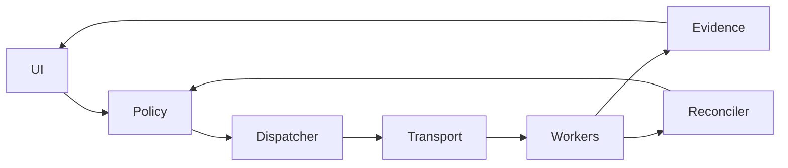

# 20260906-0606- AGY handover: new understanding and actor ecology implementation plan

Generated: 2026-09-06T06:50:06Z. Status: ANALYZED AND PLANNED; full DMC/TCM, FPP/SysML conformance, communicating actor ecology, and full-site admission remain incomplete.

[Unified reusable prompt](http://nas-1.tail55d152.ts.net:4100/files/docs/design/20260906-0606-uos-agy-codex-unified-master-prompt.md) · [ADR-017](http://nas-1.tail55d152.ts.net:4100/docs/zk/20260906-0836-adr-017-tri-sovereign-10d-tensor-evolution-master-handover-to-codex-session.md) · [Existing audit](http://nas-1.tail55d152.ts.net:4100/files/docs/design/20260906-0631-web-knowledge-verification-review.md) · [Source receipt](http://nas-1.tail55d152.ts.net:4100/files/governance/sources/20260906-0606-agy-handover-source-receipt.json) · [Wiki](http://nas-1.tail55d152.ts.net:4100/wiki) · [Home](http://nas-1.tail55d152.ts.net:4100/)

#fractal-l0 #fractal-l1 #fractal-l2 #fractal-l3 #fractal-l4 #fractal-l5 #fractal-l6 #fractal-l7 #fractal-l8 #fractal-l9 #zk-adr #km-triad #zero-muda #tailscale-web

## What the new handover changes

The goal is an operational UOS knowledge and control system whose website is an observable interface to verified Gleam behavior. The original OCaml inventory is an input to that system. The new handover adds ten concrete UI routes, a ten-axis analysis framework, historical STPA/FMEA assessments, and a continuity record. The operator's subsequent additions require complete DMC/TCM, denotational intent, L0–L9 algebraic coverage, F Prime based Gleam actors, SysML implementation, and a communicating actor ecology informed by ZigVM and Harness-Bionic.

The execution plan therefore joins three obligations: user-visible behavior; model and implementation correspondence; and actual supervised, authorized communication. Each requirement must connect through an intent, model, law, actor/module, test, runtime receipt and page/component claim. Completion of one obligation cannot stand in for another.

The source trees and their original OCaml remain unchanged. The programme will add Gleam code, ports and tests in UOS. Historical source implementations remain separately classified references/oracles until the ingestion and execution gates are satisfied.

## What is already supported by evidence

| Work | Observed result | Limit |
|---|---|---|
| Original ZigVM OCaml inventory | 161 files, 1,478 static check/law/assertion sites; 161 matching original digests | Original suites were not executed; counts are not coverage percentages |
| Cross-project census | 8,047 records, including 4,340 documents and 3,707 test/support files | Text indexing and selected close reading; not exhaustive manual review |
| Expanded selected catalogue | 770 files and 23,765 lexical declarations/scenarios/steps | Some helpers and Gherkin steps; not unique executed tests |
| New Gleam verification contract | Scoped compiler/runtime/SMT gate 28/28 passing in its receipt | Finite evidence model and named module, not arbitrary Gleam proof |
| Document-renderer repair | Eight web unit tests; final isolated fixture 58/58 browser checks; no observed control overflow | Fixture not live deployment or whole-site certification |
| Live baseline | Four passes over 46 routes, 184 attempts | 183 FAIL and one ERROR; not complete semantic cycles for every component |
| Skills and agent repair | Core discovery/configuration/inference checks completed with repair receipts | AGY Stitch OAuth and AGY browser download integration still have issues |

These results predate later shared-workspace changes. Revalidate their source/dependency/build scope before assigning current operational credit. The evidence receipt records the tested candidate separately from later publication state.

## Handover discrepancies that affect the plan

The root HANDOVER_TO_CODEX.md initially matched ADR-017 byte-for-byte (SHA-256 0a4b562acae1d186266ae59842044e97d81530f21b72c0522ab61d8681fdc458). Its “clean merged and tagged” state is historical. The shared working copy subsequently included this audit and other writers' changes. No new commit or independent reviewer signature is implied by this addendum.

The Wave 2 journal marks physical browser execution as outstanding while also claiming 100% admission. Its reported scores, test totals and certificates must be checked against runnable sources and actual receipts. The router currently spells the UX route /ux-audit; /ux-auditor in ranking tables is a concrete reference mismatch.

The inspected dmc_tcm_algebraic_atlas.gleam currently denotes syntax by constructing labels, verifies four of thirteen trace fields, lists eight layers, and carries preservation/gluing booleans. That is useful metadata but does not implement the requested semantics and laws. The new scoped web_quality_contract does test all thirteen fields for transport, but it has not replaced every old call path.

The inspected denotational_intent_router.gleam bases its decision on a device serial and emits fixed trace IDs; actor/action/target do not determine authorization there. Complete typed policy, real intent interpretation, effect isolation and end-to-end tests are mandatory.

TCM has multiple expansions in current contracts/code/CLI. Preserve TCM-Morphism, TCM-Trace13 and TCM-Temporal as distinct named obligations until reconciled. The ten-axis index and the thirteen-field trace vector also need separate types. The old template's blanket client-JavaScript ban conflicts with Gleam's browser target; pure Gleam application logic may compile to JavaScript.

The system-engineering skill is useful for isolation, observable safe states and bounded recovery. Its unrelated physical fault-injection advice and unsubstantiated SIL-6 terminology do not authorize hardware experiments or establish a certification level. Canonical UOS language/storage boundaries remain controlling.

## Read-only review: F Prime and Zenoh in the source systems

This is a targeted source review, not a fresh execution of those external systems. Full-file digests and read scope are recorded in the source receipt. No external code or executable has been imported.

| System/source | What the code or document does | Useful adaptation and missing verification |
|---|---|---|
| Harness-Bionic docs/hermes/fpp-architecture.md | Describes corpusStore, renderer/query, queued auditors, guarded controllers and an active audit loop; binds model edges to no auditor-to-corpus writes | Reuse the authority separation and requirement/probe graph. Counts are document claims until regenerated; a graph model must also constrain actual runtime routes |
| Harness-Bionic docs/hermes/fprime-alignment.md and wiki FPP metamodel | Maps FPP types, components, ports, commands, telemetry, IDs and topologies; records gaps in packets, some translation-unit features and hierarchy | Expand to a version-specific conformance matrix. “All constructs” in a heading does not close the document's own gaps or new upstream features |
| Harness-Bionic modules/hermes_harness/hermes_zenoh.ml | Validates keys, exposes publish/query/queryable through a C binding; handles disabled/unavailable transport as an error | Preserve typed boundaries and named errors. Audit key language, payload limits, callback ownership and effect authority |
| Harness-Bionic modules/hermes_harness/hz_stubs.c, publish section | Uses real zenoh-c APIs, opens a client session, puts data, drops the session; copies payload through a string API | Use a supervised persistent session outside the BEAM scheduler. Verify binary/NUL behavior and endpoint encoding; local put success is not a consumer commit |
| Harness-Bionic test_hermes_zenoh.ml | Pure key checks, invalid-key rejection, unreachable/disabled cases, optional live publish | Port the distinct unit/negative/integration cases. Its live absence prints a skip but emits skipped:0; repair UOS receipt accounting and require independently observed delivery |
| Harness-Bionic swarm_fpp.ml | Variant-shaped ports and placeholder constant outputs; the comment expands FPP as Fractal Product Process | Treat as a partial model, not NASA FPP runtime semantics |
| Harness-Bionic/UOS Hermes swarm_zenoh.ml and sysml/zenoh_mesh.ml | Printing/dummy callback paths and an explicitly named ZenohMock | Reuse only modeled state transitions after review; mocks provide no network evidence |
| UOS Hermes sysml_grammar.ml | System/Part/Block/Connection/Behavior constructors mostly return unit after ignoring arguments | Preserve the original file. Implement real Gleam AST and semantics; unit-valued constructors cannot retain a model |
| ZigVM harness/zenoh.ml | Older shell/curl REST/SSE adapter; put discards process status | Do not copy its shell/error-handling pattern into UOS |
| ZigVM harness/zenoh_channel.ml | Adapts a publisher to a transport-independent Channel_envelope interface | Keep message algebra pure and make transport an interpretation; expand the interface for acknowledgment/deadline requirements |
| ZigVM harness/zenoh_ffi.ml | Native zenoh-c via Ctypes; two sessions and a bounded receive loop for round-trip probing | Reuse the separate-session test idea, adding explicit router/peer-path controls. Audit ABI sizing, ownership/drop, monotonic deadlines and all open/close paths; do not copy opaque-buffer ABI guesses |
| ZigVM harness/sa_plan_outbox_zenoh.ml | Serializes an outbox envelope and maps successful publish to Delivered; errors become Transport_failed | Split PublishAccepted, Received, Applied and Committed. A consumer receipt must drive command completion |
| ZigVM lifecycle ADR-004 and UOS moz/client.gleam | ADR recommends persistent sessions; UOS has Option(Session), ensure_session, with_session and invalidate_session used by request/query paths | Reuse and extend actual lifecycle code. Verify session close/cleanup, real FFI transport, pending request bounds, reconnect and actor supervision before declaring persistent network behavior complete |

The source inspection found practical interfaces and honest gaps alongside simulation. Neither “FPP-shaped” nor “Zenoh-shaped” is enough: the same message must be traced from a real sender through the configured transport to the authorized consumer and its durable outcome.

Primary comparison sources: [NASA FPP](https://nasa.github.io/fpp/fpp-spec.html), [F Prime component semantics](https://fprime.jpl.nasa.gov/latest/docs/user-manual/overview/03-port-comp-top/), [F Prime topology test](https://fprime.jpl.nasa.gov/latest/FppTestProject/FppTest/topology/main/), [OMG SysML](https://www.omg.org/spec/SysML/2.0), [KerML](https://www.omg.org/spec/KerML/1.0), [Zenoh abstractions](https://zenoh.io/docs/manual/abstractions/). The proposed Gleam adaptation below is a design inference from these sources and the local evidence, not an upstream implementation guarantee.

## Latest operator addition: C3I Zenoh NIF for all UOS communication

The operator explicitly selected C3I's Zenoh NIF as the required reuse baseline and Zenoh as the common communication layer for UOS. This changes the plan from choosing a transport to verifying, completing and integrating a specific binding. All application/domain edges must map to Zenoh; browser/API protocols act as gateways. Runtime supervision/bootstrap and pure in-process calls are separately documented mechanisms. An unexplained alternate domain bus is a migration gap.

The C3I and UOS Rust zenoh_nif.rs files already share SHA-256 52e9155d544e11a989a5890685ed10058786819010dcac8131c330d8cbefe803. Their indrajaal_native_zenoh.erl wrappers share SHA-256 5519a07b225cb96d33a3b6c4aa78dfaff48d2ce558eca3165da9e6ab7f29333d. The required source is therefore already present in UOS for these two files; copying them again would not repair the integration.

Source review found these concrete issues to address before assigning communication credit:

- The indrajaal_native_zenoh wrapper's open_session creates a reference and put returns ok without a native call; get/subscribe raise nif_not_loaded. Confirm its actual callers and remove dummy-success behavior from admitted paths.
- The separate c3i_nif module registers five Rust Zenoh functions. Its unloaded get fallback returns an empty list, which get_nif can treat as success. Native absence must remain unavailable, not empty valid data.
- MoZ uses the session-based zenoh client API; that API calls cepaf_gleam_ffi, which still has legacy Elixir/native-path loading. The direct c3i_nif helpers are a separate path. Trace and unify the actual calls; source presence is not wiring.
- The Rust implementation holds a global mutex while awaiting network put/get under DirtyCpu block_on. The normal-scheduler status function also locks that mutex. Bound scheduler-facing work and cancellation; an isolated transport host using the same NIF is an option if safe embedding cannot be established.
- The OnceCell initializer cannot replace an already initialized cell, while close sets its Option to None. Test close/reopen and repeated open; do not infer successful replacement from a returned connected label.
- The inspected Rust module exposes open/put/get/status/close, not a complete subscriber/queryable/callback lifecycle. Complete the required API, bounded resource cleanup and recipient-death handling.
- Configuration failures can fall back to defaults, status uses a fixed endpoint label, and some Gleam helpers inspect JSON substrings. Require typed decoding, explicit configuration errors and observed endpoint/session state.

The C3I journal describing Sutra's Zenoh integration is a different binding/application and a useful reference; its reported counts and DirtyCpu assurances do not verify this UOS call path. Native code runs within the VM's protection boundary, and scheduler annotations do not create process-level crash isolation; validate that design against the [Erlang NIF documentation](https://www.erlang.org/doc/apps/erts/erl_nif.html). Compare all relevant bindings and tests before selecting an exact native source revision. No external binary, secret configuration or source mutation was performed during this review.

Use the CEPAF Zenoh skill's lifecycle/schema guidance with the operator-selected C3I implementation. Its empty example and legacy zenoh-erl preference are not executable evidence. Preserve the common C3I key/schema lineage, with explicit versioned UOS mappings for commands, queries, telemetry, evidence and actor coordination.

## Feature richness, performance and the full Zenoh requirement

The latest operator addition requires both a comparative source selection and complete Zenoh feature coverage. Three native candidates have now been located and inspected. Export counts describe source surface only; policy helpers and application telemetry helpers are not additional Zenoh protocol capabilities.

| Candidate and source locator | Declared dependencies and inspected surface | Findings that affect reuse | Performance evidence |
|---|---|---|---|
| Current C3I/UOS: lib/cepaf_gleam/native/c3i_nif/src/zenoh_nif.rs; UOS apps/cepaf_gleam/native/c3i_nif | Rustler 0.37; Zenoh 1.9.0 caret, TCP; five open/put/get/status/close exports | Already present in UOS; singleton, wrapper, close/reopen, blocking-lock and absent subscription/queryable gaps described above | No comparable native benchmark executed in this review |
| Legacy Elixir/Indrajaal: /home/an/dev/ver/c3i/sub-projects/c3i/native/zenoh_nif and lib/indrajaal/native/zenoh.ex | Rustler 0.37; Zenoh =1.8.0, TCP/UDP; 17 exports, including three policy helpers; resource sessions, binary put/publish/batch, get/get_timeout, subscribe/poll/unsubscribe/stats | Broadest native surface among these three. Explicit close is a no-op while references remain; status hardcodes connected; delete publishes an empty Put and does not apply the publisher's token gate; callback PID is ignored; polling reserves caller-selected capacity on a normal scheduler | Located tests include mocks, PubSub and serialization; they do not establish native throughput or latency |
| Gleam/Sutra: /home/an/dev/ver/c3i/sub-projects/sutra/sutra_server/native/zenoh_nif, src/zenoh_ffi.erl and src/sutra_server/zenoh.gleam | Rustler 0.36; Zenoh 1.9.0 caret, TCP; six open/put/span/is_open/stats/batch exports; many domain topic helpers | OnceLock without a close API, default mode not explicitly set from the argument, fixed router endpoint, no receive/queryable API in this module, no-session returned as Ok text, span JSON assembled without escaping | Inspected test examples accept Error and no_session as passing; no independently observed native benchmark here |

The source-level conclusion is limited: legacy Indrajaal is the richest inspected native candidate, and it provides useful resource/subscription/binary/batch patterns to adapt after correction and admission. No candidate has been established as the most performant or as complete. The source tree census must still locate any remaining bindings and their exact resolved versions. The Sutra source was found under sutra_server; its earlier journal is no longer the only evidence.

Concrete test-code classifications for the comparison:

| Legacy/Sutra test | Actual measured or asserted behavior in inspected code | How UOS should use it |
|---|---|---|
| test/indrajaal/zenoh/nif_latency_benchmark_test.exs | Phoenix.PubSub broadcast/receive and module/function availability | Reuse workload shape and wrapper-presence checks; replace the transport with the admitted native path and a separate observer for NIF measurements |
| test/indrajaal/performance/zenoh_performance_test.exs | Explicit ZenohPerformanceMock and synthetic timing/throughput helpers | Retain as model/unit requirements; require new live-native performance evidence |
| test/indrajaal/core/zenoh_throughput_benchmark_test.exs | Jason serialization/deserialization, in-process queues and payload budgets | Useful codec/serialization properties and boundary-cost baseline; not mesh throughput |
| test/indrajaal/cluster/zenoh_data_path_throughput_test.exs | Batch construction and simulate_publish timing | Useful batch generators, sequence and size checks; attach to real receipt-based delivery tests |
| Sutra test/sutra_zenoh_nif_test.gleam, inspected examples | Calls native-facing functions but accepts both success and error/no-session results | Split absence/error contracts from positive delivery tests. A positive test must fail when the native library, required router or receiver is absent |

None of these selected native/benchmark files uses a browser in the inspected paths. Browser-based actor ecology tests must additionally trace a real UI action through ingress, policy, Zenoh send/receive, state change and the updated UI. Sutra's references to Patrol/FluffyChat are a separate end-to-end claim that needs its own runner and receipts.

The native risk review adds required counterexamples: Delete must be received as Delete, close must invalidate every retained handle according to its contract, a dead callback owner must release declarations, subscription readiness failure must be observable, normal-scheduler allocations must be bounded, and error replies must survive collection. The legacy subscriber's bounded queue is 1,000 messages, but a count bound alone does not bound total bytes. Its source field is filled from congestion-control debug output; that is not authenticated publisher identity. Audit per-item batch authorization and results, not only an aggregate count. These observations are from source inspection, not fresh reproduction of runtime failures.

The full-coverage plan has four independently reported denominators: upstream inventory, implemented facade, executed tests and admitted capabilities. Expand the 16 feature families in unified-prompt section 11.1 into every selected-version public API item, option and lifecycle operation. Include configuration/session/key/selector/sample APIs; pub/sub and real Delete; queries/queryables/replies; discovery/matching/liveliness; QoS/locality; advanced history/recovery/groups; binary serialization/shared memory; all transport profiles; authentication/ACLs; router/storage/plugin management; diagnostics and packaging. Account for every Cargo flag and every stable/unstable/deprecated/platform distinction. Router and storage features remain supervised services with typed UOS management, rather than automatically embedding plugins into the VM. Unavailable targets remain UNRUN and block a claim of full execution.

Upstream references used for this extension are [Zenoh 1.8.0 API](https://docs.rs/zenoh/1.8.0/zenoh/), [1.8.0 flags](https://docs.rs/crate/zenoh/1.8.0/features), [flags observed as 1.9.0](https://docs.rs/crate/zenoh/latest/features), [query/reply observed as 1.10.0](https://docs.rs/zenoh/latest/zenoh/query/index.html), [extensions observed as 1.9.0](https://docs.rs/zenoh-ext/latest/zenoh_ext/all.html), and [extension feature gates](https://docs.rs/zenoh-ext/latest/src/zenoh_ext/lib.rs.html). Rolling pages disagree on versions; select a compatible exact pin and regenerate the feature census. An inaccessible version URL or a declaration in Cargo.toml is not evidence that that version ran.

The benchmark plan compares as-found and common-version builds separately, with the same hardware, topology, workload, QoS and authentication. It measures boundary cost, independently observed delivery, query round trip and durable command acknowledgment separately, with raw samples, repeated runs, justified tail percentiles, throughput/goodput, losses, CPU/memory and BEAM scheduler/mailbox impact. Test fan-out, concurrency, sizes, batching, shared memory, overload and reconnect. Use an upstream Rust control to isolate wrapper overhead. Choose a Pareto-efficient candidate only after correctness and safety gates pass; no performance winner is assigned now.

Concurrent UOS FPP work is visible in the shared Jujutsu history and working copy, including dictionary/packetizer/parameter/topology modules and new FPP DMC/TCM, intent, ontology, atlas and UI tests. It was not authored or verified by this handover review. Reconcile the current candidate and test receipts at UOS-H01 before implementing duplicate work or promoting older inspection conclusions to current status.

## Proposed actor ecology

“Ecology” means an explicit interaction graph with bounded resources, ownership, supervision, feedback and evolution rules. It does not imply autonomous replication or unrestricted self-modification. Reuse existing UOS supervisors and actor modules where verified; do not create one OS/BEAM process per atlas entry or pure function.

Use four coordinated capability groups within the existing Apps/Engines/Services/Intelligence supervision boundaries:

| Group | Responsibilities | Authority and lifecycle |
|---|---|---|
| Knowledge applications | Wiki/ZK corpus views, indexing, search, navigation, rendering and user intent ingress | Own derived caches and UI sessions; source/evidence writes pass policy and fenced writer |
| Verification engines | AST/model validation, algebra/property tests, bounded compiler/solver workers and browser orchestration | Read immutable candidates; emit findings and receipts, not admission or content mutations |
| Shared services | Actor/topology registry, persistent Zenoh session service, query/command routing, journal/evidence writer and telemetry | Explicit schemas, queue limits, authorization, single-writer epochs, backpressure and cleanup |
| Intelligence/control | Reconciliation, repair proposals, recovery budgets and user-facing explanations | Consume observations; propose actions through the same typed policy gate |

Every live actor contract records identity, stable port IDs, model/module location, state, permitted messages, outgoing connections, authority, supervisor, mailbox/resource budget, time policy, retry/dedup rules, start/stop/restart behavior, failure outputs and test IDs.

Commands, queries, events and telemetry have separate envelope variants and key namespaces. Commands require authorization and consumer completion receipts. Queries require correlation, deadlines and named stale/unavailable errors. Telemetry may be lossy under a declared budget, with loss visible. Transport and health observations cannot rewrite authoritative evidence.

The first integration scenario is a real user request to verify a wiki page: ingress decodes an intent; policy authorizes the bounded check; dispatcher routes a typed request; link/AST/browser workers produce observations; the writer appends a fenced verification receipt; the UI renders its actual state and navigation. A rejected or stale intent produces no effect. This one scenario must run through local processes, then through an isolated router and separate processes/nodes, before expansion to the remaining roles.

The second scenario is a bounded corpus correction in an isolated fixture: an auditor reports a broken link; the reconciler proposes a correction; policy and a writer lease gate the change; the source/provenance and derived indices update; the affected page/component cycles rerun. A replayed command cannot apply twice, and an observer cannot bypass the writer.

## Actor interaction view — equivalent ASCII and Mermaid

The diagrams use the same nodes U, P, D, T, W, E and R. Edges: U→P, P→D, D→T, T→W, W→E, E→U, W→R, R→P. W represents bounded application/verification workers; E represents the fenced evidence writer. Feedback is a proposal.

```text
[U UI] --> [P Policy] --> [D Dispatcher] --> [T Transport] --> [W Workers]
   ^           ^                                                |  |
   |           |                                                |  v
   |           +------------------------ [R Reconciler] <---------+ [E Evidence]
   |                                                                  |
   +------------------------------------------------------------------+
```



The implementation must validate actual routing against this authority model. Removing an edge from a picture does not remove an unguarded function call or subscriber.

## Dependency-ordered implementation plan

All identifiers below are proposed work packages and acceptance criteria. They do not name completed files or implemented APIs.

| ID / priority | Concrete task | Dependencies | Acceptance evidence |
|---|---|---|---|
| UOS-H01 / P0 | Capture current Jujutsu, clock, source manifest and running build; reconcile historical claims, route names and glossary | None | Source/build receipt, known dirty frontier, claim-to-evidence table, no inherited automatic green |
| UOS-H02 / P0 | Repair verification reporting that copies totals/booleans or hides skips; make all UI checklist statuses evidence-derived | H01 | Mutants for fabricated counts, stale/missing receipts and skipped live probes are rejected; UI shows actual state |
| UOS-H03 / P0 | Define complete intent AST/denotation and typed actor/action/target policy; replace serial-only admission path | H01 | Negative compiler fixtures and end-to-end authorized/denied/stale/replayed intent tests with measured effects |
| UOS-H04 / P0 | Implement TCM-Morphism, Trace13 transport/allowed transitions, Temporal freshness/epochs, and two-lattice isolation | H03 | Every field mutation tested; executable laws; bounded SMT counterexample checks; observer-write rejection |
| UOS-H05 / P1 | Extend inventories to uncovered files/references and FPP/Zenoh/actor tests | H01 | Every scoped file classified or named exclusion; per-case behavior/coverage/port/browser/execution row |
| UOS-H06 / P1 | Build machine-readable L0–L9 algebraic atlas linked to actual code and observations | H03,H04,H05 | No unimplemented operation marked verified; reference/efficient/actor interpretations satisfy same laws |
| UOS-H07 / P1 | Pin FPP toolchain; implement complete typed FPP model/validator, port graph and dictionary semantics in Gleam | H05,H06 | Clause matrix, upstream positive/negative corpus under license gates, actual parser/compiler receipts |
| UOS-H08 / P1 | Pin SysML/KerML; implement parser/IR/resolver/checker and full standards conformance programme | H05,H06 | Located errors, model round trips, requirements/verification links, reference-tool correspondence; unsupported features remain open |
| UOS-H09 / P1 | Implement actual passive/queued/active actor interpretations and bounded test harness | H03,H04,H07 | Real message/port histories, startup/dispatch/restart/overflow/timeout tests and model trace equivalence |
| UOS-H10 / P0-P1 | Compare all located Gleam/Elixir native candidates; pin and complete the C3I-derived Zenoh NIF, unify MoZ/native call paths, implement every versioned feature and map every UOS domain edge to Zenoh | H01,H09 | Full API/feature/target matrix, corrected semantics, native load/send/receive/query/queryable/lifecycle receipts; fair reproducible performance comparison; no dummy success; complete edge migration matrix |
| UOS-H11 / P1 | Run local then multi-process/node ecology vertical slices with real Zenoh router | H08,H09,H10 | Independent send/receive/apply/commit observations, consumer acknowledgments, trace conservation, no mock shortcut |
| UOS-H12 / P1 | Expand roles and complete model/actor/FPP/SysML/atlas coverage | H11 | Every required conformance/actor row implemented and exercised; partial profile never labeled full |
| UOS-H13 / P0-P1 | Repair unsafe document rendering, broken controls/links, mobile layout and accessibility | H01,H05; alongside H03–H12 | Targeted TDD regressions, semantic browser checks and captured visual review |
| UOS-H14 / P1 | Run at least four recursive semantic cycles for every final-candidate page and component, including all ten new routes | H12,H13 | Complete page/component/state ledger, real browser images/DOM/AST/AX/video/traces, no unexplained missing frontier |
| UOS-H15 / P1 | Property/fuzz/mutation, actor fault/recovery, performance/scale and experience validation | H06–H14 | Seeds/shrink corpus, killed mutants, router loss/rejoin/duplicate/crash-after-apply cases, measured budgets and user tasks |
| UOS-H16 / P1 | Complete AGY/Codex integration health and relevant skill admission | H01; alongside implementation | Native schema/discovery/core smoke and required connector/browser receipts; unresolved OAuth remains explicit |
| UOS-H17 / final | Refresh all required evidence, independent review, 13-section journal and serialized Jujutsu admission | H01–H16 | Runtime plus formal keys at candidate; complete conformance and browser frontier; no invented signatures or stale pass |

UOS-H10 is sequenced as H10a candidate/API/flag census and provenance; H10b independent regression oracles and native loading; H10c lifecycle/binary/pub-sub/queryable correctness and scheduler bounds; H10d remaining full-feature profiles and managed ecosystem services; H10e common-workload benchmarks; H10f complete domain-edge migration and refreshed conformance receipts. These are substeps of the same task, not six newly completed capabilities. Required final feature coverage remains exhaustive even when code delivery is staged.

Priority reflects defect risk and dependency, not a claim that all P1 tasks are small. Full SysML, FPP and Zenoh conformance are substantial implementation programmes. Stage their code delivery without reducing the operator's final requirement. Time estimates require completing the feature/clause census; no speculative deadline is asserted here.

## Completion criteria and review method

Every function has an observable contract and relevant unit/property/error coverage. Every actor is exercised as a real process, every transport edge has a delivery/absence/error contract, every page/component has four distinct semantic observe–act–compare–repair–reverify cycles, and every imported technique/source has provenance. Requirements, model features and unvisited routes are finite enumerated denominators.

For each graph/category/sheaf claim, retain actual operations and quantified laws, not naming or flags. For each solver claim retain normalized query, bound, tool version, input/model mapping, satisfiable control and outcome. For each browser claim retain actual served build, test ID, state, action, expected/observed result and media. Test counts, screenshot counts and generated diagrams are evidence dimensions, not substitute correctness metrics.

STPA/FMEA adds losses, hazards, unsafe control actions, constraints, tests, detection evidence and residual risk. Scores are attributed judgments with rationale; recomputing 929→49 does not prove empirical risk reduction. Do not inherit “no unmitigated hazards” without inspecting the control paths.

The current deliverable is the unified prompt, this reviewed plan and source/evidence continuity. The full implementation mission remains open. This addendum should travel with AGY's earlier ADR-017 so a later session sees both the intended architecture and the unresolved work.

<details>
<summary>Five domains and 18 canonical checkpoints — current handover state</summary>

| Domain | Checkpoint | State |
|---|---|---|
| Metadata/navigation | CHK-01-TIME | Timestamp and source receipt recorded |
| Metadata/navigation | CHK-02-TAIL | Clickable FQDN links; site-wide correctness not certified |
| Metadata/navigation | CHK-03-FRACT | L0–L9 requirements present; implementation incomplete |
| Metadata/navigation | CHK-04-KM | Triad integrated into actor and test plan |
| Purity/storage | CHK-05-MUDA | No prohibited runtime introduced |
| Purity/storage | CHK-06-GRAPH | Native blocking boundaries are review gates |
| Purity/storage | CHK-07-DRIVE | No storage operation; interlock preserved as requirement |
| Testing/math | CHK-08-C1C8 | Test portfolio and per-component contracts specified |
| Testing/math | CHK-09-MATH | Complete DMC/TCM/atlas work remains open |
| Testing/math | CHK-10-9MOD | Runtime evidence separated by modality |
| Testing/math | CHK-11-REGR | Scoped prior receipts; final revision regression pending |
| Control/observability | CHK-12-GLEAM | Ecology design concrete; runtime implementation pending |
| Control/observability | CHK-13-HERMES | Source unchanged; read-only FPP/Zenoh review |
| Control/observability | CHK-14-ZIGVM | Original source retained |
| Control/observability | CHK-15-MAX | Isolation unchanged |
| Control/observability | CHK-16-OTEL | Message and verification trace requirements explicit |
| Governance/VCS | CHK-17-SOV | No new ratification or third-party messages |
| Governance/VCS | CHK-18-JJ | Current state captured; no native Git mutation |

</details>

[Previous: unified prompt](http://nas-1.tail55d152.ts.net:4100/files/docs/design/20260906-0606-uos-agy-codex-unified-master-prompt.md) · [Next: audit journal](http://nas-1.tail55d152.ts.net:4100/files/docs/journal/20260906-0631-web-knowledge-verification-journal.md) · [Return to ZK](http://nas-1.tail55d152.ts.net:4100/zk).
