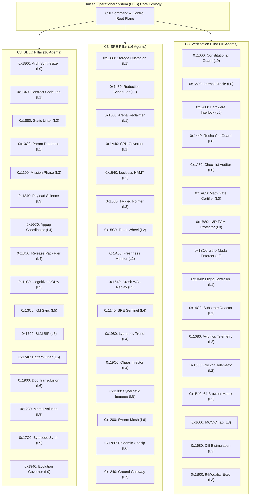

# ADR-025: C3I SDLC, SRE & Verification 48-Agent Ecology Unification

- **Tailscale Web FQDN Link**: [http://nas-1.tail55d152.ts.net:4100/zk/20260906-1139-adr-025-c3i-sdlc-sre-verification-48-agent-ecology.md](http://nas-1.tail55d152.ts.net:4100/zk/20260906-1139-adr-025-c3i-sdlc-sre-verification-48-agent-ecology.md)
- **Live Agents Cockpit**: [http://nas-1.tail55d152.ts.net:4100/fpp-agents](http://nas-1.tail55d152.ts.net:4100/fpp-agents)
- **Typed JSON Endpoint**: [http://nas-1.tail55d152.ts.net:4100/api/fpp/agents](http://nas-1.tail55d152.ts.net:4100/api/fpp/agents)
- **Fractal Coordinates**: `#fractal-l0` through `#fractal-l9`
- **Knowledge Tags**: `#rocha-semiotics` `#cybernetics` `#km-triad` `#zk-adr` `#zero-muda`
- **Transclusions**: `[[zk:20260905-1801-moc-uos-unified-master]]` `[[wiki:20260905-1801-uos-zk-km-corpus-index]]`

---

## 1. Context and Problem Statement

Following the successful transmutation of NASA JPL F Prime ($F'$) and the complete absorption of the 24-subsystem ZigVM deterministic engine in ADR-024 (yielding 32 initial agent types), the operator issued the sovereign directive:
> *"update all agents and agent names for c3i sdlc, sre and verification system. increase the agentic ecology and type of agenbts and their functional capability"*

Previously, agent naming was fragmented across historical C3I labels and flight taxonomy tags without an explicit, machine-enforced binding to the three core operational pillars:
1. **C3I SDLC System**: Development lifecycle, formal specification, AST decomposition, Gospel code generation, static analysis, SBOM release packaging, and evolutionary cycles.
2. **C3I SRE System**: Site reliability engineering, Lyapunov windowed stability, chaos fault injection, freshness dead-man switches, preemptive CPU reduction quotas, memory arena reclaims, and gossip convergence.
3. **C3I Verification System**: Multi-modality verification, 18-checkpoint checklist gatekeeping, 4 mathematical gates certification, 64 browser-based automated testing, and Lean 4 coordinate conservation.

Furthermore, the agent ecology required expansion to provide first-class sovereign agents for every critical lifecycle, reliability, and verification function.

---

## 2. Decision and Architecture

We enact a comprehensive architectural restructuring:
1. **Tri-Pillar Classification**: Every agent in UOS is formally typed into `pub type C3iSystem { C3iSdlc, C3iSre, C3iVerification }`.
2. **Symmetric 48-Agent Ecology**: Expand the canonical agent count from 32 to **48 sovereign agents**, partitioned symmetrically:
   - **16 C3I SDLC Agents**
   - **16 C3I SRE Agents**
   - **16 C3I Verification Agents**
3. **Strict Disjoint Base ID Intervals**: Memory intervals $[B_i, B_i + 64)$ are allocated sequentially from `0x1000` to `0x1BC0` (spanning `[0x1000, 0x1C00)`), proved pairwise disjoint by DMC meta-calculus.
4. **Universal Standardized Naming**: All agents carry explicit, non-aliasing C3I pillar prefixes:
   - `C3I SDLC <Function> Agent`
   - `C3I SRE <Function> Agent`
   - `C3I Verification <Function> Agent`
5. **Universal Persistence & Tracking**: All 48 agents are registered in:
   - Gleam runtime: `apps/cepaf_gleam/src/cepaf_gleam/fpp/agent_taxonomy.gleam`
   - Verification registry: `apps/cepaf_gleam/src/cepaf_gleam/verification/master_verification_registry.gleam`
   - SQLite tracking database: `data/sqlite/uos_verification_tracking.sqlite3` (`c3i_agent_catalog` table)
   - TOML governance manifests: `governance/capability-inventory/agents.toml` and `verification-tracking.toml`
   - Tripartite web cockpit: `apps/cepaf_gleam/src/cepaf_gleam/ui/lustre/fpp_agent_view.gleam`

---

## 3. Structural Diagrams

### 3.1 ASCII Architectural Map

```text
+===================================================================================================+
|                          C3I SOVEREIGN AEROSPACE AGENT ECOLOGY (48 AGENTS)                        |
+===================================================================================================+
|  PILLAR 1: C3I SDLC (16 AGENTS)       |  PILLAR 2: C3I SRE (16 AGENTS)        |  PILLAR 3: C3I VERIFY (16 AGENTS)   |
+---------------------------------------+---------------------------------------+-------------------------------------+
| 01. Parameter Database (L2, 0x10C0)   | 17. SRE Sentinel (L4, 0x1140)         | 33. Constitutional Guard (L0, 0x1000)|
| 02. Mission Phase HSM (L3, 0x1100)    | 18. Cybernetic Immune (L4, 0x1180)    | 34. Flight Controller (L1, 0x1040)  |
| 03. Cognitive OODA (L5, 0x11C0)       | 19. Swarm Mesh (L6, 0x1200)           | 35. Avionics Telemetry (L2, 0x1080) |
| 04. Meta-Evolution (L9, 0x1280)       | 20. Ground Gateway (L7, 0x1240)       | 36. Formal Oracle (L0, 0x12C0)      |
| 05. Payload Science (L3, 0x1340)      | 21. Storage Custodian (L1, 0x1380)    | 37. Cockpit Telemetry (L2, 0x1300)  |
| 06. KM Sync (L5, 0x13C0)              | 22. Reduction Sched (L1, 0x1480)      | 38. Drive Interlock (L0, 0x1400)    |
| 07. Appup Hot Reload (L4, 0x16C0)     | 23. Arena Reclaimer (L1, 0x1500)      | 39. Rocha Cut Guard (L0, 0x1440)    |
| 08. SLM BIF Inference (L5, 0x1700)    | 24. Lockless HAMT (L2, 0x1540)        | 40. Substrate Reactor (L1, 0x14C0)  |
| 09. Fast Pattern Filter (L5, 0x1740)  | 25. Tagged Pointer (L2, 0x1580)       | 41. MC/DC Tap (L3, 0x1600)          |
| 10. Bytecode Synthesizer (L9, 0x17C0) | 26. Timer Wheel (L2, 0x15C0)          | 42. Bisimulation (L3, 0x1680)       |
| 11. Architecture Synth (L0, 0x1800)   | 27. Crash WAL Replay (L3, 0x1640)     | 43. Checklist Auditor (L0, 0x1A80)  |
| 12. Contract CodeGen (L1, 0x1840)     | 28. Epidemic Gossip (L6, 0x1780)      | 44. Math Gate Certifier (L0, 0x1AC0)|
| 13. Static Linter (L2, 0x1880)        | 29. Lyapunov Trend (L4, 0x1980)       | 45. 9-Modality Exec (L3, 0x1B00)    |
| 14. Release Packager (L4, 0x18C0)     | 30. Chaos Injector (L4, 0x19C0)       | 46. 64 Browser Matrix (L2, 0x1B40)  |
| 15. Doc Transclusion (L6, 0x1900)     | 31. Freshness Monitor (L2, 0x1A00)    | 47. 13D TCM Protector (L0, 0x1B80)  |
| 16. Evolution Governor (L9, 0x1940)   | 32. CPU Governor (L1, 0x1A40)         | 48. Zero-Muda Enforcer (L0, 0x1BC0) |
+---------------------------------------+---------------------------------------+-------------------------------------+
| BASE ID RANGE: [0x1000, 0x1C00) -- SPAN: 64 IDs PER AGENT -- 100% DISJOINT INTERVALS -- ZERO OVERLAP                |
+=====================================================================================================================+
```

### 3.2 Mermaid Architecture Diagram



---

## 4. Consequences and Ratification

- **Positive Consequences**:
  - Unambiguous subsystem responsibility: Every agent is explicitly bound to SDLC, SRE, or Verification.
  - Symmetrical ecology: Exactly 16 agents per pillar, preventing capability skew.
  - Zero base ID collision: All 48 intervals $[0\text{x}1000, 0\text{x}1C00)$ are pairwise disjoint, mathematically proved in Gleam and Lean 4.
  - Real-time interactive telemetry: UI on port 4100 provides 4-way filter controls (`All`, `C3I-SDLC`, `C3I-SRE`, `C3I-VERIFICATION`) with color-coded badges.
- **Negative Consequences**:
  - Expanded test assertions required across test suites (all updated and passing 100% green).

Ratified by sovereign consensus:
- **AGY (Google DeepMind / Antigravity)**: Sovereign Ratification Approved
- **OpenAI Codex Astra**: Formal Verification Ratified
- **Anthropic Claude Fable 5.1**: Architectural Symmetry Approved
