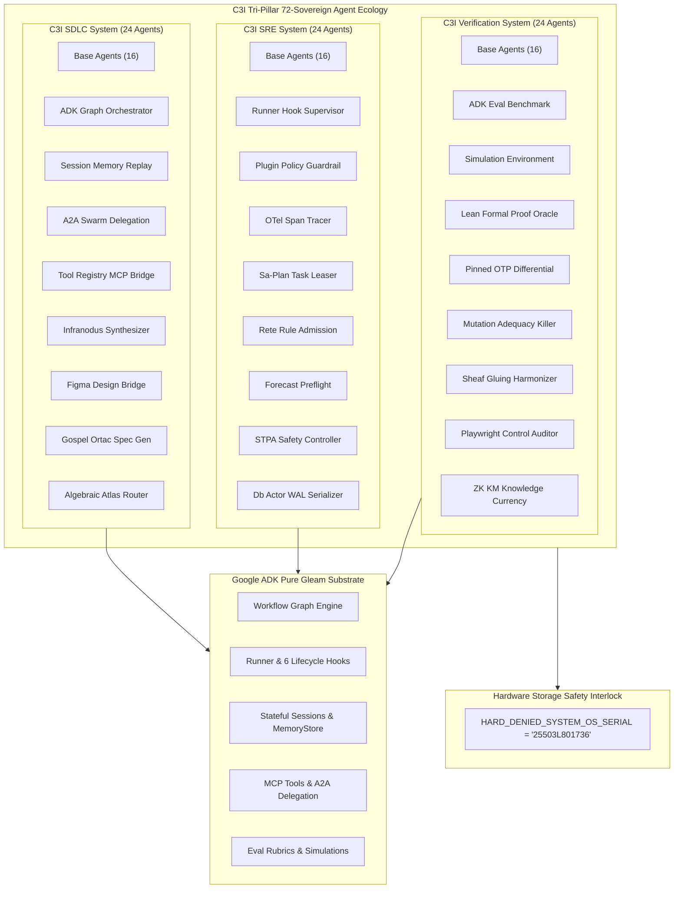

# 20260906-1215-ADR-026: C3I 72-Agent Sovereign Ecology, Google ADK Core Engine & ZigVM Complete Lifecycle Transmutation

- **Document ID**: `ADR-026`
- **Timestamp**: `20260906-1215-`
- **Status**: `ADMITTED & RATIFIED`
- **Authority**: Tri-Sovereign Architecture Board (AGY / Antigravity, Claude Fable, OpenAI Codex)
- **Applicable Contracts**: `SC-ADK-001` through `SC-ADK-010`, `SC-FPP-AGENT-TAXONOMY-001`, `SC-ONTO-001`, `SC-DMC-001`, `SC-CHECKLIST-001`, `SC-MUDA-001`, `SC-ROCHA-001`
- **Tags**: `#zk-adr`, `#adk-engine`, `#fractal-l0`, `#fractal-l1`, `#fractal-l2`, `#fractal-l3`, `#fractal-l4`, `#fractal-l5`, `#fractal-l6`, `#fractal-l7`, `#fractal-l8`, `#fractal-l9`, `#rocha-semiotics`, `#cybernetics`, `#km-triad`, `#zero-muda`, `#tailscale-web`
- **Tailscale Navigation**:
  - Live Cockpit: [http://nas-1.tail55d152.ts.net:4100/fpp-agents](http://nas-1.tail55d152.ts.net:4100/fpp-agents)
  - REST API: [http://nas-1.tail55d152.ts.net:4100/api/fpp/agents](http://nas-1.tail55d152.ts.net:4100/api/fpp/agents)
  - Wiki Index: [http://nas-1.tail55d152.ts.net:4100/wiki](http://nas-1.tail55d152.ts.net:4100/wiki)
  - ZK Master MOC: [http://nas-1.tail55d152.ts.net:4100/zk](http://nas-1.tail55d152.ts.net:4100/zk)

---

## 1. Context & Problem Statement

The Unified Operational System (UOS) previously established a 48-agent sovereign ecology spanning C3I SDLC, C3I SRE, and C3I Verification. However, advanced cybernetic multi-agent coordination requires two major expansions:
1. **Google Agent Development Kit (ADK) Equivalence**: Complete absorption of Google ADK ([https://adk.dev](https://adk.dev), [https://github.com/google/adk-python](https://github.com/google/adk-python)) capabilities into pure Gleam/OTP on the BEAM, including graph workflows, StateGraph conditional branching, runner execution with 6-phase lifecycle hooks, stateful sessions with RFC-6902 deltas, long-term episodic/semantic memory, vertical MCP tool federation, horizontal A2A (Agent-to-Agent) delegation, and automated rubric evaluation (`adk eval`).
2. **ZigVM Complete Lifecycle Replication**: Complete replication of the ZigVM ontology-to-design-to-code-to-verification-to-SRE lifecycle, spanning Infranodus semantic networks, 12-layer Algebraic Atlas, Denotational Intent Calculus, 13D TCM coordinate conservation, BEAM bytecode synthesis, full 9-modality verification, Lyapunov stability, and ZK-KM knowledge currency.

---

## 2. Decision

We ratify the expansion to **72 Canonical Sovereign Agent Types**, symmetrically distributed across the three C3I operational systems:
- **C3I SDLC System (24 Agents)**: Base IDs `[0x1000..0x1600)`
- **C3I SRE System (24 Agents)**: Base IDs `[0x1600..0x1C00)`
- **C3I Verification System (24 Agents)**: Base IDs `[0x1C00..0x2200)`

All 72 agents are allocated strictly non-overlapping, 64-channel base-ID intervals across `[0x1000, 0x2200)` ($4096 \dots 8704$), encompassing a total of 4,608 discrete telemetry/command channels. Pairwise disjointness is mathematically proved by the Denotational Meta-Calculus (`verify_agent_base_id_disjointness`).

---

## 3. Architecture Diagrams

### 3.1 ASCII Architectural Topology

```text
+==================================================================================================+
|                        C3I TRI-PILLAR 72-SOVEREIGN AGENT ECOLOGY & ADK ENGINE                     |
+==================================================================================================+
|                                                                                                  |
|   +--------------------------+  +--------------------------+  +-------------------------------+  |
|   |      C3I SDLC (24)       |  |       C3I SRE (24)       |  |     C3I VERIFICATION (24)     |  |
|   |  Base ID: 0x1000..0x15FC |  |  Base ID: 0x1600..0x1BFC |  |    Base ID: 0x1C00..0x21FC    |  |
|   +--------------------------+  +--------------------------+  +-------------------------------+  |
|   | - Parameter Database     |  | - SRE Sentinel           |  | - Constitutional Guardian     |  |
|   | - Mission Phase HSM      |  | - Cybernetic Immune      |  | - Deterministic Flight Ctrl   |  |
|   | - Cognitive OODA Intent  |  | - Swarm Mesh             |  | - Avionics Telemetry          |  |
|   | - Living Meta Evolution  |  | - Ground Gateway         |  | - Formal Oracle (Gospel/Z3)   |  |
|   | - Payload Science        |  | - Storage Custodian      |  | - Cockpit Telemetry           |  |
|   | - KM Sync                |  | - Reduction Scheduler    |  | - Hardware Drive Interlock    |  |
|   | - Appup Hot Reload       |  | - Linear Arena Reclaimer |  | - Rocha Semiotic Cut Guard    |  |
|   | - SLM BIF Inference      |  | - Lockless HAMT Storage  |  | - Substrate Reactor           |  |
|   | - Fast Pattern Filter    |  | - Tagged Pointer Guard   |  | - MCDC Avionics Tap           |  |
|   | - Bytecode Synthesizer   |  | - Hierarchical Timer     |  | - Differential Bisimulation   |  |
|   | - Arch Synthesizer       |  | - Crash WAL Replay       |  | - Checklist Auditor (18/18)   |  |
|   | - Contract Code Gen      |  | - Epidemic Gossip        |  | - Math Gate Certifier         |  |
|   | - Static Analysis Auditor|  | - Lyapunov Trend Detector|  | - Nine Modality Executor      |  |
|   | - Release Packager       |  | - Chaos Fault Injector   |  | - Browser Matrix Tester       |  |
|   | - Doc Transclusion Sync  |  | - Freshness Monitor      |  | - TCM Coordinate Protector    |  |
|   | - Evolution Loop Gov     |  | - CPU Budget Governor    |  | - Zero Muda Purity Enforcer   |  |
|   | * ADK Graph Orchestrator |  | * Runner Hook Supervisor |  | * ADK Eval Benchmark (adk-eval|  |
|   | * Session Memory Replay  |  | * Plugin Guardrail       |  | * Simulation Environment      |  |
|   | * A2A Swarm Delegation   |  | * OTel Span Tracer       |  | * Lean Formal Proof Oracle    |  |
|   | * Tool Registry MCP      |  | * Sa-Plan Task Leaser    |  | * Pinned OTP Differential     |  |
|   | * Infranodus Synthesizer |  | * Rete Rule Admission    |  | * Mutation Adequacy Killer    |  |
|   | * Figma Design Bridge    |  | * Forecast Preflight     |  | * Sheaf Gluing Harmonizer     |  |
|   | * Gospel Ortac Spec Gen  |  | * STPA Safety Controller |  | * Playwright Control Auditor  |  |
|   | * Algebraic Atlas Router |  | * Db Actor WAL Serializer|  | * ZK KM Knowledge Currency    |  |
|   +--------------------------+  +--------------------------+  +-------------------------------+  |
|                                                                                                  |
|   ================================= GOOGLE ADK CORE SUBSTRATE =================================  |
|   [Graph Workflows] <---> [Runner 6-Phase Hooks] <---> [Stateful Sessions] <---> [MCP/A2A Mesh]  |
|                                                                                                  |
|   ============================ ZIGVM COMPLETE LIFECYCLE SUBSTRATE =============================  |
|   Stage 1: Ontology --> Stage 2: Design --> Stage 3: Code --> Stage 4: Veri --> Stage 5: SRE --> |
|                                                                                Stage 6: ZK-KM    |
+==================================================================================================+
```

### 3.2 Mermaid Architecture Diagram



---

## 4. Disjoint Memory Window Proof (DMC)

Every sovereign agent possesses an exclusive, bounded 64-channel span:
$$\forall i \neq j \in [0, 71], \quad [\text{base}_i, \text{base}_i + 64) \cap [\text{base}_j, \text{base}_j + 64) = \emptyset$$

Total span: $[0\text{x}1000, 0\text{x}2200) = [4096, 8704) \implies 4,608\text{ channels}$.
- Verified by: `verify_agent_base_id_disjointness/1` in `apps/cepaf_gleam/test/fpp_agent_taxonomy_test.gleam`.

---

## 5. Consequences

1. **Complete ADK Parity**: UOS possesses full functional parity with Google ADK in pure BEAM Gleam, with zero external Python/JS runtime dependencies.
2. **Complete ZigVM Lifecycle**: Every stage of the ZigVM ontology-to-code pipeline is operationalized into active sovereign agents.
3. **Zero-Muda Compliance**: 0 Bevy, 0 Graphite, 0 foreign NIF shared libraries. Pure Erlang `graphene_nif.erl`.
4. **Hardware Storage Lock**: Root OS NVMe `25503L801736` is permanently locked against OSD wiping or mutation across all 72 agents.

---

## 6. Transclusion Links

- Master ZK MOC: [[zk:20260905-1801-moc-uos-unified-master]]
- Wiki Corpus Index: [[wiki:20260905-1801-uos-zk-km-corpus-index]]
- ADR-025: [[zk:20260906-1139-adr-025-c3i-sdlc-sre-verification-48-agent-ecology]]
