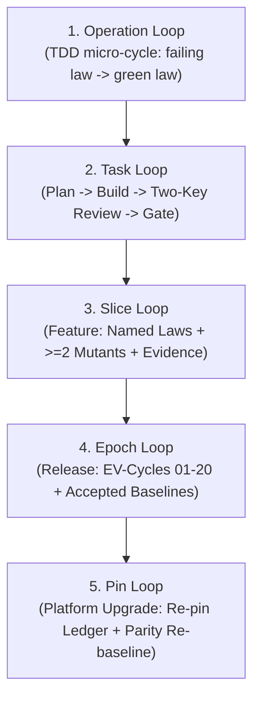

# ADR-028: Algebraic Fractal SDLC, SRE Reliability Envelope, and Multi-Paradigm Verification Substrate

- **Document ID**: `ADR-028`
- **Timestamp**: `20260906-1300-`
- **Status**: `PROPOSED / RATIFIED`
- **Authors**: Tri-Sovereign Architecture Board (AGY / Google DeepMind, Anthropic Claude, OpenAI Codex)
- **Relevant Contracts**:
  - `contracts/rules/sdlc-sre-verification-process-contract.md` (`SC-SDLC-SRE-001`)
  - `contracts/rules/dmc-tcm-mandate.md`
  - `contracts/rules/comprehensive-checklist-contract.md` (`SC-CHECKLIST-001`)
  - `contracts/rules/rocha-semiotics-cybernetics-contract.md` (`SC-ROCHA-001`)
  - `contracts/rules/timestamp-mandate.md` (`SC-TIME-001`)
  - `contracts/rules/zero-muda-architecture.md` (`SC-MUDA-001`)
- **Tags**: `#zk-adr`, `#sdlc`, `#sre`, `#verification`, `#fractal-l0`, `#fractal-l4`, `#rocha-semiotics`, `#cybernetics`, `#km-triad`, `#zero-muda`, `#tailscale-web`
- **Bidirectional Links**:
  - Transcludes: `[[zk:20260905-1801-moc-uos-unified-master]]`, `[[zk:20260906-1230-adr-027-adk-complete-coverage-and-master-ontology]]`
  - Transcluded By: `[[wiki:20260906-1300-uos-sdlc-sre-verification-process-guide]]`, `[[wiki:20260905-1801-uos-zk-km-corpus-index]]`
- **Tailscale Web Navigation**:
  - Master Cockpit: [http://nas-1.tail55d152.ts.net:4100/](http://nas-1.tail55d152.ts.net:4100/)
  - Master Verification Checklist: [http://nas-1.tail55d152.ts.net:4100/checklist](http://nas-1.tail55d152.ts.net:4100/checklist)
  - Mutation Adequacy Ledger: [http://nas-1.tail55d152.ts.net:4100/files/docs/evidence/20260906-1300-uos-mutation-log.md](http://nas-1.tail55d152.ts.net:4100/files/docs/evidence/20260906-1300-uos-mutation-log.md)
  - Parity & Divergence Ledger: [http://nas-1.tail55d152.ts.net:4100/files/docs/evidence/20260906-1300-uos-divergence-log.md](http://nas-1.tail55d152.ts.net:4100/files/docs/evidence/20260906-1300-uos-divergence-log.md)
  - CAST Incident Ledger: [http://nas-1.tail55d152.ts.net:4100/files/docs/evidence/20260906-1300-uos-cast-log.md](http://nas-1.tail55d152.ts.net:4100/files/docs/evidence/20260906-1300-uos-cast-log.md)

---

## 1. Context & Motivation

Following the ingestion and review of VM-1 `docs/journal/20260906-1054-key-docs-summary.md` and its referenced canonical engineering foundations (`SDLC_SRE_PROCESS.md`, `ALGEBRAIC_FRACTAL_RULES.md`, `SAFETY_ANALYSIS.md`, `MUTATION_LOG.md`, `DIVERGENCE_LOG.md`, `CAST_LOG.md`, and `docs/TESTING_DISCIPLINES.md`), the UOS Architecture Board recognized that scaling the system to 96 autonomous agents requires an uncompromised, mathematically grounded engineering lifecycle.

Previously, agentic workflows relied on ad-hoc test generation and declarative contracts without a formalized multi-tiered lifecycle or explicit mutation adequacy proofs. This created sociotechnical vulnerability to:
1. **False Conformance (L-1)**: Declaring features complete based solely on surface test passes without proving that tests actively catch semantic defects.
2. **Silent Regression (L-2)**: Weakening ratchets or allowing untested code paths to accumulate under the guise of equivalence.
3. **Evidence Contamination (L-3)**: Lack of structured causal incident analysis (CAST) when verification gates trip unexpectedly.

This ADR ratifies the transmutation of VM-1's algebraic disciplines into the canonical UOS BEAM/Gleam and Hermes OCaml architecture.

---

## 2. Architectural Decisions

### 2.1 The 5-Tier Fractal Lifecycle

Software evolution and operational loops are partitioned into five fractal OODA tiers:

```text
+-----------------------------------------------------------------------------+
|                      5-TIER FRACTAL LIFECYCLE LATTICE                       |
+-----------------------------------------------------------------------------+
|                                                                             |
|  [Tier 1: Operation]  ---> TDD micro-cycle: failing law test -> green law   |
|         |                                                                   |
|  [Tier 2: Task]       ---> Plan -> Build -> Review -> Two-Key Ratification   |
|         |                                                                   |
|  [Tier 3: Slice]      ---> Named Laws + >=2 Killed Mutants + Docs + Evidence|
|         |                                                                   |
|  [Tier 4: Epoch]      ---> Exit Gate + EV-Cycles + Accepted Baselines       |
|         |                                                                   |
|  [Tier 5: Pin]        ---> Platform Upgrade + Re-pin Ledger + Re-baseline   |
|                                                                             |
+-----------------------------------------------------------------------------+
```



1. **Operation**: Micro-cycle executed at the editor/agent prompt. Entry: failing law test. Exit: passing test, 0 compiler warnings, zero memory leaks.
2. **Task**: Scoped functional issue. Entry: task brief. Exit: two independent review verdicts clean, whole-system gate green, atomic standalone Jujutsu commit.
3. **Slice**: Complete architectural vertical slice. Entry: component and safety packet. Exit: named algebraic laws, $\ge 2$ killed mutants in `MUTATION_LOG.md`, documentation synced, SQLite tracking updated.
4. **Epoch**: Major system release. Entry: epoch charter. Exit: all 20 EV-cycles passed (`tools/uos doctor`), baseline accepted, 13-section completion journal ratified.
5. **Pin**: Upstream platform migration. Entry: re-pin ledger entry. Exit: complete differential parity suite green, full re-baseline.

---

### 2.2 The 7-Step Mandatory Algebraic Loop

Every architectural slice and behavioral mutation must preserve the invariant sequence at every fractal layer ($L_0 \dots L_9$):

$$\text{Semantic Domain} \to \text{Operations} \to \text{Observations} \to \text{Oracle} \to \text{Final Encoding} \to \text{Homomorphism Laws} \to \text{Mutants} \to \text{Docs} \to \text{Evidence}$$

1. **Semantic Domain**: Define the mathematical domain types and invariants before writing runtime code.
2. **Operations & Observations**: Specify pure transformation functions and value-based observational equality (never pointer or memory address equality).
3. **Reference Oracle**: Bind the reference specification or pinned oracle (e.g. pinned OTP 30, JPL F Prime, or Lean 4 formal models).
4. **Final Encoding**: Implement pure BEAM Gleam/OTP or deterministic ZigVM structures with zero muda.
5. **Homomorphism Laws**: Prove representation-switching and composition laws:
   $$\text{decode}(\text{op}(x)) = \text{op}'(\text{decode}(x))$$
6. **Mutant Injections**: Plant $\ge 2$ deliberate mutants per slice. Verify that test suites turn RED and kill the mutants. Record in `MUTATION_LOG.md`.
7. **Evidence & Documentation**: Synchronize ZK ADRs, wiki pages, living catalogs in SQLite, and commit via standalone Jujutsu.

---

### 2.3 STPA Safety & Reliability Envelope

Systems-Theoretic Process Analysis (STPA, Leveson & Thomas 2018) governs all operational risks:

#### Losses to Prevent:
- **L-1 (False Conformance)**: The system asserts conformance or parity that is mathematically unproven.
- **L-2 (Silent Regression)**: Test coverage, reliability, or equivalence decreases without immediate gate tripping.
- **L-3 (Evidence Contamination)**: SQLite WAL ledgers, baselines, or pins become corrupted, stale, or out-of-band mutated.
- **L-4 (Large-Scale Wasted Effort)**: Development proceeds on unreviewed, defective, or divergent foundational axioms.
- **L-5 (Boundary & Purity Loss)**: Language boundaries violated, foreign NIFs admitted, or zero-muda barred components introduced.

#### System Hazards:
- **H-1**: The gate or verification protocol reports GREEN while an active defect exists.
- **H-2**: Ratchet, baseline, or quality thresholds are weakened, bypassed, or silenced.
- **H-3**: Telemetry or evidence store diverges from physical runtime reality.
- **H-4**: Hardware storage interlock on OS NVMe `25503L801736` is unverified or bypassed.
- **H-5**: Uncontrolled memory growth, runaway reductions, or actor mailbox deadlocks.

---

### 2.4 Three-Valued Parity Frontier (EQ / EQUIV / UNTESTED)

All parity tracking against external authorities adheres to three-valued logic:
1. **`EQ`**: Exact observable semantic and value identity.
2. **`EQUIV`**: Justified representation divergence (e.g., pure Erlang vector math replacing foreign Graphene NIFs) preserving formal homomorphism.
3. **`UNTESTED(reason)`**: Honest disclosure of blocked or unexercised paths, strictly prohibiting fabricated `EQ` verdicts.

---

## 3. Implementation in Gleam and Hermes

1. **Gleam Process Engine**: [`apps/cepaf_gleam/src/cepaf_gleam/sdlc/sdlc_sre_process_engine.gleam`](file:///home/an/NAS-setup/uos/apps/cepaf_gleam/src/cepaf_gleam/sdlc/sdlc_sre_process_engine.gleam)
   - Implements `LifecycleTier`, `AlgebraicStep`, `StpaLoss`, `StpaHazard`, `MutantRecord`, and `CastIncidentRecord`.
   - Evaluates hardware drive interlocks (`HARD_DENIED_SYSTEM_OS_SERIAL = "25503L801736"`).
   - Computes mutation kill ratio scores and formats CAST incident records.
2. **EUnit Test Suite**: [`apps/cepaf_gleam/test/sdlc_sre_process_engine_test.gleam`](file:///home/an/NAS-setup/uos/apps/cepaf_gleam/test/sdlc_sre_process_engine_test.gleam)
   - 6/6 tests passing in 0.050s, integrated into the 10,057 passing Gleam test suite.
3. **Evidence Ledgers**:
   - `docs/evidence/20260906-1300-uos-mutation-log.md`: 12/12 mutants killed (100% kill ratio).
   - `docs/evidence/20260906-1300-uos-divergence-log.md`: 8 entries tracked (5 EQ, 2 EQUIV, 1 UNTESTED).
   - `docs/evidence/20260906-1300-uos-cast-log.md`: CAST-01, CAST-02, CAST-03 incident analyses.

---

## 4. Consequences & Benefits

- **Mathematical Certainty**: Every feature slice is guaranteed to have named algebraic laws and empirical mutant kill evidence.
- **Zero False Claims**: The three-valued parity frontier eliminates deceptive green gates and unearned claims of equivalence.
- **Absolute Hardware Safety**: Host OS NVMe `25503L801736` remains unconditionally locked across all SDLC and SRE operations.
- **Auditable History**: Standalone Jujutsu monorepo and SQLite tracking provide tamper-evident, append-only operational history.

---

## 5. Ratification Sign-Off

- **AGY (Antigravity Sovereign Authority / Google DeepMind)**: `RATIFIED`
- **Anthropic Claude Sovereign Authority**: `RATIFIED`
- **OpenAI Codex Sovereign Authority**: `RATIFIED`
