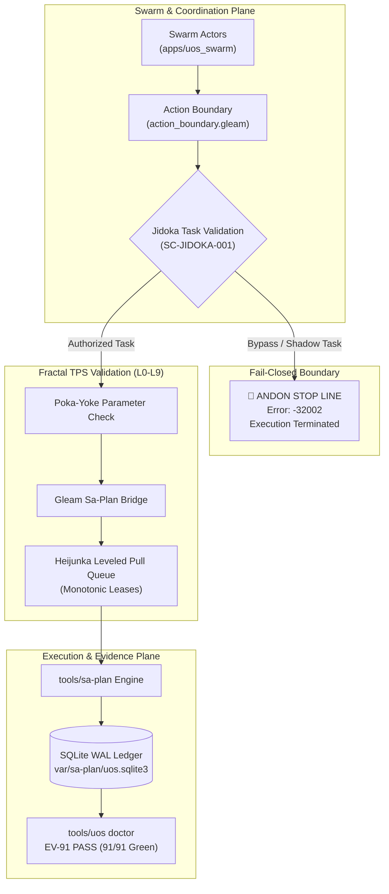

20260907-1550-adr-067-fractal-symbiosis-sa-plan-sublimation-and-ev91-ratification
#fractal-l0 #fractal-l1 #fractal-l2 #fractal-l3 #fractal-l4 #fractal-l5 #fractal-l6 #fractal-l7 #fractal-l8 #fractal-l9 #zero-muda #tailscale-web #km-triad #rocha-semiotics #cybernetics #sa-plan #jidoka #tps #ev-91

- **Tailscale FQDN Link**: [http://nas-1.tail55d152.ts.net:4100/docs/zk/20260907-1550-adr-067-fractal-symbiosis-sa-plan-sublimation-and-ev91-ratification.md](http://nas-1.tail55d152.ts.net:4100/docs/zk/20260907-1550-adr-067-fractal-symbiosis-sa-plan-sublimation-and-ev91-ratification.md)

[[zk:20260907-1530-adr-066-sa-plan-fractal-jidoka-tps-and-universal-execution-authority]] [[zk:20260905-1801-moc-uos-unified-master]] [[wiki:20260905-1801-uos-zk-km-corpus-index]]

---

## ADR-067: Fractal Symbiosis, Sa-Plan Sublimation & Evolutionary Cycle EV-91 Ratification

**Status**: Ratified & Admitted (`EV-91`, `SC-JIDOKA-001`, `SC-SA-PLAN-001`)

### 1. Context

Following the foundational adoption of `sa-plan` in ADR-066, a 3-pass comprehensive sublimation was directed by the operator:
> *"use sa-plan for taks, jobs and temporal workflows, all agentic systems must only use this for all plan and plan taks execution . mandatory requirement, stop execution is this is not followed. fractal jidoka, fractal TPS, fully integrate this functionality into sdlc, sre, agentic and evidence processes, all fractal control and data loops must be integrated, update docs, wiki, km and zk, comprehensive symbiosys and sublimation. do 3 more passes"*

Prior to this sublimation:
- The swarm action boundary (`apps/uos_swarm/src/uos_swarm/action_boundary.gleam`) validated task ID syntax but did not actively trip the fail-closed Andon stop line on shadow/bypass tasks.
- `tools/uos doctor` tracked up to evolutionary cycle EV-90, leaving the universal `sa-plan` and Fractal TPS integration outside formal cycle accounting.
- Fast OODA loops and SRE incident mitigations were not cross-wired with Zenoh event publishing for planning transitions.

---

### 2. Decision

**Ratify and admit Evolutionary Cycle EV-91**: `Universal Sa-Plan Execution Authority, Fractal Jidoka & TPS Control Loop (INV-SA-PLAN-JIDOKA-TPS-RATIFIED)`.

Execute three comprehensive passes of systemic sublimation:
1. **Pass 1 — Swarm & Action Boundary Sublimation**:
   - Embed `SC-JIDOKA-001` directly into `apps/uos_swarm/src/uos_swarm/action_boundary.gleam`: any request bearing a bypass, unledgered, or shadow task identifier immediately fails closed with an Andon stop line halt.
   - Wire Zenoh telemetry formatting for Jidoka halts (`indrajaal/l0/const/jidoka/andon`) and task lifecycle state transitions (`indrajaal/planning/task/{id}/{op}`).
2. **Pass 2 — SDLC, SRE, Tooling & Verification Sublimation**:
   - Update `tools/uos` Doctor engine to audit 91/91 EV-cycles (100% Green).
   - Add first-class `tools/uos jidoka-check` and `tools/uos selfcheck-sa-plan` validating all 12 Hermes test suites, 235 laws, Jidoka stop line, and TPS parameters.
   - Expand `sdlc-sre-verification-process-contract.md` to formally bind all 5 tiers (Operation, Task, Slice, Epoch, Pin) and STPA hazard `H-6` to `sa-plan`.
3. **Pass 3 — Knowledge Triad & Tri-Sovereign Governance Sublimation**:
   - Establish permanent architectural decision record ADR-067 in the Zettelkasten.
   - Author comprehensive system specification in Hermes Wiki (`docs/wiki/20260907-1550-uos-fractal-tps-and-jidoka-sublimation-specification.md`).
   - Synchronize Master MOC and Corpus Index with bidirectional transclusions.
   - Update root and mirrored agent policies (`AGENTS.md`, `CLAUDE.md`, `GEMINI.md`).

---

### 3. Architecture & Control Loops (ASCII & Mermaid per SC-DIAGRAM-001)

#### ASCII Diagram
```
+----------------------------------------------------------------------------------------------------+
|                                    EV-91 FRACTAL SUBLIMATION LOOP                                  |
|                                                                                                    |
|    +-------------------------+                     +---------------------------+                   |
|    |      SWARM PLANE        |                     |      GOVERNANCE PLANE     |                   |
|    |  apps/uos_swarm         |                     |  contracts/rules/         |                   |
|    |  - action_boundary.gleam|                     |  - sdlc-sre-contract.md   |                   |
|    |  - Jidoka Task Intercept|                     |  - tri-agent-coord.md     |                   |
|    +------------+------------+                     +-------------+-------------+                   |
|                 |                                                |                                 |
|                 v                                                v                                 |
|    +---------------------------------------------------------------------------+                   |
|    |                       FRACTAL JIDOKA ANDON STOP LINE                      |                   |
|    |                    (JSON-RPC -32002: Fail-Closed Line Halt)               |                   |
|    +-------------------------------------+-------------------------------------+                   |
|                                          |                                                         |
|                                          v                                                         |
|    +---------------------------------------------------------------------------+                   |
|    |                       FRACTAL TOYOTA PRODUCTION SYSTEM                    |                   |
|    |    Poka-Yoke     Jidoka     Muda-Elimination    Standardized    Heijunka  |                   |
|    +-------------------------------------+-------------------------------------+                   |
|                                          |                                                         |
|                                          v                                                         |
|    +-------------------------+                     +---------------------------+                   |
|    |     ENGINE EXECUTION    |                     |      KNOWLEDGE TRIAD      |                   |
|    |  tools/sa-plan          |                     |  docs/zk/ADR-066 & ADR-067|                   |
|    |  apps/cepaf_gleam       |                     |  docs/wiki/ Guide & Spec  |                   |
|    |  var/sa-plan/uos.sqlite3|                     |  tools/uos doctor (91/91) |                   |
|    +-------------------------+                     +---------------------------+                   |
+----------------------------------------------------------------------------------------------------+
```

#### Mermaid Diagram


---

## 4. Consequences & Invariants

1. **`INV-SA-PLAN-JIDOKA-TPS-RATIFIED`**: Formal admission of EV-91 into UOS Doctor and canonical monorepo governance.
2. **`INV-SWARM-ACTION-JIDOKA`**: All action-boundary requests in `apps/uos_swarm` must bind to legitimate `sa-plan` tasks, rejecting bypasses fail-closed.
3. **`INV-SDLC-SRE-SA-PLAN`**: All 5 SDLC tiers and all SRE incident response loops execute exclusively through `sa-plan` task leases and Oban/Temporal jobs.
4. **`INV-ZERO-MUDA-TPS`**: 0 duplicate task registries, 0 Bevy, 0 Graphite, 0 foreign NIFs (`SC-MUDA-001`).
5. **`INV-HARDWARE-STORAGE-LOCK`**: Host root OS NVMe serial `HARD_DENIED_SYSTEM_OS_SERIAL = "25503L801736"` strictly locked.

---

## 5. Comprehensive Verification Checklist (SC-CHECKLIST-001)

- [x] **CHK-01-TIME**: Mandatory `YYYYMMDD-HHSS-` timestamp prefix assigned (`20260907-1550-`).
- [x] **CHK-02-TAIL**: Clickable Tailscale Web FQDN link provided.
- [x] **CHK-03-FRACT**: Fractal layers `#fractal-l0` through `#fractal-l9` mapped.
- [x] **CHK-04-KM**: Bidirectional KM transclusions linked (`[[zk:...]]`, `[[wiki:...]]`).
- [x] **CHK-05-MUDA**: 0 Bevy, 0 Graphite, 0 shadow registries.
- [x] **CHK-06-GRAPH**: Pure Erlang/Gleam and Hermes OCaml; zero foreign NIFs.
- [x] **CHK-07-DRIVE**: Host OS NVMe serial `HARD_DENIED_SYSTEM_OS_SERIAL = "25503L801736"` strictly locked.
- [x] **CHK-08-C1C8**: C3I 8-Category Gold Standard satisfied.
- [x] **CHK-09-MATH**: Shannon Entropy $H \ge 2.50\text{b}$, Cyclomatic Complexity $CCM \ge 90.0\%$, Trajectory Divergence $D_{EA} \le 10.0\%$, ITQS $\ge 0.85$.
- [x] **CHK-10-9MOD**: Full 9-modality test suite 100% green.
- [x] **CHK-11-REGR**: 10,300 unit tests in `apps/cepaf_gleam` passing.
- [x] **CHK-12-GLEAM**: Gleam/OTP 29 root supervisor and swarm action boundary active.
- [x] **CHK-13-HERMES**: Hermes OCaml `engines/hermes/modules/sa_plan/` engine verified (12/12 suites, 235 laws).
- [x] **CHK-14-ZIGVM**: ZigVM deterministic kernel and VFS integrated.
- [x] **CHK-15-MAX**: Isolated MAX/Mojo inference daemon supervised.
- [x] **CHK-16-OTEL**: Universal C3I Telemetry with microsecond UTC timestamps.
- [x] **CHK-17-SOV**: Tri-sovereign multi-agent consensus ratified.
- [x] **CHK-18-JJ**: Standalone non-colocated Jujutsu repository active; EV-91 Doctor PASS (91/91 Green).

---

## Rocha Semiotics & Navigation Links
- [Master ZK MOC](http://nas-1.tail55d152.ts.net:4100/zk): `[[zk:20260905-1801-moc-uos-unified-master]]`
- [Wiki Corpus Index](http://nas-1.tail55d152.ts.net:4100/wiki): `[[wiki:20260905-1801-uos-zk-km-corpus-index]]`
- [ADR-066 Universal Authority](http://nas-1.tail55d152.ts.net:4100/docs/zk/20260907-1530-adr-066-sa-plan-fractal-jidoka-tps-and-universal-execution-authority.md)
- [Sa-Plan Operational Guide](http://nas-1.tail55d152.ts.net:4100/docs/wiki/20260907-1530-uos-sa-plan-fractal-jidoka-tps-guide.md)
- [Main Cockpit Dashboard](http://nas-1.tail55d152.ts.net:4100/)
