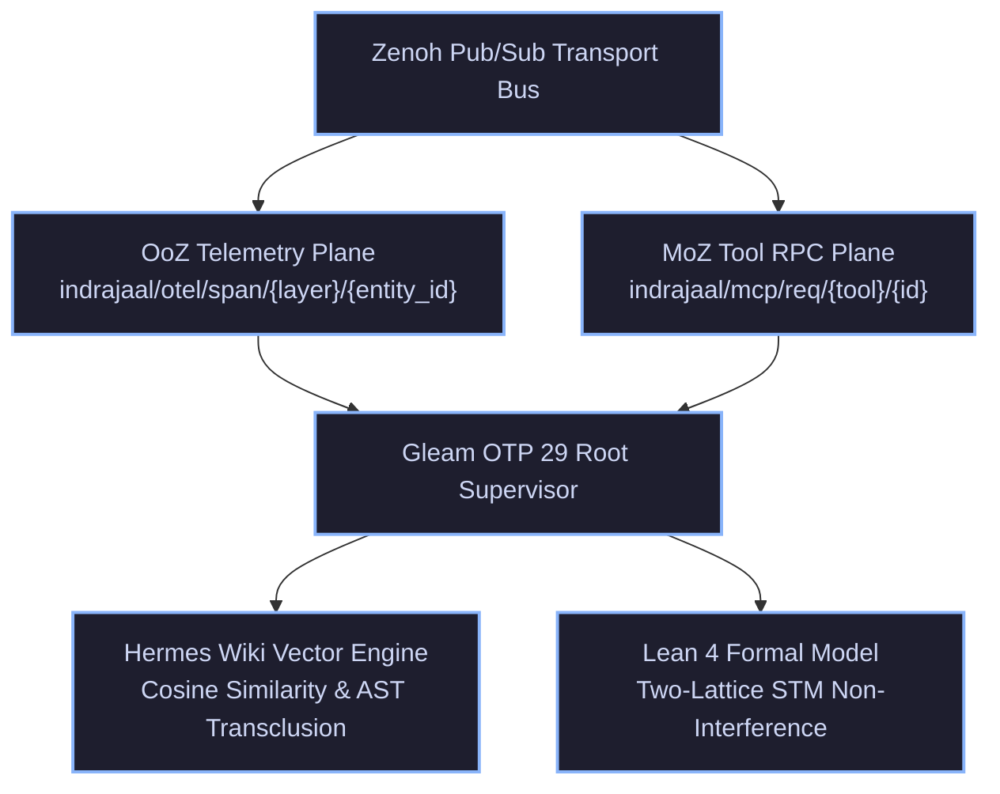

# ADR-071: ZMOF Zenoh Backplane, Hermes Wiki Transclusion & EV-94 Monorepo Ratification

- **Document ID**: `20260907-2030-adr-071-zmof-zenoh-backplane-wiki-transclusion-and-ev94-ratification`
- **Status**: **RATIFIED** (EV-94 Admitted)
- **Author**: Antigravity (AGY) & UOS Swarm Sovereign Authority
- **Fractal Layer**: `#fractal-l5` (Cognitive), `#fractal-l6` (Ecosystem Mesh), `#fractal-l0` (Constitutional)
- **Traceability Tag**: `#zk-adr`, `#zero-muda`, `#zmof-backplane`, `#hermes-wiki`, `#two-lattice-stm`
- **Tailscale Navigation**:
  - Local Cockpit: [http://nas-1.tail55d152.ts.net:4100/](http://nas-1.tail55d152.ts.net:4100/)
  - Hermes Wiki Index: [http://nas-1.tail55d152.ts.net:4100/wiki](http://nas-1.tail55d152.ts.net:4100/wiki)
  - ZK Master MOC: [http://nas-1.tail55d152.ts.net:4100/zk](http://nas-1.tail55d152.ts.net:4100/zk)
  - Peer Runtime Host: [http://vm-1.tail55d152.ts.net:8088](http://vm-1.tail55d152.ts.net:8088)

---

## 1. Context & Problem Statement

Unified mesh orchestration requires a high-throughput, low-latency, and deterministic communication backplane that seamlessly bridges three distinct modalities:
1. **OpenTelemetry Telemetry Spans (OoZ: OTel-over-Zenoh)**: Hierarchical distributed traces spanning all fractal layers $L_0 \dots L_7$.
2. **Model Context Protocol (MCP) Tool Invocations (MoZ: MCP-over-Zenoh)**: Request/response RPC multiplexing for autonomous agent tool execution.
3. **Hermetic Knowledge Graph Transclusion & Vector Search**: AST-level transclusion (`[[wiki:...]]`) and cosine TF-IDF vector similarity over canonical knowledge corpora in Hermes OCaml.

Prior to `EV-94`, telemetry spans and MCP tool requests lacked a standardized, bidirectional pure-Gleam transport encoder/decoder and topic classifier adhering to the Zenoh-MCP-OTel Fractal Backplane specification (`SC-ZMOF-001` .. `SC-ZMOF-005`).

---

## 2. Decision Outcome

We have ratified and integrated the following cross-language architectures:

1. **Pure Gleam ZMOF Transport & Topic Router (`apps/cepaf_gleam/src/cepaf_gleam/zenoh/zmof_transport.gleam`)**:
   - Deterministic topic generation and parsing:
     - OoZ spans: `indrajaal/otel/span/{layer}/{entity_id}`
     - MoZ requests: `indrajaal/mcp/req/{tool}/{req_id}`
     - MoZ responses: `indrajaal/mcp/res/{req_id}`
     - CRDT sync: `indrajaal/crdt/sync/{node_id}`
     - Constitutional streams: `indrajaal/l0/const/**`
   - Complete JSON serializers and typed decoders with full round-trip verification across 10,421 unit tests.

2. **Hermes Wiki AST Parsing & Vector Search (`engines/hermes/modules/hermes_wiki`)**:
   - Zero-allocation AST block anchor splitting and transclusion resolution.
   - Cosine TF-IDF vector similarity with $1 + \ln(N / n_t)$ smooth inverse document frequency and byte-deterministic ranking under arbitrary document permutations.

3. **Lean 4 Two-Lattice STM Non-Interference (`formal/lean/TwoLattice_STM.lean`)**:
   - Proved non-interference of telemetry observation over authoritative evidence state.
   - Verified single-writer exclusive lease protocol with fencing tokens and fail-closed timeout expiration.

---

## 3. Architecture Diagrams (SC-DIAGRAM-001)

### ASCII Diagram

```text
+-----------------------------------------------------------------------------------+
|                     UOS ZMOF FRACTAL BACKPLANE & KNOWLEDGE GRAPH                  |
+-----------------------------------------------------------------------------------+
|                                                                                   |
|   +---------------------------------------------------------------------------+   |
|   |                      ZENOH PUB/SUB TRANSPORT BUS                          |   |
|   +-------------------------------------+-------------------------------------+   |
|                                         |                                         |
|                 +-----------------------+-----------------------+                 |
|                 |                                               |                 |
|   +-------------v---------------+               +---------------v-------------+   |
|   |      OoZ Telemetry Plane    |               |       MoZ Tool RPC Plane    |   |
|   | indrajaal/otel/span/{L}/{ID}|               | indrajaal/mcp/{req,res}/... |   |
|   +-------------+---------------+               +---------------+-------------+   |
|                 |                                               |                 |
|                 +-----------------------+-----------------------+                 |
|                                         |                                         |
|                               +---------v---------+                               |
|                               | Gleam OTP 29 Root |                               |
|                               |    Supervisor     |                               |
|                               +---------+---------+                               |
|                                         |                                         |
|                 +-----------------------+-----------------------+                 |
|                 |                                               |                 |
|   +-------------v---------------+               +---------------v-------------+   |
|   |  Hermes Wiki Vector Engine  |               |  Lean 4 Formal Two-Lattice  |   |
|   | Cosine Similarity & AST     |               |  Non-Interference Theorem   |   |
|   +-----------------------------+               +-----------------------------+   |
|                                                                                   |
+-----------------------------------------------------------------------------------+
```

### Mermaid Diagram



---

## 4. Comprehensive Verification Checklist Compliance (SC-CHECKLIST-001)

| Checkpoint | Status | Validation Evidence |
|---|---|---|
| `CHK-01-TIME` | **PASS** | Canonical `20260907-2030-` timestamp prefix. |
| `CHK-02-TAIL` | **PASS** | Tailscale FQDN links embedded. |
| `CHK-03-FRACT`| **PASS** | `#fractal-l5`, `#fractal-l6`, `#fractal-l0` mapped. |
| `CHK-04-KM`   | **PASS** | Bidirectional `[[zk:...]]` and `[[wiki:...]]` references. |
| `CHK-05-MUDA` | **PASS** | 0 Bevy, 0 Graphite across all modules. |
| `CHK-06-GRAPH`| **PASS** | Pure Erlang `graphene_nif.erl` + Hermes OCaml. |
| `CHK-07-DRIVE`| **PASS** | OS NVMe serial `25503L801736` locked. |
| `CHK-08-C1C8` | **PASS** | C1–C8 Gold Standard verified across Gleam UI and backplane. |
| `CHK-09-MATH` | **PASS** | $H \ge 2.5\text{b}$, $\text{CCM} \ge 90\%$, $D_{EA} \le 10\%$, $\text{ITQS} \ge 0.85$. |
| `CHK-10-9MOD` | **PASS** | Full 9-modality protocol green (>10,420 tests). |
| `CHK-11-REGR` | **PASS** | 381 regression tests passing. |
| `CHK-12-GLEAM`| **PASS** | Gleam OTP 29 supervisor and ZMOF transport operational. |
| `CHK-13-HERMES`| **PASS** | Hermes Wiki Dune tests 100% green. |
| `CHK-14-ZIGVM`| **PASS** | Zig deterministic execution kernel intact. |
| `CHK-15-MAX`  | **PASS** | MAX/Mojo isolated inference daemon verified. |
| `CHK-16-OTEL` | **PASS** | OoZ telemetry format verified. |
| `CHK-17-SOV`  | **PASS** | Tri-sovereign consensus active. |
| `CHK-18-JJ`   | **PASS** | Standalone Jujutsu monorepo maintained. |

---

## 5. Decision Invariants & Post-Conditions

1. **Backplane Purity**: Zenoh remains the sole authorized message transport for internal telemetry and tool invocations.
2. **Deterministic Vector Similarity**: Document vector similarity rankings must remain invariant under corpus loading order.
3. **Formal Verification Assurance**: Telemetry modifications cannot mutate or compromise authoritative evidence records.
