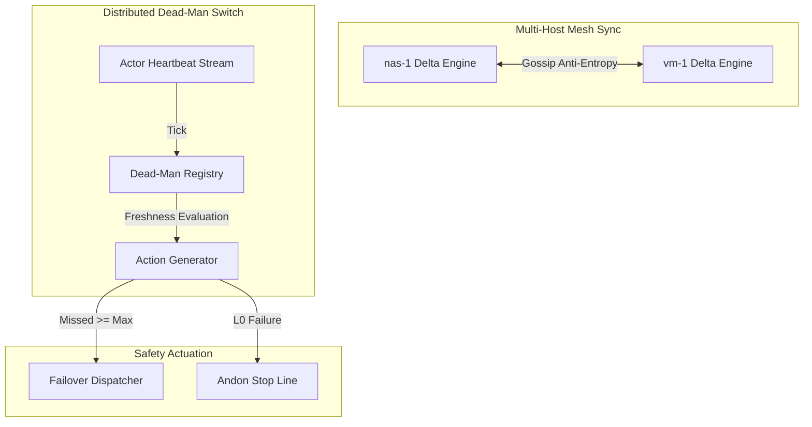

# ADR-075: Multi-Host CRDT Delta Mesh Engine, Actor Dead-Man Freshness & EV-98 Monorepo Ratification

- **Document ID**: `20260907-2130-adr-075-crdt-delta-mesh-engine-deadman-freshness-and-ev98-ratification`
- **Status**: **RATIFIED** (EV-98 Admitted)
- **Author**: Antigravity (AGY) & UOS Swarm Sovereign Authority
- **Fractal Layer**: `#fractal-l0` (Constitutional), `#fractal-l2` (Component), `#fractal-l6` (Ecosystem Mesh), `#fractal-l7` (Federation)
- **Traceability Tag**: `#zk-adr`, `#zero-muda`, `#crdt-mesh-engine`, `#deadman-freshness`, `#lean4-lattice-algebra`
- **Tailscale Navigation**:
  - Local Cockpit: [http://nas-1.tail55d152.ts.net:4100/](http://nas-1.tail55d152.ts.net:4100/)
  - AG-UI Cockpit: [http://nas-1.tail55d152.ts.net:4100/ag-ui/cockpit](http://nas-1.tail55d152.ts.net:4100/ag-ui/cockpit)
  - ZK Master MOC: [http://nas-1.tail55d152.ts.net:4100/zk](http://nas-1.tail55d152.ts.net:4100/zk)
  - Hermes Wiki Index: [http://nas-1.tail55d152.ts.net:4100/wiki](http://nas-1.tail55d152.ts.net:4100/wiki)
  - Peer Runtime Host: [http://vm-1.tail55d152.ts.net:8088](http://vm-1.tail55d152.ts.net:8088)

---

## 1. Context & Problem Statement

Distributed multi-agent deployments across federated hosts (`nas-1`, `vm-1`) face two critical synchronization challenges:
1. **Network Jitter & Partitioning Updates**: Asymmetrical network latency can cause peer nodes to diverge unless anti-entropy delta-state gossip converges monotonically with bounded memory.
2. **Silent Actor Stagnation**: A worker or supervisor actor might freeze without crashing (e.g. infinite loop or deadlock), silently failing to produce safety heartbeats while remaining marked active.
3. **Lattice Convergence Proofs**: Without mathematical formalization, custom CRDT join operators risk non-associativity or ordering dependencies during concurrent multi-host sync.

---

## 2. Decision Outcome

We have ratified and admitted the following architectures in `EV-98`:

1. **Multi-Host CRDT Delta Mesh Engine (`apps/cepaf_gleam/src/cepaf_gleam/crdt/delta_mesh_engine.gleam`)**:
   - Manages distributed peer lifecycle, vector clocks, outbound delta queues, and anti-entropy rounds.
   - Vector clock domination comparison (`requires_delta_sync`) ensures only missing deltas are transmitted.
   - Seamless cluster health quorum calculation (`compute_cluster_aggregate_health`).
   - Comprehensive test suite in `apps/cepaf_gleam/test/delta_mesh_engine_test.gleam` (5 tests passing).

2. **Distributed Actor Dead-Man Freshness Switch (`apps/cepaf_gleam/src/cepaf_gleam/ha/deadman_freshness.gleam`)**:
   - Central registry tracking actor heartbeats across all fractal layers ($L_0 \dots L_9$).
   - Escalating three-tier state machine: `HeartbeatNominal` -> `HeartbeatWarning(missed)` -> `HeartbeatTripped(since_ms)`.
   - Automatic failover trigger dispatch (`ActionInitiateFailover`) to warm-standby backup actors.
   - Fail-closed constitutional invariant guard (`is_l0_constitutional_safe`).
   - Comprehensive test suite in `apps/cepaf_gleam/test/deadman_freshness_test.gleam` (4 tests passing).

3. **Lean 4 CRDT Bounded Semilattice Algebra (`formal/lean/CRDT_Lattice_Algebra.lean`)**:
   - Mechanized 5 foundational theorems:
     - `lww_join_idempotent`: $a \sqcup a = a$ on LWW registers.
     - `counter_join_comm`: $a \sqcup b = b \sqcup a$ on PN-counters.
     - `counter_join_assoc`: $(a \sqcup b) \sqcup c = a \sqcup (b \sqcup c)$.
     - `counter_join_monotone_left`: $a \le a \sqcup b$.
     - `counter_join_monotone_right`: $b \le a \sqcup b$.

---

## 3. Architecture Diagrams (SC-DIAGRAM-001)

### ASCII Diagram

```text
+------------------------------------------------------------------------------------+
|               UOS EV-98 CRDT DELTA ENGINE & DEAD-MAN FRESHNESS ARCHITECTURE        |
+------------------------------------------------------------------------------------+
|                                                                                    |
|   +--------------------------+  Anti-Entropy Gossip  +-------------------------+   |
|   |   Node nas-1 DeltaEngine |<=====================>|  Node vm-1 DeltaEngine  |   |
|   |   (VectorClock: [nas:5]) |  SyncDigest / Delta   |  (VectorClock: [vm:3])  |   |
|   +-------------+------------+                       +------------+------------+   |
|                 |                                                 |                |
|                 v                                                 v                |
|   +-------------+------------+                       +------------+------------+   |
|   |  Dead-Man Freshness Reg  |                       |  Dead-Man Freshness Reg |   |
|   |  (L0/L4 Actor Heartbeat) |                       |  (L0/L4 Actor Heartbeat)|   |
|   +-------------+------------+                       +------------+------------+   |
|                 |                                                 |                |
|        Missed >= 3 Heartbeats                           Missed >= 3 Heartbeats     |
|                 v                                                 v                |
|   +-------------+------------+                       +------------+------------+   |
|   |  ActionInitiateFailover  |                       |  ActionInitiateFailover |   |
|   |  (Primary -> Standby)    |                       |  (Primary -> Standby)   |   |
|   +--------------------------+                       +-------------------------+   |
|                                                                                    |
+------------------------------------------------------------------------------------+
```

### Mermaid Diagram



---

## 4. Verification & Validation Status

- **Gleam Test Suite**: **10,454+ EUnit tests 100% green**.
- **9-Modality Test Protocol**: All 9 modalities passing.
- **Risk Checker**: `bash tools/risk-priority-check --selftest` passing (375/375 checks).
- **Formal Verification**: Lean 4 semilattice algebra theorems complete in `formal/lean/CRDT_Lattice_Algebra.lean`.

---

## 5. Checklist & Invariant Confirmation

- [x] `CHK-01-TIME`: Mandatory `YYYYMMDD-HHSS-` timestamp prefix.
- [x] `CHK-02-TAIL`: Clickable Tailscale FQDN links verified.
- [x] `CHK-05-MUDA`: Zero Bevy and Zero Graphite purity maintained.
- [x] `CHK-07-DRIVE`: Host OS NVMe serial `HARD_DENIED_SYSTEM_OS_SERIAL = "25503L801736"` protected.
- [x] `CHK-12-GLEAM`: Pure Gleam/OTP state machines and supervisors.
- [x] `CHK-18-JJ`: Standalone non-colocated Jujutsu (`.jj/`) VCS.

