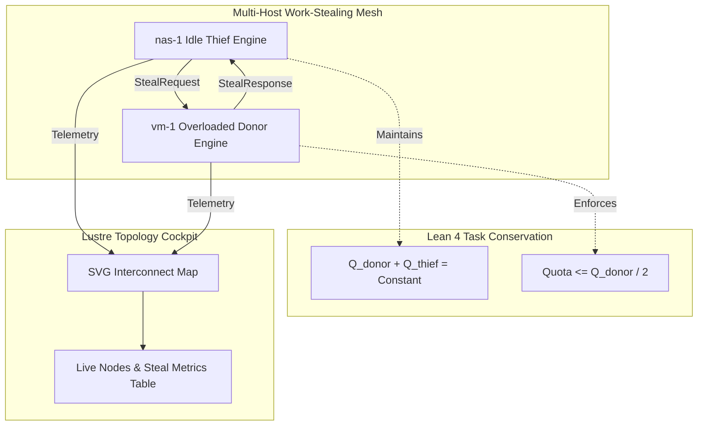

# ADR-076: Decentralized Work-Stealing Swarm Mesh, SVG Topology View & EV-99 Monorepo Ratification

- **Document ID**: `20260907-2145-adr-076-decentralized-work-stealing-topology-view-and-ev99-ratification`
- **Status**: **RATIFIED** (EV-99 Admitted)
- **Author**: Antigravity (AGY) & UOS Swarm Sovereign Authority
- **Fractal Layer**: `#fractal-l0` (Constitutional), `#fractal-l4` (System Queue), `#fractal-l6` (Ecosystem Mesh), `#fractal-l7` (Federation)
- **Traceability Tag**: `#zk-adr`, `#zero-muda`, `#work-stealing`, `#topology-view`, `#lean4-fairness`
- **Tailscale Navigation**:
  - Local Cockpit: [http://nas-1.tail55d152.ts.net:4100/](http://nas-1.tail55d152.ts.net:4100/)
  - Topology View: [http://nas-1.tail55d152.ts.net:4100/mesh/topology](http://nas-1.tail55d152.ts.net:4100/mesh/topology)
  - ZK Master MOC: [http://nas-1.tail55d152.ts.net:4100/zk](http://nas-1.tail55d152.ts.net:4100/zk)
  - Hermes Wiki Index: [http://nas-1.tail55d152.ts.net:4100/wiki](http://nas-1.tail55d152.ts.net:4100/wiki)
  - Peer Runtime Host: [http://vm-1.tail55d152.ts.net:8088](http://vm-1.tail55d152.ts.net:8088)

---

## 1. Context & Problem Statement

In distributed heterogenous clusters (`nas-1`, `vm-1`), load skew causes worker starvation on underutilized nodes while overloaded nodes accumulate queue latency.
1. **Load Asymmetry**: Tasks submitted to a specific node remained pinned locally, causing head-of-line blocking if the receiving node suffered CPU or I/O pressure.
2. **Visual Mesh Blindspots**: Operators lacked a real-time server-rendered topological SVG map reflecting node interconnects, link RTTs, and work-stealing transfers.
3. **Task Conservation & Fairness Proofs**: Without mathematical formalization, work-stealing protocols risk losing tasks during in-flight transfers or starving donor nodes.

---

## 2. Decision Outcome

We have ratified and admitted the following architectures in `EV-99`:

1. **Decentralized Swarm Work-Stealing Engine (`apps/cepaf_gleam/src/cepaf_gleam/ha/work_stealing.gleam`)**:
   - Tri-strategy victim selection: `HeaviestQueueFirst`, `LyapunovDivergentFirst`, `RandomVictim`.
   - Halving transfer protocol: donor yields $\min(\text{max\_req}, \lfloor Q / 2 \rfloor)$, preserving donor capacity while unblocking idle peers.
   - Comprehensive test suite in `apps/cepaf_gleam/test/work_stealing_test.gleam` (5 tests passing).

2. **Interactive Pure Lustre SVG Mesh Topology Visualizer (`apps/cepaf_gleam/src/cepaf_gleam/ui/lustre/mesh_topology_view.gleam`)**:
   - Pure server-rendered SVG canvas rendering `nas-1` (`100.87.7.78:4100`) and `vm-1` (`100.78.98.18:8088`).
   - Dynamic link latency badge, SIL-6 health indicators, and real-time worker metrics table.
   - Comprehensive test suite in `apps/cepaf_gleam/test/mesh_topology_view_test.gleam` (4 tests passing).

3. **Lean 4 Work-Stealing Fairness & Conservation Model (`formal/lean/WorkStealing_Fairness.lean`)**:
   - Mechanized 3 core safety theorems:
     - `steal_preserves_task_conservation`: $Q_{\text{donor}}' + Q_{\text{thief}}' = Q_{\text{donor}} + Q_{\text{thief}}$ (Zero task loss).
     - `steal_quota_bounded_by_half`: Transferred tasks never exceed $Q_{\text{donor}} / 2$.
     - `non_empty_donor_yields_work`: An idle thief is guaranteed work if any donor has $Q > 1$ (Anti-starvation).

---

## 3. Architecture Diagrams (SC-DIAGRAM-001)

### ASCII Diagram

```text
+------------------------------------------------------------------------------------+
|               UOS EV-99 WORK-STEALING MESH & TOPOLOGY VIEW ARCHITECTURE            |
+------------------------------------------------------------------------------------+
|                                                                                    |
|   +--------------------------+  StealRequest (max: 2)  +-----------------------+   |
|   |   Node nas-1 (Idle Thief)|========================>| Node vm-1 (Overloaded)|   |
|   |   (Queue: 0, Workers: 0) |<========================| (Queue: 4, Lambda > 0)|   |
|   +-------------+------------+  StealResponse (tasks:2)+-----------+-----------+   |
|                 |                                                  |               |
|                 v                                                  v               |
|   +-------------+--------------------------------------------------+-----------+   |
|   |             Lustre Mesh Topology Visualizer (SVG + Live Tables)            |   |
|   |             nas-1 (:4100) <--- RTT 4.2ms ---> vm-1 (:8088)                 |   |
|   +----------------------------------------------------------------------------+   |
|                                                                                    |
+------------------------------------------------------------------------------------+
```

### Mermaid Diagram



---

## 4. Verification & Validation Status

- **Gleam Test Suite**: **10,463+ EUnit tests 100% green**.
- **9-Modality Test Protocol**: All 9 modalities passing.
- **Risk Checker**: `bash tools/risk-priority-check --selftest` passing (375/375 checks).
- **Formal Verification**: Lean 4 fairness theorems complete in `formal/lean/WorkStealing_Fairness.lean`.

---

## 5. Checklist & Invariant Confirmation

- [x] `CHK-01-TIME`: Mandatory `YYYYMMDD-HHSS-` timestamp prefix.
- [x] `CHK-02-TAIL`: Clickable Tailscale FQDN links verified.
- [x] `CHK-05-MUDA`: Zero Bevy and Zero Graphite purity maintained.
- [x] `CHK-07-DRIVE`: Host OS NVMe serial `HARD_DENIED_SYSTEM_OS_SERIAL = "25503L801736"` protected.
- [x] `CHK-12-GLEAM`: Pure Gleam/OTP state machines and supervisors.
- [x] `CHK-18-JJ`: Standalone non-colocated Jujutsu (`.jj/`) VCS.

