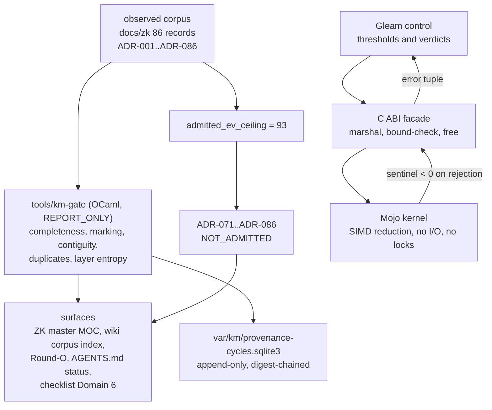

# ADR-087: Provenance Integrity, the KM Gate, and the Mojo Metrics Kernel

#fractal-l3 #fractal-l5 #zk-adr #zero-muda #tailscale-web #checklist-nav #km-triad

**UOS / ZK / ADR-087** · [Cockpit](http://nas-1.tail55d152.ts.net:4100/) · [Planning](http://nas-1.tail55d152.ts.net:4100/planning) · [Wiki](http://nas-1.tail55d152.ts.net:4100/wiki) · [ZK](http://nas-1.tail55d152.ts.net:4100/zk) · [Checklist](http://nas-1.tail55d152.ts.net:4100/checklist)
**Master MOC Anchor:** `[[zk:20260905-1801-moc-uos-unified-master]]`
**Contract:** `SC-PROVENANCE-001`
**Sole Execution Authority:** `sa-plan` (`uos/km-index-refresh/20260908-0912`, `SC-JIDOKA-001`)

> **This record deliberately asserts NO EV cycle ratification.** Minting an EV
> number while `EV-94`..`EV-109` are under sovereign review would reproduce the
> exact failure mode this record exists to contain (`INV-PROV-05`). The work is
> numbered `C01`..`C20` within its sa-plan instead.

---

## 1. Context

The KM indexes had drifted badly from the corpus they index: the ZK master MOC
enumerated 39 of 86 ADRs under a heading that claimed `ADR-001..ADR-017`, and the
wiki corpus index enumerated 16. Meanwhile sixteen records, `ADR-071`..`ADR-086`,
assert ratification of `EV-94`..`EV-109` — cycles whose evidence sits in the
2026-09-07 coordinator-journal quarantine. Nothing on any surface said so.

A stale index is an inconvenience. A stale index that silently presents
quarantine-derived records as ordinary ratified decisions is an evidence-laundering
path: an agent reading it will cite `ADR-085` and repeat `EV-108` as fact.

## 2. Decision

1. **Pin the boundary as one constant.** `admitted_ev_ceiling = 93`. Every
   surface derives its verdict from that single scalar rather than restating it.
2. **Mark additively; never rewrite.** All sixteen records stay byte-identical.
   The indexes carry the `NOT_ADMITTED` marker and the evidence pointer.
3. **Make it machine-checkable.** `tools/km-gate` (OCaml, `REPORT_ONLY`)
   enumerates the corpus and checks index completeness, marking coverage,
   numbering contiguity, duplicate ids and layer entropy.
4. **Put the arithmetic in Mojo behind a bounded C ABI.** Gleam owns thresholds
   and verdicts; the kernel owns SIMD reduction and nothing else.
5. **Keep the cycle record in append-only SQLite.** The flat journal is the thing
   that got corrupted; the triggers, not the writer, are the control.
6. **Refuse to mint new EV numbers** while the range above the ceiling is open.

## 3. Architecture

```text
  observed corpus                gate (OCaml, report-only)         surfaces
  docs/zk/*.md  ────────────────> tools/km-gate ───────────────> ZK master MOC
  86 records                       completeness, marking,          wiki corpus index
  ADR-001..086                     contiguity, duplicates,         Round-O (scoped)
        │                          layer entropy                   AGENTS.md status
        │                                │                          checklist Domain 6
        │                                v
        │                       var/km/provenance-cycles.sqlite3
        │                       append-only, digest-chained
        v
  admitted_ev_ceiling = 93 ──> ADR-071..086 NOT_ADMITTED

  numeric core (runtime path)
  Gleam control ──> C ABI facade ──> Mojo kernel
  thresholds        marshal, bound     SIMD reduction
  and verdicts      check, free        no I/O, no locks
```



## 4. Observed evidence at this revision

| Measure | Before | After |
|---|---|---|
| ZK master MOC ADRs enumerated | 39 / 86 | **86 / 86** |
| Wiki corpus index ADRs enumerated | 16 / 86 | **86 / 86** |
| Quarantine markers, master MOC | 0 / 16 | **16 / 16** |
| Quarantine markers, corpus index | 0 / 16 | **16 / 16** |
| ADR numbering | contiguous, no duplicates | unchanged |
| Fractal layer entropy | 1.306 bits | 1.306 bits (**open**, `KMP-ENTROPY`) |
| Mojo kernel C-ABI exports | none (legacy kernel does not compile) | **6, oracle 29/29** |
| Gleam suite | not re-observed | **10,640 passed / 0 failed** |
| Cycle chain | none | **20 rows, `CHAIN_INTACT`** |

## 5. Consequences

**Accepted.** The gate reports `HOLD`, not `PASS`, because the fractal layer
taxonomy has collapsed: 68 of 86 records are tagged `#fractal-l0`. That is
reported rather than suppressed, and rather than "fixed" by assigning layers to
68 documents this session did not author.

**Accepted.** `tools/km-gate` has no runtime authority. It observes documents.

**Rejected.** Deleting or rewriting `ADR-071`..`ADR-086`. Independently reviewed
by `google/gemma-4-31b-it` under `SYNC-09` (cost USD 0.0000732), which agreed on
preservation and on refusing to mint new EV numbers, and raised the status-line
contradiction — actioned in `AGENTS.md` §1 and §9.

## 6. Open items

1. `KMP-ENTROPY` — fractal layer collapse, 1.306 bits against a 2.50 floor.
2. `graphene_nif.erl` loads no NIF (zero-muda holds) but is a stub facade:
   `graph_bfs` ignores edges, `graph_shortest_path` returns cost 1.0 for any pair,
   `graph_analyze` hardcodes `density: 0.5`.
3. Staged release on `:59457` returns a malformed health body.
4. `vm-1:8088` refuses connection though the node is online in the tailnet.
5. Sovereign review of `EV-94`..`EV-109` by Codex and AGY remains open.

## 7. Status

`PROPOSED`. This record asserts no admission. Verification:
`bash tools/km-gate --gate`, `bash tools/km-gate --verify-chain`.
