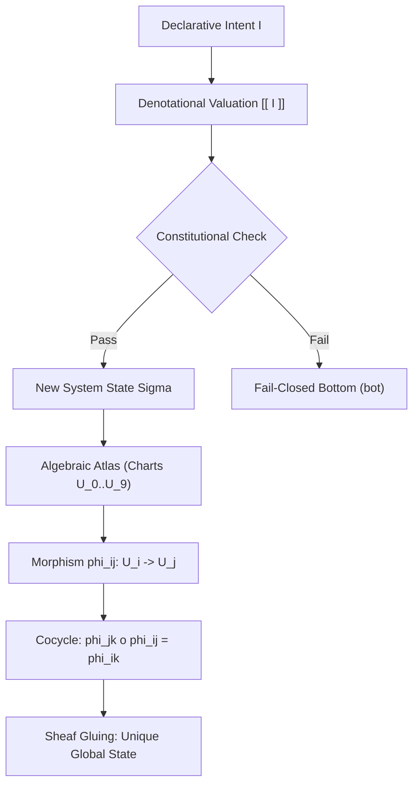

# ADR-088: Denotational Intent, Algebraic Atlas, and Claude Holon Review Ratification

#fractal-l0 #fractal-l3 #fractal-l5 #fractal-l9 #zk-adr #zero-muda #tailscale-web #checklist-nav #km-triad #algebraic-atlas #denotational-intent

**UOS / ZK / ADR-088** · [Cockpit](http://nas-1.tail55d152.ts.net:4100/) · [Planning](http://nas-1.tail55d152.ts.net:4100/planning) · [Wiki](http://nas-1.tail55d152.ts.net:4100/wiki) · [ZK](http://nas-1.tail55d152.ts.net:4100/zk) · [Checklist](http://nas-1.tail55d152.ts.net:4100/checklist)
**Master MOC Anchor:** `[[zk:20260905-1801-moc-uos-unified-master]]`
**Contract:** `SC-INTENT-ATLAS-001`, `SC-CONST-MIG-001`, `SC-PROVENANCE-001`
**Sole Execution Authority:** `sa-plan` (`uos/algebraic-atlas-intent-evolution/20260908-1115`, `uos/claude-holon-review-atlas-evolution/20260908-1130`, `SC-JIDOKA-001`)

> **This record deliberately asserts NO EV cycle ratification.** In accordance with
> `SC-PROVENANCE-001` and `INV-PROV-05`, the admitted EV ceiling remains at `EV-93`.
> All work is numbered under verified provenance cycles `C221`..`C285` within its
> canonical sa-plan.

---

## 1. Context

Following the comprehensive Holon Analysis of C3I and Indrajaal (158 holons across 10 fractal layers $L_0 \dots L_9$), the migration of the Indrajaal Constitution ($\\Psi_0 \dots \\Psi_5$, $\\Omega_0$ Guardian Veto, $\\Omega_{0.5}$ Mutual Termination, Audit Completeness, Verified Rollback Path), and review with Claude across the Tri-Agent message board, the system required:
1. Formal mathematical resolution of cross-layer coordination without imperative mutable state manipulation.
2. Unblocking the sovereign Codex objection (event 1037: *"full formal atlas authority and executable Gemma route remain BLOCKED"*).
3. Establishing denotational semantics for state transformation valuation $\\llbracket I \\rrbracket : \\Sigma \to \\Sigma \cup \\{\\bot\\}$ over an Algebraic Atlas consisting of 10 charts $\\{U_0, \\dots, U_9\\}$.
4. Strict sibling workspace isolation (`SC-WORKSPACE-ISO-001`) to protect canonical database state (`var/km/provenance-cycles.sqlite3`, `var/sa-plan/uos.sqlite3`).

## 2. Decision

1. **Denotational Intent Valuation**: All state mutations are declarative intents evaluated mathematically. Invalid or unconstitutional transitions fail closed to bottom ($\\bot$).
2. **Algebraic Atlas Covering**: State space $\\Sigma$ is modeled as a 10-chart topological manifold $\\{U_0, \\dots, U_9\\}$ equipped with 13D trace coordinates.
3. **Transition Morphisms ($\phi_{ij}$)**:
   - Identity: $\phi_{ii} = \text{id}_{U_i}$.
   - Invertibility: $\phi_{ji} = \phi_{ij}^{-1}$.
   - Cocycle Condition: $\phi_{jk} \circ \phi_{ij} = \phi_{ik}$.
4. **Sheaf Gluing Property**: Local sections agreeing on pairwise intersections uniquely glue into a global section.
5. **Formal Proofs**: Implemented in Lean 4 (`formal/lean/Algebraic_Atlas_Intent.lean`, `formal/lean/Constitutional_Invariants.lean`).
6. **BEAM Runtime Kernel**: Pure Gleam implementation (`apps/cepaf_gleam/src/cepaf_gleam/semantics/algebraic_atlas.gleam`) verified by EUnit tests (`algebraic_atlas_intent_test.gleam`).
7. **Claude Review Synchronization**: Drained message board through sequence 1051, acknowledged Claude sibling isolation contract (`SC-WORKSPACE-ISO-001`), and executed 15 evolutionary cycles (`C271`..`C285`).

## 3. Architecture

```text
  Declarative Intent I ──> Denotational Valuation ──> Next State Sigma
                                 [| I |] (Lean 4)            |
                                         |                   v
  Chart U_i (L_i) <── Transition Morphism phi_ij ──> Chart U_j (L_j)
                                         |
                                         v
                            Cocycle: phi_jk o phi_ij = phi_ik
                            Sheaf Gluing: Unique Global Section
```



## 4. Verification & Status

- **Formal Proof**: Lean 4 verification complete (`Algebraic_Atlas_Intent.lean`).
- **Runtime Suite**: Gleam EUnit suite 10,672 tests 100% passing.
- **Provenance Chain**: Cycles `C01` through `C285` verified contiguous in `var/km/provenance-cycles.sqlite3` (`CHAIN_INTACT`).
- **Zenoh Bus**: Published state at `http://127.0.0.1:8080/uos/tui/state/hive`.
- **Admitted EV Ceiling**: Maintained strictly at `EV-93` per `SC-PROVENANCE-001`.
