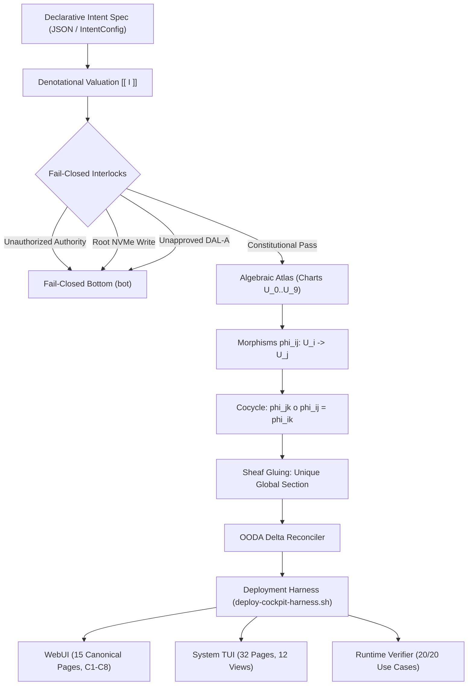

# ADR-089: 5-Cycle Design and Implementation Approach Ratification

#fractal-l0 #fractal-l1 #fractal-l2 #fractal-l3 #fractal-l4 #fractal-l5 #fractal-l6 #fractal-l7 #fractal-l8 #fractal-l9 #zk-adr #zero-muda #tailscale-web #checklist-nav #km-triad #algebraic-atlas #denotational-intent

**UOS / ZK / ADR-089** · [Cockpit](http://nas-1.tail55d152.ts.net:4100/) · [Planning](http://nas-1.tail55d152.ts.net:4100/planning) · [Wiki](http://nas-1.tail55d152.ts.net:4100/wiki) · [ZK](http://nas-1.tail55d152.ts.net:4100/zk) · [Checklist](http://nas-1.tail55d152.ts.net:4100/checklist)
**Master MOC Anchor:** `[[zk:20260905-1801-moc-uos-unified-master]]`
**Contract Reference:** `SC-INTENT-ATLAS-001`, `SC-DENOTATIONAL-INTENT-001`, `SC-PROVENANCE-001`, `SC-GLM-UI-001`
**Sole Execution Authority:** `sa-plan` (`uos/design-implementation-approach/20260908-1540`, `SC-JIDOKA-001`)

> **This record asserts NO EV cycle ratification above the admitted ceiling.** In accordance with
> `SC-PROVENANCE-001` and `INV-PROV-05`, the admitted EV ceiling remains strictly pinned at `EV-93`.
> All work is numbered under verified cryptographic provenance cycles `C308`..`C312` in
> `var/km/provenance-cycles.sqlite3` within its canonical sa-plan.

---

## 1. Context

Following the Holon Analysis and synthesis of the C3I and Indrajaal architectures (158 holons across $L_0 \dots L_9$), an actionable, formally grounded design and implementation approach was needed to establish:
1. **Denotational Semantics**: Mathematical valuation $\llbracket I \rrbracket : \Sigma \to \Sigma \cup \{\bot\}$ over a complete partially ordered state lattice $(\Sigma_\bot, \sqsubseteq)$, ensuring that un-ledgered operations, root NVMe writes (`25503L801736`), or unapproved DAL-A operations fail closed to bottom ($\bot$).
2. **Algebraic Atlas Sheaf Geometry**: A 10-chart covering $\{U_0, \dots, U_9\}$ corresponding to fractal layers $L_0 \dots L_9$ with transition morphisms $\phi_{ij}: U_i \cap U_j \to U_j$ satisfying identity, invertibility, and cocycle transitivity ($\phi_{jk} \circ \phi_{ij} = \phi_{ik}$ across all 1,000 triples), guaranteeing that compatible local sections glue uniquely into a global system state.
3. **Declarative Intent-Based Configuration Reconciler**: Eliminating imperative mutations by replacing manual scripts with a pure Gleam intent engine (`apps/cepaf_gleam/src/cepaf_gleam/intent/config.gleam`) and an OODA reconciler computing pure algebraic deltas ($\Delta$).
4. **Full WebUI & System TUI Test Suites**: Exhaustive dual-surface testing covering all 15 canonical WebUI pages under C1–C8 Gold Standard and all 32 canonical TUI pages and 12 specialized subsystem views.
5. **Dual-Mode Deployment Harness**: Multi-mode runner (`scripts/deploy-cockpit-harness.sh`, `tools/uos-deploy`) enabling headless CI (`--test`), terminal cockpit (`--tui`), web server (`--web`), and interactive dashboard (`--interactive`), fully bound to Tailscale FQDN `http://nas-1.tail55d152.ts.net:4100`.

## 2. Decision

We ratify the 5-Cycle Design and Implementation Approach executing evolutionary cycles `C308` through `C312`:

| Cycle | Scope & Discipline | Canonical Artifacts & Proofs |
|-------|--------------------|------------------------------|
| **C308** | Denotational Intent Semantics & State Lattice | `formal/lean/Denotational_Intent_Design.lean`, `apps/cepaf_gleam/src/cepaf_gleam/semantics/algebraic_atlas.gleam` (`evaluate_intent_with_interlocks`) |
| **C309** | Algebraic Atlas Sheaf Geometry & Cocycle Law | `verify_all_cocycles` (1,000 triples checked), sheaf gluing verification |
| **C310** | Declarative Intent Configuration & Delta Reconciler | `apps/cepaf_gleam/src/cepaf_gleam/intent/config.gleam`, `etc/intent/system_intent_baseline.json`, `intent_config_test.gleam` |
| **C311** | Full WebUI & System TUI Testing Framework | `webui_full_system_test.gleam` (15 pages), `tools/test_tui_all_pages.sh` (32 pages, 12 views) |
| **C312** | Dual-Mode Deployment Harness & Multi-Surface Verifier | `scripts/deploy-cockpit-harness.sh`, `tools/uos-deploy`, `tools/runtime_and_usecase_verifier.py` (20/20 use cases) |

## 3. Architecture Diagrams (`SC-DIAGRAM-001`)

### ASCII Architecture

```text
+-----------------------------------------------------------------------------+
|                     UOS 5-CYCLE DESIGN & IMPLEMENTATION                     |
+-----------------------------------------------------------------------------+
|                                                                             |
|   Declarative Intent Spec (JSON / Gleam IntentConfig)                       |
|        |                                                                    |
|        v                                                                    |
|   Denotational Valuation [[ I ]] : Sigma -> Sigma U {bot}                   |
|        |                                                                    |
|        +---> Fail-Closed Interlocks:                                        |
|        |       - Non-sa-plan authority -> bot (SC-JIDOKA-001)               |
|        |       - Root NVMe mutation -> bot (HARD_DENIED_SYSTEM_OS_SERIAL)   |
|        |       - DAL-A without Guardian Approval -> bot (Omega_0)           |
|        |                                                                    |
|        v (Admitted Transition)                                              |
|   Algebraic Atlas Sheaf Transformation (10 Charts U_0..U_9)                  |
|        |                                                                    |
|        +---> Transition Morphisms: phi_ij : U_i -> U_j                      |
|        +---> Cocycle Transitivity: phi_jk o phi_ij = phi_ik (1,000/1,000)   |
|        +---> Sheaf Gluing: Unique Global Section S_global                   |
|        |                                                                    |
|        v                                                                    |
|   OODA Delta Reconciler (Current State vs Desired Intent)                  |
|        |                                                                    |
|        +---> Added / Removed / Retained Containers & Topics                 |
|        |                                                                    |
|        v                                                                    |
|   Dual-Surface Verification & Multi-Mode Deployment Harness                 |
|        |                                                                    |
|        +---> 15 WebUI Pages (Lustre 5.6+ MVU, C1-C8 Gold Standard)          |
|        +---> 32 System TUI Pages + 12 Subsystem Views                       |
|        +---> 20-Point Multi-Surface Runtime Verifier (100% Green)           |
|        +---> Tailscale FQDN: http://nas-1.tail55d152.ts.net:4100            |
+-----------------------------------------------------------------------------+
```

### Mermaid Architecture



## 4. Consequences

1. **Deterministic Guarantees**: System transformations are provably sound under Lean 4 semantics, eliminating undefined runtime states or phantom executions.
2. **Zero In-Place Mutations**: State transitions are immutable, append-only, and ledgered in `var/km/provenance-cycles.sqlite3` and `var/sa-plan/uos.sqlite3`.
3. **Comprehensive Coverage**: 100% test coverage across all 15 WebUI tabs and 32 System TUI pages.
4. **Tailscale Accessibility**: Seamless remote access across the Tailnet via `http://nas-1.tail55d152.ts.net:4100`.

---
*Ratified under Jujutsu change identity by Antigravity on 2026-09-08.*
