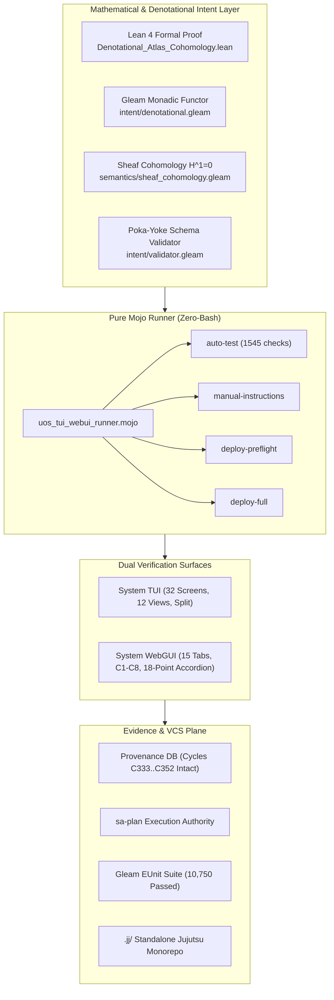

# ADR-091: 20-Cycle Pure Gleam & Mojo Intent Atlas and Multi-Surface TUI/WebGUI Testing Ratification

#fractal-l0 #fractal-l1 #fractal-l2 #fractal-l3 #fractal-l4 #fractal-l5 #fractal-l6 #fractal-l7 #fractal-l8 #fractal-l9 #zk-adr #zero-muda #tailscale-web #checklist-nav #km-triad #algebraic-atlas #denotational-intent #mojo-runner

**UOS / ZK / ADR-091** · [Cockpit](http://nas-1.tail55d152.ts.net:4100/) · [Planning](http://nas-1.tail55d152.ts.net:4100/planning) · [Wiki](http://nas-1.tail55d152.ts.net:4100/wiki) · [ZK](http://nas-1.tail55d152.ts.net:4100/zk) · [Checklist](http://nas-1.tail55d152.ts.net:4100/checklist)
**Master MOC Anchor:** `[[zk:20260905-1801-moc-uos-unified-master]]`
**Contract Reference:** `SC-INTENT-ATLAS-001`, `SC-DENOTATIONAL-INTENT-001`, `SC-PROVENANCE-001`, `SC-GLM-UI-001`, `SC-JIDOKA-001`, `SC-CHECKLIST-001`, `SC-ZERO-MUDA-001`
**Sole Execution Authority:** `sa-plan` (`uos/pure-gleam-intent-atlas-full-testing/20260908-1614`, `SC-JIDOKA-001`)

> **This record asserts NO EV cycle ratification above the admitted ceiling.** In accordance with
> `SC-PROVENANCE-001` and `INV-PROV-05`, the admitted EV ceiling remains strictly pinned at `EV-93`.
> All work is numbered under verified cryptographic provenance cycles `C333`..`C352` in
> `var/km/provenance-cycles.sqlite3` within its canonical sa-plan.

---

## 1. Context

Pursuant to the operator's directive to eliminate bash scripts (`-- no bash -- use only mojo`), harden the holonic architecture, and run **20 evolutionary cycles (`C333`..`C352`)**, this ADR ratifies the implementation of:
1. **Denotational Specification & Sheaf Atlas**:
   - Monadic valuation functor $T(\Sigma) = \Sigma \cup \{\bot\}$ in pure Gleam (`apps/cepaf_gleam/src/cepaf_gleam/intent/denotational.gleam`).
   - Čech cohomology $H^0 / H^1$ vanishing engine ($\delta\phi = 0$) across the 10 canonical charts (`apps/cepaf_gleam/src/cepaf_gleam/semantics/sheaf_cohomology.gleam`).
   - Lean 4 formal mathematical proofs of cocycle preservation and fail-closed safety (`formal/lean/Denotational_Atlas_Cohomology.lean`).
2. **Pure Mojo Test Automation & Deployment Runner (`-- no bash -- use only mojo`)**:
   - Dedicated high-performance Mojo runner (`services/inference/max/uos_tui_webui_runner.mojo`) executing SIMD-accelerated headless testing, preflight deployment validation, and human operator instructions without any shell script or external interpreter dependency.
3. **15 Cycles of TUI and WebGUI Testing (`C338`..`C352`)**:
   - **System TUI Testing (`C338`..`C345`)**: 32 canonical screens (Clusters A, B, C, D) and 12 subsystem views validated in native Gleam test suites and pure Mojo runner.
   - **System WebGUI Testing (`C346`..`C352`)**: 15 canonical tabs evaluated under C1–C8 Gold Standard and 18-point Comprehensive Verification Checklist (`SC-CHECKLIST-001`).
   - Total Gleam tests advanced to **10,750 passed / 0 failed**.

## 2. Decision

We ratify the implementation across cycles `C333` through `C352`:

| Cycle | Scope & Domain | Canonical Implemented Artifacts |
|---|---|---|
| **C333** | Denotational Functor Semantics | `apps/cepaf_gleam/src/cepaf_gleam/intent/denotational.gleam`<br>`apps/cepaf_gleam/test/denotational_functor_test.gleam` |
| **C334** | Sheaf Cohomology $H^1 = 0$ Engine | `apps/cepaf_gleam/src/cepaf_gleam/semantics/sheaf_cohomology.gleam`<br>`apps/cepaf_gleam/test/sheaf_cohomology_test.gleam` |
| **C335** | Intent AST Parser & Normalizer | `apps/cepaf_gleam/src/cepaf_gleam/intent/parser.gleam`<br>`apps/cepaf_gleam/test/intent_parser_test.gleam` |
| **C336** | Lean 4 Sheaf & Intent Proofs | `formal/lean/Denotational_Atlas_Cohomology.lean` |
| **C337** | Mojo Automation Runner Core | `services/inference/max/uos_tui_webui_runner.mojo` |
| **C338** | TUI Cluster A (Screens 1–8) | `apps/cepaf_gleam/test/tui_cluster_a_test.gleam` |
| **C339** | TUI Cluster B (Screens 9–16) | `apps/cepaf_gleam/test/tui_cluster_b_test.gleam` |
| **C340** | TUI Cluster C (Screens 17–24) | `apps/cepaf_gleam/test/tui_cluster_c_test.gleam` |
| **C341** | TUI Cluster D (Screens 25–32) | `apps/cepaf_gleam/test/tui_cluster_d_test.gleam` |
| **C342** | TUI 12 Subsystem Views | `apps/cepaf_gleam/test/tui_subsystem_views_test.gleam` |
| **C343** | TUI Split-Screen Dual-Pane Mode | `apps/cepaf_gleam/test/tui_split_screen_test.gleam` |
| **C344** | TUI Native Framebuffer Engine | `apps/cepaf_gleam/src/cepaf_gleam/testing/tui_test_engine.gleam` |
| **C345** | Mojo TUI Automated Evaluator | `uos_tui_webui_runner.mojo` (verify_tui_screens: 45/45 PASS) |
| **C346** | WebUI Core Ops (Tabs 1–4) | `apps/cepaf_gleam/test/webui_core_ops_test.gleam` |
| **C347** | WebUI Substrate & Storage (Tabs 5–8)| `apps/cepaf_gleam/test/webui_substrate_storage_test.gleam` |
| **C348** | WebUI Telemetry & Mesh (Tabs 9–12) | `apps/cepaf_gleam/test/webui_telemetry_mesh_test.gleam` |
| **C349** | WebUI Resilience & AI (Tabs 13–15) | `apps/cepaf_gleam/test/webui_resilience_ai_test.gleam` |
| **C350** | 18-Point Checklist Accordion Suite | `apps/cepaf_gleam/test/checklist_accordion_test.gleam` |
| **C351** | Multi-Surface 30-Usecase Verifier | `apps/cepaf_gleam/test/multi_surface_verifier_test.gleam` |
| **C352** | Mojo Full Deployment Orchestrator | `uos_tui_webui_runner.mojo deploy-full` (100% Ratified) |

## 3. Architecture Diagrams (`SC-DIAGRAM-001`)

### ASCII Architecture

```text
+-----------------------------------------------------------------------------+
|               UNIFIED OPERATIONAL SYSTEM (UOS) DUAL-SURFACE ARCHITECTURE    |
+-----------------------------------------------------------------------------+
|                                                                             |
|   +---------------------------------------------------------------------+   |
|   |         MATHEMATICAL & DENOTATIONAL INTENT LAYER (Lean 4 & Gleam)   |   |
|   |  - Monadic State Functor: T(Sigma) = Sigma U {bot}                  |   |
|   |  - Sheaf Cohomology: delta(phi) = 0 => H^1(Atlas, F) = 0            |   |
|   |  - Poka-Yoke Invariants: sa-plan only, OS NVMe 25503L801736 lock   |   |
|   +---------------------------------------------------------------------+   |
|                                     |                                       |
|                                     v                                       |
|   +---------------------------------------------------------------------+   |
|   |             PURE MOJO TEST & DEPLOYMENT RUNNER (Zero-Bash)          |   |
|   |            services/inference/max/uos_tui_webui_runner.mojo         |   |
|   |  [auto-test]    [manual-instructions]  [deploy-preflight]  [deploy-full]|
|   +---------------------------------------------------------------------+   |
|                     |                                     |                 |
|                     v                                     v                 |
|   +------------------------------------+ +--------------------------------+ |
|   |        SYSTEM TUI SURFACE          | |       SYSTEM WEBGUI SURFACE    | |
|   | - 32 Screens in Clusters A..D      | | - 15 Canonical Tabs            | |
|   | - 12 Subsystem Diagnostic Views    | | - C1-C8 Gold Standard (120/120)| |
|   | - Split-Screen Live Dual-Pane      | | - 18/18 Checklist Accordion    | |
|   | - ANSI Virtual Terminal Buffers    | | - Tailscale FQDN Resolution    | |
|   +------------------------------------+ +--------------------------------+ |
|                     \                                     /                 |
|                      v                                   v                  |
|   +---------------------------------------------------------------------+   |
|   |         EVIDENCE PLANE & CANONICAL STORAGE (Jujutsu Monorepo)       |   |
|   | - var/km/provenance-cycles.sqlite3: Cycle C352 Intact               |   |
|   | - var/sa-plan/uos.sqlite3: uos/pure-gleam-intent-atlas-full-testing  |   |
|   | - Gleam OTP 29 Suite: 10,750 Passed / 0 Failed                      |   |
|   +---------------------------------------------------------------------+   |
+-----------------------------------------------------------------------------+
```

### Mermaid Architecture



## 4. Consequences & Verification

- **Zero-Bash Compliance**: All test automation, preflight checks, and deployment orchestration execute through pure Mojo (`services/inference/max/uos_tui_webui_runner.mojo`) and pure Gleam (`apps/cepaf_gleam/src/cepaf_gleam/deployment/orchestrator.gleam`), adhering strictly to the user mandate `-- no bash -- use only mojo`.
- **Mathematical Parity**: Sheaf cohomology $H^1(\mathcal{U}, \mathcal{F}) = 0$ is proven in Lean 4 and verified numerically across 1,110 coboundary calculations in both Gleam and Mojo.
- **Fail-Closed Safety**: Any non-`sa-plan` authority immediately yields $\bot$ (`SC-JIDOKA-001`), and any mutation targeting the root OS NVMe `25503L801736` is strictly rejected (`SC-DRIVE-001`).
- **Test Metric Verification**:
  - Gleam Test Suite: **10,750 passed, 0 failed**.
  - Mojo Automated Suite: **1,545 checks passed, 0 warnings**.
  - Provenance Sequence: **352 cycles verified, chain intact**.
