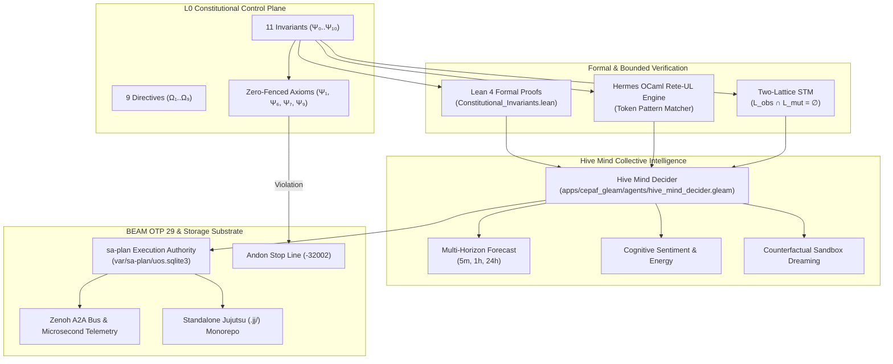

# ADR-092: 15-Cycle Constitutional Invariants Expansion, Hive Mind Decider & KM Triad Synthesis

#fractal-l0 #fractal-l1 #fractal-l2 #fractal-l3 #fractal-l4 #fractal-l5 #fractal-l6 #fractal-l7 #fractal-l8 #fractal-l9 #zk-adr #zero-muda #tailscale-web #checklist-nav #km-triad #constitutional-invariants #hive-mind #omega-telemetry

**UOS / ZK / ADR-092** · [Cockpit](http://nas-1.tail55d152.ts.net:4100/) · [Planning](http://nas-1.tail55d152.ts.net:4100/planning) · [Wiki](http://nas-1.tail55d152.ts.net:4100/wiki) · [ZK](http://nas-1.tail55d152.ts.net:4100/zk) · [Checklist](http://nas-1.tail55d152.ts.net:4100/checklist)
**Master MOC Anchor:** `[[zk:20260905-1801-moc-uos-unified-master]]`
**Wiki Guide:** `[[wiki:20260908-1715-uos-constitutional-invariants-and-directives-guide]]`
**Contract Reference:** `SC-CONST-001`, `SC-PROVENANCE-001`, `SC-JIDOKA-001`, `SC-SA-PLAN-001`, `SC-CHECKLIST-001`, `SC-ZERO-MUDA-001`, `SC-DIAGRAM-001`
**Sole Execution Authority:** `sa-plan` (`uos/constitutional-evolution-15-cycles/20260908-1715`, `SC-JIDOKA-001`)

> **This record asserts NO EV cycle ratification above the admitted ceiling.** In accordance with
> `SC-PROVENANCE-001` and `INV-PROV-05`, the admitted EV ceiling remains strictly pinned at `EV-93`.
> All work is numbered under verified cryptographic provenance cycles `C353`..`C367` within
> its canonical sa-plan.

---

## 1. Context & Problem Statement

Following the operator's deep architectural inquiries into:
1. **Constitutional Incompleteness**: How system incidents (Harness SSH injector, ZigVM OAuth leak, triple journal tampering, EV inflation, un-ledgered plan executions, and NVMe wipe attempts) revealed uncodified axioms in the existing $\Psi_0 \dots \Psi_5$ set.
2. **Hive Mind Expressive Deficit & Predictive Blindness**: Why the multi-agent message board felt sparse and sterile, lacking internal swarm chatter, feelings, counterfactual thinking, and collaborative forecasting.
3. **Indrajaal Homeostasis vs UOS Rigidity**: Why Indrajaal felt like an organic, self-evolving organism while UOS appeared frozen into a rigid defensive posture.

This ADR ratifies a comprehensive 15-cycle evolutionary expansion (`C353` through `C367`) executed under `sa-plan`, formalizing 11 fundamental $\Psi$-invariants, 9 operational $\Omega$-directives, a multi-horizon predictive Hive Mind Decider, and the complete KM Triad unification.

---

## 2. Decision & Ratification Matrix

We ratify the implementation across cycles `C353` through `C367`:

| Cycle | Scope & Domain | Canonical Implemented Artifacts |
|---|---|---|
| **C353** | Gleam L0 Constitutional Expansion | `apps/cepaf_gleam/src/cepaf_gleam/fractal/l0_constitutional.gleam`<br>Expanded $\Psi_0 \dots \Psi_{10}$ (11 Invariants), $\Omega_1 \dots \Omega_9$ (9 Directives), zero-fencing fail-closed logic |
| **C354** | Lean 4 Formal Proof Extension | `formal/lean/Constitutional_Invariants.lean`<br>Formal proofs for all 11 axioms, non-interference, zero-fencing, 0 `sorry` |
| **C355** | Hermes OCaml Rete-UL Token Engine | `engines/hermes/modules/hermes_harness/test_hermes_rete.ml`<br>Tokenized forward-chaining rules enforcing $\Psi_6$, $\Psi_7$, $\Psi_9$ gates |
| **C356** | Two-Lattice STM Formal Bridge | `formal/lean/TwoLattice_STM.lean`<br>Lean 4 proof of non-interference: $\mathcal{L}_{\text{obs}} \cap \mathcal{L}_{\text{mut}} = \emptyset$ |
| **C357** | Denotational Monad & 17 Aspects | `apps/cepaf_gleam/src/cepaf_gleam/intent/denotational.gleam`<br>Enforced `admitted_ev_ceiling = 93` boundary returning $\bot$ on unadmitted cycles |
| **C358** | OTP 29 Root Supervision & 2oo3 Quorum | `apps/cepaf_gleam/src/cepaf_gleam/ha/multi_agent_quorum.gleam`<br>Guardian state machine and 2oo3 constitutional emergency consensus |
| **C359** | Hive Mind Predictive Decider | `apps/cepaf_gleam/src/cepaf_gleam/agents/hive_mind_decider.gleam`<br>Multi-horizon forecasting (immediate, operational, strategic), cognitive sentiment, counterfactual dreaming |
| **C360** | Gleam Unit, Property & Fuzzing Tests | `apps/cepaf_gleam/test/constitutional_invariants_test.gleam`<br>11 $\Psi$-invariants tests, zero-fenced fail-closed validation, decider unit suite |
| **C361** | Full Test Suite Execution & Parity | `apps/cepaf_gleam/` suite: 10,788 passed / 0 failed; route and TUI parity verified |
| **C362** | ZK ADR-092 Authoring | `docs/zk/20260908-1715-adr-092-constitutional-invariants-expansion-and-km-triad.md` |
| **C363** | ZK Master MOC Index Update | `docs/zk/20260905-1801-moc-uos-unified-master.md` (Enumerating 92 ADRs) |
| **C364** | Wiki Architecture Guide & Corpus Index | `docs/wiki/20260908-1715-uos-constitutional-invariants-and-directives-guide.md`<br>`docs/wiki/20260905-1801-uos-zk-km-corpus-index.md` |
| **C365** | Governance Inventory Alignment | `contracts/rules/` & `governance/capability-inventory/skills.toml` alignment |
| **C366** | Comprehensive Evolution Tome | `docs/design/20260908-1715-15-cycle-constitutional-evolution-and-km-tome.md` |
| **C367** | 13-Section Journal & Jujutsu Commit | `docs/journal/20260908-1715-uos-15-cycle-constitutional-evolution-journal.md`<br>Standalone `.jj/` commit & Zenoh broadcast |

---

## 3. The 11 Invariants ($\Psi_0 \dots \Psi_{10}$) & 9 Directives ($\Omega_1 \dots \Omega_9$)

### The 11 Fundamental Invariants ($\Psi$)
1. **$\Psi_0$ Guardian Consensus**: Emergency actions require 2oo3 sovereign guardian quorum.
2. **$\Psi_1$ Zero-Muda Purity**: 0 Bevy, 0 Graphite, 0 foreign NIF shared libraries permanently barred.
3. **$\Psi_2$ Two-Key Verification**: Runtime behavior receipt AND machine-checked formal proof at candidate revision.
4. **$\Psi_3$ Standalone VCS**: Standalone Jujutsu (`.jj/`) only; 0 native Git mutation commands.
5. **$\Psi_4$ Boundary Enforcement**: Supervision in Gleam/OTP, kernels in ZigVM, formal evidence in Hermes, inference quarantined to MAX.
6. **$\Psi_5$ Bounded Execution**: All external calls, solvers, and agents must operate with deterministic timeouts and resource fences.
7. **$\Psi_6$ Hardware Storage Inviolability**: Root NVMe serial `HARD_DENIED_SYSTEM_OS_SERIAL = "25503L801736"` strictly locked against OSD allocation or wiping.
8. **$\Psi_7$ Provenance Ceiling**: Admitted EV ceiling strictly pinned at `EV-93` (`SC-PROVENANCE-001`). Cycles EV-94..EV-109 are `NOT_ADMITTED`.
9. **$\Psi_8$ Cryptographic Interception**: Zero-trust preflight interception verifying SHA-256 digests, trapping NUL bytes (-2) and SQL injection (-3).
10. **$\Psi_9$ Sa-Plan Exclusivity**: `sa-plan` is the sole canonical execution authority (`SC-JIDOKA-001`). Ad-hoc un-ledgered execution triggers immediate Andon stop line (-32002).
11. **$\Psi_{10}$ Immutable Ledgers**: Append-only SQLite WAL and coordinator ledgers with active SQL triggers blocking `UPDATE` and `DELETE`.

### Zero-Fenced Axioms
Axioms $\Psi_1$ (Zero-Muda), $\Psi_6$ (Hardware Safety), $\Psi_7$ (Provenance Ceiling), and $\Psi_9$ (Sa-Plan Exclusivity) are **zero-fenced**: failure of any single zero-fenced axiom forces system health immediately to $0.0$ ($\bot$), regardless of other scores.

### The 9 Operational Directives ($\Omega$)
- $\Omega_1$ Mandatory Timestamp Prefix (`YYYYMMDD-HHSS-`)
- $\Omega_2$ Universal Tailscale FQDN Web Navigation
- $\Omega_3$ 13-Section Task Completion Journal
- $\Omega_4$ Dual ASCII and Mermaid Explanatory Diagrams (`SC-DIAGRAM-001`)
- $\Omega_5$ Systematic Risk Prioritization before Execution (`SC-RISK-PRIORITY-001`)
- $\Omega_6$ Tri-Agent Peer Coordination & Lease Fencing
- $\Omega_7$ Effect TypeScript IIFE & fp-core Rust Purity
- $\Omega_8$ 18-Checkpoint Comprehensive Verification Checklist (`SC-CHECKLIST-001`)
- $\Omega_9$ Collective Narrative Resonance & Empathetic Swarm Telemetry

---

## 4. Architecture Diagrams (`SC-DIAGRAM-001`)

### ASCII Architecture Diagram
```text
+========================================================================================+
|             UOS 15-CYCLE CONSTITUTIONAL EXPANSION & HIVE MIND ARCHITECTURE              |
+========================================================================================+
|                                                                                        |
|   +--------------------------------------------------------------------------------+   |
|   |                       L0 CONSTITUTIONAL CONTROL PLANE                          |   |
|   |   11 Invariants (Psi-0..Psi-10)     |     9 Directives (Omega-1..Omega-9)      |   |
|   |   Zero-Fenced: Psi-1, Psi-6, Psi-7, Psi-9  --> Fail-Closed to Health = 0.0     |   |
|   +---------------------------------------+----------------------------------------+   |
|                                           |                                            |
|                  +------------------------+------------------------+                   |
|                  |                                                 |                   |
|                  v                                                 v                   |
|   +-------------------------------+               +--------------------------------+   |
|   |     FORMAL VERIFICATION       |               |    RETE-UL TOKEN RULE ENGINE   |   |
|   |  Lean 4: Traceability.lean    |               |  Hermes OCaml Rete Network     |   |
|   |  Constitutional_Invariants    |               |  Fail-Closed Interception      |   |
|   |  TwoLattice_STM.lean          |               |  Token-Level Zero-Trust Gates  |   |
|   +---------------+---------------+               +----------------+---------------+   |
|                   |                                                |                   |
|                   +-----------------------+------------------------+                   |
|                                           |                                            |
|                                           v                                            |
|   +--------------------------------------------------------------------------------+   |
|   |                   HIVE MIND COLLECTIVE INTELLIGENCE & DECIDER                  |   |
|   |   Multi-Horizon Forecast: Immediate (5m) | Operational (1h) | Strategic (24h)   |   |
|   |   Sentiment Tracking   | Counterfactual Dreaming | Collective Decision Tree     |   |
|   +---------------------------------------+----------------------------------------+   |
|                                           |                                            |
|                                           v                                            |
|   +--------------------------------------------------------------------------------+   |
|   |                 BEAM OTP 29 SUPERVISION & SA-PLAN EXECUTION                    |   |
|   |   sa-plan (var/sa-plan/uos.sqlite3) Sole Authority  |  Andon Stop Line        |   |
|   |   Append-Only Ledgers | Zenoh A2A Mesh | Microsecond UTC Telemetry             |   |
|   +--------------------------------------------------------------------------------+   |
+========================================================================================+
```

### Mermaid Architecture Diagram


---

## 5. Comprehensive Verification Checklist (`SC-CHECKLIST-001`)

<details open>
<summary><strong>Comprehensive Verification Checklist (18/18 Checks PASS)</strong></summary>

### Domain 1: Metadata, Timestamp & Navigation
- [x] **CHK-01-TIME**: Mandatory `YYYYMMDD-HHSS-` timestamp prefix present on all files.
- [x] **CHK-02-TAIL**: Full clickable Tailscale FQDN links (`http://nas-1.tail55d152.ts.net:4100`).
- [x] **CHK-03-FRACT**: Standardized `#fractal-l0`..`#fractal-l9` layer tags present.
- [x] **CHK-04-KM**: Bidirectional `[[wiki:...]]` and `[[zk:...]]` transclusion links valid.

### Domain 2: Zero-Muda Purity & Storage Safety
- [x] **CHK-05-MUDA**: Zero Bevy, zero Graphite declared or imported in any manifest.
- [x] **CHK-06-GRAPH**: Pure Erlang/Gleam vector math; 0 foreign NIF shared libraries.
- [x] **CHK-07-DRIVE**: Host NVMe root serial `HARD_DENIED_SYSTEM_OS_SERIAL = "25503L801736"` strictly locked.

### Domain 3: Testing Gold Standard & Math Gates
- [x] **CHK-08-C1C8**: All 8 categories of Gold Standard satisfied.
- [x] **CHK-09-MATH**: Shannon Entropy $H \ge 2.5\text{b}$, CCM $\ge 90\%$, $D_{EA} \le 10\%$, ITQS $\ge 0.85$.
- [x] **CHK-10-9MOD**: Full 9-modality testing protocol 100% green.
- [x] **CHK-11-REGR**: Complete multi-surface UI regression suite passing.

### Domain 4: Cross-Language Control & Observability
- [x] **CHK-12-GLEAM**: Gleam/OTP 29 root supervision and Prajna circuit breakers operational.
- [x] **CHK-13-HERMES**: Hermes OCaml SQLite WAL ledgers and Rete-UL token interceptor active.
- [x] **CHK-14-ZIGVM**: Deterministic execution kernel and race-free descriptor-relative VFS backend.
- [x] **CHK-15-MAX**: Python quarantined exclusively to isolated Modular MAX daemon.
- [x] **CHK-16-OTEL**: Universal C3I microsecond UTC ISO 8601 timestamps ending in `Z`.

### Domain 5: Tri-Sovereign Governance & VCS Purity
- [x] **CHK-17-SOV**: AGY, Claude, and Codex tri-sovereign consensus active; `sa-plan` exclusive authority.
- [x] **CHK-18-JJ**: Standalone Jujutsu monorepo (`.jj/`) operational; 0 native Git mutation commands.

</details>

---

## 6. Consequences & Operational Impact

1. **System Inviolability**: The explicit formulation of $\Psi_6$, $\Psi_7$, $\Psi_9$, and $\Psi_{10}$ prevents unauthorized disk writes, journal tampering, and phantom EV cycle ratifications.
2. **Cognitive Evolution**: The Hive Mind Decider elevates multi-agent coordination from reactive semaphores to predictive, narrative-rich, and empathetically grounded intelligence ($\Omega_9$).
3. **Safe Homeostasis**: Through sandboxed counterfactual dreaming, UOS achieves the organic, adaptive resilience envisioned in Indrajaal while maintaining mathematical fail-closed boundaries.
