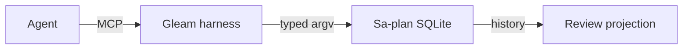

# Bind the observation to the property being claimed

Observed 2026-09-09T07:30:29.054561Z; cohort 2026-09-09T07:27:20.432947Z. #fractal-l0 #fractal-l1 #fractal-l2 #fractal-l3 #fractal-l4 #fractal-l5 #fractal-l6 #fractal-l7 #fractal-l8 #fractal-l9 #zk-adr #zero-muda

[Cockpit](http://nas-1.tail55d152.ts.net:4100/) · [Planning](http://nas-1.tail55d152.ts.net:4100/planning) · [Wiki](http://nas-1.tail55d152.ts.net:4100/wiki) · [ZK](http://nas-1.tail55d152.ts.net:4100/zk)

Task creation proves tracking. A progress activity stores evidence. A model response does not prove correctness or admission. Installed-client hook loading proves wiring; advisory messages do not enforce MCP authority.

This review found the same mismatch in four places: visible task rows omitted dependency edges; preflight extracted a nested PASS rather than top-level FAIL; the cockpit labeled static events Live; and Fable review counts/delivery were asserted before the actual rows were retrieved. Preserve failed observations and publish explicit corrections.

The tracking predicate now matches visible identity and exact successful creation receipts. Its 70th regression changes only dependency edges. Claude separately tested installed hook loading and repaired cached-preflight parsing. Dashboard truth and universal client enforcement remain open.

Current evidence is 52 canonical tasks/jobs/local workflows/current activities, zero verified feature acceptance and 70 targeted checks. The atlas remains a partial registry; encoded algebra and a verified OTP inventory need implementation.

```text
Agent --MCP--> Gleam harness --typed argv--> Sa-plan SQLite
Sa-plan SQLite --history--> Review projection
```



[Journal](http://nas-1.tail55d152.ts.net:4100/files/docs/journal/20260909-0720-harness-comprehensive-review-journal.md) · [Review](http://nas-1.tail55d152.ts.net:4100/files/docs/journal/20260909-0720-harness-comprehensive-review-reconciliation.json) · [Wiki](http://nas-1.tail55d152.ts.net:4100/files/docs/wiki/20260909-0720-harness-evolution-completion-status.md) · [Progress](http://nas-1.tail55d152.ts.net:4100/files/governance/capability-inventory/20260909-0720-harness-feature-progress.json) · [KM index](http://nas-1.tail55d152.ts.net:4100/files/governance/capability-inventory/20260909-0720-harness-km-artifact-index.json)

No EV or ADR admission number is minted. Review acceptance grants no runtime effect authority.


## Comprehensive verification checklist

Checks below are obligations, not blanket passing claims.

<details>
<summary>Domain 1 — Metadata, timestamp and Tailscale navigation</summary>

- [ ] **CHK-01-TIME** — Observe synchronized clock evidence and document prefix.
- [ ] **CHK-02-TAIL** — Verify full Tailnet links and actual serving status.
- [ ] **CHK-03-FRACT** — Verify L0–L9 tags and applicable layer mapping.
- [ ] **CHK-04-KM** — Reconcile specification, wiki, ZK and journal links.

</details>

<details>
<summary>Domain 2 — Zero-Muda purity and storage safety</summary>

- [ ] **CHK-05-MUDA** — Verify exclusions against the candidate dependencies.
- [ ] **CHK-06-GRAPH** — Verify the pure BEAM/Hermes graph boundary.
- [ ] **CHK-07-DRIVE** — Preserve the denied OS serial and test real interlocks only in scope.

</details>

<details>
<summary>Domain 3 — Testing Gold Standard and mathematical gates</summary>

- [ ] **CHK-08-C1C8** — Verify all applicable C1–C8 surfaces.
- [ ] **CHK-09-MATH** — Measure the four declared mathematical gates.
- [ ] **CHK-10-9MOD** — Apply relevant unit, system, TDD, BDD, performance, scalability, property, fuzz and chaos checks.
- [ ] **CHK-11-REGR** — Run applicable regressions and bounded observation.

</details>

<details>
<summary>Domain 4 — Cross-language control and observability</summary>

- [ ] **CHK-12-GLEAM** — Observe actual OTP control/supervision behavior.
- [ ] **CHK-13-HERMES** — Observe bounded analysis and authoritative evidence.
- [ ] **CHK-14-ZIGVM** — Verify deterministic execution and descriptor-relative VFS.
- [ ] **CHK-15-MAX** — Observe actual isolated inference when applicable.
- [ ] **CHK-16-OTEL** — Verify clock and nonzero trace/span identity.

</details>

<details>
<summary>Domain 5 — Sovereign governance and standalone Jujutsu</summary>

- [ ] **CHK-17-SOV** — Obtain candidate-bound independent review and authorized admission.
- [ ] **CHK-18-JJ** — Preserve standalone JJ, source ownership and exact candidate identity.

</details>

<details>
<summary>Domain 6 — Provenance extension</summary>

EV ceiling remains 93. EV-94..109 remain NOT_ADMITTED. No new EV number is minted.

</details>

[Previous: formal specification](http://nas-1.tail55d152.ts.net:4100/files/docs/design/20260909-0412-gleam-harness-symbiosis-formal-spec.md) · [Wiki](http://nas-1.tail55d152.ts.net:4100/wiki) · [ZK](http://nas-1.tail55d152.ts.net:4100/zk) · [Cockpit](http://nas-1.tail55d152.ts.net:4100/)

UOS footer: document and component evidence do not grant system admission.

