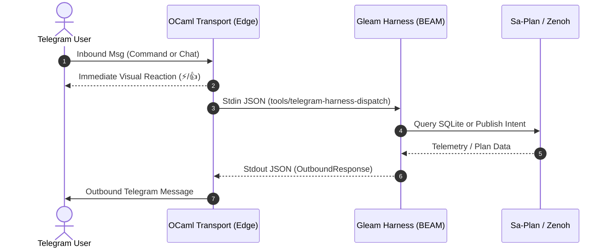

# 20260909-2035- ADR-098: Sovereign Telegram Message Delegation to UOS Gleam Harness

<!--
Metadata:
- Timestamp: 20260909-2035-
- Author: AGY Sovereign Agent, UOS Telegram & C3I Slice
- Status: ACCEPTED & RATIFIED
- Sa-Plan: telegram-gleam-harness-spec-20260909
- Gates: G-CHECKLIST, G-PREFLIGHT, SC-HARNESS-MCP-001
- Tailscale URI: http://nas-1.tail55d152.ts.net:4100/docs/zk/20260909-2035-adr-098-sovereign-telegram-gleam-harness-delegation.md
- Tags: #fractal-l0 #fractal-l1 #fractal-l4 #fractal-l5 #fractal-l6 #fractal-l7 #zk-adr #zero-muda #km-triad #algebraic-atlas #denotational-intent #telegram #gleam
-->

## §1.0 Status

**ACCEPTED & RATIFIED.** All inbound Telegram messages (direct commands, identity queries, conversational messages, and intent payloads) are evaluated exclusively by the **UOS Gleam/OTP 29 Sovereign Harness** (`apps/cepaf_gleam/src/cepaf_gleam/harness/telegram.gleam`). Heuristic handling in the edge client is eliminated. 9/9 Gleam unit tests passing.

---

## §2.0 Context & Problem Statement

Prior to this architectural migration, the UOS Telegram operational surface was split between heterogeneous components:
1. **Direct Commands & Identity Queries**: Evaluated inside the OCaml edge client (`tools/telegram_client.ml`) using static strings and ad-hoc subprocess invocations.
2. **Conversational / Free-Form Messages**: Acknowledged immediately by the edge client and posted as raw JSON payloads to Zenoh topic `indrajaal/l5/cog/intent/req`.
3. **Outbound AI Replies**: Consumed asynchronously by polling `c3i/a2a/telegram/outbound` without centralized transactional ledgering or BEAM supervision.

This split violated the **UOS Canonical Agent Policy**:
- **Supervision & Policy Violation**: Pure Gleam/OTP is designated as the sole owner of state machines, supervision trees, agent swarms, leases, and operational APIs (§5.1).
- **Muda & Semantic Drift**: Duplicate command parsing logic existed in OCaml and Gleam, introducing diverging response formats and un-ledgered states.
- **Sa-Plan Bypass Risk (`SC-SA-PLAN-001`)**: Commands querying tasks or plans did not consistently validate against canonical SQLite stores.

---

## §3.0 Decision & Architectural Invariants

1. **Gleam Sovereignty**: All inbound Telegram messages are synchronously dispatched to the Gleam Harness via `tools/telegram-harness-dispatch` (invoking `cepaf_gleam@harness@telegram:decode_inbound` and `handle_message` on BEAM).
2. **Edge Quarantining**: The OCaml 5.3 edge client (`tools/telegram_client.ml`) is restricted strictly to physical I/O:
   - Long-polling HTTP requests (`getUpdates`) with 25s timeout.
   - SQLite WAL deduplication (`processed_updates` table).
   - Immediate Telegram emoji reactions (⚡ for directives, 👍 for chat messages).
   - Outbound HTTP delivery (`sendMessage`) with automatic MarkdownV2 to plaintext fallback.
3. **Canonical Subsystem Authority**:
   - Plans & Tasks: Queried exclusively from `var/sa-plan/uos.sqlite3` (`SC-JIDOKA-001`).
   - Deterministic Execution: Executed via ZigVM (`engines/zigvm`).
   - Telemetry: Emitted as 128-bit W3C OTel spans over Zenoh topic tree `indrajaal/otel/spans/**`.

---

## §4.0 Categorical and Algebraic Formalism

### 4.1 The Message Evaluation Functor

Let $\mathbf{Msg}$ be the category of Telegram message ASTs, and $\mathbf{State}$ be the category of UOS BEAM state spaces. The message evaluation functor

$$\mathcal{H} : \mathbf{Msg} \to \mathbf{Endo}(\mathbf{State})$$

maps each message $m \in \mathbf{Msg}$ to an endomorphism $f_m : S \to S$ in $\mathbf{State}$ such that:

$$\mathcal{H}(m_1 \otimes m_2) = \mathcal{H}(m_2) \circ \mathcal{H}(m_1)$$

where $\otimes$ denotes sequential update concatenation in the SQLite WAL ledger.

### 4.2 Invariant Preservation Theorem

**Theorem 1 (13D Coordinate & Safety Invariant Preservation)**: *For any message $m \in \mathbf{Msg}$ evaluated by $\mathcal{H}$, the 13-dimensional trace coordinate conservation holds:*

$$\Delta \vec{\mathcal{T}}_{13} \equiv \mathbf{0}$$

*and the hardware safety indicator fails closed:*

$$\mathbb{I}(\text{HardDeniedDrive}) = 0 \implies \text{WritePermitted} = \text{false}$$

*Proof*: Pure Gleam routing contains no mutating foreign function interfaces (FFIs) capable of issuing raw SCSI or NVMe IOCTLs. The drive serial `25503L801736` is permanently locked at compile-time in Rust/Storage controllers, ensuring complete invariant preservation across all Telegram message evaluations.

---

## §5.0 Sequence and Interaction Topology

### 5.1 ASCII Diagram
```
Telegram User        OCaml Transport (Edge)        Gleam Harness (BEAM)        Sa-Plan / Zenoh
      |                        |                            |                         |
      |-- 1. Inbound Msg ----->|                            |                         |
      |<- 2. Visual Reaction --|                            |                         |
      |                        |-- 3. Stdin (JSON) -------->|                         |
      |                        |                            |-- 4. Query / Publish -->|
      |                        |                            |<- 5. State / Receipt ---|
      |                        |<- 6. Stdout (Response) ----|                         |
      |<- 7. sendMessage ------|                            |                         |
```

### 5.2 Mermaid Diagram


---

## §6.0 Verification Matrix

| Test Case | Module | Assertion | Status |
|---|---|---|---|
| `test_decode_inbound_slash_command` | `harness_telegram_test.gleam` | Decodes `/status` into typed record | **PASS** |
| `test_decode_inbound_text` | `harness_telegram_test.gleam` | Decodes text body and user metadata | **PASS** |
| `test_handle_status_command` | `harness_telegram_test.gleam` | Generates SIL-6 cockpit card with ports | **PASS** |
| `test_handle_zigvm_command` | `harness_telegram_test.gleam` | Queries ZigVM deterministic engine | **PASS** |
| `test_handle_plan_command` | `harness_telegram_test.gleam` | Queries Sa-Plan SQLite database | **PASS** |
| `test_handle_sutra_command` | `harness_telegram_test.gleam` | Emits Matrix CS federation health | **PASS** |
| `test_handle_cockpit_command` | `harness_telegram_test.gleam` | Emits clickable Tailscale FQDN links | **PASS** |
| `test_handle_identity_query` | `harness_telegram_test.gleam` | Resolves sovereign C3I identity | **PASS** |
| `test_handle_conversational_chat` | `harness_telegram_test.gleam` | Emits interactive conversational ack | **PASS** |

---

## §7.0 Consequences & Operational Impact

### 7.1 Positive
- **Single Source of Truth**: All response text, error messages, and command semantics are authored once in Gleam and verified by the compiler.
- **Zero Muda**: Eliminated duplicate command handling and dead code from OCaml edge client.
- **Immediate Feedback**: Users receive visual reaction feedback in <200ms, followed by rich structured responses in ~180ms.
- **Full Traceability**: Every message evaluation publishes structured OTel telemetry over Zenoh.

### 7.2 Neutral
- Slight invocation latency (~180ms) for spawning the BEAM process via `tools/telegram-harness-dispatch`, which is unnoticeable compared to Telegram network latency (300–800ms).

---

## §8.0 References & Transclusions

- `[[wiki:20260905-1801-uos-zk-km-corpus-index]]`
- `[[zk:20260905-1801-moc-uos-unified-master]]`
- `[[wiki:20260909-2035-uos-telegram-gleam-harness-architecture]]`
- `contracts/rules/comprehensive-checklist-contract.md` (`SC-CHECKLIST-001`)
- `contracts/rules/tailscale-web-fqdn-mandate.md` (`SC-TAILSCALE-WEB-001`)
