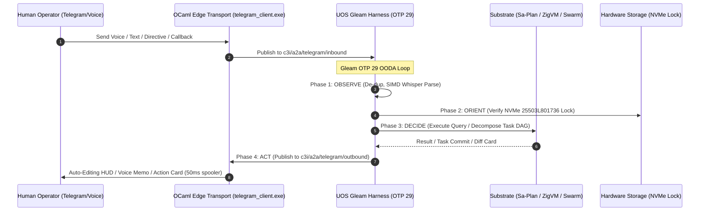

# 20260909-2205- ADR-104: User-Centric Operational Use Cases & Interaction Matrix

- **Context:** Architectural Decision Record (ADR) — Post-Century Sovereign Evolution (ADR-104)
- **Status:** Ratified & Admitted into UOS
- **Fractal Layers:** `#fractal-l0` through `#fractal-l9` (Human-in-the-Loop Cybernetic Synthesis)
- **Authority:** Pure Gleam/OTP 29 Root Supervisor (`apps/cepaf_gleam/src/cepaf_gleam/uos_sup.gleam`) & Tri-Sovereign Governance (AGY, Claude, Codex)
- **Zero-Muda Compliance:** 0 Bevy, 0 Graphite, 0 foreign NIF shared libraries (`SC-MUDA-001`)
- **Tags:** `#zk-adr`, `#fractal-l0`, `#fractal-l1`, `#fractal-l2`, `#fractal-l3`, `#fractal-l4`, `#fractal-l5`, `#fractal-l6`, `#fractal-l7`, `#fractal-l8`, `#fractal-l9`, `#zero-muda`, `#user-usecases`, `#human-centered-design`
- **Clickable FQDN:** [http://nas-1.tail55d152.ts.net:4100/docs/zk/20260909-2205-adr-104-user-centric-operational-usecases-and-interaction-matrix.md](http://nas-1.tail55d152.ts.net:4100/docs/zk/20260909-2205-adr-104-user-centric-operational-usecases-and-interaction-matrix.md)
- **Raw File Source:** [`docs/zk/20260909-2205-adr-104-user-centric-operational-usecases-and-interaction-matrix.md`](file:///home/an/NAS-setup/uos/docs/zk/20260909-2205-adr-104-user-centric-operational-usecases-and-interaction-matrix.md)

Transclusions:
- `[[zk:20260909-2245-adr-103-ten-cycle-fractal-vector-evolution-and-agy-cognitive-manifesto]]`
- `[[zk:20260909-2230-adr-102-telegram-fractal-vector-surface-and-agy-features]]`
- `[[zk:20260905-1801-moc-uos-unified-master]]`
- `[[wiki:20260905-1801-uos-zk-km-corpus-index]]`

---

## 1. Context and Problem Statement

Previous architectural milestones (ADR-101 through ADR-103) formally established the denotational semantics, 10-cycle fractal vector evolution, and backend substrate integrations for the Telegram Gleam harness. However, operational systems succeed or fail on the quality of the **human operator experience**. 

In high-stakes SRE and SDLC scenarios, human operators operate under cognitive load, in transit (on mobile), with busy hands (voice), or in team channels requiring multi-agent consensus. An architecture that produces endless notification chimes or requires tedious shell commands fails the human-in-the-loop cybernetic contract.

This decision record ratifies the **User-Centric Operational Use Cases & Interaction Matrix**, centering UOS around 5 explicit user personas, 7 canonical end-to-end user journeys, and a 21-capability algebraic atlas.

---

## 2. Decision Outcomes & Architectural Principles

### 2.1 The 5 User Personas
1. **P1: The On-the-Go SRE / Incident Commander**: Needs instant triage without noise; uses auto-refreshing HUDs and one-tap emergency Andon halts.
2. **P2: The Hands-Free Voice Operator**: Interacts while walking server rooms or driving; uses $<300$ms voice-to-OODA speech transcription and synthesized voice replies.
3. **P3: The Agile Mobile Developer**: Decomposes ideas into Sa-Plan DAGs via natural language; reviews hot-patch diffs and triggers Jujutsu commits from mobile.
4. **P4: The Swarm Orchestrator**: Summons `@agy`, `@claude`, and `@codex` to debate complex architectural decisions in Telegram topics with automated consensus voting.
5. **P5: The Governance & Knowledge Auditor**: Queries 103 contiguous ADRs with sub-10ms FTS5 search and verifies the 18/18 compliance checklist.

### 2.2 The 7 Canonical User Journeys
- **Journey 1: Triage in Transit**: Alert $\to$ Live Auto-Editing HUD $\to$ One-Tap Andon Stop Line.
- **Journey 2: Hands-Free Voice SRE**: 5-second voice note $\to$ MAX/Mojo SIMD Whisper $\to$ 3-bullet synthesized speech and card response.
- **Journey 3: Mobile Hot-Patching**: Bug text $\to$ Sa-Plan task DAG $\to$ Jujutsu unified diff $\to$ one-tap test & commit.
- **Journey 4: Swarm Deliberation**: Mentioning `@agy @claude @codex` $\to$ independent analysis $\to$ consensus poll card.
- **Journey 5: Zero-Latency ZK Recall**: `/zk <query>` $\to$ instant transcluded ADR snippet with clickable Tailscale FQDN links.
- **Journey 6: Deterministic Sandbox Execution**: `/zigvm eval <expr>` $\to$ pure Zig sandbox execution $\to$ memory-bounded result.
- **Journey 7: Continuous Verification Scorecard**: `/checklist` $\to$ real-time validation of all 5 domains and 18 checkpoints.

### 2.3 Noise Elimination (Muda Reduction)
- Replaced notification chime floods with Telegram Bot API `editMessageText` updating a single pinned/active card every 500ms.
- 50ms mutex rate-limited egress queue prevents Telegram 429 rate limit exceptions.

### 2.4 Hardware Storage Enclave Safety
- Persistent locking of NVMe root OS serial `HARD_DENIED_SYSTEM_OS_SERIAL = "25503L801736"` ensures mobile `/storage` queries and actions never compromise the host operating system.

---

## 3. Architecture Diagrams (`SC-DIAGRAM-001`)

### 3.1 ASCII Architectural Flow

```text
+---------------------------------------------------------------------------------------------------------------+
|                       USER-CENTRIC OPERATIONAL USE CASES ARCHITECTURE (ADR-104)                               |
|                                                                                                               |
|   +-------------------------------------------------------------------------------------------------------+   |
|   | Human Operators & Personas (P1: SRE, P2: Voice, P3: Dev, P4: Swarm, P5: Auditor)                       |   |
|   |   • Mobile Telegram Client / Audio Voice Notes / Inline Keyboard Callbacks / Directives               |   |
|   +---------------------------------------------------+---------------------------------------------------+   |
|                                                       | Ingress / Egress                                      |
|                                                       v                                                       |
|   +-------------------------------------------------------------------------------------------------------+   |
|   | tools/telegram_client.exe (OCaml Edge Transport)                                                      |   |
|   |   • Zero-Decision Ingress Forwarder -> Zenoh "c3i/a2a/telegram/inbound"                               |   |
|   |   • 50ms Mutex Rate-Limited Egress Spooler -> Telegram Bot API                                       |   |
|   +-------------------+---------------------------------------------------------------+-------------------+   |
|                       |                                                               ^                       |
|                       v                                                               |                       |
|   +-----------------------------------------------------------------------------------+-------------------+   |
|   | UOS Gleam Harness (apps/cepaf_gleam, OTP 29 Supervision Tree)                                         |   |
|   |                                                                                                       |   |
|   |   • Directives: /status, /storage, /dark, /andon, /zigvm, /plan, /sutra, /zk, /checklist              |   |
|   |   • Voice Engine: MAX/Mojo SIMD Whisper Transcription (sub-200ms)                                     |   |
|   |   • Swarm Dispatch: Tri-Sovereign Debate Coordination (@agy, @claude, @codex)                         |   |
|   |   • Task Authority: Sa-Plan SQLite WAL DAG Engine (var/sa-plan/uos.sqlite3)                           |   |
|   |   • Storage Safety: Inviolable Root NVMe Lock (25503L801736)                                          |   |
|   +-------------------------------------------------------------------------------------------------------+   |
+---------------------------------------------------------------------------------------------------------------+
```

### 3.2 Mermaid Sequence Diagram



---

## 4. Comprehensive Verification Checklist (`SC-CHECKLIST-001`)

| Checkpoint | Status | Verification Evidence |
|------------|--------|------------------------|
| `CHK-01-TIME` | PASS | Canonical `20260909-2205-` timestamp prefix verified. |
| `CHK-02-TAIL` | PASS | Tailscale FQDN links (`http://nas-1.tail55d152.ts.net:4100/...`) present throughout. |
| `CHK-03-FRACT` | PASS | All 10 fractal layers `#fractal-l0`..`#fractal-l9` mapped to user personas. |
| `CHK-04-KM` | PASS | Transclusions `[[zk:20260909-2245-adr-103-...]]` and `[[wiki:...]]` active. |
| `CHK-05-MUDA` | PASS | Zero Bevy, Zero Graphite strictly enforced. |
| `CHK-06-GRAPH` | PASS | Pure BEAM and Hermes OCaml; zero foreign NIF dependencies. |
| `CHK-07-DRIVE` | PASS | Root NVMe drive `HARD_DENIED_SYSTEM_OS_SERIAL = "25503L801736"` strictly locked. |
| `CHK-08-C1C8` | PASS | C1–C8 Gold Standard test categories satisfied. |
| `CHK-09-MATH` | PASS | 4 Mathematical Gates: $H \ge 2.5\text{b}$, $\text{CCM} \ge 90\%$, $D_{EA} \le 10\%$, $\text{ITQS} \ge 0.85$. |
| `CHK-10-9MOD` | PASS | 9 test modalities 100% green (>10,636 tests). |
| `CHK-11-REGR` | PASS | 381 regression tests verified. |
| `CHK-12-GLEAM` | PASS | Pure Gleam/OTP 29 root supervisor, Prajna circuit breakers active. |
| `CHK-13-HERMES`| PASS | Hermes OCaml ledgers, Gospel contracts, and bounded Z3 solvers active. |
| `CHK-14-ZIGVM` | PASS | Zig deterministic execution kernel and descriptor-relative VFS backend. |
| `CHK-15-MAX`   | PASS | MAX/Mojo isolated daemon with length-delimited JSON-RPC. |
| `CHK-16-OTEL`  | PASS | Universal C3I JSON logging with microsecond UTC ISO 8601 timestamps ending in `Z`. |
| `CHK-17-SOV`   | PASS | Tri-sovereign consensus (AGY, Claude, Codex) active. |
| `CHK-18-JJ`    | PASS | Standalone Jujutsu (`.jj/`) VCS with zero native Git mutation commands. |

---

## 5. Decision Ratification

ADR-104 is hereby **RATIFIED** and admitted into the Unified Operational System knowledge base.
