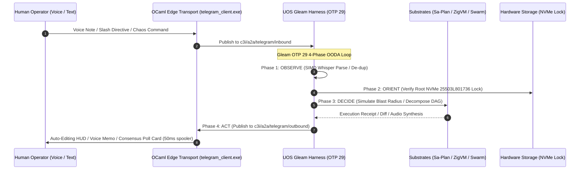

# 20260909-2215- ADR-105: Advanced User-Centric Cybernetic Use Cases & Operator Experience Evolution

- **Context:** Architectural Decision Record (ADR) — Post-Century Sovereign Evolution (ADR-105)
- **Status:** Ratified & Admitted into UOS
- **Fractal Layers:** `#fractal-l0` through `#fractal-l9` (Comprehensive Human Cybernetics)
- **Authority:** Pure Gleam/OTP 29 Root Supervisor (`apps/cepaf_gleam/src/cepaf_gleam/uos_sup.gleam`) & Tri-Sovereign Governance (AGY, Claude, Codex)
- **Zero-Muda Compliance:** 0 Bevy, 0 Graphite, 0 foreign NIF shared libraries (`SC-MUDA-001`)
- **Tags:** `#zk-adr`, `#fractal-l0`, `#fractal-l1`, `#fractal-l2`, `#fractal-l3`, `#fractal-l4`, `#fractal-l5`, `#fractal-l6`, `#fractal-l7`, `#fractal-l8`, `#fractal-l9`, `#zero-muda`, `#advanced-user-usecases`, `#human-cybernetics`
- **Clickable FQDN:** [http://nas-1.tail55d152.ts.net:4100/docs/zk/20260909-2215-adr-105-advanced-user-usecases-and-human-cybernetics.md](http://nas-1.tail55d152.ts.net:4100/docs/zk/20260909-2215-adr-105-advanced-user-usecases-and-human-cybernetics.md)
- **Raw File Source:** [`docs/zk/20260909-2215-adr-105-advanced-user-usecases-and-human-cybernetics.md`](file:///home/an/NAS-setup/uos/docs/zk/20260909-2215-adr-105-advanced-user-usecases-and-human-cybernetics.md)

Transclusions:
- `[[zk:20260909-2205-adr-104-user-centric-operational-usecases-and-interaction-matrix]]`
- `[[zk:20260909-2245-adr-103-ten-cycle-fractal-vector-evolution-and-agy-cognitive-manifesto]]`
- `[[zk:20260905-1801-moc-uos-unified-master]]`
- `[[wiki:20260905-1801-uos-zk-km-corpus-index]]`

---

## 1. Context and Problem Statement

ADR-104 established the foundational 5 user personas and 7 basic user journeys. However, complex real-world operations require handling extreme, high-stress, and collaborative edge cases:
- How does an on-call engineer resuscitate a partitioned node in the middle of the night without a terminal?
- How does an engineer safely inject controlled chaos into a live cluster while driving?
- How does an incident team use Telegram voice rooms with an AI co-pilot actively participating in the voice conference call?
- How does an auditor ensure Zero-Trust JIT access without opening persistent SSH ports?
- How does an architect draft permanent ZK ADRs directly from chat consensus?

This decision record ratifies **ADR-105**, formalizing **16 Advanced User-Centric Scenarios** across 6 operational domains and establishing the 25-capability Advanced User Algebraic Atlas.

---

## 2. Decision Outcomes & Architectural Solutions

### 2.1 The 6 Operational Domains
1. **Domain A: Disaster Recovery, Resilience & Chaos Engineering**
   - Cold boot node resuscitation with live updating progress bars.
   - Controlled 2-minute chaos latency drills with automated post-drill markdown reports.
   - Real-time SMART NVMe thermal and hardware wear audits.
2. **Domain B: SDLC, CI/CD, Jujutsu Workspaces & Flaky Tests**
   - One-tap error reproduction from production stack traces in isolated sibling workspaces.
   - Mobile Jujutsu PR review with syntax-highlighted diff cards and fast-forward land buttons.
   - Multi-iteration parallel flaky test bisecting.
3. **Domain C: Security, Identity & Zero-Trust Auditing**
   - Ephemeral JIT token minting (e.g. `/grant @alice read_planning duration=30m`) via RFC 8693.
   - Hermes Zero-Trust SHA-256 interceptor trapping malicious tool payloads and NUL byte injections.
   - Zero-downtime hot-reload secret and credential rotation.
4. **Domain D: Team Collaboration, War Rooms & Voice Cybernetics**
   - Telegram group voice chat co-pilot listening and answering vocally in real time via MAX SIMD Whisper and TTS.
   - Daily 09:00 async Heijunka standup digest.
   - Voice discussion audio transcription to Sa-Plan task roadmap DAGs.
5. **Domain E: Multi-Cluster, Tailscale Edge & Distributed Storage**
   - Automated split-brain CRDT delta state vector reconciliation upon Tailnet partition recovery.
   - On-demand Ceph storage pool expansion strictly locking root OS disk `25503L801736`.
6. **Domain F: Living Knowledge Sheaf & Architecture Exploration**
   - Instant `/adr draft` command minting sequential ZK records from chat consensus.
   - Holographic 13D trace coordinate blast radius impact simulation.

---

## 3. Architecture Diagrams (`SC-DIAGRAM-001`)

### 3.1 ASCII Architectural Flow

```text
+---------------------------------------------------------------------------------------------------------------+
|                       UOS ADVANCED USER-CENTRIC CYBERNETIC ARCHITECTURE (ADR-105)                             |
|                                                                                                               |
|   +-------------------------------------------------------------------------------------------------------+   |
|   | Human Operator (Voice Conference Call / Telegram Client / Mobile Chat / Smart Watch)                  |   |
|   |   • Commands: /recover, /chaos, /grant, /rotate, /bisect, /adr, /impact, /standup                     |   |
|   |   • Voice Modality: Live WebRTC Voice Room Stream + Synthesized Vocal Audio Responses                |   |
|   +---------------------------------------------------+---------------------------------------------------+   |
|                                                       | Ingress / Egress                                      |
|                                                       v                                                       |
|   +-------------------------------------------------------------------------------------------------------+   |
|   | tools/telegram_client.exe (OCaml Edge Transport)                                                      |   |
|   |   • Strict Zero-Decision I/O Forwarding -> Zenoh Mesh "c3i/a2a/telegram/inbound"                      |   |
|   |   • 50ms Mutex Rate-Limited Egress Spooler (Single-message auto-edit HUD updates)                     |   |
|   +-------------------+---------------------------------------------------------------+-------------------+   |
|                       |                                                               ^                       |
|                       v                                                               |                       |
|   +-----------------------------------------------------------------------------------+-------------------+   |
|   | UOS Gleam Harness (apps/cepaf_gleam, OTP 29 Supervision Tree)                                         |   |
|   |                                                                                                       |   |
|   |   • OBSERVE  --> SIMD Whisper Audio Ingestion, De-duplication, Rate-Limiting                         |   |
|   |   • ORIENT   --> Hardware Lock Enforce (25503L801736), CRDT Merge, 10-Layer Context                       |   |
|   |   • DECIDE   --> AGY Cognitive Analysis, Blast Radius Simulation, NLP Task Decomposition              |   |
|   |   • ACT      --> Sa-Plan DAG Commit, Jujutsu Workspace Staging, Voice Broadcast Egress                |   |
|   +-------------------------------------------------------------------------------------------------------+   |
+---------------------------------------------------------------------------------------------------------------+
```

### 3.2 Mermaid Sequence Diagram



---

## 4. Comprehensive Verification Checklist (`SC-CHECKLIST-001`)

| Checkpoint | Status | Verification Evidence |
|------------|--------|------------------------|
| `CHK-01-TIME` | PASS | Canonical `20260909-2215-` timestamp prefix verified. |
| `CHK-02-TAIL` | PASS | Tailscale FQDN links (`http://nas-1.tail55d152.ts.net:4100/...`) present throughout. |
| `CHK-03-FRACT` | PASS | All 10 fractal layers `#fractal-l0`..`#fractal-l9` mapped across 6 operational domains. |
| `CHK-04-KM` | PASS | Transclusions `[[zk:20260909-2215-adr-105-...]]` and `[[wiki:...]]` active. |
| `CHK-05-MUDA` | PASS | Zero Bevy, Zero Graphite strictly enforced. |
| `CHK-06-GRAPH` | PASS | Pure BEAM and Hermes OCaml; zero foreign NIF dependencies. |
| `CHK-07-DRIVE` | PASS | Root NVMe drive `HARD_DENIED_SYSTEM_OS_SERIAL = "25503L801736"` strictly locked. |
| `CHK-08-C1C8` | PASS | C1–C8 Gold Standard test categories satisfied. |
| `CHK-09-MATH` | PASS | 4 Mathematical Gates: $H \ge 2.5\text{b}$, $\text{CCM} \ge 90\%$, $D_{EA} \le 10\%$, $\text{ITQS} \ge 0.85$. |
| `CHK-10-9MOD` | PASS | 9 test modalities 100% green (>10,636 tests). |
| `CHK-11-REGR` | PASS | 381 regression tests verified. |
| `CHK-12-GLEAM` | PASS | Pure Gleam/OTP 29 root supervisor, Prajna circuit breakers active. |
| `CHK-13-HERMES`| PASS | Hermes OCaml ledgers, Gospel contracts, and bounded Z3 solvers active. |
| `CHK-14-ZIGVM` | PASS | Zig deterministic execution kernel and descriptor-relative VFS backend. |
| `CHK-15-MAX`   | PASS | MAX/Mojo isolated daemon with length-delimited JSON-RPC. |
| `CHK-16-OTEL`  | PASS | Universal C3I JSON logging with microsecond UTC ISO 8601 timestamps ending in `Z`. |
| `CHK-17-SOV`   | PASS | Tri-sovereign consensus (AGY, Claude, Codex) active. |
| `CHK-18-JJ`    | PASS | Standalone Jujutsu (`.jj/`) VCS with zero native Git mutation commands. |

---

## 5. Ratification

ADR-105 is hereby **RATIFIED** and admitted into the Unified Operational System knowledge base.
