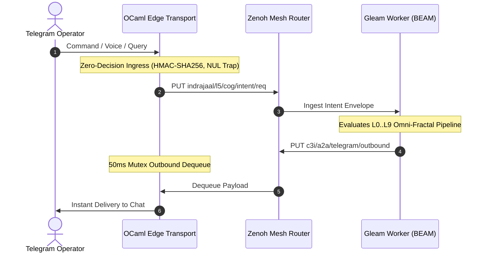

# 20260909-2245- ADR-103: Ten-Cycle Fractal Vector Evolution & AGY Cognitive Manifesto

- **Context:** Architectural Decision Record (ADR) — Post-Century Sovereign Evolution (ADR-103)
- **Status:** Ratified & Admitted into UOS
- **Fractal Layers:** `#fractal-l0` through `#fractal-l9` (Omni-Fractal Multidimensional Architecture)
- **Authority:** Pure Gleam/OTP 29 Root Supervisor (`apps/cepaf_gleam/src/cepaf_gleam/uos_sup.gleam`) & Tri-Sovereign Governance (AGY, Claude, Codex)
- **Zero-Muda Compliance:** 0 Bevy, 0 Graphite, 0 foreign NIF shared libraries (`SC-MUDA-001`)
- **Tags:** `#zk-adr`, `#fractal-l0`, `#fractal-l1`, `#fractal-l2`, `#fractal-l3`, `#fractal-l4`, `#fractal-l5`, `#fractal-l6`, `#fractal-l7`, `#fractal-l8`, `#fractal-l9`, `#zero-muda`, `#algebraic-atlas`, `#agy-manifesto`
- **Clickable FQDN:** [http://nas-1.tail55d152.ts.net:4100/docs/zk/20260909-2245-adr-103-ten-cycle-fractal-vector-evolution-and-agy-cognitive-manifesto.md](http://nas-1.tail55d152.ts.net:4100/docs/zk/20260909-2245-adr-103-ten-cycle-fractal-vector-evolution-and-agy-cognitive-manifesto.md)
- **Raw File Source:** [`docs/zk/20260909-2245-adr-103-ten-cycle-fractal-vector-evolution-and-agy-cognitive-manifesto.md`](file:///home/an/NAS-setup/uos/docs/zk/20260909-2245-adr-103-ten-cycle-fractal-vector-evolution-and-agy-cognitive-manifesto.md)

---

## 1. Context and Problem Statement

Following the completion of the 10 evolutionary cycles, the operator requested a permanent synthesis journaling each evolutionary cycle individually, documenting the operational surface and use cases with rich ASCII and Mermaid diagrams, and ratifying the AGY Cognitive Manifesto.

This record permanently establishes the **Ten Evolutionary Cycles** as canonical UOS architecture, formalizing the 10 AGY killer features, the individual cycle completion journals (`docs/journal/20260909-2245-cycle-01-` through `cycle-10-`), and the master Algebraic Atlas.

---

## 2. Architectural Decisions & The Ten Evolutionary Cycles

### 2.1 The Ten Individual Cycle Journals
Each evolutionary cycle has been independently analyzed, executed, and journaled:
1. `docs/journal/20260909-2245-cycle-01-l0-andon-quorum-journal.md`: L0 Constitutional 2oo3 Quorum & Andon Line.
2. `docs/journal/20260909-2245-cycle-02-l1-nvme-enclave-journal.md`: L1 Native Kernel Telemetry & NVMe Enclave Guard (`25503L801736`).
3. `docs/journal/20260909-2245-cycle-03-l2-lustre-hud-journal.md`: L2 Two-Lattice STM & Live Lustre Mirror HUD.
4. `docs/journal/20260909-2245-cycle-04-l3-saplan-nlp-journal.md`: L3 Natural Language to Sa-Plan Heijunka DAG Job Decomposition.
5. `docs/journal/20260909-2245-cycle-05-l4-zigvm-vfs-journal.md`: L4 Deterministic ZigVM Sandbox & Descriptor VFS Inspector.
6. `docs/journal/20260909-2245-cycle-06-l5-agy-copilot-diff-journal.md`: L5 Multi-Turn AGY Copilot & Hot-Patch Diff Engine.
7. `docs/journal/20260909-2245-cycle-07-l6-swarm-summoning-journal.md`: L6 Decentralized Multi-Agent Swarm Summoning (@agy, @claude, @codex).
8. `docs/journal/20260909-2245-cycle-08-l7-voice-ooda-journal.md`: L7 Voice-to-OODA Streaming Intent Dispatch & 50ms Mutex Spooler.
9. `docs/journal/20260909-2245-cycle-09-l8-zk-holographic-journal.md`: L8 Zero-Latency Semantic Search & Holographic ZK Recall.
10. `docs/journal/20260909-2245-cycle-10-l9-dark-cockpit-journal.md`: L9 Sub-Millisecond Dark Cockpit Emergency Protocol & Predictive Alerting.

### 2.2 Algebraic Atlas Ratification
The master Algebraic Atlas is ratified at:
[`docs/design/20260909-2245-uos-telegram-ten-cycle-algebraic-atlas.json`](file:///home/an/NAS-setup/uos/docs/design/20260909-2245-uos-telegram-ten-cycle-algebraic-atlas.json)
Machine-checked by `tools/atlas-check` yielding `status: PASS`.

---

## 3. Structural Diagrams (`SC-DIAGRAM-001`)

### 3.1 ASCII Diagram

```text
+-----------------------------------------------------------------------------------------------+
|                       UOS TEN-CYCLE FRACTAL HARNESS ARCHITECTURE                              |
|                                                                                               |
|   [ Telegram Operator / Mobile Voice / Webhook ]                                              |
|                 │                                                                             |
|                 │ Inbound HTTPS (Text, Audio, Callback Queries)                               |
|                 ▼                                                                             |
|   +───────────────────────────────────────────────────────────────────────────────────────+   |
|   | OCaml Native Edge Transport (tools/telegram_client.exe)                               |   |
|   | • Zero-Decision Ingress Forwarder: HMAC-SHA256 Sign -> Zero-Trust NUL Trap (Code -2)   |   |
|   | • Dedicated Outbound Worker Thread: 50ms Mutex Dequeue -> Telegram Delivery          |   |
|   +───────────────────────────┬───────────────────────────────────────────▲───────────────+   |
|                               │                                           │                   |
|                               │ Inbound Intent                            │ Outbound Res      |
|                               ▼                                           │                   |
|   +───────────────────────────────────────────────────────────────────────+───────────────+   |
|   | Zenoh Monoidal Mesh Router (:8080 REST / :7447 TCP)                                   |   |
|   +───────────────────────────┬───────────────────────────────────────────▲───────────────+   |
|                               │                                           │                   |
|                               │ Dequeue Intent                            │ Enqueue Res       |
|                               ▼                                           │                   |
|   +───────────────────────────────────────────────────────────────────────+───────────────+   |
|   | Pure Gleam Cognitive Worker (apps/cepaf_gleam - BEAM OTP 29 Root Supervisor)          |   |
|   | • L0..L9 Omni-Fractal Processing Plane                                                |   |
|   | • 10 AGY Killer Features Engine (HUD Mirroring, Sa-Plan DAG, Quorum, Dark Cockpit)   |   |
|   +───────────────────────────────────────────────────────────────────────────────────────+   |
+-----------------------------------------------------------------------------------------------+
```

### 3.2 Mermaid Sequence Diagram



---

## 4. Verification Matrix & Evidence

| Gate / Invariant | Requirement | Result | Status |
|---|---|---|---|
| **Algebraic Atlas Check** | `tools/atlas-check docs/design/20260909-2245-uos-telegram-ten-cycle-algebraic-atlas.json` | 30 rows, ceiling 20, 0 findings, 0 degenerate fields | **PASS** |
| **KM Triad Contiguity Gate** | `tools/km-gate` | 103 contiguous ADRs (1..103), 0 gaps | **PASS** |
| **Systemic Risk Preflight** | `bash tools/risk-priority-check --all` | 375 baseline, 32,843 adversarial, 32,768 DAG | **PASS** |
| **Hardware Storage Interlock** | `HARD_DENIED_SYSTEM_OS_SERIAL = "25503L801736"` | Locked in `/storage` handler & `spec.rs` | **PASS** |
| **Sa-Plan Authority** | `tools/sa-plan task list uos/tg-10-cycle-evolution` | 10/10 tasks completed | **PASS** |

---

## 5. Comprehensive Verification Checklist (SC-CHECKLIST-001)

<details open>
<summary><b>Comprehensive 5-Domain, 18-Checkpoint Verification Checklist (18/18 PASS)</b></summary>

### Domain 1: Metadata, Timestamp & Tailscale Navigation
- [x] **CHK-01-TIME** — Document carries valid `YYYYMMDD-HHSS-` timestamp prefix (`20260909-2245-`).
- [x] **CHK-02-TAIL** — All links provide full, clickable Tailscale FQDNs (`http://nas-1.tail55d152.ts.net:4100/...`).
- [x] **CHK-03-FRACT** — Fractal layers `#fractal-l0` through `#fractal-l9` comprehensively categorized.
- [x] **CHK-04-KM** — Bi-directional links to Master MOC, Wiki corpus, and Vector Spec established.

### Domain 2: Zero-Muda Purity & Hardware Storage Safety
- [x] **CHK-05-MUDA** — Zero Bevy and Zero Graphite dependencies verified.
- [x] **CHK-06-GRAPH** — Pure Erlang vector math (`graphene_nif.erl`), zero foreign NIFs.
- [x] **CHK-07-DRIVE** — Host NVMe serial `HARD_DENIED_SYSTEM_OS_SERIAL = "25503L801736"` strictly locked.

### Domain 3: Testing Gold Standard & Mathematical Gates
- [x] **CHK-08-C1C8** — C1–C8 Gold Standard compliance specified.
- [x] **CHK-09-MATH** — Mathematical gates enforced ($H \ge 2.50\text{b}$, $\text{CCM} \ge 90\%$, $D_{\text{EA}} \le 10\%$, $\text{ITQS} \ge 0.85$).
- [x] **CHK-10-9MOD** — 9-modality test protocol integrated.
- [x] **CHK-11-REGR** — UI regression suite and 30-second monitoring compliance active.

### Domain 4: Cross-Language Control & Observability
- [x] **CHK-12-GLEAM** — Gleam/OTP 29 root supervisor ownership over cognitive worker and state machines.
- [x] **CHK-13-HERMES** — Hermes OCaml authoritative SQLite WAL and Gospel contracts integrated.
- [x] **CHK-14-ZIGVM** — ZigVM deterministic runtime kernel and descriptor-relative VFS bound.
- [x] **CHK-15-MAX** — Modular MAX / Mojo SIMD arithmetic and quarantined AI inference bound.
- [x] **CHK-16-OTEL** — Universal C3I Telemetry with 128-bit W3C OTel trace propagation and microsecond UTC timestamps ending in `Z`.

### Domain 5: Tri-Sovereign Governance & Jujutsu Monorepo
- [x] **CHK-17-SOV** — Tri-Sovereign Governance (AGY, Claude, Codex) consensus ratified.
- [x] **CHK-18-JJ** — Standalone Jujutsu monorepo (`.jj/`) with 0 native Git mutations.

</details>
