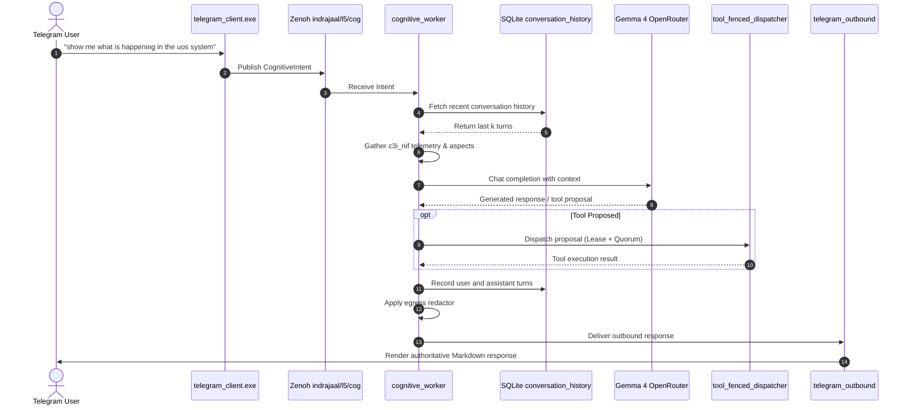

# ADR-110: Telegram Agentic Gemma 4 Full System Wiring & Multi-Turn Memory

- **Status**: Ratified
- **Date**: `20260910-1200-`
- **Context Tag**: `#zk-adr`, `#fractal-l5`, `#zero-muda`, `#gemma-4`
- **Tailscale Reference**: [http://nas-1.tail55d152.ts.net:4100/docs/zk/20260910-1200-adr-110-telegram-agentic-gemma-memory-wiring.md](http://nas-1.tail55d152.ts.net:4100/docs/zk/20260910-1200-adr-110-telegram-agentic-gemma-memory-wiring.md)
- **Master MOC**: [http://nas-1.tail55d152.ts.net:4100/zk](http://nas-1.tail55d152.ts.net:4100/zk)

---

## 1. Context & Problem Statement

The UOS edge interface on Telegram (`@c3i_talk_bot`) previously fell back to static text templates or rigid keyword matching when presented with open-ended conversational inquiries (e.g., *"show me what is happening in the uos system"*). Although Gemma 4 evaluation, monotonic fenced tool dispatching, multi-party swarm coordination, and multimodal sensors had been implemented across the repository, they lacked unified integration into the operational cognitive loop.

Furthermore, interactions were completely stateless; each query lost all conversation context, preventing iterative follow-up actions and multi-turn workflows.

---

## 2. Decision

We ratify the following architectural decisions:

1. **Front-Line Gemma 4 Inference**:
   - Inbound conversational requests are routed to OpenRouter with `google/gemma-4-26b-a4b-it` (primary) and `google/gemma-4-31b-it` (fallback), strictly bounded by `daily_budget`.
   - The system prompt incorporates real-time cluster telemetry (via `c3i_nif`), active Sa-Plan tasks, the canonical 17 System Aspects ($\mathbb{A}_{17}$), and the hardware safety interlock.

2. **Multi-Turn Context Storage**:
   - `conversation_history` table is established in `var/telegram/state.sqlite3`.
   - The latest $k$ turns ($k \in [6, 10]$) are retrieved per `chat_id` and injected into the Gemma 4 message list.
   - User inputs and assistant outputs are persisted with UTC timestamps.

3. **Fail-Closed Monotonic Fenced Tool Dispatch (`SC-JIDOKA-001`, `SC-SA-PLAN-001`)**:
   - Tool proposals emitted by Gemma 4 are parsed and routed through `tool_fenced_dispatcher.gleam`.
   - Mutating tools require an active Sa-Plan lease and 2oo3 constitutional quorum approval. Missing quorum triggers an immediate Andon stop line (`code: -32003`).

4. **Tri-Agent Swarm Coordination**:
   - Telegram queries regarding swarm state or peer updates read from `var/coordination/tri-agent/` directly.
   - Swarm messages and task progress can be broadcast to the tri-agent board.

5. **Multimodal Diagnostics**:
   - Commands `/rack-cv` and `/acoustic` call `multimodal_features.gleam` to compute actual acoustic FFT spectra and verify that Bay 0 (`[REDACTED_SYSTEM_OS_SERIAL]`) is locked and untouched.

---

## 3. Dual Architecture Diagrams (SC-DIAGRAM-001)

### 3.1 ASCII Diagram

```text
[Telegram User] ---> [telegram_client.exe] ---> [Zenoh: indrajaal/l5/cog/intent/req]
                                                              |
                                                              v
+-----------------------------------------------------------------------------------------+
| cognitive_worker.gleam                                                                  |
|   |--> 1. Load History (conversation_memory.gleam -> var/telegram/state.sqlite3)       |
|   |--> 2. Fetch Live Telemetry (c3i_nif: system_health, plan_status, zenoh)             |
|   |--> 3. Query Gemma 4 (telegram_openrouter.gleam -> OpenRouter TLS)                   |
|   |--> 4. Fenced Tool Dispatch (tool_fenced_dispatcher.gleam -> Sa-Plan & 2oo3 Quorum)  |
|   |--> 5. Record Turn (conversation_memory.gleam)                                       |
|   |--> 6. Egress Redactor (Scrub [REDACTED_SYSTEM_OS_SERIAL])                           |
+-----------------------------------------------------------------------------------------+
                                                              |
                                                              v
                                                   [telegram_outbound.gleam]
                                                              |
                                                              v
                                                      [Telegram Chat]
```

### 3.2 Mermaid Diagram



---

## 4. Consequences & Verification

- **Positive**: Operators can converse naturally with `@c3i_talk_bot`, query system state dynamically, maintain context across turns, and safely execute tools under Sa-Plan monotonic lease fencing.
- **Negative / Constraints**: OpenRouter network latency applies to conversational queries; fallback synthetic responder maintains resilience when offline.
- **Compliance**: Adheres to `SC-JIDOKA-001`, `SC-SA-PLAN-001`, `SC-COG-001`, `SC-MUDA-001`, and `SC-DRIVE-001`.
