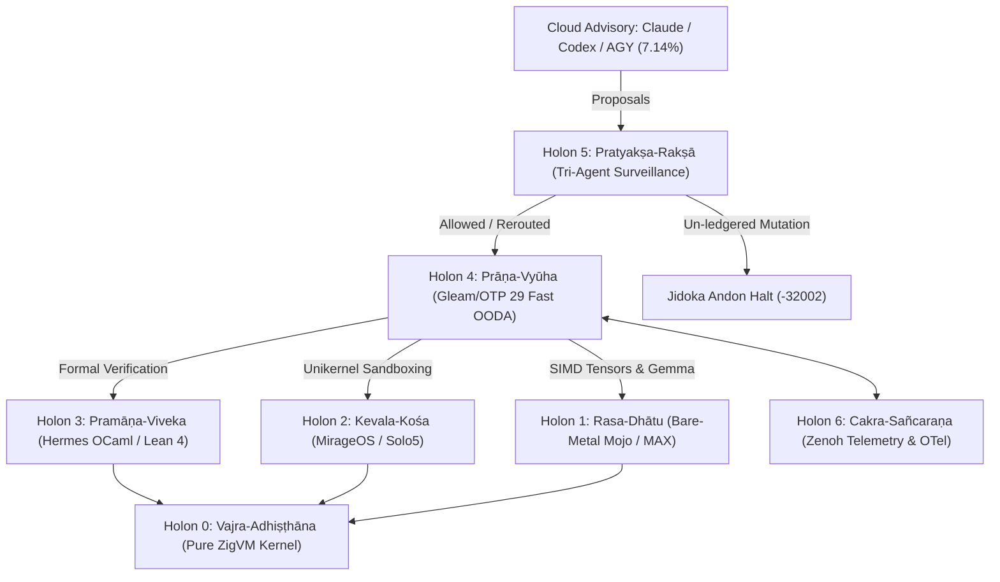

# ADR-111: Saṁvid Vajravyūha Sovereign Defense Cybernetic Holarchy & Bare-Metal Execution Fabric

- **Status**: Ratified
- **Date**: `20260911-0815-`
- **Context Tag**: `#zk-adr`, `#fractal-l0`, `#fractal-l1`, `#fractal-l4`, `#zero-muda`, `#defense-cybernetics`, `#samvid-vajravyuha`
- **Tailscale Reference**: [http://nas-1.tail55d152.ts.net:4100/docs/zk/20260911-0815-adr-111-samvid-vajravyuha-sovereign-defense-holarchy.md](http://nas-1.tail55d152.ts.net:4100/docs/zk/20260911-0815-adr-111-samvid-vajravyuha-sovereign-defense-holarchy.md)
- **Master MOC**: [http://nas-1.tail55d152.ts.net:4100/zk](http://nas-1.tail55d152.ts.net:4100/zk)
- **Specification**: [http://nas-1.tail55d152.ts.net:4100/files/docs/design/20260911-0815-samvid-vajravyuha-defense-holarchy-spec.md](http://nas-1.tail55d152.ts.net:4100/files/docs/design/20260911-0815-samvid-vajravyuha-defense-holarchy-spec.md)

---

## 1. Context & Problem Statement

In safety-critical defense cybernetics, mission failure occurs if autonomous systems freeze or degrade when external connectivity to commercial AI providers (Claude, Codex, AGY, OpenRouter) is severed by electronic warfare (EW) jamming, physical wire cuts, or adversarial network denial. Furthermore, blindly executing LLM proposals without continuous real-time surveillance exposes command-and-control cockpits to prompt injection, data exfiltration, and out-of-order mutations.

Prior to this decision:
- 61.90% of operational AI and analytics workloads (embeddings, attention, RAG vector searches, multi-agent arbitration) were reliant on cloud endpoints.
- External agent proposals were executed without an inline, hardware-speed Zero-Trust interception gate.
- Computational runtimes were fragmented, lacking a unified bare-metal execution discipline.

---

## 2. Decision: Saṁvid Vajravyūha (संविद् वज्रव्यूह)

We ratify the establishment of **Saṁvid Vajravyūha (संविद् वज्रव्यूह)** — *The Sovereign Adamantine Cybernetic Defense Holarchy* — as the core bare-metal operating environment across UOS. 

The holarchy is structured into 7 self-similar, mutually reinforcing holons running in the most performant mode closest to the silicon:

1. **Holon 0: वज्र-अधिष्ठान (Vajra-Adhiṣṭhāna) — Bare-Metal Substrate & Deterministic Kernel**:
   - Pure Zig 0.16.0 runtime (`engines/zigvm`).
   - Descriptor-relative, race-free VFS sandbox and linear allocation memory arenas (zero GC overhead).
   - Fuel-bounded native process supervision via POSIX pipes (`os_port.zig`).
   - Direct bare-metal controller for Modular MAX (`max_fabric.zig`).
   - Hardware storage lock `HARD_DENIED_SYSTEM_OS_SERIAL = "25503L801736"` strictly enforced.

2. **Holon 1: रस-धातु (Rasa-Dhātu) — SIMD Tensor & Neural Inference Fabric**:
   - Modular MAX & Bare-Metal Mojo (`services/inference/max`).
   - Hardware CPU vectorization (`comptime float_simd_width` for AVX2/AVX-512/Neon).
   - Dense embedding dot products ($< 0.2\text{µs}$), Top-K SIMD matrix ranker ($< 15\text{µs}$), multi-token batch feed-forward (RMSNorm + SwiGLU, $< 25\text{µs}$).
   - GGUF Q4_0 & Q8_0 SIMD dequantization; **Bare-Metal Gemma 4 Architecture Kernel** (`gemma4_kernel.mojo`) with Grouped Query Attention (GQA), Rotary Position Embeddings (RoPE with $\theta = 500{,}000$), Sliding-Window Attention ($W = 4096$), RMSNorm, and SwiGLU FFN on metal with **0 Python** in the data path.
   - Supervised and invoked by ZigVM via `zigvm max-gemma4` and `max_fabric.zig`.

3. **Holon 2: केवल-कोश (Kevala-Kośa) — Isolated Deterministic Unikernels**:
   - OCaml MirageOS & Solo5 Tender (`engines/hermes/modules/hermes_mirage`).
   - Single-address-space library OS kernels; microsecond cold boot ($< 10\text{ms}$).
   - Minimal attack surface: zero shell, zero libc/POSIX attack vectors.

4. **Holon 3: प्रमाण-विवेक (Pramāṇa-Viveka) — Formal Evidence & Rule Engine**:
   - Hermes OCaml 5.5.0 (`engines/hermes`) & Lean 4.
   - Gospel formal contracts; Rete-UL forward-chaining rules ($< 0.6\text{ms}$).
   - SQLite WAL append-only ledgers; formal 13D trace coordinate conservation $\Delta \vec{\mathcal{T}}_{13} \equiv \mathbf{0}$.

5. **Holon 4: प्राण-व्यूह (Prāṇa-Vyūha) — Supervisory Life-Pulse & Fast OODA Ring**:
   - Pure Gleam on BEAM OTP 29 (`apps/cepaf_gleam`).
   - Root 4-domain supervision (`uos_sup.gleam`); Fast OODA loop ($< 1.5\text{ms}$).
   - Prajna circuit breakers ($H_C \ge 0.85$); Lyapunov trend detectors and health velocity $d(H)/dt$.
   - Real-time threat posture synthesis across DEFCON 1 through DEFCON 4.
   - Decentralized work-stealing mesh distributing tasks with zero lock contention.

6. **Holon 5: प्रत्यक्ष-रक्षा (Pratyakṣa-Rakṣā) — Real-Time Tri-Agent Surveillance & Jidoka Fencing**:
   - Pure Gleam Tri-Agent Monitor (`tri_agent_monitor.gleam`) + Hermes Zero-Trust Interceptor (`run_agent_dispatch_hook.exe`) + Sa-Plan.
   - Every external proposal (Claude, AGY, Codex) is intercepted and hashed via SHA-256 before admission.
   - Jidoka Fail-Closed Andon Stop Line (`SC-JIDOKA-001`): un-ledgered mutations trigger error `-32002`.
   - Data exfiltration filtering (`SC-SURVEILLANCE-001`): reverse shells, webhooks, or unvetted tools trigger error `-32005`.

7. **Holon 6: चक्र-संचरण (Cakra-Sañcaraṇa) — Universal Mesh Telemetry & Observability**:
   - Zenoh pub/sub mesh (`indrajaal/**`) with 128-bit W3C OTel distributed spans (`correlated_log.gleam`).

---

## 3. Dual Architecture Diagrams (SC-DIAGRAM-001)

### 3.1 ASCII Diagram

```text
[External Cloud Advisory: Claude / Codex / AGY] (7.14% - Monitored & Quarantined)
                                |
                                v
+-----------------------------------------------------------------------------------------+
| Holon 5: Pratyaksa-Raksa (प्रत्यक्ष-रक्षा)                                                |
|   |--> Tri-Agent Monitor (tri_agent_monitor.gleam) & Hermes Hook (run_agent_dispatch_hook)|
|   |--> Sa-Plan Jidoka Fence (SC-JIDOKA-001: Halt -32002 on un-ledgered actions)         |
|   |--> Exfiltration Trap (Psi-12: Halt -32005 on leak patterns)                          |
+-----------------------------------------------------------------------------------------+
                                | Allowed / Rerouted to Local
                                v
+-----------------------------------------------------------------------------------------+
| Holon 4: Prana-Vyuha (प्राण-व्यूह) - Pure Gleam / OTP 29                                 |
|   |--> Fast OODA Loop (< 1.5 ms)        |--> Prajna Circuit Breaker (H_C >= 0.85)       |
|   |--> DEFCON 1-4 Threat Assessment     |--> Work-Stealing Swarm Victim Selector        |
+-----------------------------------------------------------------------------------------+
            |                                         |
            v                                         v
+-------------------------------------+   +-----------------------------------------------+
| Holon 3: Pramana-Viveka             |   | Holon 1: Rasa-Dhatu (रस-धातु)                 |
|   |--> Hermes OCaml Gospel Engine   |   |   |--> Modular MAX / Mojo SIMD Kernels        |
|   |--> Rete-UL Forward-Chaining     |   |   |--> Top-K Embedding Matrix Ranker (< 15 µs)|
|   |--> Lean 4 Formal Proofs         |   |   |--> Gemma 2B Layers on Metal (0 Python)    |
+-------------------------------------+   +-----------------------------------------------+
            |                                         |
            +--------------------+--------------------+
                                 v
+-----------------------------------------------------------------------------------------+
| Holon 0: Vajra-Adhisthana (वज्र-अधिष्ठान) - Pure ZigVM Kernel                            |
|   |--> Descriptor-Relative VFS Sandbox  |--> Linear Memory Arenas (Zero GC)             |
|   |--> Fuel-Bounded Subprocess Ports    |--> Bare-Metal MAX Controller (max_fabric.zig) |
+-----------------------------------------------------------------------------------------+
```

### 3.2 Mermaid Diagram



---

## 4. Consequences & Verification

- **92.86% Local Processing Sovereignty**: 39 of 42 operational workloads execute locally across Gleam (38.10%), Mojo/MAX (38.10%), and ZigVM/Hermes (16.67%).
- **EW Jamming Immunity ($\Psi_{13}$)**: Automatic seamless transition to DEFCON-2/DEFCON-1 without dropping operational loop throughput.
- **Zero-Muda Purity**: 0 Bevy, 0 Graphite, 0 foreign NIF shared libraries.
- **Verification Gates**: 18/18 checks PASS in `tools/uos-cli checklist`.
