# ADR-115: SC-JOURNAL-v3: Anticipatory Epistemic Ledger Architecture & 7-Engine Verification Framework

- **Status**: Ratified
- **Date**: `20260912-0745-`
- **Context Tag**: `#zk-adr`, `#fractal-l0`, `#fractal-l1`, `#fractal-l2`, `#fractal-l3`, `#fractal-l4`, `#fractal-l5`, `#fractal-l6`, `#fractal-l7`, `#zero-muda`, `#km-triad`, `#stamp-stpa`
- **Tailscale Reference**: [http://nas-1.tail55d152.ts.net:4100/docs/zk/20260912-0745-adr-115-sc-journal-v3-anticipatory-epistemic-ledger.md](http://nas-1.tail55d152.ts.net:4100/docs/zk/20260912-0745-adr-115-sc-journal-v3-anticipatory-epistemic-ledger.md)
- **Master MOC**: [http://nas-1.tail55d152.ts.net:4100/zk](http://nas-1.tail55d152.ts.net:4100/zk)
- **Contract**: [http://nas-1.tail55d152.ts.net:4100/files/contracts/rules/20260912-0745-sc-journal-v3-anticipatory-contract.md](http://nas-1.tail55d152.ts.net:4100/files/contracts/rules/20260912-0745-sc-journal-v3-anticipatory-contract.md)
- **Specification**: [http://nas-1.tail55d152.ts.net:4100/files/docs/design/20260912-0745-sc-journal-v3-anticipatory-spec.md](http://nas-1.tail55d152.ts.net:4100/files/docs/design/20260912-0745-sc-journal-v3-anticipatory-spec.md)

---

## 1. Context & Epistemic Dilemma

Engineering task completion journals (`SC-JOURNAL`) have historically documented work after the fact. While the 13 canonical sections provided structural rigor, post-hoc narrative reporting suffered from three systemic epistemic vulnerabilities:
1. **Confirmation & Hindsight Bias**: Diagnoses in Section 4 often focused on a single preferred explanation, ignoring competing root causes.
2. **Uncalibrated Evidence Confidence**: Test claims in Section 7 lacked uniform credibility standards, allowing self-attested model claims to masquerade as verified facts.
3. **Absence of Predictive Feedback**: Once a journal was filed, its conclusions were rarely tied to measurable forward-looking predictions, eliminating the feedback loop required for continuous swarm learning.

---

## 2. Decision: The Anticipatory Epistemic Ledger (SC-JOURNAL-v3)

We ratify **SC-JOURNAL-v3**, transforming the completion journal into an **Anticipatory Epistemic Ledger** governed by a **7-Engine Verification Architecture**:

```text
+-----------------------------------------------------------------------------------+
|                        SC-JOURNAL-v3 7-ENGINE ARCHITECTURE                        |
+-----------------------------------------------------------------------------------+
|                                                                                   |
|  [1. Scope & Trigger]       ──> [5. Formal Gateways: Lean 4 / Z3 / Gospel]        |
|  [2. Pre-State Assessment]  ──> [7. Predictive View: Kalman / Lyapunov / Brier]   |
|  [3. Execution Detail]      ──> [6. Rete-UL Production Invariant Network]         |
|  [4. Root Cause Analysis]   ──> [1. ACH Competing Hypotheses Disconfirmation]     |
|  [5. Fix Taxonomy]          ──> [6. Rete-UL Fix Alignment Rule]                   |
|  [6. Patterns / Anti-Pat]   ──> [4. Devil's Advocate & Red Team Falsification]    |
|  [7. Verification Matrix]   ──> [2. Admiralty System: NATO STANAG 2017 >= B2]     |
|  [8. Files Modified]        ──> [6. Jujutsu Standalone Clean Diff Gate]           |
|  [9. Architectural Obs]     ──> [5. Sheaf-Presheaf & Category Consistency]       |
|  [10. Remaining Gaps]       ──> [4. Unmitigated Failure Mode Residuals]          |
|  [11. Metrics Summary]      ──> [3. Bayesian Update & Half-Life Trust Decay]      |
|  [12. STAMP Alignment]      ──> [6. Control Loop & UCA Hazard Conservation]       |
|  [13. Conclusion]           ──> [7. Precommitted Forecasts & Calibration]         |
|                                                                                   |
+-----------------------------------------------------------------------------------+
```

```mermaid
graph TD
    subgraph S13["SC-JOURNAL-v3 13-Section Backbone"]
        S1["1. Scope & Trigger"]
        S2["2. Pre-State Assessment"]
        S3["3. Execution Detail"]
        S4["4. Root Cause Analysis"]
        S5["5. Fix Taxonomy"]
        S6["6. Patterns & Anti-Patterns"]
        S7["7. Verification Matrix"]
        S8["8. Files Modified"]
        S9["9. Architectural Obs"]
        S10["10. Remaining Gaps"]
        S11["11. Metrics Summary"]
        S12["12. STAMP Alignment"]
        S13C["13. Conclusion & Forecast"]
    end

    subgraph E7["The 7 Verification Engines"]
        E1["Engine 1: ACH Matrix"]
        E2["Engine 2: Admiralty Protocol (>=B2)"]
        E3["Engine 3: Bayesian Half-Life Decay"]
        E4["Engine 4: Devil's Advocate Red Team"]
        E5["Engine 5: Formal Lean 4 / Z3 / Gospel"]
        E6["Engine 6: Rete-UL Invariant Rules"]
        E7E["Engine 7: Predictive Kalman & Brier"]
    end

    S4 --> E1
    S7 --> E2
    S11 --> E3
    S6 --> E4
    S10 --> E4
    S1 --> E5
    S9 --> E5
    S3 --> E6
    S5 --> E6
    S12 --> E6
    S2 --> E7E
    S13C --> E7E
```



### 2.1 The 7 Verification Engines

1. **Engine 1: Analysis of Competing Hypotheses (ACH)**:
   - Evaluates competing explanations in Section 4 using Popperian disconfirmation scoring $R(H_j) = \sum \mathbb{I}(L < 0) |L| W(E_i)$.
2. **Engine 2: NATO STANAG 2017 Admiralty Protocol**:
   - Enforces an evidence admissibility threshold $\ge \text{B2}$ for Section 7 passing rows. Model self-attestations ($E3/F6$) are inadmissible for admission.
3. **Engine 3: Bayesian Belief Updating with Half-Life Decay**:
   - Computes posterior parameter trust $\theta \sim \text{Beta}(\alpha, \beta)$ and applies exponential temporal decay $\tau_{1/2}$.
4. **Engine 4: Devil's Advocate & Red Team Falsification**:
   - Injects mandatory failure mode probes and counter-factual analysis into Sections 6 and 10.
5. **Engine 5: Formal Verification & Invariant Conservation**:
   - Enforces coordinate conservation $\Delta \vec{\mathcal{T}}_{13} \equiv \mathbf{0}$ and Gospel contract conformance.
6. **Engine 6: Rete-UL Invariant Production Network**:
   - Cross-evaluates all 13 sections for structural completeness and logical alignment.
7. **Engine 7: Predictive & Forecasting Dynamics**:
   - Embeds precommitted Brier-scored prognostications ($B \le 0.10$), Kalman innovation tracking, and Lyapunov energy derivatives ($\dot{V}(t) < 0$).

---

## 3. Tooling & Enforcement

- **Automated Linter**: Native compiled OCaml binary `tools/journal_linter` and bash wrapper `tools/journal-check`.
- **Gleam CLI Integration**: `tools/uos-cli journal-check <path>` and `tools/uos-cli gate G-JOURNAL`.
- **Storage Safety**: Hardware NVMe serial `[REDACTED_SYSTEM_OS_SERIAL]` enforced via automated regex scan.
- **Diagram Parity**: Mandatory editable ASCII and Mermaid source pair for all diagrams (`SC-DIAGRAM-001`).

---

## 4. Consequences & Impact

- **Epistemic Rigor**: Eliminates retroactive rationalization and holds agents accountable for falsifiable predictions.
- **Fail-Closed Safety**: Incomplete sections, low-grade evidence ($< B2$), or unredacted hardware serials immediately halt task admission.
- **Sovereign Triad Consensus**: Ratified jointly by Codex GPT 6 Astra (implementation), Claude Fable 5.1 (formal/review), and Antigravity AGY (cockpit/telemetry).
