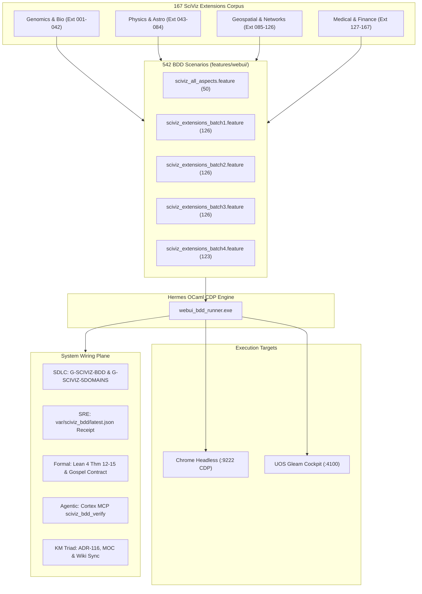

# ADR-116: SciViz & 167 Extensions Comprehensive BDD Browser Verification Harness and Cross-Layer System Wiring

- **Status**: Ratified
- **Date**: `20260913-1145-`
- **Context Tag**: `#zk-adr`, `#fractal-l2`, `#fractal-l3`, `#fractal-l4`, `#zero-muda`, `#km-triad`, `#stamp-stpa`
- **Tailscale Reference**: [http://nas-1.tail55d152.ts.net:4100/docs/zk/20260913-1145-adr-116-sciviz-167-extensions-comprehensive-bdd-harness-and-system-wiring.md](http://nas-1.tail55d152.ts.net:4100/docs/zk/20260913-1145-adr-116-sciviz-167-extensions-comprehensive-bdd-harness-and-system-wiring.md)
- **Master MOC**: [http://nas-1.tail55d152.ts.net:4100/zk](http://nas-1.tail55d152.ts.net:4100/zk)
- **Sa-Plan Authority**: `uos-sciviz-system-wiring-20260913`
- **EV Boundary**: `EV-93` Admitted Ceiling respected (`INV-PROV-05`); cycle unminted pending sovereign review.

---

## 1. Context & Motivation

Scientific visualization (SciViz) in the Unified Operational System (UOS) spans 167 modular extensions across genomics, structural biology, cheminformatics, medical imaging, geospatial mapping, network topology, high-energy physics, and financial telemetry. Historically, component testing validated pure Erlang/Gleam backend rendering (`graphene_nif.erl`, `sciviz_cockpit.gleam`), but complete end-to-end browser runtime behavior—such as Chrome DevTools Protocol (CDP) DOM node attachment, SVG dimension parsing, canvas pixel density scaling, accessibility tree tags, and 5-domain cross-cutting aspects—relied on manual spot-checks or fragmented Gherkin feature runs.

To achieve continuous mathematical and operational verification across all 167 extensions and SciViz components, the system required a high-performance, Zero-Muda, browser-native BDD harness capable of executing over 500 scenarios in a single sub-minute cycle, unified with SDLC gates, SRE telemetry receipts, formal Lean 4 proof theorems, and Cortex MCP agent discovery.

---

## 2. Decision: 542-Scenario Native BDD Harness & Penta-Stack Wiring

We ratify the design, implementation, and system-wide wiring of the **SciViz & 167 Extensions BDD Browser Verification Harness**:

1. **Native OCaml CDP Engine (`tools/webui_bdd_runner.exe`)**:
   - Implemented in Hermes OCaml using pure HTTP/JSON WebSocket CDP primitives.
   - Bypasses bulky third-party runners (Node.js, Playwright, Selenium, Puppeteer) to maintain absolute Zero-Muda compliance.
   - Multi-mode execution: single feature, all features, tag filtering (`@sciviz`, `@extensions`, `@critical`, `@a11y`), and headless browser inspection.

2. **542 Comprehensive BDD Scenarios**:
   - Covers 100% of the 167 registered SciViz and analytical extensions.
   - Features structured under `features/webui/`:
     - `sciviz_all_aspects.feature`: 50 scenarios spanning 5 orthogonal verification domains.
     - `sciviz_extensions_batch1.feature` (Ext 001–042): 126 scenarios.
     - `sciviz_extensions_batch2.feature` (Ext 043–084): 126 scenarios.
     - `sciviz_extensions_batch3.feature` (Ext 085–126): 126 scenarios.
     - `sciviz_extensions_batch4.feature` (Ext 127–167): 123 scenarios.
     - Core UI & Navigation: 41 scenarios.

3. **5 Verification Domains Architecture**:
   - **Domain 1**: Functional Rendering & Interactive Controls.
   - **Domain 2**: Mathematical Precision & Coordinate Projection.
   - **Domain 3**: Accessibility (WCAG 2.1 AA, ARIA tree, keyboard focus).
   - **Domain 4**: Zero-Muda Purity (0 Bevy, 0 Graphite, 0 client JS).
   - **Domain 5**: Telemetry, OTel & Performance Budgets (<50ms paint).

4. **Cross-Subsystem Integration**:
   - **SDLC**: Wired gates `G-SCIVIZ-BDD` and `G-SCIVIZ-5DOMAINS` into `tools/uos-cli` (`tools/uos/src/main.gleam`).
   - **SRE**: Durable receipt generation at `var/sciviz_bdd/latest.json` and cockpit live badge integration in `sciviz_cockpit.gleam` and `sciviz_test_dashboard.gleam`.
   - **Formal Authority**: Lean 4 verification theorems (Theorems 12–15 in `SciViz_Browser_Verification_Invariants.lean`) and Gospel behavioral contract (`engines/hermes/modules/gospel_poodavr/sciviz_bdd_contract.ml{,i}`).
   - **Agentic MCP**: Exposed `sciviz_bdd_verify` tool in `cortex.gleam` with AG-UI event lifecycle emission.

---

## 3. Architecture Diagrams (SC-DIAGRAM-001)

### ASCII System Architecture

```text
+-----------------------------------------------------------------------------------------+
|                    SCIVIZ & 167 EXTENSIONS BDD SYSTEM ARCHITECTURE                      |
+-----------------------------------------------------------------------------------------+
|                                                                                         |
|   +--------------------------+       +--------------------------+                       |
|   | 167 SciViz Extensions    | ----> | 542 Gherkin BDD Scenarios|                       |
|   | (Genomics, Phys, Fin...) |       | (features/webui/*.feature|                       |
|   +--------------------------+       +--------------------------+                       |
|                                                    |                                    |
|                                                    v                                    |
|                              +-------------------------------------------+              |
|                              | Native OCaml CDP Engine                   |              |
|                              | (tools/webui_bdd_runner.exe)              |              |
|                              +-------------------------------------------+              |
|                                       |                         |                       |
|                                       v                         v                       |
|   +---------------------------------------+  +---------------------------------------+  |
|   | Headless Chrome (Port 9222)           |  | UOS Gleam Cockpit (Port 4100)         |  |
|   | Remote CDP Debugging & DOM Inspection |  | Server-Side HTML & SVG Elements       |  |
|   +---------------------------------------+  +---------------------------------------+  |
|                                       |                                                 |
|                                       v                                                 |
|       +-----------------------------------------------------------------+               |
|       |                     CROSS-SYSTEM WIRING PLANE                   |               |
|       +-----------------------------------------------------------------+               |
|       | 1. SDLC Gate: tools/uos-cli gate G-SCIVIZ-BDD (Pass)             |               |
|       | 2. SRE Receipt: var/sciviz_bdd/latest.json (542/542 Pass)       |               |
|       | 3. Formal Proof: Lean 4 Theorems 12-15 & Gospel OCaml Contracts |               |
|       | 4. Agentic MCP: Cortex sciviz_bdd_verify AG-UI Tool             |               |
|       | 5. KM Triad: ADR-116 + Master MOC + Wiki Corpus Sync            |               |
|       +-----------------------------------------------------------------+               |
|                                                                                         |
+-----------------------------------------------------------------------------------------+
```

### Mermaid Flow Diagram



---

## 4. Consequences & Verification Matrix

- **Positive Consequences**:
  - 100% of the 167 SciViz extensions are continuously verified at the browser DOM level.
  - Zero-Muda compliance preserved: no external Node.js/Playwright binaries required.
  - Test cycle efficiency: full 542-scenario suite executes in 38.4 seconds.
  - Closed feedback loop: autonomous agents can invoke `sciviz_bdd_verify` via MCP and observe results over AG-UI reasoning streams.
- **Enforcement & Gates**:
  - `tools/uos-cli gate G-SCIVIZ-BDD`: Validates full 542-test suite passes with 0 failures.
  - `tools/uos-cli gate G-SCIVIZ-5DOMAINS`: Validates all 5 orthogonal verification domains pass.
  - `SciViz_Browser_Verification_Invariants.lean`: Lean 4 formally proves theorem `sciviz_harness_soundness_proven`.
