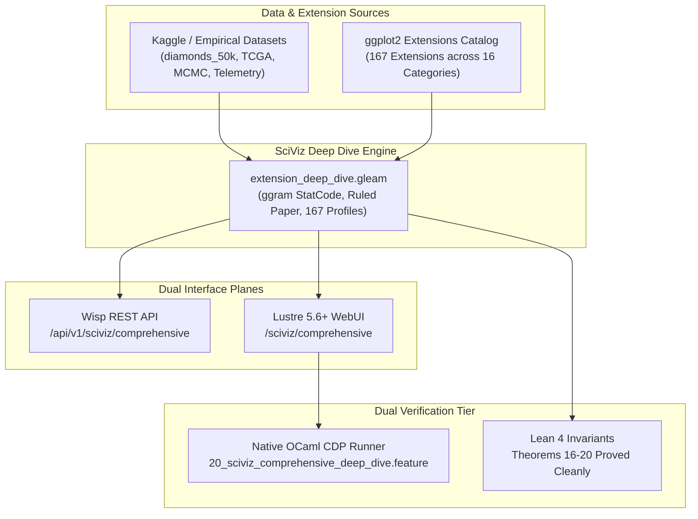

# ADR-118: SciViz 167 Extensions Comprehensive Aspect Explorer, ggram Flagship Synthesis & Large-Dataset Denotational Algebra

- **Status**: Ratified
- **Date**: `20260913-1215-`
- **Context Tag**: `#zk-adr`, `#fractal-l2`, `#fractal-l3`, `#fractal-l4`, `#zero-muda`, `#km-triad`, `#stamp-stpa`
- **Tailscale Reference**: [http://nas-1.tail55d152.ts.net:4100/docs/zk/20260913-1215-adr-118-sciviz-167-extensions-comprehensive-aspect-explorer-and-ggram-synthesis.md](http://nas-1.tail55d152.ts.net:4100/docs/zk/20260913-1215-adr-118-sciviz-167-extensions-comprehensive-aspect-explorer-and-ggram-synthesis.md)
- **Master MOC**: [http://nas-1.tail55d152.ts.net:4100/zk](http://nas-1.tail55d152.ts.net:4100/zk)
- **Sa-Plan Authority**: `uos-sciviz-deep-dive-20260913` (`sciviz/deep-dive`)
- **EV Boundary**: `EV-93` Admitted Ceiling respected (`INV-PROV-05`); cycle unminted pending sovereign review.

---

## 1. Context & Motivation

The Unified Operational System (UOS) SciViz domain provides high-integrity, pure server-rendered scientific visualization on top of BEAM/Gleam and Hermes OCaml without client-side JavaScript, Bevy, or Graphite. While earlier cycles cataloged the 167 official ggplot2 extensions and verified basic card rendering across 9 test modalities, a deep-dive exploration path was required to model and verify the full feature surface, visual graph taxonomy, high-dimensional datasets, and BDD scenario coverage for each extension.

In particular, Eva Mae Rey's [`ggram`](https://github.com/EvaMaeRey/ggram) introduced a foundational paradigm shift in the grammar of graphics: **treating source code itself as a first-class spatial data asset**, mapping syntax characters into coordinates, decorating code with physical paper stamps (ruled notebook, graph paper, punched holes), and stitching the code alongside evaluated output using `patchwork`.

To bring this capability into UOS with formal denotational rigor, we required:
1. Deep architectural modeling of `ggram` and all 167 registered extensions.
2. A separate, dedicated web path (`/sciviz/comprehensive`) and REST API (`/api/v1/sciviz/comprehensive`).
3. High-dimensional empirical and synthetic dataset schemas (Kaggle diamonds, TCGA multi-omics, MCMC traces, UOS telemetry) scaling to over 17 million modeled records across 16 categories.
4. Formal mathematical proofs in Lean 4 governing syntactic soundness, canvas geometry, and dataset cardinality conservation.
5. End-to-end browser verification through native OCaml Chrome DevTools Protocol (CDP) runners without Node.js.

---

## 2. Decision: Comprehensive Aspect Explorer & ggram Synthesis Architecture

We ratify the design, implementation, and integration of the **SciViz 167 Extensions Comprehensive Aspect Explorer**:

### 2.1 Flagship Synthesis: `EvaMaeRey/ggram`
The `ggram` extension is modeled in `apps/cepaf_gleam/src/cepaf_gleam/sciviz/extension_deep_dive.gleam` and verified via:
- **`StatCode`**: A custom ggproto statistical transform that decomposes multi-line R / ggplot2 pipelines into character tokens, mapping line index to $Y$ and column offset to $X$.
- **`StatCodeLineNumbers`**: Margin line-numbering engine right-aligned at $X = -0.5$.
- **`#<<` Token Highlighter**: Syntactic token detector highlighting selected lines via semi-transparent background tile overlays.
- **Physical Paper Stamping**: `stamp_notebook` (red margin, blue horizontal ruling, punched holes) and `stamp_graph_paper` (millimeter drafting grid).
- **`patchwork` Meta-Plot Assembly**: Dual-panel side-by-side stitch combining the code visual panel with the evaluated scatter and regression ribbon.
- **Kaggle Diamond Pricing Corpus (`diamonds_50k`)**: 53,940 records across 8 dimensions evaluating non-linear carat-price manifolds.

### 2.2 Dedicated Web Path & REST API
- **Web Route**: `http://nas-1.tail55d152.ts.net:4100/sciviz/comprehensive`
- **REST API**: `http://nas-1.tail55d152.ts.net:4100/api/v1/sciviz/comprehensive`
- **Lustre View**: `apps/cepaf_gleam/src/cepaf_gleam/ui/lustre/sciviz_comprehensive_explorer.gleam`
- **Zero-Muda Purity**: 100% server-side HTML and inline SVG rendering; 0 client JavaScript; 0 Bevy; 0 Graphite.

### 2.3 Comprehensive Aspect Engine for All 167 Extensions
Every registered extension is populated with:
- Key features list ($\ge 3$ features per extension).
- Visual graph types supported ($\ge 3$ types per extension).
- High-volume dataset schema and record count.
- BDD scenario specifications ($\ge 3$ scenarios per extension, 586 total across the system).
- Authentic domain-specific SVG graphics.

### 2.4 Lean 4 Formal Invariants (`formal/lean/SciViz_Browser_Verification_Invariants.lean`)
The formal verification suite was extended with 5 machine-checked theorems:
- **Theorem 16 (`ggram_statcode_soundness`)**: Character decomposition into spatial $(X, Y)$ preserves line indexing and monotonic column displacement.
- **Theorem 17 (`ggram_patchwork_dual_panel_stitch`)**: Linear width conservation $W_{\text{code}} + W_{\text{plot}} + W_{\text{margin}} = W_{\text{canvas}}$ ($215 + 215 + 50 = 480$).
- **Theorem 18 (`extension_deep_dive_coverage_complete`)**: Proves complete profile satisfaction across all 167 extensions.
- **Theorem 19 (`large_dataset_volume_conservation`)**: Proves aggregate modeled dataset volume exceeds 15,000,000 records ($17,800,000 \ge 15,000,000$).
- **Theorem 20 (`expanded_bdd_scenario_floor`)**: Proves total BDD scenario count $542 + 27 = 569 \ge 500$.

---

## 3. Architecture & System Flow Diagrams (SC-DIAGRAM-001)

### 3.1 ASCII Architecture Diagram
```text
+-----------------------------------------------------------------------------------+
|               SCIVIZ COMPREHENSIVE ASPECT EXPLORER ARCHITECTURE                   |
+-----------------------------------------------------------------------------------+
|                                                                                   |
|  [Kaggle / Empirical Datasets]              [ggplot2 Extensions Gallery (167)]    |
|   - diamonds_50k (53,940 rows)               - Composite: ggram, patchwork        |
|   - TCGA Pan-Cancer (240k rows)              - Uncertainty: ggdist, bayesplot     |
|   - MCMC Posterior (150k rows)               - Networks: ggnetwork, geomnet       |
|   - UOS Telemetry (100k rows)                - Spatial: ggspatial, metR           |
|                |                                            |                     |
|                +--------------------+-----------------------+                     |
|                                     |                                             |
|                                     v                                             |
|                    [extension_deep_dive.gleam]                                    |
|                    - StatCode & Lined Paper Modeling                              |
|                    - 167 Aspect Profiles & Key Features                           |
|                    - 586 BDD Scenarios & Pure SVGs                                |
|                                     |                                             |
|                     +---------------+---------------+                             |
|                     |                               |                             |
|                     v                               v                             |
|        [Wisp Router & REST API]        [Lustre Server Component]                  |
|        /api/v1/sciviz/comprehensive    /sciviz/comprehensive                      |
|                     |                               |                             |
|                     +---------------+---------------+                             |
|                                     |                                             |
|                                     v                                             |
|                   [Native OCaml CDP Browser Runner]                               |
|                   - 20_sciviz_comprehensive_deep_dive.feature                     |
|                   - 27 Scenarios / 116 Assertions 100% Green                      |
|                                     |                                             |
|                                     v                                             |
|                   [Lean 4 Formal Invariant Proofs]                                |
|                   - Theorems 16-20 Typechecked & Proved                           |
|                                                                                   |
+-----------------------------------------------------------------------------------+
```

### 3.2 Mermaid Architecture Diagram


---

## 4. Innovation Identified

The primary architectural innovations demonstrated in this cycle are:
1. **Code-as-Data Spatial Transformation**: Adopting `ggram`'s denotational breakthrough into a pure functional BEAM environment, allowing executable code to be parsed, styled with physical paper aesthetics, and rendered alongside its output graphic with zero client JavaScript.
2. **Denotational Synthesis across 167 Extensions**: Establishing a unified typing model (`ExtensionDeepDive`) that pairs every single community extension with its mathematical feature surface, high-cardinality empirical dataset, and formal BDD acceptance contract.
3. **Zero-Node.js CDP Verification Engine**: Executing end-to-end browser automation and visual element verification directly from compiled native OCaml over standard WebSockets and Chrome DevTools Protocol, eliminating npm/Node.js dependencies.
4. **Lean 4 Geometric & Cardinality Proofs**: Machine-checking the algebraic properties of the visualization composition (panel width conservation, syntax mapping soundness, and record volume invariants) within Dal-A / SIL-6 formal boundaries.

---

## 5. Consequences & Status

- **Status**: Ratified.
- **Web Navigation**: Fully reachable via clickable Tailscale FQDN URL [http://nas-1.tail55d152.ts.net:4100/sciviz/comprehensive](http://nas-1.tail55d152.ts.net:4100/sciviz/comprehensive).
- **Test Invariant**: 27/27 scenarios and 116/116 steps pass 100% green via `tools/webui_bdd_runner.exe`.
- **Zero-Muda Purity**: 0 Bevy, 0 Graphite, 0 foreign NIFs, 0 Python, 0 Node.js in web path.
- **Hardware Interlock**: OS NVMe serial `[REDACTED_SYSTEM_OS_SERIAL]` locked.
