# The Wiki Pipeline

How a markdown file in this repository becomes a served page, what verifies
that transformation, and which files own each step.

**Scope.** The Zettelkasten wiki: corpus selection, parsing, rendering, the
note graph, serving, and the laws that admit all of it. Adjacent generators
that also emit HTML — dashboards, lint reports, atlas projections, journals —
are covered in §10 only to say what they are *not*, because conflating them
with the wiki is the most common misreading of this subsystem.

**The invariant everything rests on.** The generator is a pure function.
`Docs_wiki.build : (path * markdown) list -> page list` performs no I/O, reads
no globals, and consults no clock. Only its edges touch the world. That is what
makes 758 documents renderable and byte-comparable on every gate run, and it is
why a change to anchor generation moved exactly three documents instead of
drifting silently across the corpus.

---

## 1. End to end

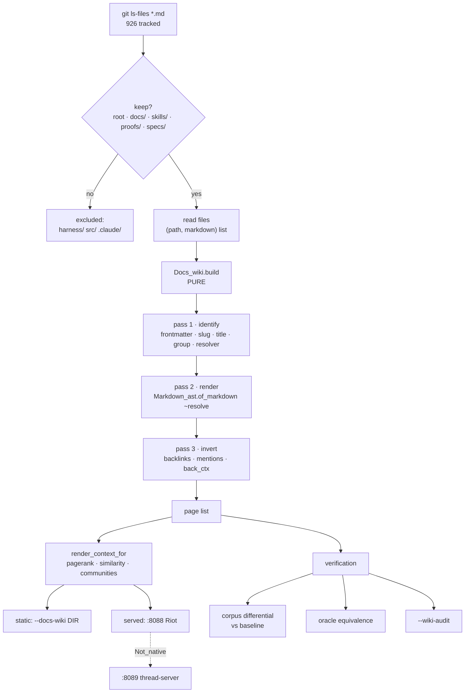

Untracked files are invisible: the corpus comes from `git ls-files`, not a
filesystem walk. A note only becomes a page once it is committed.

---

## 2. File inventory

### Core pipeline

| File | Lines | Role |
| --- | --- | --- |
| `harness/docs_wiki.ml` | 5445 | corpus reduction, `page` record, 30 `render_*` views, search, graph analytics |
| `harness/markdown_ast.ml` | 864 | tokenizer, typed AST, TyXML renderer |
| `harness/slugger.ml` | 90 | stateful anchor disambiguation |
| `harness/journal_markdown_html.ml` | 124 | journal stream parser and publisher |

### Verification

| File | Lines | Role |
| --- | --- | --- |
| `harness/markdown_ast_laws.ml` | 923 | oracle equivalence, quirk scenarios, corpus differential, information laws, locality |
| `harness/docs_wiki_laws.ml` | 271 | page-state invariants |
| `harness/wiki_render_laws.ml` | 346 | render properties |
| `harness/slugger_laws.ml` | 118 | uniqueness, validity, determinism |
| `harness/gen_markdown_baseline.ml` | 226 | baseline builder — **never run by the gate** |
| `harness/render_markdown_file.ml` | 25 | single-file render, developer loop |

### Serving

| File | Lines | Role |
| --- | --- | --- |
| `harness/agent_workers.ml` | 1544 | Riot front on `:8088`, strangler-fig proxy |
| `harness/zigvm_harness.ml` (`--serve`) | — | thread-server backend on `:8089` |

### Supporting modules

`wiki_selfcheck_parallel` · `wiki_sidebar_tree_generator` ·
`wiki_theme_token_injector` · `wiki_content_security_policy_generator` ·
`wiki_cache_poisoning_detector` · `wiki_gate_coupling_prover` ·
`wiki_snippet_executor_validator` · `wiki_benchmark_dashboard` ·
`wiki_pipeline_scale`

### Artifacts

| Path | Role |
| --- | --- |
| `docs/design/markdown-render-baseline.txt` | 758 pinned renders: `<render-digest> <content-digest> <path>` |
| `harness/state/zigvm_harness.sqlite3` | ontology, vectors, events |

---

## 3. Corpus selection

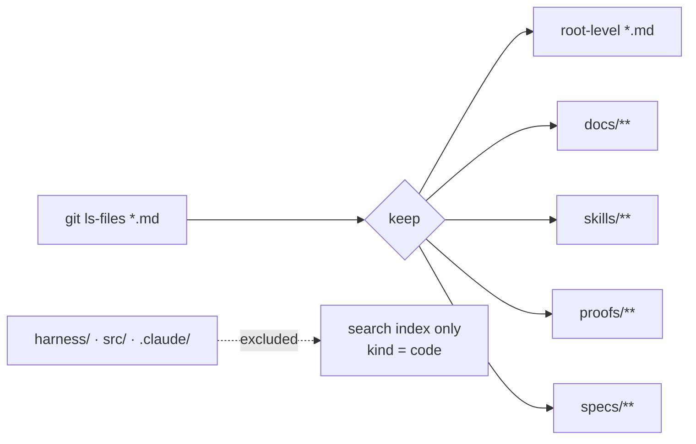

Code is excluded from the **note graph** but still reaches the **search index**
as `kind = code`. Two readers exist for two consumers: the CLI rebuilds fresh
on every invocation, and the server caches for `docs_pages_ttl = 20.0`
seconds. Evidence paths never read a cache.

---

## 4. `Docs_wiki.build` — three passes

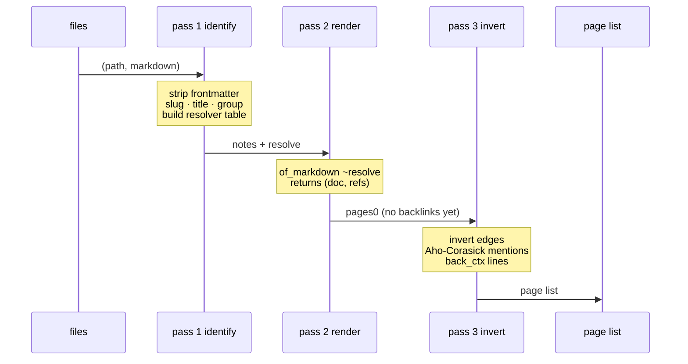

The passes cannot be reordered: the resolver must exist before rendering, and
the full page set must exist before the graph can be inverted.

### The resolver registers four keys per note

`znorm slug` · `znorm title` · `znorm basename` · **title minus a leading
ordinal** (`"03 · The Gate"` → `the-gate`). First registration wins. So
`[[The Gate]]`, `[[03 · The Gate]]` and `[[harness-wiki--03-the-gate]]` all
resolve to one slug. Link resolution is many-keys-to-one-slug, and collisions
resolve by corpus order.

### The `page` record

| Field | Meaning |
| --- | --- |
| `path` `slug` `title` `group` | identity and placement |
| `html` | the rendered body |
| `outlinks` `backlinks` | the note graph, both directions |
| `mentions` | titles appearing verbatim **without** a link |
| `back_ctx` | `(source-slug, source line)` — why it links here |
| `typed` | `(target, relation)` from `[[T\|@rel]]` |
| `raw` | source markdown, for mention scanning |
| `meta` | frontmatter control panel |

Domain law: `fst back_ctx ≡ backlinks`.

### Pass 3 detail

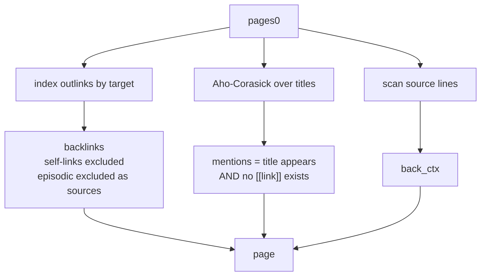

---

## 5. The parser

Parsing is split from rendering because the oracle's shape — a streaming state
machine carrying `in_ul`/`in_ol`/`in_bq`/`in_tbl` across lines — cannot be
converted to typed markup by swapping call sites. TyXML needs a tree.

```
parse  : string -> t              bytes to a typed document
render : t -> Tyxml elements      a document to markup that cannot be malformed
```

### AST

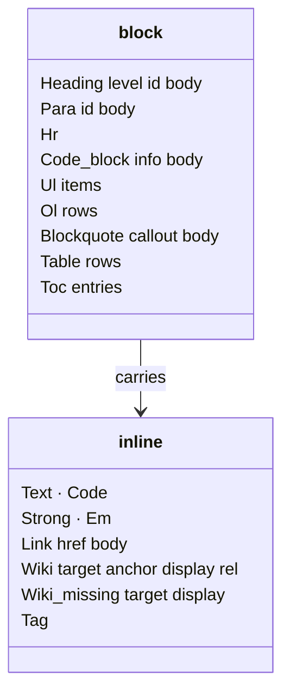

Two representation choices are load-bearing:

- A link's `display` is an **`inline list`, not a string**. The corpus contains
  `[[x|… **CLOSED** …]]`; a string field would flatten the emphasis on the way
  out.
- `Code_block` carries the **raw info string**, committing to no
  interpretation. `lang_of_info` decides the language later, and a future meta
  reader needs no carrier change.

### Pass order — the subtlest thing in the module

The oracle is a chain of string rewrites over one string: wiki links, markdown
links, hashtags, bold, italic. Each pass sees the **output** of the previous
one, so by the time the bold regex runs a link is already inert markup and
`[^*]+` spans it happily.

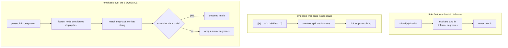

Both naive orders are wrong on **real corpus lines**, and the differential is
what caught them.

### Quirks preserved deliberately

Equivalence is the bar, so a "fix" here would be a silent behaviour change
across ~1,600 published documents. Each is pinned by a named BDD scenario:

| Quirk | Behaviour |
| --- | --- |
| `[TOC]` | scans every heading-prefixed line **including inside code fences** |
| separator row | `\|---\|` does not itself open a table; a list stays open |
| `#####` | five hashes is not a heading; falls through to a paragraph |
| blockquote | a run joins its lines with a trailing space per line |
| ordered list | needs digit, `.`, space — `10 items` is a paragraph |

---

## 6. Anchors

Three anchor sites, **not** interchangeable:

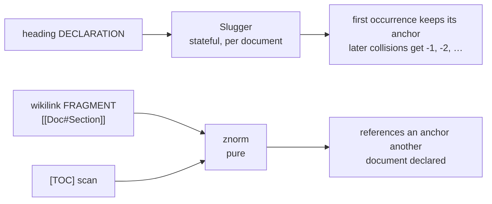

A wikilink fragment is computed **without seeing** the target document, so a
suffix drawn from this document's history would point at nothing. The `[TOC]`
scan stays pure because its own quirk means its sequence is not the heading
sequence, and a shared counter would drift out of step.

**Disclosed residual (suffix capture).** A generated suffix can claim a slug a
later heading would naturally own — `""` → `section`, `"!!!"` → `section-1`,
then a heading whose natural slug *is* `section-1` becomes `section-1-1`. This
is a pigeonhole property of every suffix scheme, not a defect here; a different
separator makes it rarer, never impossible.

**Locality.** One slugger per document. Anchors must not depend on what was
parsed before, or a full-corpus render and a single-file render would emit
different links for the same page.

---

## 6a. Slugs: four different namespaces

"Slug" names four distinct things here, and confusing them is how a path
traversal or a dead link gets written. Each has its own function, its own
alphabet, and its own guarantee.

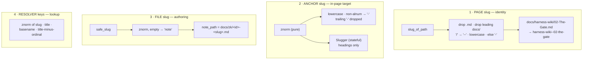

| # | Function | Alphabet | Guarantee |
| --- | --- | --- | --- |
| 1 | `slug_of_path` | `[a-z0-9-]`, `--` for `/` | one page, one URL id |
| 2 | `znorm` / `Slugger.slug` | `[a-z0-9-]` | resolvable in-page target |
| 3 | `safe_slug` | `[a-z0-9-]`, never empty | path-safe by construction |
| 4 | resolver keys | `znorm` of four forms | many keys → one slug |

### How slugs are checked

**By construction.** `note_path` is always `docs/zk/<id>-<slug>.md` where `id`
is digits and `-`, and `safe_slug` yields `[a-z0-9-]+` with `"note"` as the
empty fallback. Neither can contain a separator, so a traversal cannot be
built.

**By assertion, anyway.** `path_is_safe` is asserted before *every* write and
is total: the path must be under `docs/zk/`, end `.md`, have a stem of only
`[0-9a-z-]`, and contain no `..`. This is defence in depth on purpose — a
mutant that bypassed the sanitising namer was killed *twice*, once by
`path_is_safe` alone, proving the second layer is load-bearing rather than
decorative.

**By law.** Uniqueness, character validity and determinism are carried by
`slugger_laws.ml` and an Ortac state model; anchor locality and non-vacuity by
`markdown_ast_laws.ml`; block-anchor uniqueness by
`zk_block_anchor_uniqueness.ml`.

**Block anchors.** A trailing ` ^id` on any block is an explicit, stable
anchor (Obsidian convention), so an agent can address and patch **one block**
and `[[Page#^id]]` resolves to it. Author-pinned ids bypass the slugger
entirely — they are deliberate names, and rewriting one would defeat its
purpose. They cannot collide with generated slugs because pinned ids keep
their `^` prefix and generated ones never have it.

---

## 6b. How pages are created

Three creation paths converge on the same corpus, and none of them is a
special case at render time — everything is just markdown on disk that
`git ls-files` finds.

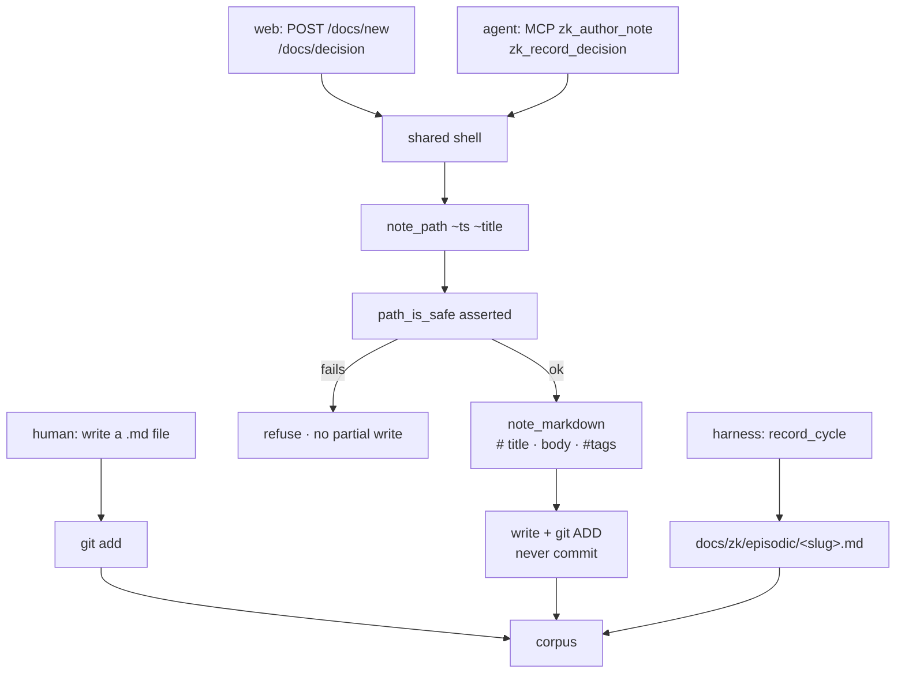

**Create-only over MCP.** There is no edit or delete tool, which makes a whole
UCA structurally impossible; editing stays on HTTP with an ETag. MCP writes
carry a 64 KiB cap.

**Staged, never committed.** Authored notes are `git add`-ed and left for
human review — the harness never commits on your behalf.

**Harness-authored notes.** `--record-cycle` writes a per-slice episodic note.
Since DIVERGENCE 770 it also writes to the **main checkout** when the root is a
linked worktree, because two such notes were once found stranded in disposable
`/tmp` trees, one `rm` from destruction.

---

## 6c. How pages are managed

The frontmatter is a **control panel**, kept out of the reading surface: it is
parsed off before rendering so it neither displays nor pollutes search.

| Field | Meaning |
| --- | --- |
| `id` | stable UUID; derived from the slug when absent |
| `status` | `draft` · `published` · `flagged_for_review` |
| `last_verified` / `verified_by` | when the fact was confirmed, and by `agent` or `human` |
| `next_review` | decay signal — a due date for re-checking |
| `type` | discourse type: `note` · `question` · `claim` · `evidence` · `decision` |
| `has_frontmatter` | did the file carry an explicit `---` block |
| `allow_example_links` | audit-only exemption for notes quoting `[[…]]` grammar |

An **unknown** `type:` value is preserved verbatim and flagged report-only —
honesty over normalisation.

### Editing is optimistically concurrent

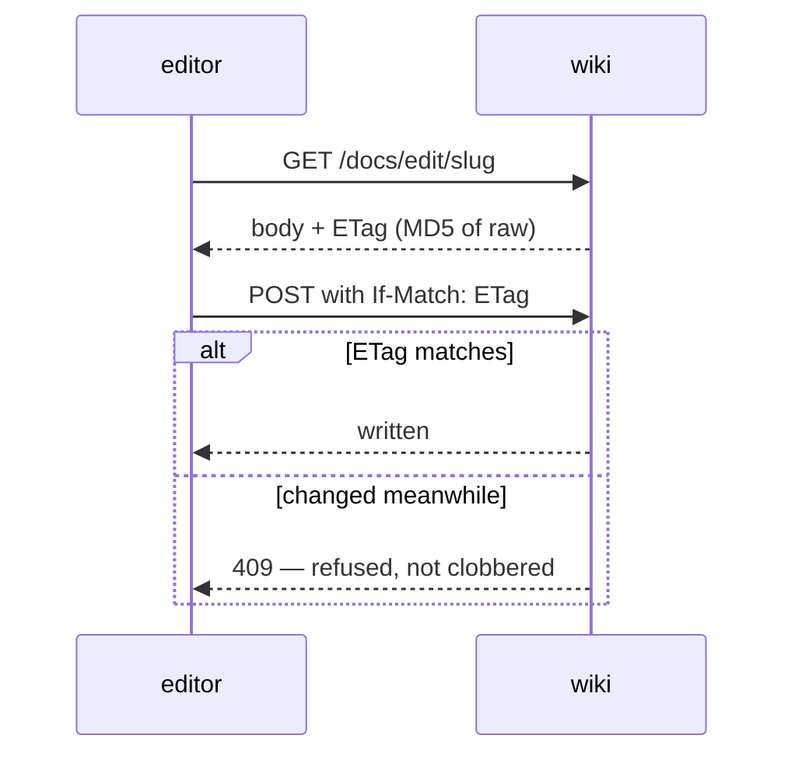

Deterministic: same content, same ETag. A human or another agent editing
underneath you produces a refusal, not a silent overwrite.

### The currency loop

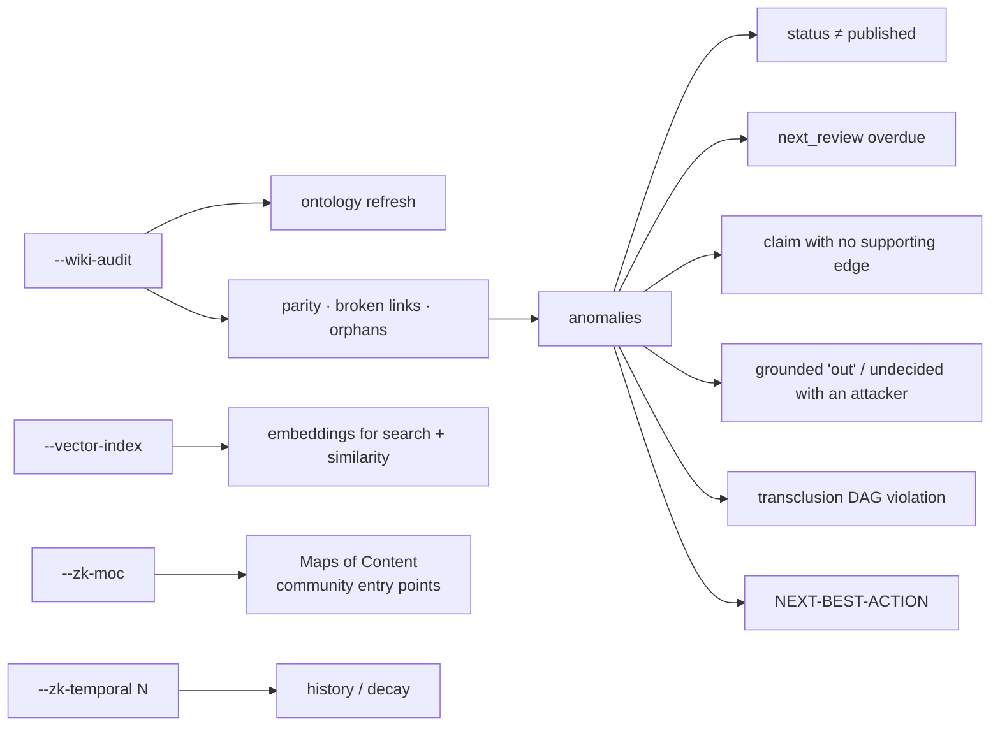

Anomalies are **structural**, not stylistic: a `claim` with no inbound
`supports` edge, a claim or decision that grounded semantics rules `out`, an
undecided node with an attacker, a transclusion cycle. Episodic notes are
excluded from graph analytics by the §8.2-M projection law — they are
intentional non-graph citizens.

---

## 7. Rendering a page

`render_context_for` memoises the expensive derived views and is keyed on
**physical identity** (`context.rc_pages == pages`), so a rebuilt corpus
invalidates it automatically.

| Field | Content |
| --- | --- |
| `rc_titles` | slug → title |
| `rc_neighbours` | previous/next |
| `rc_inferred` | inferred links |
| `rc_similar` | vector similarity |
| `rc_pagerank` | centrality |
| `rc_grounded` | grounded standing |
| `rc_communities` | label-propagation clusters |

`docs_wiki.ml` exposes 30 `render_*` entry points — page, index, tags, search,
graph, timeline, currency, anomalies, memory, forms, zkquery results, and more.

---

## 8. Serving

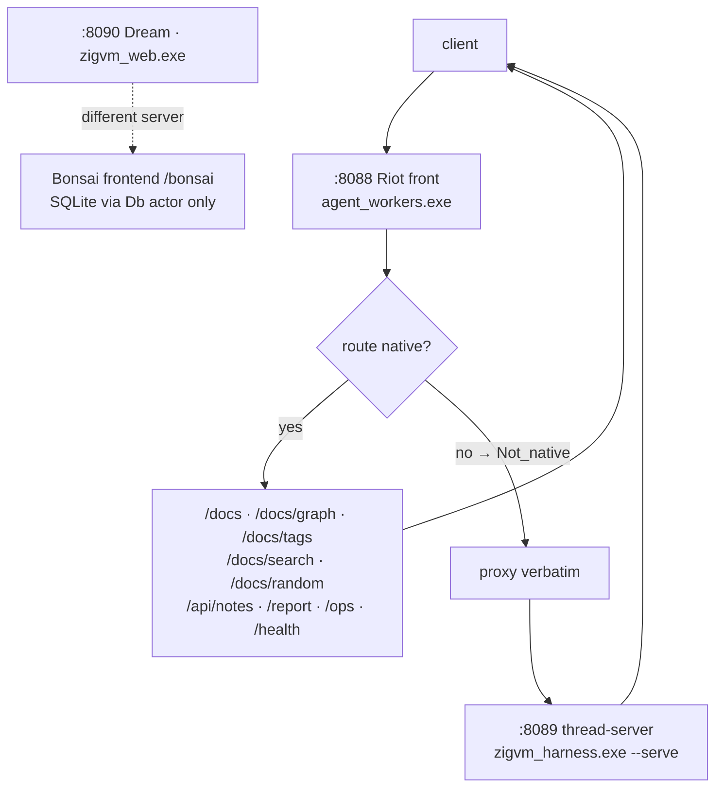

This is a **strangler fig**. `:8088` is zero-regression while routes migrate
incrementally; a route the Riot node does not serve raises `Not_native` and is
forwarded verbatim. Dream on `:8090` is *not* the wiki — different server,
different renderer, and it reaches SQLite only through the harness `Db` actor.

### Delivery-time work

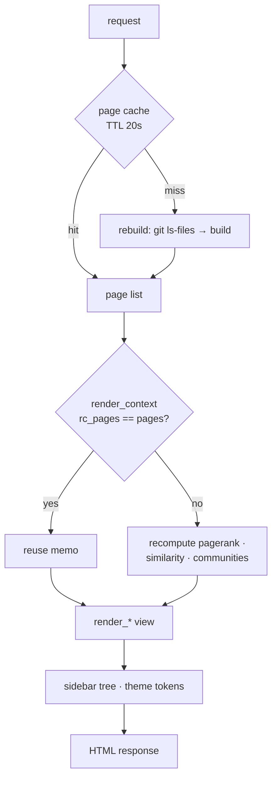

The context memo is keyed on **physical identity** (`rc_pages == pages`), so a
rebuilt corpus invalidates it automatically — there is no staleness window to
reason about separately from the 20 s page TTL.

Three delivery-layer modules do real, bounded work and are honest about their
limits: `wiki_sidebar_tree_generator` (navigation from `group_of`),
`wiki_theme_token_injector` (design tokens to CSS), and
`wiki_content_security_policy_generator`, which emits a strict CSP
(`default-src 'none'` plus narrow allowances) **and** scans the generated HTML
for constructs that policy would block — inline `<script>`, `onclick=`-style
handlers, `javascript:` URIs, inline styles — reporting real counts per
construct. It does **not** claim the wiki is XSS-safe; it reports exactly how
many inline constructs the emitted policy would reject.
`wiki_cache_poisoning_detector` scans generated HTML for injection markers
(external `<script src>`, event handlers, `javascript:`, `eval(`), excluding
`.git`, vendored coverage output, and other agents' worktrees.

---

## 9. Verification

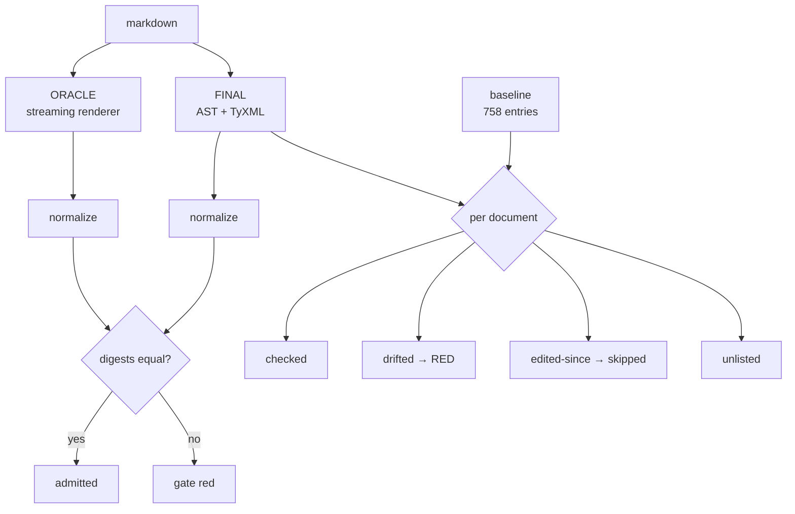

**The oracle never dies.** The old streaming renderer has produced every page
of this wiki for the programme's whole life; its behaviour, quirks included,
*is* the specification. It stays as a permanently-exercised oracle — deleting
it would delete the specification.

**Normalisation, not byte equality.** A real tokenizer emits `` `Tag ``,
`` `Txt `` and `` `Pre `` so whitespace collapses outside `<pre>` and entities
decode. The comparison is of rendered *meaning*, not formatting.

**The content digest is what makes honesty possible.** Each baseline line
carries both a render digest and a digest of the source. A document edited
since the baseline was taken is reported as `edited-since (skipped)` rather
than silently re-baselined — the checker cannot quietly absorb a change.

Rendering laws run inside the gate through the `Render_suite` registry, now 13
suites (`Wiki · Slo · Self · Json · Viz · Markdown · Zk · Toolchain · Model ·
Slugger · Baseline · Publication · Preflight`) with a `SUITE-FLOOR` law so a
suite cannot be quietly handed back. A law only counts when the gate runs it.

### `--wiki-audit`

Refreshes the living ontology, rebuilds the corpus, and reports parity
(`files − pages`), broken links, orphans, communities, vitality and a
NEXT-BEST-ACTION.

**Broken-link honesty** is explicit rather than tuned. A page may declare
`wiki-audit: allow-example-links` in source; episodic notes and
`Generated: 20…` artifacts are excluded **structurally**, because they quote
`[[…]]` syntax verbatim as evidence and can never carry the marker. The opt-out
is in-repo and visible — a truth-bearing perception, not a gamed metric.

---

## 10. What is *not* the wiki

| Generator | Output | Note |
| --- | --- | --- |
| `--dashboard --dashboard-html` | ops board, `:8092` | dual-written; regenerated on commit |
| `--lint-report` | metrics, OTLP spans, dashboard | report-only; a source-scan law denies it any effectful token |
| `render_fractal_fp_atlas.exe` | 11 projections | checked by `--selfcheck-fractal-fp-atlas` |
| `journal_markdown_html.ml` | journal HTML | artifacts carry `sha256`, `bytes`, `provenance` |

**A dashboard is never gate evidence.** `--check-lint` and the SQLite run
status are.

Generated artifacts are held to a stricter standard than authored ones: every
lint finding on a generated artifact is an `Error`, no ratchet, no exception.

---

## 11. Commands

| Task | Command |
| --- | --- |
| static export | `--docs-wiki DIR` |
| serve backend | `--serve 8089` |
| serve front | `agent_workers.exe --serve <root> 8088 8089` |
| audit | `--wiki-audit` |
| render one file | `dune exec ./harness/render_markdown_file.exe` |
| re-baseline | `dune exec ./harness/gen_markdown_baseline.exe` |

Re-baselining **accepts a corpus-wide rendering change** and is deliberately
never run by the gate. Doing it without a stated reason is how a silent drift
would enter.

---

## 12. Failure modes

| Mode | Control |
| --- | --- |
| silent render drift | corpus differential, 758 pinned documents |
| oracle deleted as "dead code" | it is the specification; equivalence law depends on it |
| quirk "fixed" accidentally | five named BDD scenarios |
| anchor collision | Slugger + locality laws |
| law passes vacuously | explicit non-vacuity guards |
| checker misreports | algebras, not substring scans — `TABLE_ALGEBRA.md`, `HTML_ALGEBRA.md` |
| untracked note invisible | by design: `git ls-files` is the corpus |
| stale cache in evidence | CLI rebuilds fresh; only serving caches |

---

## Related

`docs/design/TABLE_ALGEBRA.md` · `docs/design/HTML_ALGEBRA.md` ·
`docs/ONTOLOGY.md` · `docs/FRACTAL_ONTOLOGY.md` ·
`skills/zk-knowledge-base/SKILL.md` · `AGENTS.md`
