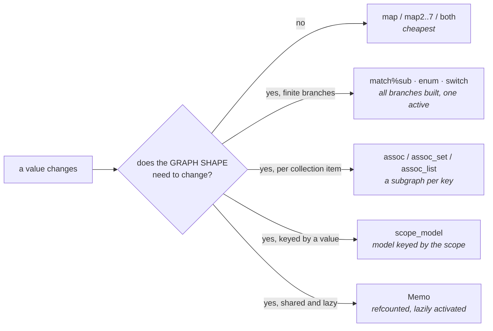
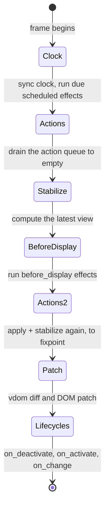
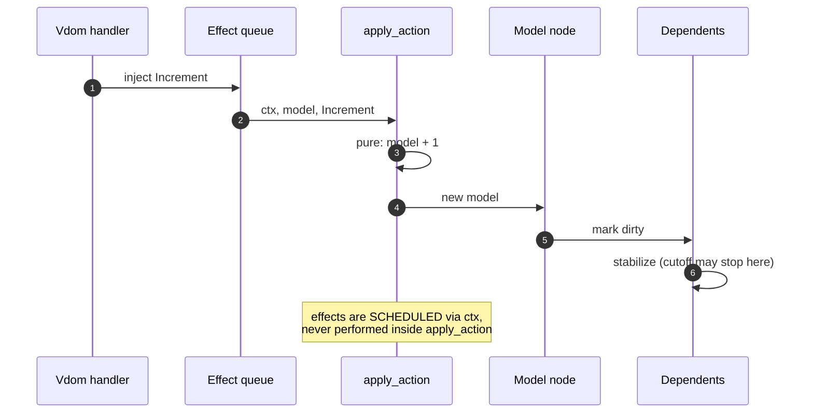
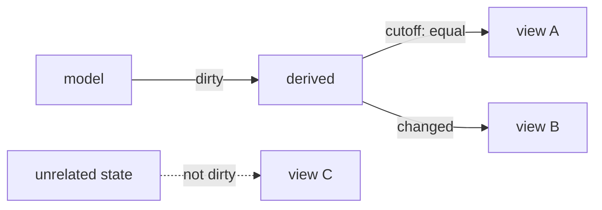

# The algebra of Bonsai

Carrier, denotation, signature, laws, dynamic behaviour and key algorithms —
in the shape this repository uses for every algebra it depends on
(`TABLE_ALGEBRA.md`, `HTML_ALGEBRA.md`, `ALGEBRAIC_*.md`).

Signatures are read from the installed interfaces at pin
`v0.18~preview.130.106+341`. Prose, laws, diagrams and code are this
repository's own analysis.

---

## 1 · Carrier and denotation

```text
  Carrier      'a t                the type of time-varying values
  Denotation   ⟦'a t⟧ = Time → 'a  a value that has an 'a at every instant
  Carrier      graph               the construction-time capability
  Denotation   ⟦graph⟧ = the permission to add nodes; no runtime meaning
```

A **component** is a plain function:

```ocaml
'input t -> graph -> 'result t
```

There is no separate computation type in the current API: a computation *is* a
graph-taking function, and composition *is* function composition. This is the
single most clarifying fact about the modern interface.

**The two-phase discipline.** `graph` exists only while the graph is being
built. Anything that adds a node needs it; anything that merely transforms a
value does not. So the signature tells you the phase:

```text
  'a t -> f:('a -> 'b) -> 'b t                  pure, no graph, adds nothing
  … -> graph -> 'b t                            construction, adds nodes
  'a -> unit Effect.t                           runtime, performs
```

---

## 2 · Why applicative and not monadic

`'a t` satisfies `Applicative.S`. It deliberately does **not** provide
`bind : 'a t -> ('a -> 'b t) -> 'b t`.

The reason is structural, not stylistic. A bind would let the *shape* of the
graph depend on a runtime value — every value change could rebuild an
arbitrary subgraph, and no static analysis could say what the graph is. The
applicative restriction keeps the graph's shape statically known, which is what
makes cutoffs, sharing and profiling meaningful.

Shape-changing dynamism is therefore confined to named combinators, each with a
declared cost:



**The law that follows** (`SHAPE-STATIC`): the set of nodes reachable in the
graph is determined at construction time; only which of them are *active*
varies at runtime. Any design that wants otherwise is asking for a bind and
should be rewritten into one of the five boxes above.

---

## 3 · The signature

Grouped by algebraic role rather than alphabetically.

### 3.1 Applicative core

```ocaml
val return : 'a -> 'a t
val map    : 'a t -> f:('a -> 'b) -> 'b t
val map2   : 'a t -> 'b t -> f:('a -> 'b -> 'c) -> 'c t     (* map3 .. map7 *)
val both   : 'a t -> 'b t -> ('a * 'b) t
val cutoff : 'a t -> equal:('a -> 'a -> bool) -> 'a t
```

`let%arr` is the recommended surface syntax over `let%map`: it compiles to the
`mapN` of the right arity instead of a chain of `map`s and `both`s, which is
fewer nodes for the same meaning.

### 3.2 State

```ocaml
val state : ?reset:('m -> 'm) -> ?equal:('m -> 'm -> bool) -> 'm -> graph
         -> 'm t * ('m -> unit Effect.t) t

val state_machine
  :  ?reset:_ -> ?equal:_ -> default_model:'m
  -> apply_action:(('a, unit) Apply_action_context.t -> 'm -> 'a -> 'm)
  -> graph -> 'm t * ('a -> unit Effect.t) t

val state_machine_with_input
  :  … -> apply_action:(… -> 'i Computation_status.t -> 'm -> 'a -> 'm)
  -> 'i t -> graph -> 'm t * ('a -> unit Effect.t) t

val actor : … -> recv:(… -> 'm -> 'a -> 'm * 'r) -> graph
         -> 'm t * ('a -> 'r Effect.t) t

val wrap  : … -> apply_action:(… -> 'result Computation_status.t -> 'm -> 'a -> 'm)
         -> f:('m t -> ('a -> unit Effect.t) t -> graph -> 'result t)
         -> graph -> 'result t
```

Four increasingly powerful shapes, and the guidance is to take the weakest that
works:

| Shape | Use when | Extra power |
|---|---|---|
| `state` | a single value with a setter | none |
| `state_machine` | transitions are a function of model and action | typed actions |
| `state_machine_with_input` | transitions also need live input | sees `Computation_status` |
| `actor` | the caller needs a *response* from the transition | `'r Effect.t` |
| `wrap` | the transition needs the component's own result | result feedback |

`?equal` is a **memory** optimisation, not a correctness knob: with it,
`assoc` and branching can store only the default model instead of the current
one. `?sexp_of_model` is debugger-only. `?reset` fires when an enclosing
`with_model_resetter` is triggered.

### 3.3 Collections

```ocaml
val assoc      : ('k,'cmp) Comparator.Module.t -> ('k,'v,'cmp) Map.t t
              -> f:('k t -> 'v t -> graph -> 'a t) -> graph -> ('k,'a,'cmp) Map.t t
val assoc_set  : ('k,'cmp) Comparator.Module.t -> ('k,'cmp) Set.t t
              -> f:('k t -> graph -> 'r t) -> graph -> ('k,'r,'cmp) Map.t t
val assoc_list : ('k,_) Comparator.Module.t -> 'a list t -> get_key:('a -> 'k)
              -> f:('k t -> 'a t -> graph -> 'b t) -> graph
              -> [ `Duplicate_key of 'k | `Ok of 'b list ] t
```

Note the return type of `assoc_list`: duplicate keys are a **value**, not an
exception. That is the framework making an error case impossible to ignore, and
it is the shape to imitate.

`assoc_on` — where the model key differs from the input key — is quarantined
under `Expert`, because keys that collide on the model key *share* a model.

### 3.4 Branching, laziness, recursion

```ocaml
val enum  : (module Enum with type t = 'k) -> match_:'k t
         -> with_:('k -> graph -> 'a t) -> graph -> 'a t
val delay : f:(graph -> 'a t) -> graph -> 'a t          (* f runs at most once *)
val fix   : 'i t -> f:(recurse:('i t -> graph -> 'r t) -> 'i t -> graph -> 'r t)
         -> graph -> 'r t
```

`enum` requires the branch type to derive `enumerate`, so the compiler
guarantees every case is handled — exhaustiveness by construction.

### 3.5 Edge — reaching the world

```ocaml
val lifecycle : ?on_activate:unit Effect.t t -> ?on_deactivate:unit Effect.t t
             -> ?before_display:unit Effect.t t -> ?after_display:unit Effect.t t
             -> graph -> unit
val on_change : ?trigger:[`Before_display | `After_display]
             -> equal:('a -> 'a -> bool) -> 'a t
             -> callback:('a -> unit Effect.t) t -> graph -> unit
```

And the polling family, whose contract is the interesting part:

```ocaml
val Edge.Poll.effect_on_change
  :  equal_input:('a -> 'a -> bool) -> ('o,'r) Starting.t -> 'a t
  -> effect_value:('a -> 'o Effect.t) t -> graph -> 'r t
```

**Guarantee:** a later-scheduled effect wins even if it *completes* earlier.
This is the out-of-order protection you would otherwise have to write yourself,
and writing it yourself is where race conditions come from.

### 3.6 Effects

```ocaml
type 'a t = ..                                   (* open, extensible *)
type 'a t += Ignore : unit t | Many : unit t list -> unit t
include Monad.S                                  (* let%bind.Effect *)
module Par : Monad.S                             (* `and` runs concurrently *)

val of_sync_fun     : ('q -> 'r) -> 'q -> 'r t
val of_deferred_fun : ('q -> 'r Deferred.t) -> 'q -> 'r t
val all_parallel    : 'a t list -> 'a list t
val protect         : 'a t -> finally:unit t -> 'a t
val try_with_or_error : 'a t -> 'a Or_error.t t
```

Effects are **descriptions**. Constructing one does nothing; only scheduling
runs it. There are exactly three routes to the scheduler — a state machine's
context, a Vdom attribute handler, or the driver — and that closed set is what
makes the system analysable.

---

## 4 · Dynamic behaviour

### 4.1 The frame

The loop, in the order the runtime actually performs it:



Five consequences worth internalising, because each is a bug someone will
otherwise find the hard way:

1. **The action queue drains to empty each frame.** A chain of sequentially
   composed effects that each inject an action all resolve *within the same
   frame*, not one per frame.
2. **A state machine with input stabilises before its action is applied**, so
   `apply_action` sees fresh input rather than last frame's.
3. **`before_display` runs inside a fixpoint** — run effects, apply actions,
   stabilise, repeat until no new ones. It terminates because each effect runs
   at most once per frame and there are finitely many.
4. **Nothing stabilises after the DOM patch or after lifecycles.** This is the
   mechanical reason a state update scheduled from a lifecycle event lands on
   the *next* frame, and therefore why state-synchronisation schemes produce a
   visible flash of stale content.
5. **The next frame is requested via animation frame, raced against a timeout**,
   because a backgrounded tab may not receive animation frames at all.

The ordering is a **specification**, not an implementation detail. Code that
depends on a different order is wrong even if it currently works.

> **UNVALIDATED — do not rely on this paragraph.** An earlier draft asserted
> that `on_change` fires once on activation and at most once per frame
> thereafter, always with the latest value. That is the documented intent, but
> attempting to *verify* it produced the opposite: driven through the headless
> driver, the callback fired on every frame and always carried the initial
> value, while variable propagation demonstrably worked elsewhere in the same
> suite. Whether the hand-driven frame protocol is an unfaithful stand-in for a
> real display cycle, or the usage is wrong, is **not distinguishable with the
> tooling installed here**. Recorded in `BONSAI_GUIDE.md` §10.1. Until it is
> settled, treat edge-trigger timing as something to establish per use rather
> than to assume.

### 4.2 A state transition, end to end



### 4.3 Activation and model retention

Whether a model survives deactivation depends on the combinator, and this is a
frequent source of surprise:

| Combinator | On deactivation |
|---|---|
| `assoc` | the key leaving the map destroys its subgraph and model |
| `match%sub` / `enum` | the inactive branch's model is retained by default |
| `scope_model` | switching scope swaps to that scope's model |
| `Memo` | when the last subscriber leaves, the shared computation deactivates |
| `with_model_resetter` | explicit reset to defaults on demand |

---

## 5 · Laws

Stated so they can be checked. Those marked **[mechanised]** are enforced by
the `BONSAI-*` rules in `harness/doc_lint.ml`; the rest are review obligations
in `BONSAI_SOP.md` until someone mechanises them.

### 5.1 Algebraic

| Law | Statement |
|---|---|
| `APPLICATIVE-IDENTITY` | `map v ~f:Fun.id ≡ v` |
| `APPLICATIVE-COMPOSITION` | `map (map v ~f) ~f:g ≡ map v ~f:(g ∘ f)` — and the right-hand side allocates one node instead of two |
| `BOTH-COMMUTES-TO-MAP2` | `map (both a b) ~f:(fun (x,y) -> f x y) ≡ map2 a b ~f` — prefer `map2`/`let%arr`, which is the same meaning at lower node count |
| `CUTOFF-IDEMPOTENT` | applying the same cutoff twice equals applying it once |
| `SHAPE-STATIC` | the reachable node set is fixed at construction; only activity varies |

### 5.2 State

| Law | Statement |
|---|---|
| `TRANSITION-PURE` | `apply_action` is a pure function of context, model and action; effects are scheduled, never performed |
| `TRANSITION-TOTAL` | every action is handled for every model; no partial matches |
| `DEFAULT-REACHABLE` | `default_model` is a legal state, and `reset` returns to a legal state |
| `EQUAL-IS-SEMANTIC` | if `?equal` is supplied it is a true equivalence on the model; it is a memory optimisation and must never change observable behaviour |

### 5.3 Typing **[mechanised]**

| Law | Statement | Rule |
|---|---|---|
| `MODEL-IS-A-TYPE` | related state is one record or variant, not a dozen primitives | `BONSAI-STATE-EXPLOSION` |
| `BUNDLE-IS-TYPED` | bundles are records or heterogeneous tuples, never positional lists | `BONSAI-POSITIONAL-BUNDLE` |
| `VALUE-IS-PARSED` | a numeric state carries a number, not a numeric string | `BONSAI-STRINGLY-STATE` |
| `DEPENDS-ON-WHAT-IT-READS` | a view depends on the state it reads, not on all state | `BONSAI-MONOLITHIC-MAP` |

### 5.4 Effects

| Law | Statement |
|---|---|
| `EFFECT-DESCRIBED` | constructing an effect performs nothing; only scheduling does |
| `EFFECT-ORDERED` | for polled effects, the last-scheduled result wins regardless of completion order |
| `EFFECT-CONTAINED` | an effect that can fail returns `Or_error.t`; it does not raise across the scheduler |

---

## 6 · Key algorithms

### 6.1 Stabilisation

The incremental core marks the transitive dependents of a changed node dirty,
then recomputes them in topological order, stopping at any node whose new value
passes its cutoff.



Consequences worth internalising: work is proportional to the *dirty* subgraph,
not the whole graph — unless you built a node that depends on everything, in
which case the dirty subgraph is the whole graph. That is exactly what
`BONSAI-MONOLITHIC-MAP` detects.

### 6.2 Assoc diffing

`assoc` does not rebuild on every map change. The underlying incremental map
computes a *diff* — keys added, removed, changed — and applies only that:

```text
  input map change   →   diff   →   add subgraph for new keys
                                    destroy subgraph for removed keys
                                    propagate data change for changed keys
                                    UNTOUCHED for unchanged keys
```

This is why `assoc` over a map is dramatically better than mapping over a list
and rebuilding: the list version has no key identity, so nothing can be
preserved. `assoc_list` recovers key identity via `get_key`, but pays
`O(n log n)` per change to do it — use it when the input is genuinely a list
you do not control, not as a default.

### 6.3 Node paths

Each node has a reproducible address — a choice list plus a descent count —
rendered as a string safe for HTML ids. This is what makes profiler labels,
graph-info entries and stable DOM identifiers agree with one another.

---

## 7 · Formal-verification posture

This repository's `formal-technique-selection` skill says to match the
technique to the *shape* of the subject. Applied honestly here:

| Technique | Fit | Verdict |
|---|---|---|
| **Quint / TLA+** | The frame lifecycle is a small state machine with a specified ordering, and `Edge.Poll`'s out-of-order guarantee is a temporal property. | **FITS.** A Quint model of frame ordering and of last-scheduled-wins is a genuine obligation and is scoped as the next slice. |
| **Rocq / Coq** | The applicative laws and `SHAPE-STATIC` are provable, but about *Bonsai's* implementation, which this repo does not own. | **PARTIAL.** Proving properties of our own components' transition functions fits; proving the framework does not. Do the former. |
| **Property tests** | `apply_action` is a pure total function — the ideal property-test subject. | **FITS, and is cheap.** Seeded action sequences against model invariants. This is the highest value-per-effort item. |
| **Ruliology** | The combinator set is a rule space, but the combinators do not interact emergently — composition is function composition. | **DOES NOT FIRE**, on the same test that deferred it for the lint registry. It would fire if we built a combinator that inspects the graph. |
| **STPA / FMEA** | The UI is a controller over evidence displays; a wrong render is a hazard. | **FITS.** The packet is in `BONSAI_SOP.md`. |

Recording a *does not fire* is the point of the trigger test; adding a
technique because it is available is the failure mode the skill exists to
prevent.

---

## 8 · Cost model

The number to keep in your head, because every performance rule derives from
it:

```text
  frame cost  ≈  Σ (cost of each node whose inputs changed and whose cutoff did not stop it)
```

| Choice | Effect on that sum |
|---|---|
| `let%arr` on a pattern that ignores fields | inserts cutoffs, so it fires only on the fields you bound |
| a cutoff with a real `equal` | truncates propagation early |
| `assoc` over list rebuilding | unchanged keys contribute zero |
| an `assoc` body that never touches `graph` | compiles to a plain incremental map — a *constant* node count regardless of key count |
| one big map over all state | every change contributes the whole view |
| `Clock.approx_now` over `Clock.Expert.now` | recomputes per tick, not per frame |
| `Memo` for a shared expensive subgraph | computed once, refcounted |

### 8.1 Incrementality is two-sided

The obvious failure is a node that depends on everything. The **non-obvious**
failure is the opposite: incremental nodes are not free to create, fire or
track, so splitting a cheap computation into many small nodes can cost more
than leaving it whole.

The reconciliation, and the rule to actually apply:

> **Split where it separates expensive work from frequently-changing input.
> Do not split merely to make the graph finer.**

A coarse node combining a slow input and a fast one recomputes the slow part
whenever the fast one changes — that is worth splitting, and the payoff can be
orders of magnitude when the fast input dominates. Splitting two cheap
computations that always change together buys nothing and costs node overhead.

Two hard limits worth knowing before you design around them: the incremental
graph has a maximum height (reachable via deep recursion through `fix`), and
`assoc` cost grows sharply when nested, because each level maintains and
persists per-key state.
