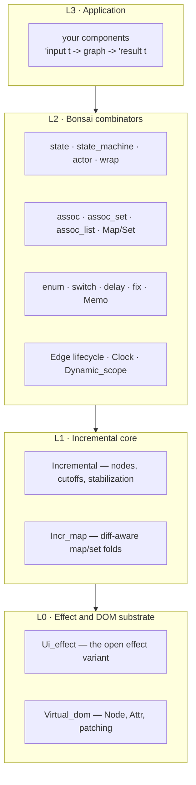
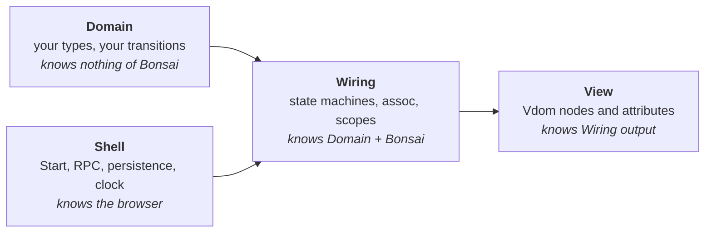
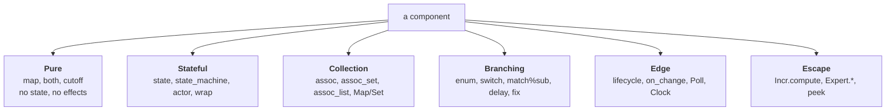
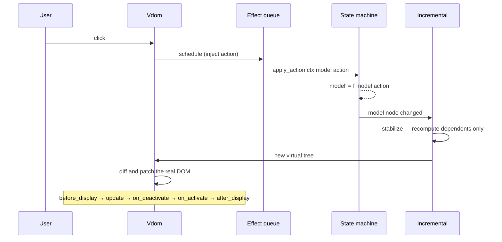

# Bonsai — fractal ontology and domain-driven analysis

The vocabulary of the Bonsai UI framework as this repository uses it, in the
shape `docs/ONTOLOGY.md` uses for every other subsystem: terms, layers,
components, interactions, and the laws that bind them.

**Version of record:** `v0.18~preview.130.106+341`, the pin this repo builds
against. Every signature quoted here was read from the installed interfaces in
the local opam switch, not from memory. Where the public documentation and the
installed interface disagree, **the interface wins** — that is this
repository's standing direction-of-truth rule.

**Sibling documents:** `BONSAI_ALGEBRA.md` (signature, laws, dynamics,
algorithms), `BONSAI_GUIDE.md` (features, use cases, do and do-not, patterns,
extension), `BONSAI_SOP.md` (the operating procedure).

---

## 1 · What kind of thing Bonsai is

Bonsai is an **incremental** UI framework: you describe a dependency graph
once, and at runtime only the parts whose inputs changed are recomputed. This
single fact generates almost every rule in these documents. The framework's
cost is that you must express your UI as a graph; its benefit is that a change
touches only its dependents. **Code that consumes more than it needs pays the
cost and forfeits the benefit** — that is the root of every anti-pattern in
`BONSAI_GUIDE.md`.

Three properties follow, and they are worth stating before any API:

1. **Two phases.** Graph *construction* happens once; graph *evaluation*
   happens every frame. The `graph` parameter is the construction-time
   capability, and it cannot escape into runtime.
2. **Applicative, not monadic.** `'a t` is an `Applicative.S`. There is
   deliberately no `bind : 'a t -> ('a -> 'b t) -> 'b t`, because a bind would
   let the graph's *shape* depend on a runtime value, which is precisely what
   makes incremental frameworks unpredictable. Shape-changing dynamism is
   confined to named combinators.
3. **Strong typing is the mechanism, not the decoration.** The model is a
   type, actions are a type, the response of an action is a type, and
   inactivity is a type (`Computation_status.t`). Every one of these exists so
   an impossible state cannot be written down.

---

## 2 · The fractal layers

Bonsai occupies four layers, each a total function of the one below.

The **web** layer (`Bonsai_web`) sits beside L2/L0 rather than above them: it
adds the browser-specific pieces — starting an app, RPC effects, focus,
persistence — without changing the core algebra. Notably, core `bonsai` has
**no** dependency on `js_of_ocaml` or `async`; only `bonsai_web` does. The
core is browser-independent, which is why it can be driven headlessly in
tests.

---

## 3 · Glossary — the ubiquitous language

Terms are given in dependency order. A term is defined once and used
consistently everywhere in these documents and in the linter's messages.

### 3.1 Core

| Term | Definition |
|---|---|
| **Value** (`'a t`) | A time-varying `'a`; a node in the incremental graph. Applicative: `map`, `both`, `map2..map7`, `return`. |
| **Graph** (`graph`) | The construction-time capability. Any operation that adds a node takes it, conventionally as the last positional argument. It is `local_` and cannot escape into runtime. |
| **Component** | A plain OCaml function `'input t -> graph -> 'result t`. There is no `Computation.t` type in the current API — a computation *is* a graph-taking function. |
| **Cutoff** | A declared equality that stops propagation when a recomputed value is equal to its predecessor. `cutoff : 'a t -> equal:('a -> 'a -> bool) -> 'a t`. |
| **Model** | The state a component owns. Typed, defaulted, optionally `equal`-comparable (a memory optimisation) and `sexp_of`-able (debugger only). |
| **Action** | The typed input to a state transition. |
| **Effect** (`'a Effect.t`) | A described, not-yet-performed action on the world. A monad; also an *open extensible variant*, so new effect kinds are pluggable. |
| **Inject** | Turning an action into an `Effect.t`: `('action -> unit Effect.t) t`. |
| **Computation status** | `Active of 'input \| Inactive` — the type that makes "this component is not currently on screen" impossible to ignore. |
| **Path** | A component's position in the graph, reproducible across runs; renders to an HTML-id-safe string. |

### 3.2 Time and lifecycle

| Term | Definition |
|---|---|
| **Frame** | One evaluation pass: `before_display` → incremental and DOM update → `on_deactivate` → `on_activate` → `after_display`. |
| **Activation** | A component entering the active graph. `on_activate` fires; `on_change` also fires once. |
| **Deactivation** | A component leaving it. Its model may be discarded or retained depending on the combinator. |
| **Time source** | The injectable clock. Advancing it in tests *enqueues* alarms rather than firing them, which is what makes time-dependent behaviour testable. |

### 3.3 Composition

| Term | Definition |
|---|---|
| **Assoc** | Instantiating a component once per key of a map, with per-key state. The workhorse for collections. |
| **Scope** | Keying a subgraph's model by a value, so switching the key switches the whole model (`scope_model`). |
| **Memo** | A shared, refcounted, lazily-activated computation whose inputs are known at lookup time rather than creation time. |
| **Dynamic scope** | Implicit context passed down the graph without threading it through every signature; resolves to the nearest enclosing binding, else a fallback. |
| **Model resetter** | A handle that restores a subgraph's models to their defaults. |

---

## 4 · Domain-driven decomposition

Read as a domain model, Bonsai has four bounded contexts. The value of naming
them is that **the dependencies point one way**, and a design that violates
that direction is the first thing to look for in review.

| Context | Aggregate root | Value objects | Invariant it owns |
|---|---|---|---|
| **Domain** | the model type | typed enums, records, identifiers | every legal state is representable and every representable state is legal |
| **Wiring** | the state machine | action type, inject function | transitions are total and pure |
| **View** | the Vdom node | attributes, test selectors | rendering is a function of state alone |
| **Shell** | the app handle | connectors, time source, storage | the outside world is reached only through effects |

**The rule this yields:** the transition function belongs to the Domain, not
to Bonsai. This repository already does this well — `harness/ui_web/ui_state.ml`
defines `step : t -> event -> (t, error) result` as a pure total function with
no Bonsai dependency, and the Bonsai `apply_action` is a three-line adapter
over it. That function is unit-testable without a browser, a graph, or a
frame. Keep it that way.

---

## 5 · The component taxonomy

Every Bonsai combinator falls into exactly one of six kinds. Knowing which
kind you are reaching for is most of the design decision.

| Kind | Cost | Rule of thumb |
|---|---|---|
| Pure | one node | free; prefer it |
| Stateful | a model per instantiation | one model per concept, not per field |
| Collection | a subgraph per key | the only correct way to render a dynamic list |
| Branching | one subgraph per branch, only the taken one active | shape change goes here, never through a bind |
| Edge | a frame-ordered callback | for reaching the world, never for computing values |
| Escape | unbounded | requires a written justification |

---

## 6 · Dataflow — how a frame actually runs

Two things in this picture are load-bearing:

- **`apply_action` is pure.** It receives a context, a model and an action and
  returns a model. Effects are *scheduled* through the context, never
  performed inline. This is what makes the transition testable.
- **Stabilisation is the recompute.** Only nodes downstream of a changed node
  run. A node whose inputs are unchanged, or whose recomputed value passes its
  cutoff, does not propagate further.

---

## 7 · Registry — controllers, evidence, agent surfaces

Following the `docs/ONTOLOGY.md` class model, so this subsystem is addressable
the same way as every other.

**Controllers.** `Bonsai.Start` (app entry; owns the root computation and the
DOM binding). `Bonsai_driver` / `Bonsai_web.Driver` (headless and DOM frame
drivers; own `flush` → `result` → `trigger_lifecycles`). The state machine of
each component (owns its model). `Rpc_effect` connectors (own the network
boundary).

**Evidence stores.** `Skeleton` (a serialisable mirror of the graph, for
snapshot tests and node counts). `Graph_info` (two views — a lexical *tree*
answering "where did this node come from" and a *dag* answering "is this
computed twice"). `To_dot` (Graphviz rendering). `Instrumentation` (per-node
timers whose labels carry the node path). `Linter` (a static missed-optimisation
report). `Node_path` (the shortest unambiguous address of a node).

**Agent surfaces.** `skills/bonsai-ui-development/SKILL.md` binds agents to
this ontology; the doc-lint rule family `BONSAI-*` mechanises the parts of it
that are checkable; `skills/mobile-first-adaptive-ui` and
`skills/ocaml-playwright-control` own the responsive and runtime-verification
halves respectively.

**Laws.** Stated and made executable in `BONSAI_ALGEBRA.md` §5.

---

## 8 · Strong typing as a structural requirement

This repository's standing requirement is that every part of the system is
strongly typed. In a Bonsai app that requirement has five specific,
checkable consequences:

| Requirement | Consequence | Failure mode it prevents |
|---|---|---|
| The model is a **record or variant**, never a bag of primitives | related fields change together, invariants have a home | two fields disagreeing |
| Enumerations are **variants**, never strings | the compiler checks exhaustiveness | a typo becoming a silent no-op |
| Numbers are **numbers**, never numeric strings | parsing happens once, at the edge | a parse-and-swallow default on every read |
| Bundles are **records or tuples of distinct types**, never positional lists | reordering is a type error | a silent behavioural swap |
| Absence is `option` and inactivity is `Computation_status.t` | the compiler forces the case | an ignored inactive branch |

Each of these has a rule in the linter (`BONSAI-STRINGLY-STATE`,
`BONSAI-POSITIONAL-BUNDLE`, `BONSAI-STATE-EXPLOSION`), and each fires today on
this repository's own frontend. The findings are listed in
`BONSAI_GUIDE.md` §8 with their closing slice.

---

## 9 · Boundaries — what Bonsai is not

Stated so this ontology is never over-read:

- **Not a renderer.** Virtual_dom owns nodes, diffing and patching. Bonsai
  produces a `Vdom.Node.t` and stops.
- **Not a router, not a data layer, not a design system.** Those are your
  domain; the framework has no opinion.
- **Not a reactive-streams library.** There is no event stream type. Discrete
  occurrences are effects; continuous values are `'a t`. Conflating them is a
  category error that produces most newcomer confusion.
- **Not monadic.** Repeated because it is the single most common wrong
  expectation. If you want the graph's shape to depend on a value, the answer
  is `match%sub` / `enum` / `assoc` / `Memo`, never a bind.
