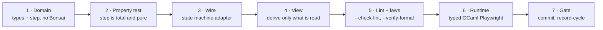

# Bonsai — standard operating procedure

The binding procedure for Bonsai work in this repository. It composes with the
mandatory slice loop in `AGENTS.md`; it does not replace it. Vocabulary is
`BONSAI_ONTOLOGY.md`, laws are `BONSAI_ALGEBRA.md`, patterns are
`BONSAI_GUIDE.md`.

---

## 1 · Order of work

The order is a constraint, not a suggestion. Writing the view first produces a
model shaped by the markup, which is how state explosion happens.

## 2 · Entry criteria

- The domain types exist and are strongly typed: variants for enumerations,
  numbers for numbers, `option` for absence.
- A pure `step : model -> action -> model` (or a `result`-returning variant)
  exists and is not aware of Bonsai.
- You can state which existing component this belongs in, or why it is new.

## 3 · Activities

1. Write or extend the domain model and `step`. No `graph`, no `Vdom`.
2. Property-test `step`: totality over generated action sequences, and any
   model invariant that should hold after every transition.
3. Adapt with the **weakest** state shape that works — `state`, then
   `state_machine`, then `state_machine_with_input`, then `actor`, then `wrap`.
4. Derive named read-values; give each view fragment the value it reads.
5. Use `assoc` over a map keyed by a domain identifier for any collection.
6. Add `Test_selector` hooks where the runtime check will need them.
7. Run `--check-lint` and `--verify-formal`.
8. Verify appearance and behaviour through typed OCaml Playwright.
9. Gate, commit, `--record-cycle`.

## 4 · Exit criteria

- `--check-lint` shows no new `BONSAI-*` finding.
- The canonical gate is green and the SQLite run status is `ok`.
- Any escape hatch (`Expert.*`, `Incr.compute`, `peek`, `Clock.Expert.now`)
  carries a comment naming what was measured and why.
- Runtime evidence exists for anything that changed what a user sees.

---

## 5 · Safety packet — CTRL-BONSAI-UI

The web UI is a controller on an **evidence path**: it renders gate verdicts,
ledgers and conformance state to a human who acts on them. A wrong render is
therefore a safety concern, not a cosmetic one.

**Control structure.** Domain model → state machine → derived values → Vdom →
browser. Feedback: the runtime Playwright check and the `data-testid` surface.

**Hazards.**

- **H-B1 false display.** The page shows a value that is not the system's
  state — stale, defaulted after a failed parse, or from the wrong component.
- **H-B2 silent degradation.** The UI renders an error placeholder or an empty
  view where real content belongs, and nothing fails.
- **H-B3 unresponsive.** Recomputation cost makes the interface unusable, so
  evidence is effectively unavailable.
- **H-B4 lost action.** A user action is dropped or applied to the wrong model.

**Unsafe control actions and constraints.**

| UCA | Instance (⚡ = observed in this repository) | Constraint |
|---|---|---|
| **P** provided wrongly | a positional bundle renders the wrong field after a reorder ⚡ — 25 same-typed pairs distinguished only by position | SC-B1 **typed bundles**: state is bundled by record or heterogeneous tuple, never a positional list |
| **P** provided wrongly | a numeric string fails to parse and silently becomes a default ⚡ — five states hold numeric strings re-parsed with a swallowed error | SC-B2 **parse once at the edge**: the model carries the parsed type |
| **N** not provided | the whole view degrades to a placeholder because an unreachable branch became reachable ⚡ — the catch-all rendering "Invalid UI state" | SC-B3 **no unreachable arms**: if the compiler needs a catch-all, the encoding is wrong |
| **T** wrong timing | a stale response overwrites a newer one | SC-B4 **ordered polling**: use `Edge.Poll` or `Effect_throttling`, never a bare fetch-on-change |
| **D** wrong duration | a single change recomputes the entire view ⚡ — a 321-line map over all state | SC-B5 **read what you depend on**: view fragments depend on the values they read |

**FMEA.** The dangerous direction is H-B1, because it is silent and the reader
believes the page. SC-B1 and SC-B2 address its two observed causes. H-B2 is
loud to a developer but silent to a reader, which is why SC-B3 forbids the
encoding that produces it rather than the placeholder itself. H-B3 is
self-announcing and bounded by SC-B5. H-B4 is contained by the framework: a
scheduled action reaches exactly one model, and `Computation_status` forces the
inactive case.

**Priority.** The UI can only misreport; it cannot mutate gate state. Its
failures are therefore evidence-integrity failures, not control failures — the
same class as a dashboard, and governed by the same rule that a rendered view
is never cited as gate evidence.

**Residual (honest).** SC-B1, SC-B2 and SC-B5 are mechanised by the `BONSAI-*`
rules at `Info` severity; SC-B3 and SC-B4 are protocol-enforced and reviewed.
The four findings in `BONSAI_GUIDE.md` §8 are open, disclosed, and carry a
named closing slice.

---

## 6 · Quality attributes

What "good" means here, and how each is checked rather than asserted.

| Attribute | Mechanism | Check |
|---|---|---|
| **Correctness** | pure total `step`; exhaustive variants | property tests, compiler |
| **Modularity** | domain knows nothing of Bonsai; view knows nothing of the DOM shell | dependency direction in `dune` |
| **Evolvability** | adding a field or action is a compile error everywhere it matters | build |
| **Speed** | fine-grained dependencies; cutoffs; `assoc` diffing | the cost model in the algebra §8 |
| **Robustness** | fallible effects return `Or_error.t`; inactivity is a type | compiler |
| **Dependability** | runtime verification against a real browser | typed OCaml Playwright |
| **Durability** | typed persistence via `Sexpable` | `Persistent_var` round-trip |
| **Beauty** | the design system, not ad-hoc styling; responsive by the five window classes | `skills/mobile-first-adaptive-ui` |

## 7 · Review checklist

- Is the transition function pure, total, and free of Bonsai types?
- Is every enumeration a variant and every number a number?
- Is any bundle positional?
- Does any view depend on more than it reads?
- Is every collection an `assoc` over a domain-keyed map?
- Does any fallible effect escape without `Or_error.t`?
- Is every escape hatch justified in a comment?
- Do new user-visible surfaces have test selectors and runtime evidence?
