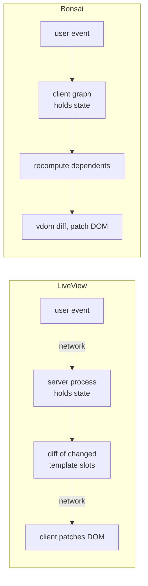
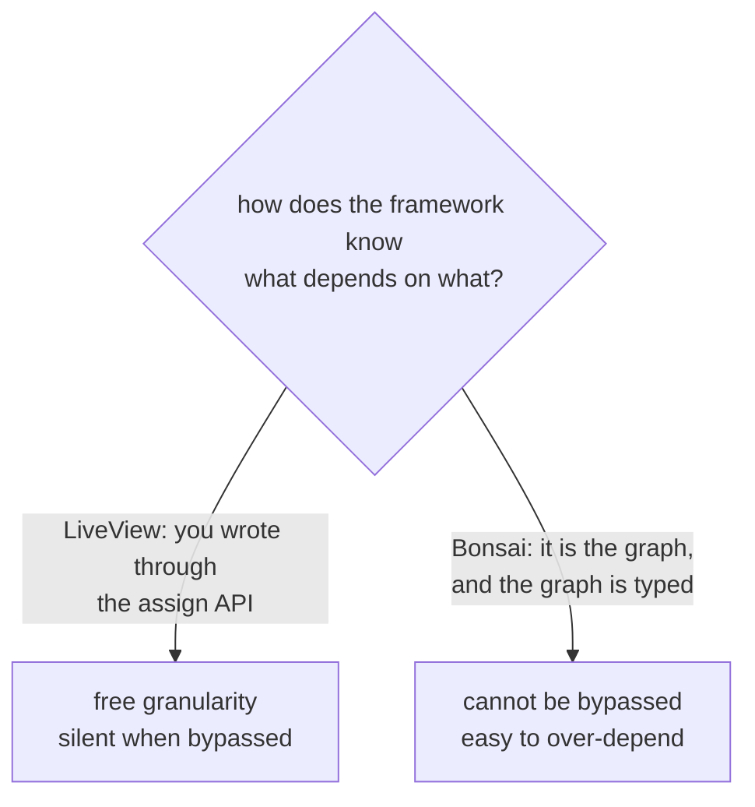

# Frontend development — Bonsai versus Phoenix LiveView

A focused comparison of the two as *tools you build a frontend with*: what the
day-to-day work feels like, what each makes easy, what each makes impossible,
and what Bonsai would need to close the difference.

The wider framework comparison is `PHOENIX_COMPARISON.md`; the server mapping is
`PHOENIX_DREAM_MAP.md`. This document is only about the frontend.

Bonsai facts come from the interfaces installed at our pin plus an executable
suite. Phoenix facts come from its documentation. That asymmetry is real and is
restated in §9.

---

## 1 · The one difference everything else follows from

**LiveView puts a network round trip in the middle of the state transition.
Bonsai does not.** Everything below is downstream of that.

It cuts both ways, and honestly. LiveView's placement means the server always
holds truth, the client never receives data it may not see, and any process in
the cluster can drive the UI. Bonsai's means interactions are instant, work
offline, and cost the server nothing after load.

---

## 2 · Building the same feature in each

A filtered, editable list — the most common frontend shape there is.

**In LiveView**, the shape of the work is: put the collection in the view's
assigns, render it in a template, bind a change event on the filter input, and
handle that event by recomputing the filtered collection and re-assigning it.
The framework diffs the template and sends only the changed slots. Filtering
costs a round trip. Editing a row costs a round trip. If the collection is
large you reach for streams, which stop retaining it server-side and send
insert/delete operations instead — the DOM becomes the storage.

**In Bonsai**, the shape is: a typed model, a pure transition function, one
state machine, and `assoc` over a map keyed by a domain identifier so each row
gets its own subgraph *and its own state*. Filtering is a derived value —
instant, no network. Editing a row recomputes that row only. The collection
lives in the client, so its size is a client memory question, not a
per-viewer server memory question.

The instructive part is what each makes you think about:

| Concern | LiveView pushes you to think about | Bonsai pushes you to think about |
|---|---|---|
| Where state lives | how much you hold per connected viewer | how the model is typed |
| Performance | payload size and round trips | which nodes depend on what |
| Correctness | whether change tracking is intact | whether the model makes bad states unrepresentable |
| Failure | what happens on reconnect | what happens when a component is inactive |

---

## 3 · Frontend developer experience

| Dimension | LiveView | Bonsai |
|---|---|---|
| Language for markup | a template dialect, HTML-aware, checked at compile time | OCaml expressions, or an HTML-like syntax extension |
| Type checking of the view | attributes and slots are declared and checked; the client boundary is **not** typed | the whole view is typed OCaml, including the event handlers |
| Event wiring | a string attribute paired with a handler clause — **a typo is a runtime error** | an effect value placed on an attribute — **a typo is a compile error** |
| Feedback loop | code reload on the next request; CSS hot-swaps without losing state | recompile the bundle |
| Component model | function components (stateless) and live components (stateful, shared process) | plain functions, with state where you ask for it |
| Styling | a CSS syntax extension with compile-time validation and scoped names | the same idea is available; the repo uses a design-token layer |
| Debugging | a production introspection console, latency simulation, debug mode | graph visualisation, node counts, per-node profiling, a watch that is a no-op unless enabled |
| Testing without a browser | drive the view by messages, assert on rendered HTML **strings** | drive the graph by injected actions, assert on **typed values** |
| First paint | real HTML before the socket upgrades | requires the bundle |

Two rows deserve emphasis because they are the substantive DX differences.

**Event wiring.** LiveView connects a DOM attribute string to a handler clause
by name. Nothing checks that the clause exists; a rename is a runtime failure.
In Bonsai the handler *is* a typed value placed on the attribute — there is no
name to get wrong. For a codebase that will be edited by agents, this is not a
small difference.

**Testing.** LiveView's harness is genuinely excellent — full lifecycle, no
browser, fast, parallel. But every assertion is a substring or selector match
over an HTML string, so restructuring markup breaks tests that were not testing
markup, and a loose assertion can pass over a broken interaction. Bonsai's
driver returns the component's actual result value, so assertions are typed.
Our own suite asserts on `int`s and records, not on rendered text.

---

## 4 · LiveView features, and the honest Bonsai answer

| LiveView feature | Bonsai today | Verdict |
|---|---|---|
| Server-held state, client holds nothing | inverted by design | different architecture, not a gap |
| Automatic change tracking to slot granularity | typed dataflow graph with explicit cutoffs | **parity**, with opposite failure modes (§5) |
| Two-phase mount, SSR for free | none | **gap**, matters for public pages, not for an authenticated dashboard |
| Live navigation preserving the process | a URL-var library | **partial** |
| Streams for collections larger than memory | not applicable — the client holds its own state | inverted |
| File upload with progress and cancellation | none | **real gap** |
| Forms: binding, per-field errors, recovery on reconnect | manual | **the largest real gap** |
| Async work with loading/error rendering | effects plus request-as-data, by convention | **gap** — should be a typed primitive |
| Client-side commands with no round trip | not applicable — everything is already client-side | inverted |
| Rate limiting at the binding | none built in | small gap, easily added |
| Presence | none | needs a server; out of scope here |
| Server push | polling | **the architectural gap** |
| Crash isolation per viewer | none — one event loop | **not portable**, it is a runtime property |
| Uploads direct to object storage | none | gap, only if ever needed |

**Summary: three real frontend gaps** — forms, uploads, async-as-a-primitive —
and all three are libraries. The one architectural gap is push, and the one
unreachable item is crash isolation.

---

## 5 · Change tracking — the sharpest technical contrast

Both frameworks avoid recomputing everything. They differ in *what enforces the
dependency*.

**LiveView** derives dependencies from the assign-writing API. Consequence: it
gets slot-level granularity for free, with no work from the developer. Also a
consequence: it is defeated **silently** by ordinary-looking code — a local
variable in a template, mutating assigns outside the API, or passing the whole
assigns collection into a child. Nothing fails; the page just re-sends more
than it needed to, forever, until someone profiles it.

**Bonsai** derives dependencies from the graph, and the graph is the type. It
cannot be silently defeated — a value you did not depend on is a value you
cannot read. Also a consequence: you can very easily build a node that depends
on *everything*, which is not silent but is equally slow, and which our own
frontend did (a 321-line map over all state, now caught by a lint rule).

The honest reading: **LiveView's failure is invisible, Bonsai's is visible.**
A visible failure is the better one to have, and it is why a lint rule can
catch ours.

---

## 6 · What Bonsai should adopt

Ranked by value per effort. None require architectural change.

**1 · Forms as a typed value.** The largest gap. A validation result carrying
proposed changes, per-field errors and validity, produced once by the domain and
consumed by the renderer. LiveView's version also recovers form contents after a
reconnect; ours loses in-flight input on reload, which is cheap to fix and
disproportionately annoying to lack.

**2 · Request-as-data as a primitive.** We *describe* the four-state request
pattern in the guide and the repo already models it in `ui_state.ml`. It should
be a typed component with a renderer that forces all four states to be handled,
rather than a convention each site re-implements.

**3 · Upload with progress.** Only if the product needs it. Chunked upload over
the existing transport with typed progress is a bounded piece.

**4 · Debounce and throttle at the binding.** LiveView makes these declarative
attributes. Ours would be a small combinator, and it removes a common source of
hand-rolled timers.

**5 · Server push.** Already the queued architectural slice, and the one that
would let a completed gate run update every open dashboard with no polling.

---

## 7 · What LiveView would want from Bonsai

Recorded because it explains why the conclusion is not "switch".

- **A typed client boundary.** LiveView event payloads arrive as untrusted maps
  and event names are unchecked strings.
- **Incrementality that cannot be silently defeated.**
- **Zero-latency interaction** for anything that is not a genuine server fact.
- **Typed test assertions** rather than substring matches over HTML.

---

## 8 · Verdict

For **this** system — a single-operator harness whose UI displays verification
evidence over a private network — Bonsai is the better fit, and the comparison
is not close on the axes that matter here: everything is typed end to end, the
UI cannot silently disagree with the harness about a field name, and
interactions do not pay a round trip to display data the client already has.

LiveView would be the better fit for a different product: public pages needing
first paint and indexing, many concurrent viewers whose data must not reach the
client, or a team that wants presence and server-driven UI without building a
transport.

The three frontend gaps worth closing are **forms, async-as-a-primitive, and
push**. None of them require becoming LiveView.

## 9 · Honest limits

- Phoenix was assessed from documentation, not by building an application in
  it. Documentation states intent; only use reveals friction. Every DX claim
  above should be read with that discount.
- Bonsai claims rest on the installed interfaces and an executable suite that
  currently passes 35 of 38 cases, with three findings open
  (`BONSAI_GUIDE.md` §10.1).
- No benchmark was run in either direction. Performance statements are
  structural — a round trip is a round trip — not measured.
- The browser evidence gathered so far covers published static pages, not the
  live application. Driving the running UI is a queued slice, and nothing here
  should be read as evidence about it.
