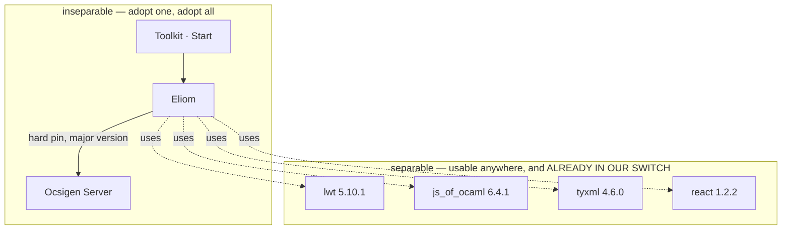

# Ocsigen and Eliom — ontology, three-way map, and the decision

The third framework in the comparison, and the one with a real claim on our
architecture: Eliom is the OCaml stack that puts client and server in **one
program** with a type-checked boundary.

Assessed from the project's own documentation and repository metadata; the
locally-installed pieces were verified in our switch. Where this document says
"absent", it means absent from everything retrieved — stated that way because
absence of documentation is weaker evidence than presence.

Companions: `PHOENIX_COMPARISON.md`, `PHOENIX_DREAM_MAP.md`,
`FRONTEND_LIVEVIEW_COMPARISON.md`.

---

## 1 · What Ocsigen is — the structural fact that decides everything

Ocsigen is **not one product**. It is a stack of independently versioned
packages, several of which are ecosystem infrastructure used far outside it,
plus **one framework** that ties them together.

**The asymmetry is the whole analysis.** You can adopt most of Ocsigen's value
without Eliom — and we already have: `lwt`, `js_of_ocaml`, `tyxml` and `react`
are installed here, and `js_of_ocaml` is what compiles our Bonsai frontend.
**You cannot adopt Eliom without also adopting Ocsigen Server**, which it pins
to a major version with no adapter seam. Eliom is the only piece that demands
wholesale adoption, because it is the only piece that is not a library.

---

## 2 · Glossary

| Term | Definition |
|---|---|
| **Section annotation** | A marker on a top-level binding declaring where it runs — server, client, or both. Top-level only; cannot nest. |
| **Client fragment** | An expression marked to evaluate in the browser, for which the server holds an **opaque handle it cannot read**. |
| **Injection** | The server-to-client data channel: a server value serialised and shipped with the page. **Cannot contain a closure.** |
| **Service** | A typed URL: path plus parameter types plus output type, as one value. Creation and registration are separate steps. |
| **Pathless / attached service** | Services identified by parameter rather than path, or created dynamically against a fallback — the continuation-style feature giving correct back-button semantics. |
| **Scope lattice** | group ⊃ session ⊃ process (one browser tab), each with three orthogonal storage kinds and its own cookie. |
| **Eliom reference** | A typed cell scoped to a point in that lattice. |
| **Comet channel** | Server push over long polling, in three buffering modes. |
| **F / D / C / R** | Four flavours of the same typed tree: by value, DOM-referenced, client-embedded, and reactive. |

---

## 3 · Eliom's distinguishing model

Four ideas, in the order they matter.

**Typed services are the real differentiator.** A service value *is* the URL:
path, parameter types and output type in one thing. Links and forms are built
from the service value, so the argument shape is derived from it. Rename a
route or change a parameter's type and every link and form **fails to compile**.
There is no reverse-routing table and no string URL. This is genuinely stronger
than anything in Dream or Phoenix.

**One program, two tiers.** Bindings carry annotations saying where they run;
client fragments give the server an unreadable handle to a future client value;
injections ship server data to the client. One source tree compiles to a native
server binary plus a JavaScript bundle plus a WebAssembly bundle.

**RPC is a function call.** A single annotation turns a server function into
something the client calls directly, with the type annotations mandatory
because they select the serialisers. Serialisation is a JSON deriver rather
than OCaml marshalling — deliberately, because the server cannot trust the
client. Exceptions do not cross; a server-side failure arrives as a string.

**Shared reactive rendering.** Signals that have both a server and a client
meaning: the server evaluates once to render real indexable first content, the
client takes over for updates, and the hydration boundary is type-checked. This
is the capability LiveView approximates and Bonsai lacks.

---

## 4 · The three-way capability map

| Capability | Phoenix | Dream | Eliom |
|---|---|---|---|
| Routing | compiled dispatch, verified paths | string patterns, `param` returns a **string** | **typed service values** |
| Reverse routing / link safety | verified at compile time | **absent** | **compile-time, strongest of the three** |
| Typed request parameters | changesets at the edge | manual | **combinator-typed** |
| Forms | changeset-driven, per-field errors | manual | **typed field names bound to the service** |
| Middleware | plug pipeline, composes as a monoid | ordinary function composition | **no per-route combinator** — server-level extensions instead |
| Sessions | cookie store | three backends | **group ⊃ session ⊃ tab lattice, richest of the three** |
| RPC / client calls | not applicable | manual | **one annotation, typed** |
| Server push | native, per-process | **WebSocket transport present** | **Comet long polling; WebSockets ABSENT** |
| WebSockets | yes | **yes** | **no** |
| HTTP/2 | yes | yes | **no** |
| Database | Ecto (separate, integrated) | `Dream.sql` over Caqti | **none** — key/value persistence only |
| GraphQL | no | yes | no |
| Testing story | three harnesses | request-level | **absent from documentation** |
| Observability | telemetry bus, live console | structured logging | **logs only; no metrics or tracing** |
| Client UI | LiveView | none — bring your own | **its own, and it must be its own** |
| Mobile from one source | no | no | **yes** |
| Embeddable as a library | no | **yes** | no — pins its server |
| Concurrency substrate | BEAM | agnostic | **Lwt, by explicit long-term decision** |

---

## 5 · The finding that decides it

**Eliom has no WebSockets.** Its push story is Comet long polling with a
ten-second request cap.

Our single identified architectural gap is **server push** — a completed gate
run should update every open dashboard without polling. Dream already has the
WebSocket transport; what is missing is only the topic layer above it.

So adopting Eliom would **cost us the very capability we set out to gain**,
replacing an available WebSocket transport with long polling. That is not a
close call.

Three further disqualifiers for this system specifically:

1. **The Bonsai frontend would be a rewrite.** Eliom's client tree is TyXML
   driven by React signals and reactive lists; Bonsai composes a typed
   incremental graph with explicit state machines and scoped models. There is
   no mechanical translation. Serving the Bonsai bundle as an opaque script
   from an Eliom page is possible — and it is the trap: injections, client
   fragments, shared sections, client-side services and shared reactive
   rendering all become unavailable, so **you pay Eliom's entire tax and
   receive none of its benefit**.
2. **No database layer and no testing story.** We would carry our own anyway,
   but it means Eliom's surface is narrower than its reputation suggests.
3. **It replaces the server outright.** The major-version pin means Dream is
   removed, not adapted, and everything Dream owns — TLS, ports, static files,
   logging, shutdown — moves into a different configuration model.

---

## 6 · What we should take anyway

The separable pieces are the point, and three of four are already here.

| Piece | Status | Action |
|---|---|---|
| `js_of_ocaml` | installed, load-bearing — compiles our frontend | none, already relied on |
| `lwt` | installed | none |
| `react` | installed | none |
| `tyxml` | installed, **not used** | **evaluate** — typed HTML would strengthen any server-rendered markup we emit, and it works under Dream today |

**The one idea worth stealing outright is typed services.** Eliom's
service-value-as-URL is the strongest link-safety story of the three
frameworks, and it does not require Eliom: a variant of routes plus a total
path function makes a broken link a compile error. That is already the second
item on the Phoenix work list, and Eliom is independent evidence that it is the
right shape.

---

## 7 · Verdict

**Evaluate the libraries, do not adopt the framework.** Confirmed rather than
assumed — the earlier draft flagged this as unverified, and the research
changed one thing materially: the reason is no longer "we already solve typed
client/server sharing", it is that **Eliom lacks WebSockets and would force a
frontend rewrite**, which are concrete and checkable.

Eliom is justified when the multi-tier guarantees *are* the product
requirement: typed links, typed RPC, tab-scoped state, shared reactive
server-side rendering, and a mobile build from one source. For a
single-operator verification harness whose UI displays evidence over a private
network, they are not.

Worth recording as a mark of the project's seriousness rather than against it:
the maintainers migrated the entire stack to a different concurrency substrate,
got it working, measured it, and then **declined to release it** — because
losing function colouring removes the only cue distinguishing a local
computation from a network round trip, which matters more in a multi-tier
framework than anywhere else. That is a project that throws away working code
for a principled reason.

## 8 · Honest limits

- Assessed from documentation and repository metadata, not by building on it.
- "Absent" means absent from everything retrieved. The project's own
  documentation site has broken internal links and a recently changed URL
  scheme, so a capability could exist and be undocumented.
- Only `lwt`, `tyxml`, `js_of_ocaml` and `react` were verified locally; Eliom
  and Ocsigen Server are **not installed here** and were not executed.
- Release cadence is uneven across the stack — one load-bearing library's last
  tagged release is years old despite steady commits. That is a maintenance
  consideration, not a correctness one.
