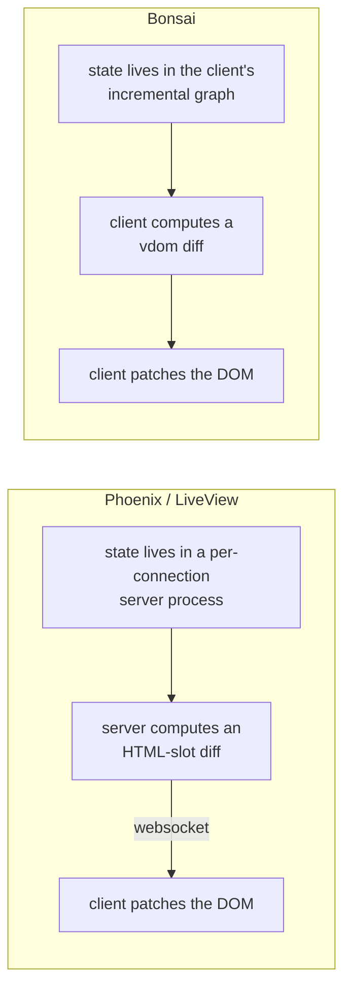
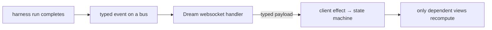

# Bonsai and Phoenix — capability comparison and evolution path

The goal set for this analysis was *functional equivalence with Phoenix*. This
document establishes what that would actually require, by comparing the two
honestly rather than favourably.

Sources: the Phoenix and LiveView guides and module documentation, and the
Bonsai interfaces installed at our pin. Prose and analysis are this
repository's own.

---

## 1 · The headline, stated plainly

**Bonsai and Phoenix are not competitors, and treating them as such is the
first error.** Bonsai is a UI library. Phoenix is an application framework that
contains a UI library.

LiveView — Phoenix's UI half — and Bonsai solve the *same* problem (keep a view
consistent with changing state, cheaply) at *opposite ends of the wire*. That
part is a genuine comparison. But LiveView is perhaps a fifth of what Phoenix
ships. The rest — routing, the request pipeline, authentication, authorization
scoping, PubSub, presence, mailers, i18n, telemetry, a production introspection
console, code generators, releases — has no Bonsai counterpart because it is
*not a UI concern*.

So "functional equivalence with Phoenix" decomposes into two very different
programmes:

| Programme | Scope | Difficulty |
|---|---|---|
| **A · Match LiveView** | the UI layer | mostly already true, with real gaps |
| **B · Match the framework** | everything else | building a web framework |

This document scopes both, and recommends against most of B.

---

## 2 · The structural difference

Everything else follows from where the state sits.

| Axis | Phoenix / LiveView | Bonsai |
|---|---|---|
| State location | server, one process per viewer | client, in the graph |
| Incrementality | tracked by the assign-write API, down to template slots | tracked by the typed dataflow graph, with explicit cutoffs |
| How it is enforced | **convention** — silently defeated by a local variable in a template, by mutating assigns outside the API, or by splatting assigns into a child | **types** — dependencies *are* the graph; you cannot read an untracked value |
| Cost per interaction | one network round trip, unless it is a client-side command | zero |
| Concurrency | one preemptively-scheduled process per view, crash-isolated | single-threaded event loop |
| Server push | native — any process can message a view | needs an explicit transport |
| First paint | real HTML, then the socket upgrades | requires the bundle |
| Offline | impossible by construction | natural |
| Server cost | scales with *concurrent viewers*, each holding state | scales with requests only |
| Client boundary typing | untyped DOM attributes and JSON event payloads | end-to-end typed, including RPC |

**Two observations that matter more than the table.**

The first is that each framework's incrementality has the *opposite* failure
mode. LiveView tracks change for free all the way down to an HTML slot, but its
tracking is defeated by ordinary-looking code and fails *silently*. Bonsai
cannot be silently defeated — the graph is the dependency — but its diffing
below the graph is not incremental, and it is easy to build a node that depends
on everything, which our own frontend did.

The second is that Phoenix's real advantage over a client-rendered
architecture is not rendering at all: **the data a user may not see never
crosses the network**, because the client receives only rendered output. In a
client-rendered app, hiding a field in the UI is not a security control. That
is a structural property, and it is why Phoenix's authorization scoping applies
at the *query*.

---

## 3 · Programme A — matching LiveView

Where Bonsai stands against LiveView's UI feature set.

| LiveView capability | Bonsai today | Gap |
|---|---|---|
| Declarative state → view | yes, and more strongly typed | none |
| Fine-grained change tracking | yes, and type-enforced | none |
| Keyed collections | `assoc`, with per-key state and diffing | none |
| Component-local state | yes | none |
| Lifecycle hooks | activate, deactivate, before and after display | none |
| Async state with loading/error rendering | effects plus a request-as-data model | **convention, not a primitive** — LiveView ships a three-state async result and a renderer for it |
| Client-side commands with no round trip | not applicable — everything is already client-side | inverted: Bonsai wins |
| Form binding and validation | manual | **gap** — no changeset-equivalent, no form recovery, no per-field error plumbing |
| File uploads with progress | none | **gap** |
| Live navigation and URL as state | a URL-var library exists | partial |
| Presence | none | **gap** (needs a server) |
| Server-pushed updates | polling RPC | **gap** — no push transport |
| Streams (server renders more than it holds) | not applicable — the client holds its own state | inverted |
| Testing without a browser | driver-based; our suite runs 38 cases headlessly | comparable |
| Compile-time template checking | stronger — the whole view is typed OCaml | Bonsai wins |

**Assessment:** on the UI axis Bonsai is at rough parity and is *stronger* on
typing, on latency, and on the impossibility of silently defeating
incrementality. The genuine UI gaps are **forms**, **uploads**, and
**async-as-a-primitive** — all of which are libraries, not architecture.

---

## 4 · Programme B — matching the framework

This is the part that is not a UI question. Ranked by whether it is worth
doing, for a system whose UI is an evidence display over a verification
harness.

| Capability | Effort | Verdict for this repository |
|---|---|---|
| Routing with compile-time-verified paths | moderate | **worth it** — we already have a typed route module; verified construction is a natural extension |
| Request pipeline with composable stages | moderate | partially present in the Dream backend |
| Authentication and session tokens | large | **only if** the dashboard ever leaves the private network |
| Authorization scoping at the query | moderate | **worth it in principle** — the evidence DB has no per-user scoping because it has no users |
| PubSub and server push | large | **the highest-value gap**, see §5 |
| Presence | large | not needed — single-operator system |
| Mailer | small | not needed |
| Internationalisation | moderate | not needed |
| Telemetry and metrics | — | **already have it**, and arguably better: report-only projections with OTLP spans |
| Production introspection console | — | **already have it** — the dashboards, the wiki, the ZK graph |
| Code generators | moderate | we generate ledgers, tables and docs already; UI scaffolding is not the bottleneck |
| Releases and clustering | large | not applicable |
| Hot code reloading | — | the Zig VM has this as a *subject*; the harness does not need it |
| Asset pipeline | small | already generated |

**Assessment:** most of Programme B is not a gap, it is a *different product*.
Phoenix's batteries exist because it targets multi-tenant public web
applications. This system is a single-operator verification harness whose UI
displays evidence. Adopting authentication, presence, mailers and i18n would be
building capability nobody has asked the system to have.

---

## 5 · The one gap actually worth closing

**Server-pushed state.** Everything else in Programme B is either present,
unnecessary, or a library. This one is architectural, and it is the single
place where LiveView's design is genuinely better for our use case.

The harness's UI displays *live* evidence: gate runs, ledgers, conformance
verdicts, kanban position. Today the client polls. Under LiveView's model, the
harness process would push — a gate run completing would update every open
dashboard with no polling loop, no staleness window, and no wasted queries.

Bonsai can do this; it simply has no transport for it, because the transport is
a *server* concern. The shape:

Three properties this repository would need to hold it to, all consistent with
the existing rules: the payload is a **typed OCaml value** with a round-trip
law, not ad-hoc JSON; the push is **report-only** and can never mint gate
state; and a dropped connection degrades to the current polling path rather
than to a silently stale view.

That is a bounded slice, and it is the recommendation.

---

## 6 · What each framework should learn from the other

**What Bonsai practice should adopt from Phoenix:**

- **The request-as-data pattern as a primitive**, not a convention. LiveView's
  three-state async result with a matching renderer removes an entire class of
  half-handled loading states. We describe this pattern in the guide; it should
  be a typed component.
- **Form recovery.** LiveView re-submits form values after a reconnect. Our UI
  loses in-flight input on reload. Cheap to add, disproportionately annoying to
  lack.
- **Authorization at the query, not the display.** Even without users, the
  principle applies: a view should be handed the data it may show, not the data
  it must filter.
- **Generators that emit tests.** Phoenix generates a resource *and* its tests.
  Our generators emit ledgers and docs but not tests.

**What Phoenix practice would gain from Bonsai's model** — noted because it
explains why we are not simply switching:

- Incrementality that **cannot be silently defeated**. LiveView's tracking is
  bypassed by a local variable in a template; Bonsai's is the type system.
- **Zero-latency interaction** for anything that is not a genuine server fact.
- **A typed client boundary.** LiveView's event payloads arrive as untrusted
  maps and a typo in an event name is a runtime error. Ours is a compile error.

---

## 7 · Recommendation

1. **Do not pursue framework equivalence.** Most of Phoenix's surface is
   capability this system has no requirement for, and the parts that matter —
   telemetry, introspection, evidence display — this repository already has in
   a form better suited to its purpose.
2. **Close the push gap.** One bounded slice: a typed event bus from the
   harness, a websocket handler in the existing backend, a typed payload with a
   round-trip law, degrading to polling.
3. **Adopt three patterns as typed components**: request-as-data, form state
   with recovery, and a validation model with per-field errors.
4. **Keep the typing advantage.** It is the reason the comparison favours us
   where it does, and it is the thing most easily lost by copying a framework
   built in a dynamically-typed language.

## 8 · Honest limits of this analysis

- Phoenix was assessed **from its documentation**, not by building an
  application in it. Documentation describes intent; only use reveals
  friction.
- No benchmark was run against either framework. The performance statements
  here are structural (a round trip is a round trip) rather than measured.
- LiveView's wire encoding is not publicly specified in detail, so statements
  about what travels are at the level of documented semantics.
- The Bonsai side is grounded in the installed interfaces and an executable
  suite that currently passes 35 of 38 cases; three findings are open and
  recorded in `BONSAI_GUIDE.md` §10.1.
