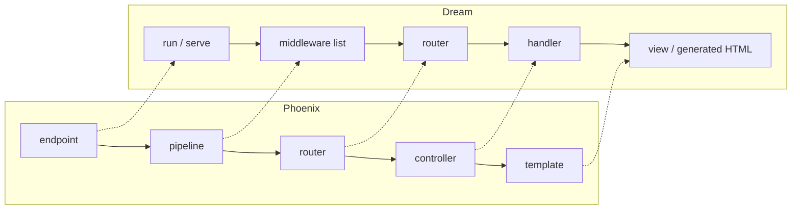
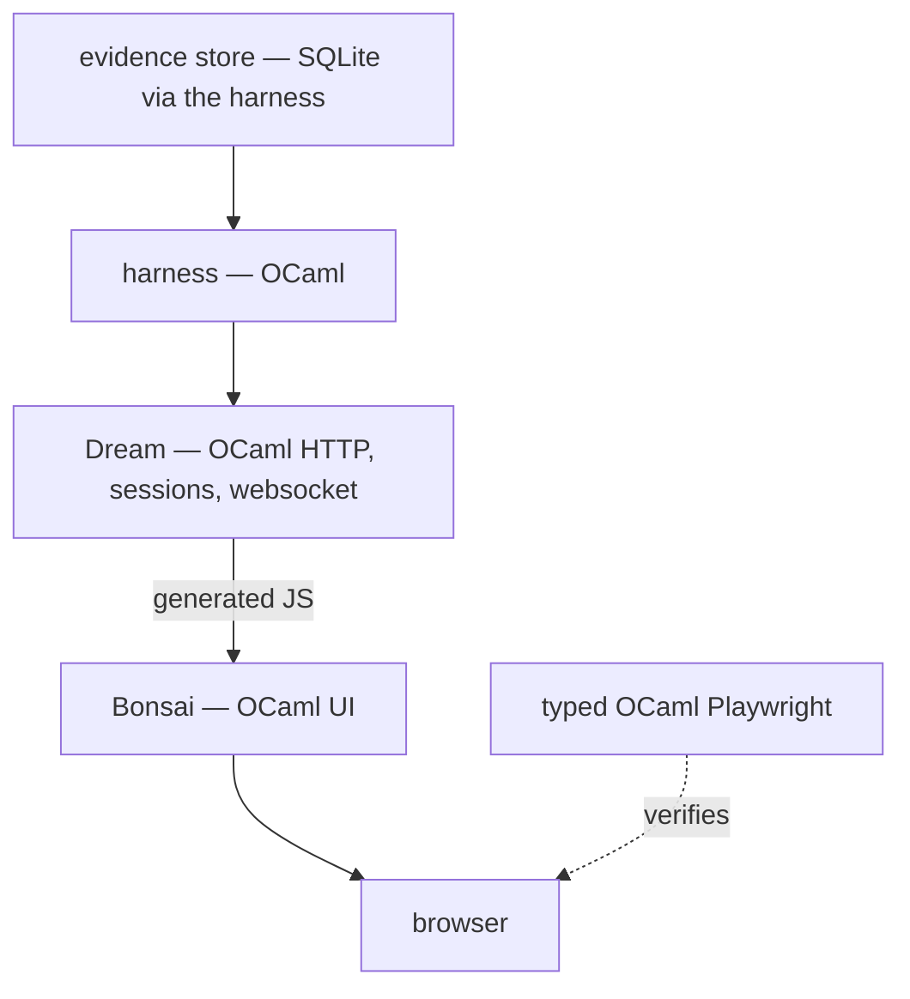

# Phoenix → Dream — capability mapping

What Phoenix's server-side surface corresponds to in Dream, the OCaml web
framework this repository already runs (`zigvm-web`, the backend behind the
Bonsai dashboard).

Grounded in the **installed interface** at our pin, read directly rather than
recalled. Phoenix is assessed from its documentation. Where the two disagree
with anything written here, the installed interface wins.

This is the document that turns "be functionally equivalent to Phoenix" from an
aspiration into a work list — and, in several rows, into a decision not to
work.

---

## 1 · The shape of the answer

Dream covers **more of Phoenix's server surface than expected**, and the parts
it covers, it covers with the same fundamental idea: a request threaded through
composable middleware into a compiled router.

The correspondence is close because both are folds over a connection value. The
divergence is not in the pipeline — it is in **what sits above it**: Phoenix
adds a live UI layer, a domain-layer convention, code generation, and an
authentication system. Dream stops at the web layer, deliberately.

---

## 2 · Capability mapping

Legend — **Direct**: Dream provides it. **Partial**: present but narrower.
**Absent**: would have to be built. **N/A**: not applicable to this system.

### 2.1 Request handling

| Phoenix | Dream | Status |
|---|---|---|
| endpoint as supervised entry | `run`, `serve`, `with_site_prefix` | **Direct** |
| plug pipeline | middleware composition, `pipeline`, `no_middleware` | **Direct** |
| router with verb macros | `router`, `get`, `post`, `put`, `delete`, `head`, `options`, `patch`, `any` | **Direct** |
| route scopes | `scope`, `no_route` | **Direct** |
| path parameters | `param` | **Direct** |
| **compile-time verified paths** | — | **Absent** — see §4, the top recommendation |
| controller actions | ordinary handler functions | **Direct** (simpler: a handler *is* a function) |
| response builders | `respond`, `html`, `json`, `redirect`, `empty`, `status` | **Direct** |
| header and status control | `header`, `set_header`, `add_header`, `set_status`, the full status algebra | **Direct** |
| fallback error mapping | `catch`, `error_template`, `debug_error_handler` | **Direct** |
| static file serving | `static`, `from_filesystem`, `mime_lookup` | **Direct** |
| request/response streaming | `stream`, `read_stream`, `write_stream`, `flush_stream`, `close_stream` | **Direct** |

### 2.2 State, security, forms

| Phoenix | Dream | Status |
|---|---|---|
| sessions | `session_field`, `set_session_field`, `drop_session_field`, `all_session_fields`, `invalidate_session` | **Direct** |
| session backends | `memory_sessions`, `cookie_sessions`, `sql_sessions` | **Direct**, three backends |
| cookies | `cookie`, `set_cookie`, `all_cookies`, `to_set_cookie`, `from_cookie` | **Direct** |
| CSRF protection | `csrf_token`, `verify_csrf_token`, `csrf_tag`, `origin_referrer_check` | **Direct** |
| flash messages | `flash`, `flash_messages`, `add_flash_message` | **Direct** |
| form handling | `form`, `multipart`, `upload`, `upload_part` | **Direct**, including uploads |
| secrets and crypto | `set_secret`, `encrypt`, `decrypt`, `random` | **Direct** |
| **changeset-style validation** | — | **Absent** — validation as a *value* is a pattern, not a library; see §4 |
| authentication system | — | **Absent** — Phoenix *generates* one; Dream has the primitives |
| authorization scoping | — | **Absent** as a convention; nothing prevents it |

### 2.3 Realtime

| Phoenix | Dream | Status |
|---|---|---|
| websockets | `websocket`, `send`, `receive`, `receive_fragment`, `close_websocket` | **Direct** |
| channels — process per client per topic | — | **Partial** — the socket exists; the multiplexing, join and topic model do not |
| pubsub | — | **Absent** |
| presence | — | **Absent** |
| server-pushed UI | — | **Absent** — and this is the one gap worth closing |

### 2.4 Data, observability, operations

| Phoenix | Dream | Status |
|---|---|---|
| database pool | `sql_pool`, `sql` | **Direct** |
| schemas and migrations | — | **N/A** — this system's evidence store is owned by the harness |
| structured logging | `logger`, `log`, `error`, `warning`, `info`, `debug`, `sub_log`, `set_log_level` | **Direct** |
| telemetry bus and metrics | — | **Absent in Dream**, but **already present** in this repository — the report-only metrics and span projections |
| production introspection console | — | **Absent in Dream**, **already present** here — dashboards, wiki, knowledge graph |
| live code reload | `livereload` | **Direct** |
| test support | `test`, `request`, `echo`, `sort_headers` | **Partial** — request-level, no channel or live-view harness |
| mailer, i18n, generators, releases | — | **N/A** for this system |
| GraphQL | `graphql`, `graphiql` | Dream has it; Phoenix does not, natively |

---

## 3 · Scorecard

| Phoenix area | Coverage |
|---|---|
| Request pipeline and routing | **~90%** — everything but verified paths |
| Sessions, cookies, CSRF, flash, forms, uploads | **~95%** |
| Websocket transport | **~100%** at the transport level |
| Channel/topic/presence model above the socket | **~10%** |
| Live UI layer | **N/A** — Bonsai occupies this, from the other side of the wire |
| Domain conventions, generators, auth system | **~0%**, by design |
| Observability | **Absent in Dream; already solved here** |

**The honest summary:** Dream plus Bonsai already covers most of what Phoenix
does *that this system needs*. The uncovered areas divide cleanly into one gap
worth closing, two patterns worth adopting, and a large remainder that is a
different product.

---

## 4 · The work list

Ranked. Each item states what it buys and what it costs.

### 4.1 Worth doing

**1 · Typed event push (the one architectural gap).**
Dream has websockets; what is missing is the layer above — a typed event, a
topic, and a push from the harness to open dashboards. Today the UI polls, so
evidence is stale by up to the polling interval and every open tab costs
queries. The slice: a typed OCaml event with a round-trip law, a websocket
handler over `websocket`/`send`, a client-side effect feeding a state machine,
report-only so it can never mint gate state, degrading to the current polling
path on disconnect. This is already queued.

**2 · Compile-time verified routes.**
Phoenix's strongest transferable idea. The repository already has a typed route
module; what is missing is that *link construction* goes through it, so a route
that does not exist cannot be written down. In OCaml this is more natural than
in a dynamic language — a variant of routes plus a total `to_path` function
makes a broken link a compile error rather than a 404. Small, high value,
mostly a discipline change.

**3 · Validation as a value.**
Not a library — a pattern. A typed validation result carrying proposed changes,
per-field errors and validity, produced once by the domain and consumed by the
form renderer. This closes the largest *UI* gap identified in the comparison,
and it removes the duplicate-validation class entirely.

### 4.2 Worth adopting as convention, not code

**4 · Halt on reject.** Dream's middleware composes; the discipline that a
rejecting stage must terminate the chain rather than merely set a status is a
review rule worth writing down. In Phoenix this is a framework primitive; here
it is a convention, and conventions need a stated law.

**5 · Authorization before data.** Even with a single operator, deciding what
may be read at the *query* rather than at the render is the right shape, and it
is what makes a future multi-viewer story possible without a rewrite.

**6 · Generators emit tests.** This repository generates ledgers, tables and
documents; Phoenix generates a resource *and* its tests. Cheap to adopt.

### 4.3 Explicitly not worth doing

Authentication systems, presence, mailers, internationalisation, releases and
clustering, database migrations, and code scaffolding for CRUD. Each targets
multi-tenant public web applications. This is a single-operator verification
harness whose UI displays evidence. Building these would be adding capability
nobody has asked the system to have, and every one of them is a maintenance
surface that must then be kept correct.

Two Phoenix strengths deserve explicit mention as **already solved here, and
arguably better for this purpose**: telemetry, where this repo has report-only
metric and span projections with a law forbidding them from minting gate state;
and production introspection, where the dashboards, wiki and knowledge graph go
considerably further than a process list.

---

## 5 · The one thing Dream cannot borrow

Phoenix's per-viewer isolation — a preemptively scheduled process per live view,
with its own heap, crashing alone — is a property of its **runtime**, not of the
framework. It is not portable by adopting an API.

Worth stating plainly because it bounds the whole exercise: functional
equivalence with Phoenix's *feature list* is achievable; equivalence with its
*failure semantics* is not, without the runtime underneath. The mitigations
available here are the ordinary ones — keep state small, keep it recoverable
from the URL and the evidence store, and make reconnect a remount rather than a
resync. Which is, notably, exactly what Phoenix's own documentation recommends
for the same reason.

---

## 6 · The all-OCaml full stack, and where Ocsigen sits

The stated goal is full-stack development in OCaml components only. **That is
already this repository's architecture and its binding rule** — three authored
languages, with all tooling and all web code in OCaml, browser JavaScript
generated rather than written. The stack today:

Every box is OCaml. The only generated artefact is the browser bundle, and the
verification loop closes in OCaml too. So the goal is not a migration — it is
already the constraint, and the work list in §4 is what completes it.

### Ocsigen / Eliom — assessed, not verified

**Not installed in this switch** (only `lwt` and `tyxml` are present, and
neither implies it). Everything in this subsection is therefore *general
knowledge, not observation*, and must be verified against a real installation
before any decision rests on it. That distinction matters here more than usual,
because this document's value is that everything else in it was read from an
installed interface.

The reason it is worth evaluating at all: Eliom's distinguishing idea is
**shared client/server code with typed services** — one program, annotated by
where each fragment runs, with the client/server boundary type-checked rather
than convention-checked. That is the one architectural idea in the OCaml web
space that Dream does not have and that would address the *typed client
boundary* problem from a different direction than Bonsai does.

Against adopting it, three things worth weighing before spending any effort:

1. It is a **different architecture**, not an addition. Eliom's model competes
   with the Dream-plus-Bonsai split rather than composing with it; adopting it
   would mean rewriting the web layer, not extending it.
2. This repository's pins are exact and its patch mailboxes tracked. Adding a
   second web framework doubles that surface.
3. The problem Eliom solves best — typed client/server sharing — is **already
   solved here** by both sides being OCaml with a typed RPC surface. The
   remaining gap is push, not typing.

**Recommendation: evaluate, do not adopt.** A time-boxed spike that installs it
and measures the boundary-typing story against our existing RPC path would
settle it. Until that spike exists, nothing here should be cited as a reason to
change direction.

## 7 · Honest limits

- Dream's surface was read from its installed interface; behaviour was not
  exercised beyond what this repository already runs.
- Phoenix was assessed from documentation only.
- Coverage percentages are judgement, not measurement. They express whether a
  capability is *present*, not whether it is equally good.
- No performance comparison was attempted in either direction.
