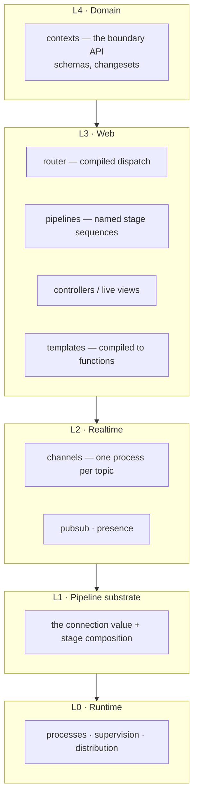
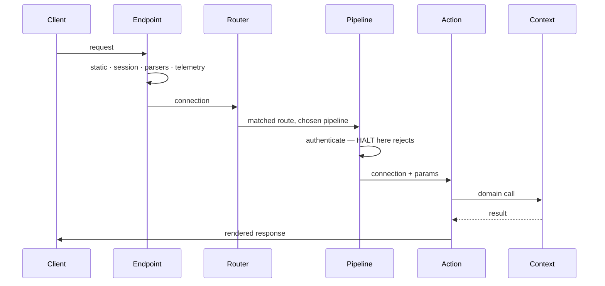
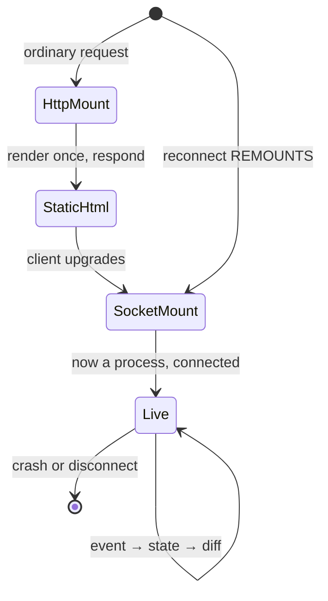

# Phoenix — fractal ontology, algebra and patterns

The Phoenix framework analysed in the same shape this repository uses for every
subsystem it depends on. Written so the comparison in `PHOENIX_COMPARISON.md`
and the mapping in `PHOENIX_DREAM_MAP.md` rest on a stated model rather than an
impression.

Assessed **from its documentation**, not by building an application in it —
that limit is repeated in §9 because it bounds every claim here.

---

## 1 · What kind of thing Phoenix is

Phoenix is an **application framework** whose central abstraction is a single
value threaded through a pipeline of functions. Everything else — routing,
controllers, templates, even the live UI layer — is arranged around that one
idea, and around the fact that it runs on a runtime providing lightweight
preemptively-scheduled processes with isolated heaps and supervision.

Two facts generate almost every property worth knowing:

1. **The connection is a value, and handling is a fold over it.** There is no
   request object and separate response object, no middleware stack with its
   own protocol. A stage is a function from the connection to the connection.
2. **Concurrency and fault isolation come from the runtime, not the
   framework.** Phoenix does not implement per-viewer isolation; it *inherits*
   it. A crash in one viewer's live process is invisible to every other.

---

## 2 · The fractal layers



The layering is strict in one direction that matters for review: **the domain
layer does not know the web layer exists.** Generated projects physically
separate them into two trees, and the data-access module lives in the domain
half. A controller calling the database directly is the canonical smell.

---

## 3 · Glossary

| Term | Definition |
|---|---|
| **Connection** | The single struct carrying both request and response. Threaded through every stage. |
| **Stage** | A function from connection to connection, or a module exposing an initialisation and a call function. The universal unit of composition. |
| **Endpoint** | The outermost stage sequence, and the supervised process that owns the web server. |
| **Router** | The final stage of the endpoint; compiles routes into pattern-matched dispatch rather than a runtime table scan. |
| **Pipeline** | A named, reusable stage sequence attached to a route scope. |
| **Scope** (routing) | A path and module prefix applied to a group of routes. |
| **Scope** (authorization) | A struct carrying the current actor and permissions, threaded into domain functions so filtering happens at the query. |
| **Controller** | A module of actions; each action is a function of connection and parameters. |
| **Context** | The domain boundary module. The web layer calls contexts, never the data layer. |
| **Schema** | The typed shape of a persisted record. |
| **Changeset** | A validation and change-tracking value carrying the proposed changes, the errors, and validity. **The shared currency between the data layer and the UI.** |
| **Template** | Markup compiled to a function of assigns; HTML-aware at compile time, escaping by default. |
| **Function component** | A function from assigns to markup. The universal view unit. |
| **Assigns** | The map of values a view renders from. |
| **Live view** | A process holding state on the server for the lifetime of a connection, rendering diffs to the client. |
| **Live component** | Stateful, but runs *inside* the parent's process; identity is module plus id. |
| **Channel** | One process per client per topic, with join, inbound and outbound callbacks. |
| **Topic** | The string routing key a channel is joined on. |
| **Presence** | Cluster-wide tracking of who is on a topic, with conflict-free merge semantics. |
| **Stream** (live) | A collection rendered but *not retained* server-side; the client's DOM becomes the storage and the server sends operations. |
| **Telemetry event** | A name, measurements and metadata, emitted on a shared bus that any reporter may consume. |

---

## 4 · The algebra of the pipeline

This is the part worth stating formally, because it is what makes the framework
composable at all.

```text
  Carrier      Conn                  the connection value
  Stage        Conn -> Conn          a handling step
  Compose      (∘) with short-circuit
  Identity     the stage that returns its input unchanged
```

Stages form a **monoid** under composition, with the identity stage as unit.
Composition is associative: grouping stages into a named pipeline and then
attaching that pipeline is indistinguishable from listing the stages inline.
That associativity is precisely what lets a pipeline be a first-class, reusable,
nameable thing.

The one departure from a plain monoid is the **halt** flag: a stage may mark the
connection halted, and subsequent stages are skipped. Formally this makes the
carrier a two-state value — *continuing* or *halted* — and composition short-
circuits on the second. It is the same shape as an error monad, and it is the
entire authorization-rejection mechanism: an authorization stage that halts is a
guarantee that nothing downstream runs.

**The law that follows** and that review should check: *a stage that rejects
must halt.* A stage that sets an error status without halting is a security
defect, not a style issue, because the action still executes.

### 4.1 Routing as compiled dispatch

Routes are not matched by scanning a table at runtime; they compile into
pattern-matched dispatch on method and path segments. Two consequences: lookup
does not degrade with route count, and the route set is *known at compile time*
— which is what makes compile-time-verified path construction possible. A path
built with the verified form fails to compile if no route matches it.

This is the single most transferable idea in Phoenix for a typed language, and
it is the first recommendation in the Dream mapping.

### 4.2 The changeset as a shared value

A changeset carries proposed changes, accumulated errors, and validity. The
same value is produced by the data layer and consumed by the form renderer.
There is **one** validation implementation, not a server one and a client one.

This is worth naming as an architectural pattern independent of Phoenix:
*validation is a value, not a procedure*. It is the reason the form layer needs
no duplicate schema.

---

## 5 · Dynamic behaviour

### 5.1 A request



### 5.2 A live view's two-phase connection

The property most likely to surprise: **a live view mounts twice.** First over
plain HTTP, rendering static markup for first paint and indexing; then again
over the socket, as a long-lived process. Work that must happen once —
subscriptions, timers — must be guarded on the connected phase, or it happens
twice.



### 5.3 Change tracking, and how it is defeated

At compile time a template is split into a fixed part and an indexed dynamic
part. The fixed part is sent once. At runtime only the dynamic slots whose
inputs changed are re-evaluated and re-sent.

The tracking is derived from **the assign-writing API**. So it is defeated,
silently, by: introducing a local variable in a template (the framework cannot
track a variable); mutating the assigns map outside the API; and passing the
whole assigns collection into a child, which makes every assign a dependency of
that subtree.

**This is the sharpest contrast with a typed dataflow model**, and it is worth
stating precisely: LiveView gets slot-level granularity for free but the
tracking is a convention with silent escape hatches, whereas a graph-based model
cannot be silently defeated but pays for its own diffing below the graph.

---

## 6 · Patterns

| Pattern | What it is | Why it works |
|---|---|---|
| **Context boundary** | the web layer calls a domain module, never the data layer | the domain stays testable and reusable; the boundary is a compile-time fact |
| **Changeset as currency** | validation is a value produced once and consumed by the UI | one implementation, no duplication |
| **Halt on reject** | authorization stages halt rather than set a status | downstream cannot run by accident |
| **Scope threaded into queries** | the actor is a parameter to domain functions, so filtering is in the query | authorization is applied before data exists, not before it is displayed |
| **Fallback handler** | a chain returning tagged results is mapped centrally to responses | error mapping lives in one place |
| **State in the URL** | view state expressed as route parameters | recoverable, shareable, and survives a remount |
| **Stream for large collections** | render without retaining; send operations | server memory decoupled from collection size |
| **Presentation-only optimism** | client-side commands for show/hide/transition; never for state | no reconciliation problem, because no client state |

## 7 · Anti-patterns

| Smell | Cost |
|---|---|
| Data access from a controller or view | the domain becomes untestable and the boundary erodes |
| A rejecting stage that does not halt | the action still runs — a security defect |
| Authorization decided from request parameters | the client controls the check |
| Trusting that the UI hid a control | the server must re-check on every entry point |
| A local variable in a template | change tracking silently degrades to always-changed |
| Passing the whole assigns collection to a child | every assign becomes a dependency of the subtree |
| Holding a large collection in view state | server memory scales with collection size per viewer |
| Data-dependent work on activation | it runs before the data arrives |
| Stateful components used for code organisation | they exist for encapsulated state; a plain function component is simpler |
| Pushing a server stream to a browser client | a backgrounded tab throttles, and the queue accumulates on both ends |

---

## 8 · Quality attributes — how Phoenix achieves each

| Attribute | Mechanism |
|---|---|
| **Correctness** | compile-time template and route checking; validation as a value |
| **Modularity** | domain and web physically separated; stages compose as a monoid |
| **Evolvability** | generators emit code you own rather than framework internals you inherit |
| **Speed** | compiled dispatch; statics sent once; diffs thereafter |
| **Robustness** | per-viewer process isolation; supervision; crash means remount, not cascade |
| **Dependability** | at-most-once delivery stated honestly, with client rejoin and backoff |
| **Durability** | state kept in the URL and the database precisely *because* processes die |
| **Observability** | one telemetry bus; declarations decoupled from reporters; runtime introspection across the cluster |
| **Beauty** | one idea — thread a value through functions — applied consistently enough that the whole framework is learnable from it |

The transferable lesson is the last row. Phoenix's coherence comes from
refusing to introduce a second composition mechanism.

---

## 9 · Honest limits

- Assessed from documentation. Documentation states intent; only building
  reveals friction.
- No benchmark was run. Performance statements here are structural.
- The live layer's wire encoding is not publicly specified in detail; claims
  are at the level of documented semantics.
- Scaling figures published by the project are vendor claims and are not
  reproduced here as facts.
