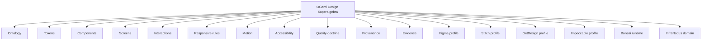
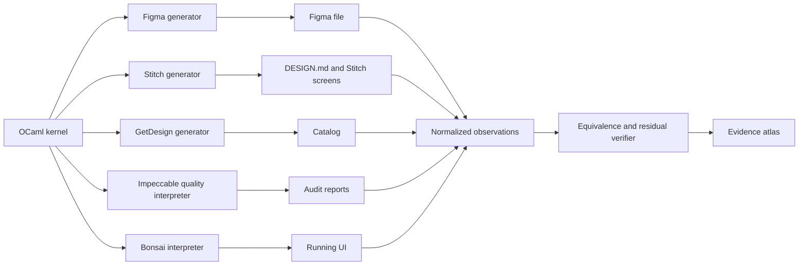
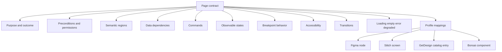
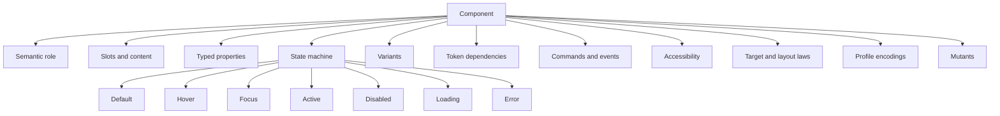
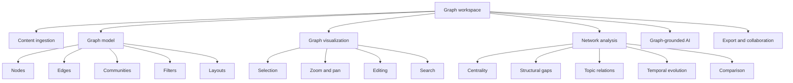
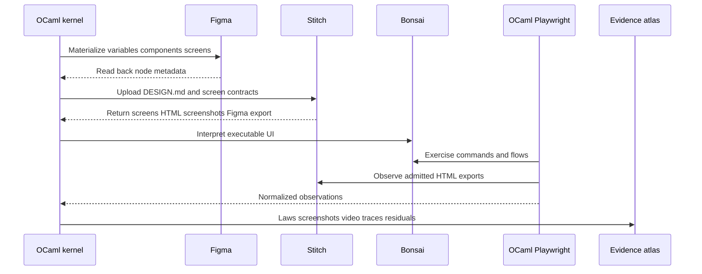
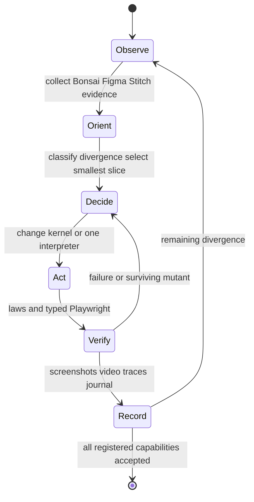

# InfraNodus Design Superset, Figma, Stitch, GetDesign, and Impeccable Journal

Date: 2026-08-04

Status: OCaml superset, Sa-plan sequence, and wiki/ZK performance slice implemented; authenticated external-runtime materialization remains honestly unavailable where no observation exists

Canonical prompt chain:

- `docs/journal/20260803-infranodus-figma-source-prompt.jsonl`
- `docs/journal/20260804-infranodus-design-superset-source-prompt.jsonl`

HTML projection: `docs/journal/20260804-infranodus-design-superset-analysis.html`

Tailscale self-contained HTML: [design-superset analysis](http://vm-1.tail55d152.ts.net:8092/20260804-infranodus-design-superset-analysis.html)

Tailscale wiki/Zettelkasten interpretation: [live journal note](http://vm-1.tail55d152.ts.net:8088/docs/journal--20260804-infranodus-design-superset-journal.html)

Figma interpretation: [InfraNodus Full UI](https://www.figma.com/design/MrrWJ0b0zhrmptQ7MW0IMA)

## 1. Scope & Trigger

The user expanded the InfraNodus capability-equivalent OCaml program from a
Figma/Bonsai implementation into a design-system superset that must synthesize
and generate distinct Figma, Google Stitch, GetDesign, Impeccable, Bonsai, and
InfraNodus profiles. The same canonical ontology must drive all profiles, all
differences must remain explicit, and browser-visible behavior must ultimately
be verified through the repository's typed OCaml Playwright binding.

The user also required:

- full fractal detail at system, context, capability, page, component,
  interaction, operation, evidence, and function scales;
- detailed diagrams explaining every part of the system;
- a full review of Impeccable, GetDesign, and the Google Stitch documentation;
- compliance with both Figma and Stitch and evidence from both;
- a GetDesign-compatible profile and an Impeccable-derived quality profile;
- Markdown and self-contained HTML journals;
- verbatim prompt preservation without normalization, deduplication, spelling
  repair, or deletion;
- screenshots, video, prompt records, design artifacts, and verification
  evidence in the eventual artifact atlas.

"All" remains honesty-bounded. Public documentation and captured public pages
support the research findings. Authenticated Stitch generation, account-only
InfraNodus behavior, and remaining Figma component materialization are not
reported as complete.

## 2. Pre-State Assessment

Before this expansion, the repository already contained:

- a 70-capability InfraNodus contract;
- 37 page contracts;
- 115 typed Bonsai component contracts;
- responsive page and traceability registries;
- an OCaml-owned Figma algebra and generated JSON contract;
- typed OCaml Playwright control and captured page-flow evidence;
- Figma foundations, page topology, and the first six component contracts;
- the original lossless prompt ledger through Phase 0 approval.

The Figma file currently contains 47 variables, five text styles, one effect,
13 pages, foundations sections, 12 component-family frames, and these six
materialized component contracts: Icon, Text, Button, Icon button, Link, and
Badge. Therefore Phase 3 is 6/115 materialized; 109 component contracts remain.

The missing architectural concept was a profile-generating superalgebra. A
direct Figma-to-Stitch conversion would make one external tool the accidental
authority and would lose concepts that only exist in another profile. The
design instead makes OCaml authoritative and treats each tool as a typed,
loss-aware interpretation.

## 3. Execution Detail

### 3.1 Research method

Public product and documentation pages were mapped, scraped, captured, and
visually inspected. Research artifacts were retained outside the repository
during the design pass and selected screenshots are embedded into the HTML
projection of this journal.

Impeccable evidence included:

- [Designing with Impeccable](https://impeccable.style/designing)
- [Documentation](https://impeccable.style/docs)
- [Design slop and anti-patterns](https://impeccable.style/slop)
- [Research](https://impeccable.style/research)
- [Audit](https://impeccable.style/docs/audit)
- [Critique](https://impeccable.style/docs/critique)
- [Harden](https://impeccable.style/docs/harden)
- [Adapt](https://impeccable.style/docs/adapt)
- [Context](https://impeccable.style/docs/context)
- [Detector](https://impeccable.style/docs/detector)
- [Extract](https://impeccable.style/docs/extract)
- [Document](https://impeccable.style/docs/document)

GetDesign evidence included:

- [GetDesign home](https://getdesign.md)
- [What is DESIGN.md?](https://getdesign.md/what-is-design-md)
- [Design catalog](https://getdesign.md/design-md)
- [Figma analysis](https://getdesign.md/figma/design-md)
- [State of DESIGN.md](https://getdesign.md/state-of-design-md)

Representative catalog analyses included Figma, Linear, IBM, Miro, Sentry,
ClickHouse, and Mintlify. These analyses are treated as unofficial inferred
starting points, not authoritative brand specifications.

Google Stitch evidence included:

- [Documentation home](https://stitch.withgoogle.com/docs)
- [DESIGN.md overview](https://stitch.withgoogle.com/docs/design-md/overview)
- [DESIGN.md specification](https://stitch.withgoogle.com/docs/design-md/specification)
- [Linting rules](https://stitch.withgoogle.com/docs/design-md/linting-rules)
- [Import instructions](https://stitch.withgoogle.com/docs/design-md/get-instructions)
- [Prompting](https://stitch.withgoogle.com/docs/learn/prompting)
- [Device types](https://stitch.withgoogle.com/docs/learn/device-types)
- [Design modes](https://stitch.withgoogle.com/docs/learn/design-modes)
- [Variants](https://stitch.withgoogle.com/docs/learn/variants)
- [MCP setup](https://stitch.withgoogle.com/docs/mcp/setup)
- [MCP reference](https://stitch.withgoogle.com/docs/mcp/reference)
- [SDK architecture](https://stitch.withgoogle.com/docs/sdk/architecture)
- [Code-to-design roundtrip](https://stitch.withgoogle.com/docs/skills/roundtrip)
- [Build in a loop](https://stitch.withgoogle.com/docs/skills/build-in-a-loop)

### 3.2 Impeccable synthesis

Impeccable contributes a quality and lifecycle profile rather than a visual
interchange format:

- four surface intents: Persuade, Operate, Read, and Experience;
- Start, Iterate, Polish, and Maintain lifecycle stages;
- PRODUCT.md strategy/context separated from DESIGN.md implementation memory;
- a five-dimensional technical audit covering accessibility, performance,
  theming, responsiveness, and anti-patterns;
- 0-4 maturity scores and P0-P3 issue priority;
- heuristic critique separated from deterministic audit;
- Nielsen heuristics, cognitive load, persona, and emotional-journey review;
- hardening for text/data extremes, loading, errors, localization, RTL,
  offline use, slow connections, devices, and unusual contexts;
- a responsive non-amputation rule: critical capabilities cannot disappear on
  mobile merely to simplify layout;
- deterministic anti-pattern checks across design systems, visual details,
  typography, color/contrast, layout/spacing, motion, copy, imagery, and
  general quality;
- design-debt extraction and design-system recapture;
- seeded divergent directions and an independent reviewer;
- explicit direction contracts: thesis, owned world, story, first viewport,
  and form.

Impeccable's Live Mode depends on a JavaScript/HMR workflow and cannot become
project-authored automation. Its useful semantics are reinterpreted as Figma
variants, Bonsai states, and typed OCaml Playwright observations.

### 3.3 GetDesign synthesis

GetDesign contributes a durable design-memory and catalog profile:

- DESIGN.md as long-lived design memory;
- YAML front matter for machine tokens plus Markdown prose for rationale;
- role-based token names;
- token, rule, and rationale kept together;
- one-to-one component-token and component-prose coverage;
- explicit responsive behavior, touch targets, collapsing strategies, and
  known gaps;
- searchable/filterable catalog navigation;
- live preview and DESIGN.md source views;
- palette, typography, buttons, cards, forms, spacing, radii, elevation, and
  responsive analysis sections;
- provenance and disclaimers for inferred systems.

The GetDesign profile is generated locally from the OCaml kernel. It is not an
external design authority and no third-party brand analysis is copied as the
InfraNodus visual identity.

### 3.4 Stitch synthesis

Stitch DESIGN.md is currently an alpha, open-ended format with YAML design
tokens and a Markdown rationale body. Its canonical section sequence is:

1. Overview / Brand & Style
2. Colors
3. Typography
4. Layout / Layout & Spacing
5. Elevation & Depth
6. Shapes
7. Components
8. Do's and Don'ts

Its documented linter rules are:

| Rule | Severity | Meaning |
|---|---|---|
| `broken-ref` | error | unresolved token or component references |
| `missing-primary` | warning | colors exist without a primary color |
| `contrast-ratio` | warning | component text/background below WCAG AA 4.5:1 |
| `orphaned-tokens` | warning | defined colors unused by components |
| `missing-typography` | warning | colors exist without typography tokens |
| `section-order` | warning | body sections violate canonical order |
| `missing-sections` | info | optional spacing or rounded tokens absent |
| `token-summary` | info | token counts per section |

The current public Stitch MCP reference exposes 14 operations:

- projects: `create_project`, `get_project`, `list_projects`;
- screens: `list_screens`, `get_screen`;
- generation: `generate_screen_from_text`, `edit_screens`,
  `generate_variants`;
- design systems: `create_design_system`, `update_design_system`,
  `list_design_systems`, `apply_design_system`;
- DESIGN.md: `upload_design_md`,
  `create_design_system_from_design_md`.

The shared ontology includes Screen, File, DesignSystem, Asset, DesignTheme,
ScreenMetadata, SessionOutputComponent, UserFeedback, VariantOptions, and
SelectedScreenInstance. Enums cover device, model, screen type, color mode,
color variant, font, roundness, creative range, and variant aspect.

Stitch distinguishes App and Web as primary design surfaces, not merely
viewport sizes. It supports mobile, desktop, tablet, and device-agnostic
screens. Variant generation supports 1-5 variants and REFINE, EXPLORE, and
REIMAGINE creative ranges. A screen may expose a screenshot, HTML, Figma
export, prompt, theme, dimensions, group, generator, metadata, and status.

The official Stitch SDK and roundtrip examples target TypeScript, React,
Tailwind, Node, and Puppeteer. Those are external references only. Generated
React/TypeScript cannot become authored project implementation. The compatible
roundtrip is:

```text
OCaml kernel
  -> generated DESIGN.md
  -> generated Bonsai/static HTML observation
  -> external Stitch project/screen
  -> Stitch screenshot/HTML/Figma-export evidence
  -> normalized OCaml observations and residuals
```

Google authentication will use the user-specified account through the
interactive login UI. No password, OAuth token, cookie, recovery code, or
session secret may enter repository artifacts.

## 4. Root Cause Analysis

The central design problem is semantic asymmetry:

- Figma represents variables, styles, nodes, components, variants, pages, and
  prototype connections.
- Stitch represents projects, screens, prompts, variants, design systems,
  generated HTML, screenshots, and Figma exports.
- GetDesign represents design-system memory, rationale, catalog pages, and
  inferred analyses.
- Impeccable represents design lifecycle, quality auditing, hardening,
  critique, and anti-pattern detection.
- Bonsai represents executable state, commands, subscriptions, rendering, and
  runtime behavior.
- InfraNodus contributes the product/domain ontology: content-to-graph,
  network analytics, graph interaction, AI insight, integrations, and
  end-to-end use cases.

Taking the intersection would delete unique capabilities. Taking the union as
an untyped bag would permit contradictions and silent loss. The repair is a
typed superset whose profiles are explicit projections with residuals.

## 5. Fix Taxonomy

- authority repair: OCaml is the sole semantic authority;
- projection repair: every target is a profile generator/interpreter;
- loss repair: unsupported concepts produce explicit residuals;
- provenance repair: stable IDs relate OCaml, Figma, Stitch, runtime, and
  evidence objects;
- quality repair: Impeccable rules become a separate quality interpretation;
- documentation repair: GetDesign becomes a generated searchable catalog;
- interchange repair: DESIGN.md is a generated projection, not hand-maintained
  parallel truth;
- runtime repair: Bonsai behavior remains the executable interpretation;
- evidence repair: Figma/Stitch artifacts are observations, never proof by
  existence;
- language-boundary repair: external JS/TS/React output remains evidence only;
- authentication repair: identity provenance is recorded without credentials.

## 6. Patterns & Anti-Patterns Discovered

### Patterns

- A common semantic kernel can support multiple non-isomorphic profiles.
- Token values need human rationale as well as machine representation.
- Responsive behavior is part of component semantics, not a late CSS concern.
- A generated design is not accepted until runtime observations agree.
- Variants are proposals; acceptance requires an explicit kernel update.
- Product strategy, design memory, runtime behavior, and audit evidence are
  distinct artifacts with distinct authorities.
- Stable identifiers are the join key across tools and evidence stores.
- Every external operation needs read-only/mutating classification and
  provenance.

### Anti-patterns

- Treating a Figma frame as implementation evidence.
- Treating Stitch-generated React as project source.
- Silently dropping unsupported concepts during profile generation.
- Copying unofficial GetDesign analyses as a product brand.
- Using Impeccable's advisory taste rules as hard semantic truth.
- Hiding critical features on mobile.
- Claiming visual parity from screenshots without interaction evidence.
- Embedding credentials in DESIGN.md, prompts, screenshots, or journals.
- Claiming authenticated testing before login/readback evidence exists.
- Treating a generated HTML file as self-contained while it still loads remote
  scripts, fonts, CSS, images, or prompt files.

## 7. Verification Matrix

| Surface | Required observation | Current state |
|---|---|---|
| OCaml kernel | total registries and profile projections | design specified; superset implementation pending |
| InfraNodus capabilities | 70 capability contracts | registry present; full external parity remains open |
| Pages | 37 page contracts | registry and Bonsai surfaces present |
| Components | 115 contracts | registry present |
| Figma foundations | variables/styles/effects/pages | materialized |
| Figma components | 115 contract nodes/sets | 6 materialized, 109 remaining |
| Stitch schema | DESIGN.md/MCP ontology | public docs inventoried |
| Stitch authentication | authorized interactive session | account identified; execution pending |
| Stitch project | design system/screens/variants | untested |
| GetDesign profile | generated catalog and DESIGN.md explorer | specified, not generated |
| Impeccable profile | audit/critique/harden/adapt/detector | specified, not generated |
| Bonsai runtime | commands, states, responsive pages | implemented surface exists; parity closure pending |
| Playwright | screenshots/video/DOM/accessibility traces | prior flow evidence exists; dual-profile suite pending |
| Journal Markdown | complete research and decision record | generated by this slice |
| Prompt provenance | immutable original and continuation JSONL | preserved |
| Journal HTML | standalone HTML with embedded prompts and evidence | four typed-Playwright viewport verdicts PASS |

The browser-test state space is generated from:

```text
Page x Viewport x Theme x DataState x Permission x ComponentState x Interaction
```

Critical journeys require exhaustive transition coverage. Remaining
combinations use pairwise coverage plus boundaries, negative cases, and all
component-state laws.

## 8. Files Modified

This journal slice creates or updates:

- `docs/journal/20260804-infranodus-design-superset-source-prompt.jsonl`
- `docs/journal/20260804-infranodus-design-superset-journal.md`
- `docs/journal/20260804-infranodus-design-superset-analysis.html`
- `harness/journal_markdown_html.ml`
- `harness/journal_markdown_html.mli`
- `harness/render_journal_html.ml`
- `harness/test_journal_markdown_html.ml`
- `harness/dune`
- `docs/journal/INDEX.md`

The unrelated staged file `docs/zk/moc-agent-handover.md` is not part of this
slice and must remain untouched.

## 9. Architectural Observations

### 9.1 Superalgebra carrier

```text
Kernel =
  Ontology
  x Tokens
  x Components
  x Screens
  x Interactions
  x ResponsiveRules
  x Motion
  x Accessibility
  x QualityRules
  x Provenance
  x Evidence
```

A profile projection has the semantic shape:

```text
project : Profile -> Kernel -> Artifact * Residual list
```

Every mapped concept is classified as Exact, Equivalent, Advisory, Generated,
Unsupported, or Unavailable.

### 9.2 Whole-system profile diagram



### 9.3 Projection and observation diagram



### 9.4 Page fractal



### 9.5 Component fractal



### 9.6 InfraNodus domain fractal



### 9.7 Dual-platform verification sequence



### 9.8 OODA closure



### 9.9 Profile matrix

| Profile | Primary artifact | Authority | Admission observation |
|---|---|---|---|
| OCaml kernel | typed values and laws | canonical | law suite |
| Figma | variables, nodes, variants, prototype | external editable interpretation | API/MCP readback and screenshots |
| Stitch | DESIGN.md, systems, screens, variants | external generative interpretation | MCP readback, lint, exports |
| GetDesign | catalog and rationale | generated documentation interpretation | coverage and navigation |
| Impeccable | audits and lifecycle reports | generated advisory interpretation | deterministic findings and evidence |
| Bonsai | executable UI | runtime interpretation | typed Playwright behavior |
| InfraNodus | capability/use-case composition | domain interpretation | scenario and parity laws |

### 9.10 Diagram registry

The atlas must generate at least these diagram families:

1. whole-system context;
2. bounded contexts;
3. capability hierarchy;
4. page hierarchy;
5. component hierarchy;
6. token dependency graph;
7. screen region decomposition;
8. component state machines;
9. navigation graph;
10. user-journey timelines;
11. command/event flows;
12. graph-data algebra;
13. analysis pipeline;
14. AI insight pipeline;
15. import/export pipeline;
16. permission model;
17. responsive transformations;
18. accessibility relationships;
19. motion lifecycle;
20. loading/error recovery;
21. Figma object mapping;
22. Stitch MCP object mapping;
23. DESIGN.md reference graph;
24. GetDesign catalog generation;
25. Impeccable quality lifecycle;
26. Bonsai runtime architecture;
27. Dream/API boundary;
28. Playwright observation model;
29. screenshot/video provenance;
30. test-case generation;
31. dual-interpreter commuting diagram;
32. profile residual lattice;
33. cross-platform validation matrix;
34. OODA cycle;
35. artifact lineage;
36. capability-to-evidence traceability.

### 9.11 Cross-profile laws

1. Projection determinism.
2. Stable identifier preservation.
3. Token-reference closure.
4. Component-to-token coverage.
5. Screen-to-capability coverage.
6. State-machine transition closure.
7. Responsive non-amputation.
8. Accessibility-name preservation.
9. Content non-invention.
10. Projection idempotence.
11. Export/readback agreement.
12. Figma/Bonsai observation agreement.
13. Stitch/Bonsai observation agreement.
14. Figma/Stitch shared-observation agreement.
15. Explicit residual preservation.
16. External output cannot silently alter the OCaml kernel.
17. Authentication material cannot enter generated artifacts.
18. Unsupported evidence remains honestly UNTESTED or UNAVAILABLE.

The core agreement equation is:

```text
normalize (project profile kernel)
  ~= observable_projection profile kernel
```

## 10. Remaining Gaps

- The user has not yet issued the exact phrase `approve superset design`; the
  design gate remains formally open even though this journal capture is
  authorized.
- Figma Phase 3 has 109 remaining components.
- Stitch interactive authentication has not been performed.
- No Stitch project, design-system upload, screen generation, variant
  generation, readback, screenshot, HTML, or Figma-export evidence exists yet.
- GetDesign and Impeccable do not expose equivalent editable runtime APIs;
  their profiles must be generated locally and tested as documentation/quality
  interpretations.
- Mermaid source is preserved in this journal, but a later atlas slice must
  materialize each registered diagram as accessible SVG/HTML views.
- Account-only InfraNodus behavior remains outside public-source evidence.
- Visual comparison tolerances and shared observations must be fixed per
  component before any EQ claim.
- Video evidence exists for earlier Bonsai flows, but dual Figma/Stitch video
  evidence remains open.

## 11. Metrics Summary

- 70 registered capability contracts.
- 37 registered page contracts.
- 115 registered component contracts.
- 13 Figma pages.
- 47 Figma variables.
- Five Figma text styles.
- One Figma effect.
- 12 Figma component-family frames.
- 6/115 Figma component contracts materialized.
- 14 documented Stitch MCP operations.
- 10 primary Stitch shared types.
- Eight canonical DESIGN.md body sections.
- Eight Stitch lint rules.
- Seven generated/interpreted profiles including the canonical kernel.
- 36 required diagram families.
- 18 cross-profile laws in this design packet.
- Two immutable prompt-ledger segments.

Counts describe the current contracts and research observations. They do not
claim complete external runtime parity.

## 12. STAMP & Constitutional Alignment

Controllers:

- the OCaml kernel controls design semantics and identifiers;
- the Figma interpreter controls external node materialization;
- the Stitch interpreter controls remote project, screen, and design-system
  actions;
- the GetDesign generator controls catalog projection;
- the Impeccable interpreter controls advisory quality findings;
- Bonsai controls runtime UI state and rendering;
- typed OCaml Playwright controls browser observation and capture;
- the artifact renderer controls journal Markdown-to-HTML projection;
- the user controls design approval and interactive Google authorization.

Unsafe control actions and constraints:

- UCA-DESIGN-1: an external profile silently becomes authority. Constraint:
  only reviewed OCaml kernel changes alter semantics.
- UCA-DESIGN-2: a projection drops unsupported data. Constraint: emit a typed
  residual.
- UCA-DESIGN-3: a generated screen is called implemented without runtime
  evidence. Constraint: require Bonsai/Playwright agreement.
- UCA-DESIGN-4: credentials enter an artifact. Constraint: credentials remain
  in the external authentication substrate.
- UCA-DESIGN-5: responsive simplification removes a critical function.
  Constraint: non-amputation law.
- UCA-JOURNAL-1: prompt normalization loses requirements. Constraint: immutable
  JSONL plus embedded HTML copy.
- UCA-JOURNAL-2: prompt markup becomes executable. Constraint: HTML escaping
  and a named quarantine law.
- UCA-JOURNAL-3: HTML depends on remote assets. Constraint: inline CSS and data
  URI evidence assets; no remote script/font/style/image dependency.
- UCA-JOURNAL-4: the journal fabricates completion. Constraint: explicit
  current-state and remaining-gap matrices.

The HTML renderer is report-only. It cannot write gate evidence or alter
SQLite. Its atomic temporary-write-and-move path protects against partial
artifact replacement.

## 13. Conclusion

The synthesized system is not a Figma clone, a Stitch wrapper, or a collection
of design tips. It is a law-governed OCaml design superalgebra with multiple
profile interpretations:

- Figma supplies editable structural design;
- Stitch supplies generative screen/design-system workflows and exports;
- GetDesign supplies durable design memory and a searchable catalog;
- Impeccable supplies lifecycle, critique, hardening, and anti-pattern quality;
- Bonsai supplies executable behavior;
- InfraNodus supplies the graph-intelligence domain;
- typed OCaml Playwright supplies runtime observations;
- the journal and atlas supply durable, linked evidence.

The research, design decisions, assumptions, public evidence, current
materialization state, residuals, diagrams, and complete available user prompt
records are preserved by this bundle. Hidden model chain-of-thought is not an
artifact and is neither claimed nor exposed; the journal preserves the full
decision rationale and evidence needed to reproduce or challenge the design.

The next implementation action after explicit design approval is to
materialize the profile algebra and DESIGN.md projection, then close Figma
Phase 3 and authenticate Stitch for dual readback verification.

## 14. Wiki and Zettelkasten Integration

This journal is an addressable evidence node in the repository knowledge
graph, not an isolated report. Its principal typed relationships are:

- [[20260803-infranodus-feature-ontology-journal|@extends]]
- [[2026-08-04-infranodus-full-ui-figma-bonsai-design|@extends]]
- [[2026-08-04-infranodus-full-ui-figma-bonsai|@implements]]
- [[INFRANODUS_OCAML_AUTHORITY|@governed-by]]
- [@projects](../ontology/FIGMA_OCAML_DESIGN_CONTRACT.json) — a JSON artifact, not a note
- [[PLAYWRIGHT_OCAML_ONTOLOGY|@verified-by]]
- [[FRACTAL_ONTOLOGY|@part-of]]
- [[ONTOLOGY|@part-of]]
- [[The Knowledge-Systems Algebra — a formal specification of Wiki, ZK, Notion, and Obsidian entities|@instantiates]]
- [[Mobile-First Adaptive UI|@governed-by]]
- [[OCaml Playwright Control|@governed-by]]
- [[OCaml Figma Control|@governed-by]]

The two source-prompt ledgers are immutable provenance children. The generated
HTML is a view of this Markdown node, while the Markdown remains the editable
knowledge source. Wikilinks contribute outgoing edges, typed link labels carry
semantic relations, tags support retrieval, and the journal index is the
chronological Map of Content. Backlinks and contextual citations are derived
by `Docs_wiki.build`; they are never hand-maintained as a second graph.

Zettelkasten laws applied here:

- stable note identity survives title wording changes;
- outgoing links and derived backlinks form an adjoint-inverse relation;
- every typed edge resolves or is reported as an anomaly;
- the Markdown body is the canonical note; HTML is a pure projection;
- prompt ledgers are immutable evidence nodes, not prose summaries;
- generated artifacts do not emit live classification tags copied from source
  members;
- journal anomalies remain report-only and cannot alter gate evidence;
- the HTML projection embeds its complete input/evidence set while retaining
  source paths and labels for graph navigation.

## 15. Comprehensive OCaml and Functional Design

### 15.1 Strata

| Stratum | Carrier | Responsibility |
|---|---|---|
| A | immutable kernel values | ontology, tokens, components, screens, laws, residuals |
| B | interpreters and projections | Figma, Stitch, GetDesign, Impeccable, Bonsai, journal rendering |
| C | external substrates | Figma APIs, Stitch MCP, browser engines, filesystem, network |

Effects never define the semantic law. An external failure yields a typed
failure/residual and cannot manufacture an accepted kernel observation.

### 15.2 OCaml module architecture

```text
Design_kernel.S
  Token.S
  Component.S
  Screen.S
  Interaction.S
  Responsive.S
  Accessibility.S
  Quality.S
  Provenance.S
  Evidence.S

Profile.S
  Figma_profile
  Stitch_profile
  Getdesign_profile
  Impeccable_profile
  Bonsai_profile
  Infranodus_profile

Make_laws(Kernel)(Profile)
Profile_residual_lattice
Profile_observation_normalizer
```

Every invariant-bearing value uses a smart constructor. Public equality is
observational. Generators use public constructors and deterministic
`Random.State` seeds. Initial operation lists act as the oracle; normalized
catalog/profile encodings are final interpretations admitted through shared
laws and twin-seed homomorphisms.

### 15.3 Functional structures

- tokens form a finite keyed environment with overlay as a right-biased
  monoid, subject to alias closure;
- component dependencies form a finite directed graph with endpoint closure;
- responsive variants form a total ordered partition of viewport width;
- residuals form a severity join-semilattice where unsupported/unavailable
  information cannot be weakened by composition;
- evidence forms a provenance-preserving ordered monoid;
- commands and events form a free sequential program interpreted by Bonsai,
  Figma, or Stitch boundaries;
- page composition is a tree whose cross-page references form a graph;
- state machines are labelled transition systems with total observation and
  explicit rejected transitions;
- DESIGN.md serialization and parsing form a partial roundtrip with a complete
  diagnostic carrier;
- profile projection is a homomorphism over registries and ordered evidence.

### 15.4 Error strategy

Independent DESIGN.md/token diagnostics accumulate. Dependent remote actions
fail fast. If both validation modes exist, successful values must agree:

```text
is_ok fast(x) = is_ok accumulate(x)
fast(x)=Ok(a) and accumulate(x)=Ok(b) => observe(a)=observe(b)
```

## 16. Comprehensive Bonsai Design and Implementation

The Bonsai interpretation is a pure `Model -> View` projection plus explicit
actions. It must not read SQLite or call Figma/Stitch directly. Dream supplies
immutable HTTP snapshots; any application persistence remains Dream to typed
OCaml service to the harness Db actor.

### 16.1 Component packet

Every Bonsai component defines:

- immutable input model;
- typed action/command sum;
- state machine and transition function;
- view function producing `Virtual_dom.Vdom.Node.t`;
- semantic roles, accessible names, descriptions, and focus order;
- compact-first layout plus monotone window-class enhancements;
- loading, empty, error, disabled, selected, focused, and degraded states;
- Figma component/variant mapping;
- Stitch component/token mapping;
- GetDesign catalog entry;
- Impeccable audit rules;
- Playwright selectors and observations;
- law and mutant identifiers.

### 16.2 Page packet

Each of P01-P37 composes registered component instances, owns no duplicated
token values, exposes one route identity, and declares incoming/outgoing
transitions. Page truth remains invariant across compact, medium, expanded,
large, and extra-large layouts; only composition changes.

### 16.3 Runtime laws

- action determinism for pure transitions;
- no command is emitted by a disabled control;
- route closure over P01-P37;
- component registry closure over all page dependencies;
- all interactive targets are at least 44x44 CSS pixels;
- no horizontal document overflow;
- compact and medium panes stack;
- expanded and larger panes expose the required supporting pane;
- keyboard, touch, pointer, reduced-motion, forced-color, and light/dark
  observations remain operable;
- no browser database edge exists;
- runtime semantics agree with the canonical design observations.

### 16.4 Generated-code boundary

Bonsai and Virtual_dom remain authored OCaml. `js_of_ocaml` output is generated
JavaScript and may be served as a build artifact. Stitch React/TypeScript and
Figma plugin JavaScript are external evidence/implementation details and are
never copied into the authored runtime.

## 17. Browser Verification Contract

The generated HTML journal is verified through direct typed OCaml Playwright
at 390x844, 768x1024, 1440x900, and 1920x1080. The verifier must reject:

- navigation or page errors;
- console errors;
- a blank or zero-sized document;
- horizontal overflow;
- missing title, journal heading, or embedded-artifact section;
- missing embedded prompt-ledger content;
- any stylesheet, font, script, frame, image, audio, or video URL that depends
  on `http:`, `https:`, or protocol-relative remote loading;
- an evidence image whose source is not a `data:` URI;
- a blank screenshot.

External research hyperlinks are allowed as inert anchors; they are not loaded
resources. One isolated browser context is used per viewport and every context
is closed in reverse acquisition order. Screenshots and the JSON verdict are
preserved under `docs/evidence/infranodus-ocaml/design-superset-journal/`.

### 17.1 Live result

The first live invocation failed closed before navigation because the process
sandbox denied Chromium Crashpad's socket operation. The same typed OCaml
executable was rerun with browser-process permission; no law or threshold was
changed. The admitted run observed:

| Viewport | Embedded artifacts | Prompt ledgers | Remote resources | Verdict |
|---|---:|---:|---:|---|
| 390x844 | 54 | 2 | 0 | PASS |
| 768x1024 | 54 | 2 | 0 | PASS |
| 1440x900 | 54 | 2 | 0 | PASS |
| 1920x1080 | 54 | 2 | 0 | PASS |

Every violation list was empty. The four screenshots were opened and visually
inspected; headings, provenance, journal content, wrapping, margins, and cards
remained readable without horizontal clipping. The manifest and first-pass
screenshots are embedded into the regenerated self-contained bundle, followed
by a second verification pass over that final bundle.

## 18. Skill and Superpower Promotion

The reusable workflow is published as
[[skills--infranodus-design-superset--skill]] and linked into the Claude,
Codex, Gemini, and generic-agent skill mirrors. Its Superpowers design and
execution artifacts are:

- [[2026-08-04-infranodus-design-superset]]
- [[2026-08-04-infranodus-design-superset-implementation]]

The skill requires the algebra-driven OCaml, Figma, Playwright, adaptive UI,
and Zettelkasten skills. It defines the profile workflow, journal/evidence
contract, authentication boundary, and acceptance matrix without duplicating
the detailed research contained in this journal.

## 19. Publication, Wiki Integration, and Closed-Loop Evidence

Two HTML interpretations are deliberately published because they serve
different algebras:

| Interpretation | Carrier and observation | Verified Tailscale route |
|---|---|---|
| archival bundle | historical first publication: one 9.2 MB HTML value containing CSS, rendered journal, two verbatim prompt ledgers, text contracts, and base64 evidence images; later authoritative size/counts come from the generated report, not this historical observation | [self-contained analysis](http://vm-1.tail55d152.ts.net:8092/20260804-infranodus-design-superset-analysis.html) |
| live knowledge note | the repository Markdown interpreted by `Docs_wiki`, including typed outgoing edges, backlinks, two-hop neighborhood, tags, graph, index, chronology, and Zettelkasten navigation | [wiki journal](http://vm-1.tail55d152.ts.net:8088/docs/journal--20260804-infranodus-design-superset-journal.html) |

Both routes returned HTTP 200 on 2026-08-04. The archival response was
9,226,282 bytes at the publication observation; the wiki response was 138,827
bytes. The renderer is authored OCaml. Publication reuses the existing
OCaml-only dashboard server rather than introducing a second server or a
non-OCaml copy script.

The historical second browser-verification pass observed the regenerated archival bundle
after first-pass screenshots and the prompt ledgers had been embedded:

| Viewport | Embedded artifacts | Prompt ledgers | Remote resources | Verdict |
|---|---:|---:|---:|---|
| 390x844 | 59 | 2 | 0 | PASS |
| 768x1024 | 59 | 2 | 0 | PASS |
| 1440x900 | 59 | 2 | 0 | PASS |
| 1920x1080 | 59 | 2 | 0 | PASS |

The canonical continuation prompt chain contains all 41 user turns supplied at that
closure point in this
program in the current continuation ledger, plus the earlier source ledger.
The final turn is preserved verbatim, including spelling, punctuation, and the
standing requirement to provide both Tailscale links.

Prompt ledgers are private/tailnet provenance by default because source text may
contain personal identifiers. A public manifest must reject personal
identifiers; secrets reject every audience. Publication changes the readable
projection, never the authoritative private source bytes.

## 20. Fractal Process Review: Approach A Versus Approach B

The optimization review found that the present journal workflow renders the
same bundle once for the repository and again for the dashboard, repeats a
large argument list, compares input paths lexically, depends on 14 research
screenshots whose regeneration sources currently live under `/tmp`, and checks
only part of the browser's remote-resource surface. Two improvement strategies
were therefore separated explicitly.

### 20.1 Approach A: patch the current tools

Approach A retains the existing renderer, publisher invocation, and verifier.
It would normalize paths, copy the known temporary assets into durable evidence
storage, group some command arguments, and extend the current Playwright
selectors. Its advantages are low implementation effort, a small change set,
and low migration risk. Its disadvantages are continued command duplication,
manual artifact selection, fragmented verdicts, weak extensibility, and limited
opportunity for content-addressed incremental work.

Approach A is appropriate for a one-time or nearly static publication whose
artifact inventory is small and continuously supervised by a human.

### 20.2 Approach B: typed OCaml bundle algebra

Approach B introduces one checked bundle manifest and treats the whole
publication as a typed, law-governed OCaml value:

```text
Prompt chain + bundle manifest + wiki corpus + durable evidence
                              |
                     validate invariants
                              |
                render exactly once in OCaml
                              |
                     content-addressed HTML
                       /             \
                 local journal   dashboard copy
                       |              |
                 Playwright       HTTP checksum
                       \             /
                         evidence fold
                              |
                 journal + wiki + skill update
```

The proposed carriers and observations are:

| Algebra | Carrier | Principal observations and laws |
|---|---|---|
| `Prompt_chain` | ordered immutable prompt entries | contiguous ordinals; append preserves the old prefix; source bytes equal embedded bytes |
| `Artifact_set` | digest-indexed finite map of durable artifacts | required-artifact totality; collision rejection; deterministic union |
| `Bundle_spec` | smart-constructed inputs, outputs, viewports, routes, and requirements | canonical paths; duplicate rejection; every required interpretation classified |
| `Projection` | manifest to self-contained HTML | deterministic rendering; no undeclared runtime dependency; residual preservation |
| `Publication` | one HTML value and multiple atomic targets | every target observes bytes identical to the rendered value |
| `Verification` | an idempotent set of typed violations | independent errors accumulate; acceptance holds exactly when the set is empty |

Effects remain outside the algebraic core. Filesystem reads and atomic writes,
wiki-corpus construction, browser control, HTTP transport, clocks, and hashing
are separate interpretations. The initial interpretation would favor a simple
operation list; an optimized interpretation could reuse content digests and
cached wiki projections. Both must satisfy the same observation laws.

### 20.3 Trade-off matrix

| Concern | Approach A | Approach B |
|---|---|---|
| Initial effort | low | moderate |
| Initial migration risk | low | moderate |
| Repeated rendering | normally retained | one render, atomic fan-out |
| Configuration | large or grouped CLI arguments | one versioned manifest |
| Missing artifacts | individual procedural checks | manifest-totality rejection |
| Prompt integrity | embed supplied ledgers | embed plus ordinal and immutable-prefix validation |
| Publication equality | checked after separate renders | a defining publication law |
| Failure model | several command failures | one accumulated typed violation set |
| Incremental speed | limited | content-addressed caching is derivable |
| New profiles and evidence | more flags and commands | new interpretations of the same signature |
| Long-term supervision | human knowledge remains essential | workflow knowledge becomes executable |

Approach A is cheaper for the next isolated run. Approach B is recommended for
this continuing OODA program because 115 component contracts, multiple design
profiles, recurring screenshots/video, prompt provenance, and permanent
Tailscale publication make the workflow recurrent rather than one-off.

### 20.4 Approval state

Approach B was explicitly approved by the user and is now the active recurrent
publication interpretation. Its admitted scope is the design/journal bundle
compiler and observation plane; this approval does not by itself close the
wider InfraNodus UI, Figma, or Stitch parity residuals.

## 21. Approach B Materialization, Hard Controls, and Fractal Assurance

### 21.1 Outcome and exact boundary

The versioned Approach B compiler is implemented in OCaml. One checked bundle
value now owns validation, durable evidence materialization, bounded parallel
acquisition, content-addressed wiki reuse, one HTML render, atomic identical
fanout, a publication report, a live self-contained status dashboard,
deterministic TUI events, and an OpenTelemetry-compatible file-log projection.

This closes the recurrent publication pipeline. It does **not** claim that all
InfraNodus behavior or pixels have been replicated, that all 115 Figma
component contracts are materialized, or that live Stitch/Figma round-trips
are complete. Those remain visible program residuals.

Canonical artifacts:

- [[2026-08-04-infranodus-bundle-algebra-design]]
- [[2026-08-04-infranodus-bundle-algebra]]
- [[skills--infranodus-design-superset--references--execution-character]]
- `docs/journal/20260804-infranodus-design-superset-bundle.json`
- `docs/evidence/infranodus-ocaml/design-superset-bundle/report.json`
- `docs/evidence/infranodus-ocaml/design-superset-bundle/otel-file.json`
- [live bundle status](http://vm-1.tail55d152.ts.net:8092/infranodus-design-superset-bundle-status.html)

### 21.2 TDD, BDD, properties, and mutants

The implementation was grown red-to-green. The timestamp control first failed
to compile on the absent `valid_human_timestamp` observer, then went green only
after a calendar-aware validator and formatter were added. The stage-budget
control repeated that sequence: its test failed on absent budget operations,
then passed after actual/budget observations and violation folds existed.

The law surface covers:

- manifest smart-constructor totality and version rejection;
- missing, duplicate, and ephemeral durable-artifact mutants;
- explicit contiguous prompt ordinals, legacy ordered ledgers, mixed-schema
  rejection, and the ordinal-gap mutant;
- deterministic content fingerprint and cache readback;
- sequential versus bounded-parallel acquisition equality and manifest-order
  preservation;
- idempotent atomic publication and missing-source failure;
- exactly-one terminal event, monotone metrics, deterministic TUI, remote-free
  dashboard, OTEL fields, and report-only telemetry;
- exact human timestamp format plus epoch property samples;
- stage-budget-overrun mutant and the cache-hit warm-path BDD threshold;
- typed browser observations for archival prompt/artifact integrity and for
  dashboard metric cards, complete stage rows, budget columns, console/page
  errors, remote resources, and responsive overflow.

### 21.3 ZERO-MUDA and measured performance

A measured full-corpus closure run acquired 599 unique files, built 515 wiki
notes, embedded 97 artifacts, and published approximately 11.47 MB. The final
manifest then closed its own audit/ontology source boundary at 100 artifacts;
the current report is authoritative for its byte and timing observations. The cold
cache-seeding run took 17.105 seconds. The next unchanged run took 140 ms, a
roughly 122× reduction, with one HTML render and two unchanged targets. These
are B2 single-host observations, not universal latency guarantees. The current
report remains the authoritative run-level measurement.

Every stage now prints `actual / budget` in the TUI and dashboard. The hard
budgets are decode 100 ms, validate 250 ms, materialize 1000 ms, acquire 2000
ms, wiki 30000 ms, render 2000 ms, publish 2000 ms, and report 500 ms. A
cache-hit warm path at or above 1500 ms is rejected. The dashboard adds a
horizontal-scroll containment rule on narrow viewports rather than amputating
columns.

### 21.4 Timestamp and clock integrity

New human-facing timestamps emitted by this path use the exact
`yyyy-mm-dd-hhss` representation (`%Y-%m-%d-%H%S`). The validator checks real
month/day/leap-year/hour/second bounds and generated timestamps are
property-sampled across epochs. OpenTelemetry keeps Unix nanoseconds because
that is its protocol-native timestamp representation. Immutable historical
filenames remain unchanged evidence. The final repository `--check-time` audit
observed the authoritative host clock as NTP-synchronized; it separately
reported a stale Claude hook, so this handoff uses the host observation rather
than model-context time.

### 21.5 STPA/FMEA and fact-to-verdict boundary

`SAFETY_ANALYSIS.md` §16 models `CTRL-JOURNAL-BUNDLE` and all four UCA types:
not provided, provided incorrectly, wrong timing, and stopped too soon. Its
FMEA rows cover schema rot, cache lies, partial publication, performance rot,
observation-authority creep, and cryptographic mislabeling.

No new “Rete-UL” rule was armed. The repository engine is an active
declarative, single-pass forward-chaining fact-to-verdict gate, not the Rete
algorithm, and DIVERGENCE 669 requires documentation/wiki facts to stay
disjoint from gate-consumed facts. Bundle hard controls fail their own command;
only the existing canonical gate can admit a program cycle.

### 21.6 ACH, Admiralty, devil's advocate, and Stan

ACH considered H1, “Approach A patches are enough,” and H2, “the recurrent
multi-profile workflow needs Approach B.” Repeated rendering, fragile temporary
evidence, fragmented checks, and an expanding prompt/artifact set disconfirm
H1. The implemented one-value compiler, law suite, and warm measurement support
H2.

Evidence grades are deliberately conservative:

| Evidence | Grade | Reason |
|---|---|---|
| source and focused laws in the current worktree | A2 | direct primary observation, not yet a committed canonical-gate stamp |
| repeated local cold/warm timing | B2 | direct measurement but one host and workload |
| generated dashboard and four-viewport browser evidence | A2 | direct typed observation; still local deployment state |
| overall InfraNodus completion | not admitted | parity residuals remain; no grade can convert absence into completion |

The devil's-advocate review identified five risks: a large manifest can become
a monolith; a whole-corpus fingerprint causes broad invalidation; digest fixity
is not authenticity; synchronous dashboard persistence can amplify writes;
and a single-host benchmark can hide scale regressions. The controls bound
these risks with schema versions, deterministic projections, honest fingerprint
labels, stage budgets, cache metrics, explicit residuals, and an independently
recomputed SHA-256 AIP fixity value. Finer-grained dependency caching remains a
versioned future upgrade.

No new Stan model was added. This slice has deterministic timings and hard
contracts but no new uniquely Bayesian question whose uncertainty is the
answer and no independent posterior oracle. The existing Stan/FDC system may
annotate wider decisions from real ledger data; its outputs remain report-only
and can never replace the hard laws.

### 21.7 Fractal view and reality check

| Scale | Correctness and durability | Speed and parallelism | Human and information quality | Evidence |
|---|---|---|---|---|
| operation | typed result, calendar/path/schema checks | measured actual/budget | named actionable error | unit/property law |
| stage | start→exactly-one terminal | bounded domains, complexity, budget | color/state plus plain text | TUI/metrics/OTEL |
| bundle | total manifest, one HTML value, atomic equality | cache and one-render law | provenance and residuals | report/fingerprint |
| UI | responsive non-amputation, no remote runtime assets | static fast archive, 2 s status refresh | readable cards/table and reduced motion | typed Playwright/screenshots |
| knowledge | Markdown/HTML/wiki source agreement | cached wiki projection | links, backlinks, prompts, embedded artifacts | wiki audit/self-contained HTML |
| system | report-only controller, fail-closed local rules | <1500 ms warm budget | honest bounded completion | canonical gate and clock check |

Reality check: Approach B is now materially faster, more repeatable, more
observable, and more upgrade-resistant than the prior command chain. The most
credible claim is exact publication-pipeline behavior. The weakest claims are
generalized performance beyond this host and external-tool parity. Full UI
replication remains an OODA backlog, not something the bundle compiler can
manufacture.

### 21.8 UI look-and-feel observation

The final typed Playwright contract observes the manifest-declared embedded
artifact count rather than hard-coding 100, and requires two prompt ledgers on
all four archival viewports, with all 41 explicit ordinal
markers, zero remote runtime resources, no console/page errors, and no root
overflow. The status dashboard showed eight metric cards, all 16 stage-event
rows, both actual/budget headers, and zero violations at all four viewports.

Manual inspection of the captured mobile and desktop images confirmed a
restrained two-profile visual language: the archive is a warm, high-legibility
reading surface; the live dashboard is a dark monospace operational surface.
Mobile cards remain legible in two columns, the long title wraps without
clipping, and the table is preserved behind local horizontal scrolling rather
than deleting data. Desktop exposes the complete actual/budget matrix above
the fold. This is an observation of the publication surfaces, not an
InfraNodus pixel-parity claim.

## 22. Long-Term PKM and OAIS Preservation Profile

The user-supplied archival and PKM architecture is preserved verbatim as prompt
ordinal 37 and materialized as [[PKM_ARCHIVAL_ARCHITECTURE]] plus the atomic
zettel [[2026-08-04-0859-oais-package-algebra]]. These pages link back here, so
the journal capture, atomic concept, and hierarchical Map of Content form an
explicit reciprocal Journal→Zettelkasten→Wiki loop.

Approach B now emits an OAIS-inspired SIP/AIP/DIP description in its report.
Each run recomputes SHA-256 over every published HTML copy and fails if fanout
fixity differs. New input/cache/report/transaction identity is SHA-256;
historical MD5 fields remain readable only through the explicit legacy decoder
and never become authenticity evidence.
The package profile inventories open formats, maps project metadata to Dublin
Core, defines versioned migrations, separates optional external DOI/ORCID from
local IDs, provides an IMRAD publication profile, and treats Obsidian/Logseq as
replaceable viewers over authoritative plain files.

The stable-ID rule reconciles uniqueness with the mandatory clock format: new
PKM IDs begin with `yyyy-mm-dd-hhss` and add a non-temporal sequence suffix.
Existing repository notes and filename history are legacy evidence and are not
mass-renamed. Physical paper requirements (ISO 9706/11108, neutral/alkaline,
lignin-free, buffered, mechanically durable stock) are a procurement/storage
profile, not a property software can certify.

### 22.1 Logseq OCaml profile and full wiki/ZK integration

The official Logseq contents, current source repository, DB-version docs, and
Awesome Logseq catalog were reviewed on 2026-08-04. The official contents cover
pages, nested blocks, journals, links/backlinks, aliases, references/embeds,
properties, tasks, commands, queries, templates, media/PDF/whiteboard/draw/
Zotero, flashcards/slides/calculator/tables/publishing/graph, configuration,
themes/plugins, Markdown/Org, advanced queries/Hiccup, and unlinked references.
The current repository also describes a DB graph line with RTC/mobile work in
alpha and warns that the DB beta can lose data, so it recommends backups and a
non-critical test graph. Awesome Logseq contributes community themes, plugins,
integrations, guides, workflows, bibliography/PDF tools, resources, and public
gardens; those entries are advisory/untrusted, not automatically executed.

The external source oracle is pinned to Logseq revision
`9a11243d50b23afeb10bda5a2ca6cc77357eea38`. Its codebase overview confirms the
Clojure/ClojureScript + React/Rum + DataScript/Datalog architecture and locates
editor components, handlers, workers, common code, graph parser, plugin API,
mobile, packages/UI, and E2E surfaces. The source is referenced and mapped; it
is not vendored as authored implementation because this repository's semantic
owner must stay OCaml and executing untrusted JS/CLJS would violate the
boundary.

`harness/logseq_profile.ml` now owns a 72-capability registry across nine
families. The partition is 6 Exact, 33 Equivalent, 14 Advisory, 15 Unsupported,
and 4 Unavailable. Each row carries its source, wiki mapping, ZK mapping, and
honest reason where local semantics are absent. The generated machine ontology
is `docs/ontology/LOGSEQ_OCAML_PROFILE.json`; the full carrier, operations,
observers, invariants, laws, information hierarchy, control flow, data flow,
L0–L10 ontology, UI rules, classic-file/DB split, ecosystem trust boundary, and
residuals are in [[LOGSEQ_OCAML_SUPERSET_ARCHITECTURE]].

The implemented file-profile parser round-trips source bytes and observes
properties, task states/priorities, `[[page]]` references, `((block))`
references, and tags. Page observations map homomorphically to Docs_wiki links;
page/block/tag observations map to ZK edges. Focused laws prove registry
totality and family coverage, lossless file round-trip, page-link/wiki equality,
block-reference edges, property/task observation, honest disposition partition,
and order-independent counts; a duplicate feature-ID mutant is killed.

Full integration is therefore exact at the registered open-file/wiki/ZK
observation boundary. It is not a claim to have cloned Logseq's editor,
DataScript engine, DB/RTC/mobile/sync, plugin/theme runtime, whiteboard, PDF,
Zotero, flashcard scheduler, or every command interaction. Those behaviors are
preserved as typed residuals until a real consumer, external deployment, and
independent oracle exist.

Prompt ordinals 38–41 are immutable lossless compositions over ordinal 37:
each records a backward `base_ordinal`, an exact nonempty suffix, and the
reconstruction equation. The validator rejects forward/self references, empty
suffixes, mixed full/derived content, missing content, and ordinal gaps. This
preserves the repeated multi-kilobyte prompt exactly without wasteful byte
duplication.

## 23. Sa-plan, Wiki, and Zettelkasten Pipeline Optimization

### 23.1 What happened

The final Store task exposed a 125.15-second internal `--selfcheck-wiki` path.
Stage instrumentation showed that page rendering was not the main end-to-end
problem: corpus construction repeatedly scanned every source for every title,
and several downstream projections rebuilt the same corpus or global graph
values. Adding domains to that shape would have multiplied allocation and
shared-state pressure without removing the quadratic work.

The implemented compiler-style path is:

```text
acquire files
  -> parse/frontmatter/outlinks
  -> indexed edge inversion + Aho-Corasick mentions
  -> immutable corpus-wide render context
  -> sequential page-byte oracle
  -> bounded Eio GSS render
  -> ordered observational join
  -> structural/dynamic/ZK checks
  -> report-only JSON/dashboard/OTEL observations
```

Backlinks now use one edge-inversion pass. Unlinked references use a
deterministic ASCII-case-insensitive Aho-Corasick automaton while preserving
the old substring semantics. The previous all-pairs interpretation remains as
the admission oracle. One immutable `render_context` precomputes titles,
neighbors, inference, similarity, PageRank, grounded semantics, and
communities. Independent page coordinates are scheduled through bounded Eio
domains using guided self-scheduling: a successful CAS claims
`ceil(remaining/workers)` contiguous coordinates, each result slot is written
once, and the join returns source order.

### 23.2 Stage model and datapoints

Every material stage records wall time, CPU time, allocated words, input and
output bytes, work-item count, worker count, complexity label, cache state, and
budget. The scheduler additionally records per-worker items and duration. The
pipeline records sequential and parallel rendered-byte totals, speedup,
efficiency, semantic-law count, corpus size, formal/control verdicts, and peak
RSS from the outer process observer.

| Stage | Final wall | Budget | Interpretation |
|---|---:|---:|---|
| Total internal | 9.42 s | 90 s | 13.28x faster than first instrumented run |
| Dynamic projections | 2.60 s | 30 s | largest remaining aggregate |
| Render context | 1.58 s | 30 s | superlinear analysis residual |
| Corpus build | 1.47 s | 10 s | old value was 35.97 s |
| Structural contract | 1.39 s | 5 s | repeated scan-compaction opportunity |
| Metadata/API JSON | 1.05 s | 5 s | within budget |
| ZK fractal alignment | 714 ms | 15 s | within budget |
| Sequential render oracle | 358 ms | 30 s | retained on every self-check |
| Parallel render, 4 workers | 122 ms | 30 s | 2.95x over the paired oracle |

End-to-end process elapsed fell from 127.55 s to 11.63 s. Peak RSS fell from
750,284 to 588,984 KiB (21.5%). The semantic checks increased from 6,473 to
6,479 and all passed. Both interpretations emitted 66,210,052 bytes.

### 23.3 Sensitivity analysis and worker choice

| Workers | Parallel render | Speedup | Efficiency |
|---:|---:|---:|---:|
| 1 | 334 ms | 1.079x | 1.079 |
| 2 | 210 ms | 1.695x | 0.847 |
| 4 | 127 ms | 2.633x | 0.658 |
| 8 | 186 ms | 2.130x | 0.266 |
| 9 | 171 ms | 1.948x | 0.216 |

Four is the measured default. The apparent one-worker speedup is ordinary run
noise/cache ordering, not parallel acceleration. Eight and nine domains regress
because coordination, cache/GC pressure, and memory traffic exceed the small
remaining render work. The render-only Amdahl estimate at four workers has
parallel fraction about 0.881 and serial fraction about 0.119; rendering is now
too small a fraction of the full check for more render domains to matter.

Corpus sensitivity at 64/128/256/512/643 pages preserved byte equality and
exactly-once execution at every point. Full-corpus build/context/parallel render
were 1.36 s/1.47 s/126 ms. The compatibility single-page path changed from
about 1.38 s cold to 0.45 ms warm because it reuses the immutable context. The
naive oracle was swept through 256 pages and run once over the full corpus;
the full comparison took 34.43 s and returned no mismatch.

### 23.4 Optimization decision algorithm and KPIs

For each iteration, rank candidates by:

```text
priority = exclusive_time * recurrence * confidence / change_risk
```

Then optimize only the largest supported cause, retain the initial
interpretation, compare values, rerun worker/corpus/cache sensitivity, and
reject any result that trades latency for semantic drift, unbounded memory, or
authority coupling. Continue until the stage is within budget or its residual
is explicitly measured and bounded.

Primary KPIs are internal and process elapsed time, exclusive stage share,
p50/p95/p99 when repeated request samples exist, CPU/wall ratio, allocated
words, peak RSS, bytes per second, pages per second, speedup, worker efficiency,
worker imbalance, cache hit ratio, cold/warm ratio, retry/lock/queue wait,
semantic mismatches, exactly-once violations, budget misses, and unsupported
formal/runtime observations. A zero mismatch count and exact byte conservation
are hard constraints, not performance KPIs that may be traded away.

### 23.5 Formal, safety, and authority checks

| Technique | Narrow question | Result |
|---|---|---|
| Sequential OCaml | Are ordered page bytes equal? | equal for every page |
| Quint | Can bounded CAS-linearized GSS omit or duplicate a coordinate? | all four invariants held |
| SMTML/Z3 | Can the observed visit vector contain a value other than one? | UNSAT; independent OCaml oracle agrees |
| Rete rule graph | Can wiki/ZK anomaly facts affect admission rules? | decoupled; five isolation laws green |
| Stan | What is the correlated-page latency probability relative to 100 ms? | 0.9984, advisory only |
| Typed OCaml Playwright | Is the report legible at four canonical viewports? | 4/4, zero violations/errors |

STPA constraints cover missing/duplicate/out-of-order work, mutable partial
context, unmeasured worker selection, indexed semantic drift, and observer
authority creep. Scheduler gap/duplicate and Aho terminal/explicit-link mutants
are killed. NUMA topology, affinity, first-touch allocation, and hierarchical
stealing remain `Unavailable_observed`; no locality claim is fabricated.

### 23.6 Dashboard and evidence

- Markdown dashboard:
  `work/benchmarks/sa-plan/wiki-selfcheck/dashboard.md`
- self-contained HTML dashboard:
  `work/benchmarks/sa-plan/wiki-selfcheck/dashboard.html`
- machine observations and sensitivity curves:
  `work/benchmarks/sa-plan/wiki-selfcheck/`
- typed browser evidence:
  `work/benchmarks/sa-plan/wiki-selfcheck/playwright/`
- expected Tailscale publication:
  <http://vm-1.tail55d152.ts.net:8092/20260804-wiki-zk-pipeline-benchmark.html>

The dashboard is an existing-OCaml-renderer projection. It reports progress,
budgets, outcomes, worker and corpus curves, formal authority, the optimization
algorithm, and ranked residuals. It cannot mutate the Store or gate.

## 24. What the C3I Comparison Taught Us

The OCaml Sa-plan and external C3I source share the same durable core idea but
have different breadth. Sa-plan is stronger at repository admission: typed
Store plans/tasks/dependencies/leases; at-least-once Oban-style jobs;
event-sourced Temporal-style workflows; hierarchical naming; STPA/FMEA
selection; read-only Bonsai/TUI projections; correlated telemetry; and a
fail-closed Rete/gate boundary. Its retry law is exponential with a one-hour
cap, `min(3600, 15 * 2^attempt)`.

C3I is a broader operations daemon: the observed source contains 69 Rust daemon
modules, 16 Gleam planning modules, and seven NIFs, including queue pause,
concurrency/fair-share administration, dead-letter/prune/lifeline operations,
workflow signal/query/cancel/terminate/continue-as-new/compensation/schedules,
process supervision/cgroups/preemption, gateways, ZK/ingest, preferences,
email/Drive, backup/TLS, and inference integrations. Those surfaces are not
silently claimed by Sa-plan.

The external daemon also revealed an authority hazard: its canonical working
directory reported the v22.5 corpus with 3,174 completed tasks and roughly
7 ms internal status time, while a noncanonical directory selected a different
291-task database. Functional equivalence therefore requires an explicit,
fail-closed database identity before adding more breadth.

To reach functional equivalence or a trustworthy superset, Sa-plan should add,
in order: explicit DB/cwd authority; workflow signals/cancel/terminate/timers
and compensation under event-replay laws; queue pause/concurrency/fairness,
dead-letter and pruning administration; supervised process-resource controls;
then API/UI and finite cross-runtime differentials. Email, Drive, inference,
and similar integrations are optional breadth and must remain separate from
the correctness kernel. The OCaml Store/gate discipline should be preserved as
the stronger admission/control-plane layer rather than copied away.

## 25. Remaining Optimization Frontier

The next measured targets are render-context similarity/inference, one-pass
structural observation records, content-addressed incremental invalidation,
and shared code-inventory caching. Parallel parsing is deferred until renderer
capture state is made local and the sequential parse observation is frozen.
NUMA-aware placement is deferred until an allowed OCaml/hwloc boundary and
cross-socket evidence exist. These residuals are performance work; the current
pipeline is already within every declared stage budget and semantically
admitted by its focused laws.

## 26. Final Admission and Durable Store Result

The canonical gate passed at HEAD `0967866617d0362c50c46041d020ec3f3cd4523e`:
the complete formal pipeline, safety synchronization, language boundary,
documentation and freshness checks, and all 1,090 Zig laws were green.
`--verify-cycle` independently reported that the Zero-Trust rule gate admits
HEAD `09678666`.

Task `infranodus/fractal-closure/governance/publication-admission` was then
completed through the typed Sa-plan command. The authoritative Store readback
is `total=18, completed=18, ready=0, executing=0`. The completion command took
19.26 ms end to end: Store open 0.497 ms, durable dispatch 16.699 ms, and Store
close 2.052 ms. The subsequent read-only status request took 0.603 ms.

The post-closure OODA observation selects `http-laneD-envelope-evidence` as the
next OTP-parity slice. That is a new program slice, not an unreported remainder
of this 18-task plan. The observation also reports ledger/coverage staleness;
those values remain explicit and must be addressed through the normal Sa-plan
and record-cycle protocol rather than altered by this journal.
