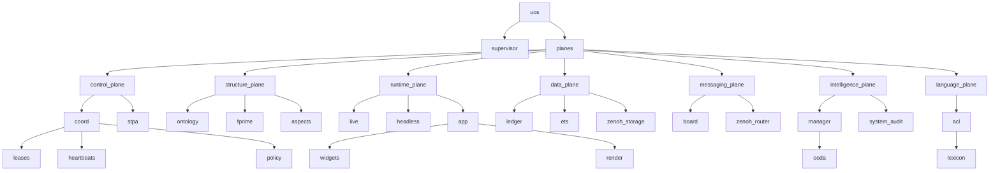

| L | id | name | Sanskrit | plane | whole | parts | module | audit subject |
|---|---|---|---|---|---|---|---|---|
| 0 | uos | Unified Operational System | ekīkṛta-kārya-tantra (एकीकृत-कार्य-तन्त्र) | control · niyantraṇa (नियन्त्रण) | — | supervisor, planes | `apps/uos_tui` | — |
| 0 | supervisor | L0 design authority (Fable) | adhiṣṭhātṛ (अधिष्ठातृ) | control · niyantraṇa (नियन्त्रण) | uos |  | `uos_tui/coord (policy)` | coordination policy |
| 1 | planes | Seven planes | sapta-tala (सप्त-तल) | structure · saṃracanā (संरचना) | uos | control-plane, structure-plane, runtime-plane, data-plane, messaging-plane, intelligence-plane, language-plane | `uos_tui/holon` | — |
| 1 | control-plane | Control plane | niyantraṇa-tala (नियन्त्रण-तल) | control · niyantraṇa (नियन्त्रण) | planes | coord, stpa | `uos_tui/coord` | coordination policy |
| 1 | structure-plane | Structure plane | saṃracanā-tala (संरचना-तल) | structure · saṃracanā (संरचना) | planes | ontology, fprime, aspects | `uos_tui/ontology` | fractal ontology |
| 1 | runtime-plane | Runtime plane | pravartana-tala (प्रवर्तन-तल) | runtime · pravartana (प्रवर्तन) | planes | live, headless, app | `uos_tui/live` | cockpit screen |
| 1 | data-plane | Data plane | dattāṃśa-tala (दत्तांश-तल) | data plane · dattāṃśa (दत्तांश) | planes | ledger, ets, zenoh-storage | `uos_tui/board (ledger)` | message board |
| 1 | messaging-plane | Messaging plane | sandeśa-tala (सन्देश-तल) | messaging · sandeśa (सन्देश) | planes | board, zenoh-router | `uos_tui/board` | zenoh infra |
| 1 | intelligence-plane | Intelligence plane | buddhi-tala (बुद्धि-तल) | intelligence · buddhi (बुद्धि) | planes | manager, system-audit | `uos_tui/manager` | telemetry |
| 1 | language-plane | Language plane | bhāṣā-tala (भाषा-तल) | language · bhāṣā (भाषा) | planes | acl | `uos_tui/acl` | — |
| 2 | coord | Coordination & sync | samanvaya (समन्वय) | control · niyantraṇa (नियन्त्रण) | control-plane | leases, heartbeats, policy | `uos_tui/coord` | coordination policy |
| 2 | stpa | STPA & FMEA safety | surakṣā (सुरक्षा) | control · niyantraṇa (नियन्त्रण) | control-plane |  | `uos_tui/stpa` | — |
| 2 | ontology | Fractal Textual ontology | sattā-śāstra (सत्ता-शास्त्र) | structure · saṃracanā (संरचना) | structure-plane |  | `uos_tui/ontology` | fractal ontology |
| 2 | fprime | F´ dictionaries | śabda-kośa (शब्द-कोश) | structure · saṃracanā (संरचना) | structure-plane |  | `uos_tui/fprime` | F´ dictionary |
| 2 | aspects | 17-aspect audit | saptadaśa-pakṣa (सप्तदश-पक्ष) | structure · saṃracanā (संरचना) | structure-plane |  | `uos_tui/aspects` | — |
| 2 | live | OTP live driver | jīva-cālaka (जीव-चालक) | runtime · pravartana (प्रवर्तन) | runtime-plane |  | `uos_tui/live` | cockpit screen |
| 2 | headless | Headless pilot | parīkṣaka (परीक्षक) | runtime · pravartana (प्रवर्तन) | runtime-plane |  | `uos_tui/headless` | — |
| 2 | app | TEA application core | mūla-yantra (मूल-यन्त्र) | runtime · pravartana (प्रवर्तन) | runtime-plane | widgets, render | `uos_tui/app` | cockpit screen |
| 2 | ledger | Append-only JSONL ledger | lekhā (लेखा) | data plane · dattāṃśa (दत्तांश) | data-plane |  | `uos_tui/board (jsonl)` | — |
| 2 | ets | ETS live table | smṛti (स्मृति) | data plane · dattāṃśa (दत्तांश) | data-plane |  | `uos_swarm_ffi.erl (ets)` | — |
| 2 | zenoh-storage | Zenoh memory storages | megha-smṛti (मेघ-स्मृति) | data plane · dattāṃśa (दत्तांश) | data-plane |  | `ops/zenoh (storage_manager)` | — |
| 2 | board | Message board | sandeśa-phalaka (सन्देश-फलक) | messaging · sandeśa (सन्देश) | messaging-plane |  | `uos_tui/board` | message board |
| 2 | zenoh-router | Zenoh router c3i-zenoh-router-1 | mārga-darśaka (मार्ग-दर्शक) | messaging · sandeśa (सन्देश) | messaging-plane |  | `ops/zenoh` | zenoh infra |
| 2 | manager | F´ managing agent | prabandhaka (प्रबन्धक) | intelligence · buddhi (बुद्धि) | intelligence-plane | ooda | `uos_tui/manager` | telemetry |
| 2 | system-audit | System-wide audit | sarva-parīkṣā (सर्व-परीक्षा) | intelligence · buddhi (बुद्धि) | intelligence-plane |  | `uos_tui/system_audit` | — |
| 2 | acl | Agent communication language | sambhāṣā (सम्भाषा) | language · bhāṣā (भाषा) | language-plane | lexicon | `uos_tui/acl` | — |
| 3 | widgets | Widget catalog (17 families) | aṅga (अङ्ग) | runtime · pravartana (प्रवर्तन) | app |  | `uos_tui/widget` | — |
| 3 | render | Compositor | citra-kāra (चित्र-कार) | runtime · pravartana (प्रवर्तन) | app |  | `uos_tui/render` | — |
| 3 | ooda | Fast OODA controller | cakra (चक्र) | intelligence · buddhi (बुद्धि) | manager |  | `uos_tui/ooda` | — |
| 3 | leases | Fenced leases | paṭṭā (पट्टा) | control · niyantraṇa (नियन्त्रण) | coord |  | `uos_tui/coord (acquire/renew/release)` | — |
| 3 | heartbeats | Freshness monitor | spandana (स्पन्दन) | control · niyantraṇa (नियन्त्रण) | coord |  | `uos_tui/coord (beat/stale)` | — |
| 3 | policy | Hierarchical authority | adhikāra (अधिकार) | control · niyantraṇa (नियन्त्रण) | coord |  | `uos_tui/coord (authorize)` | — |
| 3 | lexicon | Sanskrit/English lexicon | kośa (कोश) | language · bhāṣā (भाषा) | acl |  | `uos_tui/acl (lexicon)` | — |

```text
L0 uos · Unified Operational System · ekīkṛta-kārya-tantra (एकीकृत-कार्य-तन्त्र)
  L0 supervisor · L0 design authority (Fable) · adhiṣṭhātṛ (अधिष्ठातृ)
  L1 planes · Seven planes · sapta-tala (सप्त-तल)
    L1 control-plane · Control plane · niyantraṇa-tala (नियन्त्रण-तल)
      L2 coord · Coordination & sync · samanvaya (समन्वय)
        L3 leases · Fenced leases · paṭṭā (पट्टा)
        L3 heartbeats · Freshness monitor · spandana (स्पन्दन)
        L3 policy · Hierarchical authority · adhikāra (अधिकार)
      L2 stpa · STPA & FMEA safety · surakṣā (सुरक्षा)
    L1 structure-plane · Structure plane · saṃracanā-tala (संरचना-तल)
      L2 ontology · Fractal Textual ontology · sattā-śāstra (सत्ता-शास्त्र)
      L2 fprime · F´ dictionaries · śabda-kośa (शब्द-कोश)
      L2 aspects · 17-aspect audit · saptadaśa-pakṣa (सप्तदश-पक्ष)
    L1 runtime-plane · Runtime plane · pravartana-tala (प्रवर्तन-तल)
      L2 live · OTP live driver · jīva-cālaka (जीव-चालक)
      L2 headless · Headless pilot · parīkṣaka (परीक्षक)
      L2 app · TEA application core · mūla-yantra (मूल-यन्त्र)
        L3 widgets · Widget catalog (17 families) · aṅga (अङ्ग)
        L3 render · Compositor · citra-kāra (चित्र-कार)
    L1 data-plane · Data plane · dattāṃśa-tala (दत्तांश-तल)
      L2 ledger · Append-only JSONL ledger · lekhā (लेखा)
      L2 ets · ETS live table · smṛti (स्मृति)
      L2 zenoh-storage · Zenoh memory storages · megha-smṛti (मेघ-स्मृति)
    L1 messaging-plane · Messaging plane · sandeśa-tala (सन्देश-तल)
      L2 board · Message board · sandeśa-phalaka (सन्देश-फलक)
      L2 zenoh-router · Zenoh router c3i-zenoh-router-1 · mārga-darśaka (मार्ग-दर्शक)
    L1 intelligence-plane · Intelligence plane · buddhi-tala (बुद्धि-तल)
      L2 manager · F´ managing agent · prabandhaka (प्रबन्धक)
        L3 ooda · Fast OODA controller · cakra (चक्र)
      L2 system-audit · System-wide audit · sarva-parīkṣā (सर्व-परीक्षा)
    L1 language-plane · Language plane · bhāṣā-tala (भाषा-तल)
      L2 acl · Agent communication language · sambhāṣā (सम्भाषा)
        L3 lexicon · Sanskrit/English lexicon · kośa (कोश)
```


