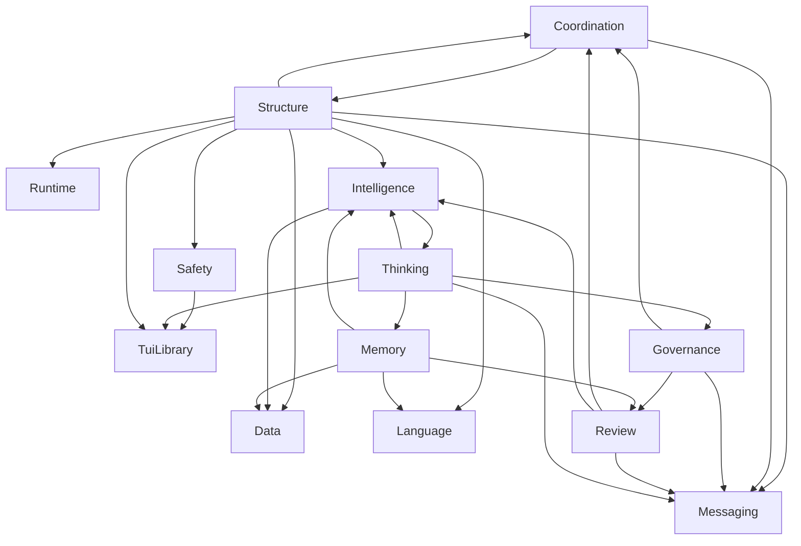

## TUI Library (38 concepts)
- **App** (यन्त्र / yantra) — App: textual.app.App -> uos_tui/app.App (Homomorphic). class with compose() becomes a record of init/update/screens; reactivity is TEA re-render _(relates: Screen)_
- **Screen** (पटल / paṭala) — Screen: textual.screen.Screen -> uos_tui/app.Screen (Isomorphic). named view over the model; push/pop via PushScreen/PopScreen effects _(relates: Widget)_
- **Widget** (अङ्ग / aṅga) — Widget: textual.widget.Widget -> uos_tui/widget.Widget(msg) (Homomorphic). class hierarchy becomes one closed sum type; state lives in the model _(relates: DOM)_
- **DOM** (वृक्ष / vṛkṣa) — DOM: textual.dom.DOMNode -> uos_tui/widget.flatten/find/children (Isomorphic). pre-order tree with ids
- **compose()** (रचना / racanā) — compose(): Widget.compose -> uos_tui/app.Screen.view (Isomorphic). pure function model -> tree _(relates: Widget)_
- **TCSS** (शैली / śailī) — TCSS: textual.css -> uos_tui/style.Style (Reinterpreted). no CSS parser; typed style records with a combine monoid _(relates: Widget)_
- **Scalar / fr units** (मात्रा / mātrā) — Scalar / fr units: textual.css.scalar -> uos_tui/layout.Scalar (Isomorphic). Cells, Fraction, Percent, Auto
- **Vertical/Horizontal/Grid** (विन्यास / vinyāsa) — Vertical/Horizontal/Grid: textual.layouts -> uos_tui/layout.arrange/grid (Isomorphic). same resolution order: fixed, percent, auto, fraction _(relates: Region/Size/Offset)_
- **Region/Size/Offset** (क्षेत्र / kṣetra) — Region/Size/Offset: textual.geometry -> uos_tui/geometry.Region (Isomorphic). half-open rectangles with intersection/union laws
- **Segment / Strip** (खण्ड / khaṇḍa) — Segment / Strip: rich.segment / textual.strip -> uos_tui/segment.Strip (Isomorphic). styled runs with cached cell length; crop/extend/simplify
- **Compositor** (चित्र-कार / citra-kāra) — Compositor: textual._compositor -> uos_tui/render.compose/arrange (Homomorphic). placements blitted into a frame; no dirty-region diffing yet _(relates: Segment / Strip, Region/Size/Offset)_
- **reactive** (प्रतिक्रिया / pratikriyā) — reactive: textual.reactive -> uos_tui/app.update -> render (Reinterpreted). every message re-renders; watchers become update clauses
- **Message / Event** (सन्देश / sandeśa) — Message / Event: textual.message / textual.events -> uos_tui/event.Event, msg (Homomorphic). system events typed; widget messages are user-typed msg _(relates: App)_
- **Binding / action** (बन्धन / bandhana) — Binding / action: textual.binding.Binding -> uos_tui/widget.Binding(msg) (Isomorphic). key -> msg with description shown in Footer _(relates: App)_
- **Focus chain** (दृष्टि-शृङ्खला / dṛṣṭi-śṛṅkhalā) — Focus chain: textual.screen.focus_chain -> uos_tui/app.move_focus (Isomorphic). document-order Tab/Shift-Tab _(relates: Widget)_
- **Worker** (कार्मकर / kārmakara) — Worker: textual.worker -> uos_tui/app + uos_tui/live.Effect.Task (Homomorphic). task functions run in BEAM processes by the live driver _(relates: Driver)_
- **Driver** (चालक / cālaka) — Driver: textual.driver -> uos_tui/live.run/child_spec (Homomorphic). OTP actor + reader process; raw mode via pure Erlang shell API _(relates: App)_
- **Pilot / run_test** (परीक्षक / parīkṣaka) — Pilot / run_test: textual.pilot.Pilot -> uos_tui/headless.run (Isomorphic). scripted events, captured frames _(relates: App)_
- **Command palette** (आदेश-थाली / ādeśa-thālī) — Command palette: textual.command -> uos_tui/gallery.view/search/score (Homomorphic). fuzzy subsequence scoring; caller supplies the registry (uos_tui/gallery demos it)
- **Themes** (वर्ण-विन्यास / varṇa-vinyāsa) — Themes: textual.theme -> uos_tui/render.Theme (Homomorphic). single dark theme plus Dark Cockpit mode overlay _(relates: Compositor)_
- **Header/Footer** (शिरस्-पाद / śiras-pāda) — Header/Footer: textual.widgets -> uos_tui/widget.Header, Footer (Isomorphic). 
- **Static/Label** (नाम-पट्टिका / nāma-paṭṭikā) — Static/Label: textual.widgets.Static -> uos_tui/widget.Static (Isomorphic). 
- **Button** (स्पर्शक / sparśaka) — Button: textual.widgets.Button -> uos_tui/widget.Button (Isomorphic). 
- **Input** (प्रवेश / praveśa) — Input: textual.widgets.Input -> uos_tui/widget.Input (Homomorphic). no validators/suggester
- **DataTable** (दत्तांश-सारणी / dattāṃśa-sāraṇī) — DataTable: textual.widgets.DataTable -> uos_tui/widget.DataTable (Homomorphic). row cursor only
- **Tree** (वृक्ष / vṛkṣa) — Tree: textual.widgets.Tree -> uos_tui/widget.Tree (Homomorphic). 
- **ListView** (सूची / sūcī) — ListView: textual.widgets.ListView -> uos_tui/widget.ListView (Isomorphic). 
- **ProgressBar** (प्रगति-पट्टी / pragati-paṭṭī) — ProgressBar: textual.widgets.ProgressBar -> uos_tui/widget.ProgressBar (Isomorphic). 
- **Sparkline** (लघु-रेखा / laghu-rekhā) — Sparkline: textual.widgets.Sparkline -> uos_tui/widget.Sparkline (Isomorphic). 
- **Tabs / TabbedContent** (विभाग / vibhāga) — Tabs / TabbedContent: textual.widgets.Tabs -> uos_tui/widget.Tabs (Homomorphic). content switching is the model's job
- **RichLog / Log** (वृत्तान्त / vṛttānta) — RichLog / Log: textual.widgets.Log -> uos_tui/widget.Log (Homomorphic). plain lines, scroll offset
- **Rule** (रेखा / rekhā) — Rule: textual.widgets.Rule -> uos_tui/widget.Rule (Isomorphic). 
- **Collapsible** (सङ्कोचनीय / saṅkocanīya) — Collapsible: textual.widgets.Collapsible -> uos_tui/widget.Checklist (Reinterpreted). UOS 5-domain/18-item checklist accordion (SC-CHECKLIST-001) _(relates: 17 Aspect audit)_
- **Container** (पात्र / pātra) — Container: textual.containers -> uos_tui/widget.Container, Grid (Isomorphic). border + title like Textual border-title
- **17 Aspect audit** (सप्तदश-पक्ष / saptadaśa-pakṣa) — 17 Aspect audit: (none) -> uos_tui/aspects.audit (Reinterpreted). UOS-only: fail-closed structural verification of a composed screen _(relates: Widget)_
- **F´ component** (उपाङ्ग / upāṅga) — F´ component: (none) -> uos_tui/fprime.component/dictionary_json (Reinterpreted). UOS-only: ports, commands, channels, events, parameters, ground dictionary _(relates: App)_
- **Textual Web / serve** (जाल-सेवा / jāla-sevā) — Textual Web / serve: textual-serve -> uos_tui/frame.to_text/to_ansi (Deferred). projection to Wisp at :4100 is a follow-on
- **Evolution** (विकास / vikāsa) — Evolution: (none) -> uos_tui/ontology.Fidelity (Reinterpreted). fidelity ladder Deferred -> Reinterpreted -> Homomorphic -> Isomorphic

## Structure (11 concepts)
- **planes** (सप्त-तल / sapta-tala) — Seven planes: Holon uos/holon/L1/planes (uos_tui/holon), whole uos. _(relates: control-plane, structure-plane, runtime-plane, data-plane, messaging-plane, intelligence-plane, language-plane)_
- **structure-plane** (संरचना-तल / saṃracanā-tala) — Structure plane: Holon uos/holon/L1/structure-plane (uos_tui/ontology), whole planes. _(relates: ontology, fprime, aspects)_
- **ontology** (सत्ता-शास्त्र / sattā-śāstra) — Fractal Textual ontology: Holon uos/holon/L2/ontology (uos_tui/ontology), whole structure-plane.
- **fprime** (शब्द-कोश / śabda-kośa) — F´ dictionaries: Holon uos/holon/L2/fprime (uos_tui/fprime), whole structure-plane.
- **aspects** (सप्तदश-पक्ष / saptadaśa-pakṣa) — 17-aspect audit: Holon uos/holon/L2/aspects (uos_tui/aspects), whole structure-plane.
- **kosha** (पञ्च-कोश / pañca-kośa) — Pañca-kośa (the five sheaths): The five sheaths from gross to subtle; maps onto the system's layers from hardware to admitted harmony. _(relates: kosha:annamaya, kosha:pranamaya, kosha:manomaya, kosha:vijnanamaya, kosha:anandamaya)_
- **kosha:annamaya** (अन्नमय / annamaya) — Annamaya-kośa (matter sheath): The gross material sheath; maps onto the hardware substrate and the BEAM VM it runs on. _(relates: aspect:SubstrateStorageSafety)_
- **kosha:pranamaya** (प्राणमय / prāṇamaya) — Prāṇamaya-kośa (vital-breath sheath): The sheath of vital energy; maps onto running BEAM processes and the OTP supervisor. _(relates: aspect:GleamOtpSupervisor)_
- **kosha:manomaya** (मनोमय / manomaya) — Manomaya-kośa (mind sheath): The sheath of mind; maps onto the agents themselves and their OODA loops. _(relates: ooda)_
- **kosha:vijnanamaya** (विज्ञानमय / vijñānamaya) — Vijñānamaya-kośa (discernment sheath): The sheath of discerning knowledge; maps onto formal verification and the 17-aspect audit. _(relates: 17 Aspect audit)_
- **kosha:anandamaya** (आनन्दमय / ānandamaya) — Ānandamaya-kośa (bliss sheath): The innermost sheath of bliss/harmony; maps onto the final `admitted` evidence state where discovered -> ... -> admitted closes without residue.

## Runtime (6 concepts)
- **runtime-plane** (प्रवर्तन-तल / pravartana-tala) — Runtime plane: Holon uos/holon/L1/runtime-plane (uos_tui/live), whole planes. _(relates: live, headless, app)_
- **live** (जीव-चालक / jīva-cālaka) — OTP live driver: Holon uos/holon/L2/live (uos_tui/live), whole runtime-plane.
- **headless** (परीक्षक / parīkṣaka) — Headless pilot: Holon uos/holon/L2/headless (uos_tui/headless), whole runtime-plane.
- **app** (मूल-यन्त्र / mūla-yantra) — TEA application core: Holon uos/holon/L2/app (uos_tui/app), whole runtime-plane. _(relates: widgets, render)_
- **widgets** (अङ्ग / aṅga) — Widget catalog (17 families): Holon uos/holon/L3/widgets (uos_tui/widget), whole app.
- **render** (चित्र-कार / citra-kāra) — Compositor: Holon uos/holon/L3/render (uos_tui/render), whole app.

## Data (4 concepts)
- **data-plane** (दत्तांश-तल / dattāṃśa-tala) — Data plane: Holon uos/holon/L1/data-plane (uos_tui/board (ledger)), whole planes. _(relates: ledger, ets, zenoh-storage)_
- **ledger** (लेखा / lekhā) — Append-only JSONL ledger: Holon uos/holon/L2/ledger (uos_tui/board (jsonl)), whole data-plane.
- **ets** (स्मृति / smṛti) — ETS live table: Holon uos/holon/L2/ets (uos_swarm_ffi.erl (ets)), whole data-plane.
- **zenoh-storage** (मेघ-स्मृति / megha-smṛti) — Zenoh memory storages: Holon uos/holon/L2/zenoh-storage (ops/zenoh (storage_manager)), whole data-plane.

## Messaging (20 concepts)
- **messaging-plane** (सन्देश-तल / sandeśa-tala) — Messaging plane: Holon uos/holon/L1/messaging-plane (uos_tui/board), whole planes. _(relates: board, zenoh-router)_
- **board** (सन्देश-फलक / sandeśa-phalaka) — Message board: Holon uos/holon/L2/board (uos_tui/board), whole messaging-plane.
- **zenoh-router** (मार्ग-दर्शक / mārga-darśaka) — Zenoh router c3i-zenoh-router-1: Holon uos/holon/L2/zenoh-router (ops/zenoh), whole messaging-plane.
- **kind:Plan** (योजना / yojanā) — Plan: A broadcast plan for the swarm.
- **kind:Dispatch** (प्रेषण / preṣaṇa) — Dispatch: L0/L1 dispatch of work to an agent.
- **kind:Claim** (अधिग्रहण / adhigrahaṇa) — Claim: An agent claims a task under a fenced lease.
- **kind:Progress** (प्रगति / pragati) — Progress: An in-flight progress update.
- **kind:Question** (प्रश्न / praśna) — Question: A question posted to another agent.
- **kind:Answer** (उत्तर / uttara) — Answer: An answer to a Question.
- **kind:Report** (विवरण / vivaraṇa) — Report: A worker's report of completed work.
- **kind:Verdict** (निर्णय / nirṇaya) — Verdict: A verifier's admit/reject decision.
- **kind:Andon** (सावधान / sāvadhāna) — Andon: A line-status alert (yellow/red).
- **kind:Jidoka** (स्वयं-निरोध / svayaṃ-nirodha) — Jidoka: A stop-the-line signal.
- **kind:Integrate** (संयोजन / saṃyojana) — Integrate: L0/L1 integration of a verified slice.
- **kind:Heartbeat** (स्पन्दन / spandana) — Heartbeat: A freshness pulse from a live agent.
- **kind:Intent** (अभिसन्धि / abhisandhi) — Intent: A declared intent, rank-strict (must target L0/L1).
- **kind:LeaseGrant** (पट्टा-अनुज्ञा / paṭṭā-anujñā) — LeaseGrant: Grant of a fenced lease/epoch.
- **kind:LeaseRelease** (पट्टा-मुक्ति / paṭṭā-mukti) — LeaseRelease: Release of a held lease.
- **kind:Ack** (स्वीकृति / svīkṛti) — Ack: Acknowledgement of receipt/delivery.
- **kind:DeadLetter** (मृत-पत्र / mṛta-patra) — DeadLetter: A message retried past its limit and dead-lettered.

## Intelligence (27 concepts)
- **intelligence-plane** (बुद्धि-तल / buddhi-tala) — Intelligence plane: Holon uos/holon/L1/intelligence-plane (uos_tui/manager), whole planes. _(relates: manager, system-audit)_
- **manager** (प्रबन्धक / prabandhaka) — F´ managing agent: Holon uos/holon/L2/manager (uos_tui/manager), whole intelligence-plane. _(relates: ooda)_
- **system-audit** (सर्व-परीक्षा / sarva-parīkṣā) — System-wide audit: Holon uos/holon/L2/system-audit (uos_tui/system_audit), whole intelligence-plane.
- **ooda** (चक्र / cakra) — Fast OODA controller: Holon uos/holon/L3/ooda (uos_tui/ooda), whole manager.
- **ooda-mode:Dark** (अन्धकार / andhakāra) — Dark: Cockpit mode: minimum draw, only heartbeats.
- **ooda-mode:Dim** (मन्द / manda) — Dim: Cockpit mode: low draw, occasional repaint.
- **ooda-mode:Normal** (सामान्य / sāmānya) — Normal: Cockpit mode: steady-state repaint cadence.
- **ooda-mode:Bright** (प्रकाश / prakāśa) — Bright: Cockpit mode: elevated cadence plus an aspect audit.
- **ooda-mode:Emergency** (आपद् / āpad) — Emergency: Cockpit mode: halt admission, raise Andon, repaint every cycle.
- **ooda-phase:observe** (अवलोकन / avalokana) — observe: OODA: gather the observation window (manas).
- **ooda-phase:orient** (विचार / vicāra) — orient: OODA: weigh the observation against the trend.
- **ooda-phase:decide** (निर्णय / nirṇaya) — decide: OODA: choose the mode and actions (buddhi).
- **ooda-phase:act** (क्रिया / kriyā) — act: OODA: emit the chosen actions for this cycle.
- **memory:working** (कार्य-स्मृति / kārya-smṛti) — Working memory: Namespace `working/`: scratch memory for the task in flight. _(relates: ets)_
- **memory:episodic** (प्रसङ्ग-स्मृति / prasaṅga-smṛti) — Episodic memory: Namespace `episodic/<id>`: a remembered board message. _(relates: ets)_
- **memory:belief** (मतम् / matam) — Belief memory: Namespace `belief/`: doxastic state the agent holds but has not asserted. _(relates: ets)_
- **memory:goal** (लक्ष्य / lakṣya) — Goal memory: Namespace `goal/`: the agent's current objectives. _(relates: ets)_
- **grant** (अनुज्ञा / anujñā) — Grant: A scoped, expiring, opaque capability token minted only by L0/L1 and tracked as a board message. _(relates: capability)_
- **capability** (सामर्थ्य / sāmarthya) — Capability: A default-deny permission class (Memory, Rete, Bayes, Zenoh, Lean, Quint, STM) gated by a live grant. _(relates: grant)_
- **lifecycle:Idle** (निष्क्रिय / niṣkriya) — Idle: F´ lifecycle: unclaimed, no lease held.
- **lifecycle:Claimed** (गृहीत / gṛhīta) — Claimed: F´ lifecycle: claimed under a lease, not yet started.
- **lifecycle:Working** (कार्यरत / kāryarata) — Working: F´ lifecycle: actively being worked.
- **lifecycle:Verifying** (परीक्ष्यमाण / parīkṣyamāṇa) — Verifying: F´ lifecycle: submitted, awaiting verification.
- **lifecycle:Done** (सिद्ध / siddha) — Done: F´ lifecycle: verified and accepted.
- **lifecycle:Failed** (विफल / viphala) — Failed: F´ lifecycle: verification failed.
- **rete** (नियम / niyama) — Rete (rule matcher): Bounded forward-chaining matcher over typed facts (naive unification, not a full Rete network). _(relates: pramana:anumana)_
- **bayes** (सम्भावना / sambhāvanā) — Bayes (Beta-Binomial belief): Bayesian (Beta-Binomial) success belief per (agent, model), used for cheapest-adequate routing. _(relates: pramana:anumana)_

## Language (15 concepts)
- **language-plane** (भाषा-तल / bhāṣā-tala) — Language plane: Holon uos/holon/L1/language-plane (uos_tui/acl), whole planes. _(relates: acl)_
- **acl** (सम्भाषा / sambhāṣā) — Agent communication language: Holon uos/holon/L2/acl (uos_tui/acl), whole language-plane. _(relates: lexicon)_
- **lexicon** (कोश / kośa) — Sanskrit/English lexicon: Holon uos/holon/L3/lexicon (uos_tui/acl (lexicon)), whole acl.
- **perf:Inform** (सूचना / sūcanā) — Inform: B(s,φ) ∧ ¬B(s,K(r,φ)) ⇒ K(r,φ): the sender shares a belief the receiver did not know.
- **perf:Request** (प्रार्थना / prārthanā) — Request: Requests the receiver to accept or reject doing an action.
- **perf:Propose** (प्रस्ताव / prastāva) — Propose: Proposes a feasible action for the receiver to accept or reject.
- **perf:Accept** (स्वीकार / svīkāra) — Accept: Accepts a prior Request/Propose; the speaker now intends to act.
- **perf:Reject** (निराकरण / nirākaraṇa) — Reject: Rejects a prior Request/Propose, with a reason.
- **perf:Query** (प्रश्न / praśna) — Query: Asks the receiver to Inform on a proposition.
- **perf:Confirm** (पुष्टि / puṣṭi) — Confirm: Confirms a belief the receiver was uncertain of.
- **perf:Commit** (सङ्कल्प / saṅkalpa) — Commit: Commits the speaker to completing an action by a deadline.
- **perf:Assert** (प्रतिज्ञा / pratijñā) — Assert: Asserts a known proposition into the shared ledger.
- **perf:Retract** (प्रत्याहार / pratyāhāra) — Retract: Withdraws a previously asserted proposition.
- **perf:Hypothesize** (कल्पना / kalpanā) — Hypothesize: Offers an unproven proposition for testing (the dream module's output).
- **perf:Andon** (सावधान / sāvadhāna) — Andon: Raises a hazard; forces a decide obligation and a yellow/red line state.

## Thinking (9 concepts)
- **antahkarana** (अन्तःकरण / antaḥkaraṇa) — Antaḥkaraṇa (inner instrument): The fourfold inner instrument of cognition; maps onto the agent's cognitive stack end to end. _(relates: antahkarana:manas, antahkarana:buddhi, antahkarana:ahamkara, antahkarana:citta)_
- **antahkarana:manas** (मनस् / manas) — Manas (sensing mind): Manas gathers and filters sense-data; maps onto the OODA Observe phase. _(relates: ooda-phase:observe)_
- **antahkarana:buddhi** (बुद्धि / buddhi) — Buddhi (discerning intellect): Buddhi discriminates and decides; maps onto the OODA Decide phase and manager.step's control decision. The intelligence plane's own Sanskrit name is buddhi-tala. _(relates: ooda-phase:decide)_
- **antahkarana:ahamkara** (अहंकार / ahaṃkāra) — Ahaṃkāra (I-maker, self-model): Ahaṃkāra is the sense of 'I'; maps onto the agent's self-model as posted on the board (Agent id/layer/model).
- **pramana** (प्रमाण / pramāṇa) — Pramāṇa (valid means of knowledge): The four accepted means of valid cognition; maps onto the system's evidence sources for two-key verification. _(relates: pramana:pratyaksa, pramana:anumana, pramana:sabda, pramana:upamana)_
- **pramana:pratyaksa** (प्रत्यक्ष / pratyakṣa) — Pratyakṣa (perception): Direct perception; maps onto observed runtime behaviour, the first key of two-key verification. _(relates: two-key-verification)_
- **pramana:anumana** (अनुमान / anumāna) — Anumāna (inference): Inference from evidence; maps onto Rete forward-chaining rules and Bayesian belief updates. _(relates: rete, bayes)_
- **pramana:sabda** (शब्द / śabda) — Śabda (testimony): Verbal testimony from a trusted source; maps onto board Report messages and sovereign reviews. _(relates: kind:Report, sovereign-review)_
- **pramana:upamana** (उपमान / upamāna) — Upamāna (comparison): Knowledge by comparison/analogy; maps onto differential oracles and the 17-aspect audit. _(relates: 17 Aspect audit)_

## Memory (7 concepts)
- **antahkarana:citta** (चित्त / citta) — Citta (mind-stuff, memory store): Citta is the substrate that retains impressions; maps onto the agent's ETS live memory table. _(relates: ets)_
- **citta-vrtti** (चित्त-वृत्ति / citta-vṛtti) — Citta-vṛtti (modifications of mind-stuff): The five fluctuations of mind-stuff (Yoga Sūtra 1.6); maps onto the agent's cognitive/memory states. _(relates: citta-vrtti:pramana, citta-vrtti:viparyaya, citta-vrtti:vikalpa, citta-vrtti:nidra, citta-vrtti:smrti)_
- **citta-vrtti:pramana** (प्रमाण / pramāṇa) — Pramāṇa (valid cognition): Valid cognition grounded in perception/inference/testimony; maps onto a verified, Pass-admitted evidence state. _(relates: verdict:Pass)_
- **citta-vrtti:viparyaya** (विपर्यय / viparyaya) — Viparyaya (error, misconception): False cognition; maps onto a Fail verdict. _(relates: verdict:Fail)_
- **citta-vrtti:vikalpa** (विकल्प / vikalpa) — Vikalpa (imagination, conceptualisation): Cognition built from words/imagination without a directly grounded object; maps onto the dream module's speculative output posted as a Hypothesize. _(relates: perf:Hypothesize)_
- **citta-vrtti:nidra** (निद्रा / nidrā) — Nidrā (sleep): The vṛtti of contentless sleep; maps onto an agent's Idle lifecycle line. _(relates: lifecycle:Idle)_
- **citta-vrtti:smrti** (स्मृति / smṛti) — Smṛti (memory): Retention of past experience; maps onto the ETS live table and the episodic memory namespace. _(relates: ets, memory:episodic)_

## Music (4 concepts)
- **swara** (स्वर / svara) — Svara (musical note): The seven svara (sa ri ga ma pa dha ni), the base pitches used by the music module.
- **thaat** (थाट / thāṭ) — Thāṭ (parent scale): A parent scale (one of the 10 Hindustani thāṭ) from which rāga are derived. _(relates: raga)_
- **raga** (राग / rāga) — Rāga (melodic framework): A melodic framework of specific notes, phrases and mood used by the music module. _(relates: swara, thaat)_
- **tala** (ताल / tāla) — Tāla (rhythmic cycle): A cyclic rhythmic pattern counted in beats (mātrā), used by the music module.

## Governance (5 concepts)
- **design-authority** (अधिष्ठातृ / adhiṣṭhātṛ) — Design authority: Design decisions (Plan/Dispatch/Integrate/Andon broadcasts) come only from the design authority model roster. _(relates: supervisor)_
- **rank-strict-intent** (श्रेणी-नियत-सङ्कल्प / śreṇī-niyata-saṅkalpa) — Rank-strict intent: An Intent message must target a strictly higher-ranked layer than its sender. _(relates: kind:Intent)_
- **sovereign-review** (सार्वभौम-परीक्षा / sārvabhauma-parīkṣā) — Sovereign review: Tri-sovereign multi-agent review consensus (Antigravity/AGY, Claude, Codex) verified and ratified.
- **two-key-verification** (द्वि-कुञ्चिका-सत्यापन / dvi-kuñcikā-satyāpana) — Two-key verification: Trust requires BOTH fresh observed runtime behaviour AND a machine-verifiable formal specification. _(relates: admissible)_
- **quarantine** (सङ्गरोध / saṅgarodha) — Quarantine: A malformed or refused artifact is preserved verbatim for inspection, never dropped and never silently absorbed.

## Review (10 concepts)
- **verdict:Pass** (सिद्ध / siddha) — Pass: Freshly, positively evidenced.
- **verdict:Declared** (घोषित / ghoṣita) — Declared: Bound by declaration/config, not fresh observed behaviour.
- **verdict:Fail** (विफल / viphala) — Fail: Not positively evidenced; fail-closed default.
- **admissible** (स्वीकार्य / svīkārya) — Admissible: Strict two-key admission: zero Fail AND zero Declared findings. _(relates: verdict:Pass)_
- **no-failures** (अविफल / aviphala) — No-failures gate: The softer gate: zero Fail findings, Declared tolerated (used for jidoka stop/resume). _(relates: verdict:Fail)_
- **hold** (अवरोध / avarodha) — Hold: The line-stopped state entered by jidoka when no_failures fails, pending a fix and sovereign review. _(relates: no-failures, jidoka)_
- **guna** (गुण / guṇa) — Guṇa (the three qualities): Sāṃkhya's three qualities, used here as a state classification for system health: sattva, rajas, tamas. _(relates: guna:sattva, guna:rajas, guna:tamas)_
- **guna:sattva** (सत्त्व / sattva) — Sattva (clarity): Clear, balanced quality; maps onto a subject with zero Fail and zero Declared findings. _(relates: admissible)_
- **guna:rajas** (रजस् / rajas) — Rajas (activity): Active, restless quality; maps onto churn — high Progress/Dispatch traffic on the board. _(relates: kind:Progress)_
- **guna:tamas** (तमस् / tamas) — Tamas (inertia): Dull, inert quality; maps onto a stale subject — no heartbeat, Dark OODA mode. _(relates: ooda-mode:Dark)_

## Coordination (33 concepts)
- **uos** (एकीकृत-कार्य-तन्त्र / ekīkṛta-kārya-tantra) — Unified Operational System: Holon uos/holon/L0/uos (apps/uos_tui), whole (root). _(relates: supervisor, planes)_
- **supervisor** (अधिष्ठातृ / adhiṣṭhātṛ) — L0 design authority (Fable): Holon uos/holon/L0/supervisor (uos_tui/coord (policy)), whole uos.
- **control-plane** (नियन्त्रण-तल / niyantraṇa-tala) — Control plane: Holon uos/holon/L1/control-plane (uos_tui/coord), whole planes. _(relates: coord, stpa)_
- **coord** (समन्वय / samanvaya) — Coordination & sync: Holon uos/holon/L2/coord (uos_tui/coord), whole control-plane. _(relates: leases, heartbeats, policy)_
- **stpa** (सुरक्षा / surakṣā) — STPA & FMEA safety: Holon uos/holon/L2/stpa (uos_tui/stpa), whole control-plane.
- **leases** (पट्टा / paṭṭā) — Fenced leases: Holon uos/holon/L3/leases (uos_tui/coord (acquire/renew/release)), whole coord.
- **heartbeats** (स्पन्दन / spandana) — Freshness monitor: Holon uos/holon/L3/heartbeats (uos_tui/coord (beat/stale)), whole coord.
- **policy** (अधिकार / adhikāra) — Hierarchical authority: Holon uos/holon/L3/policy (uos_tui/coord (authorize)), whole coord.
- **Overproduction** (अत्युत्पादन / atyutpādana) — Overproduction: Muda: producing more, sooner, or faster than the next station needs.
- **Waiting** (प्रतीक्षा / pratīkṣā) — Waiting: Muda: idle time while a card sits blocked on another resource.
- **Transport** (परिवहन / parivahana) — Transport: Muda: unnecessary movement of work or artifacts between agents.
- **Overprocessing** (अतिप्रक्रिया / atiprakriyā) — Overprocessing: Muda: doing more work on a slice than the spec requires.
- **Inventory** (संग्रह / saṃgraha) — Inventory: Muda: unclaimed or unmerged work piling up (WIP above takt capacity).
- **Motion** (गति / gati) — Motion: Muda: unnecessary context switching or re-reading by an agent.
- **Defects** (दोष / doṣa) — Defects: Muda: rework caused by a verification failure that should have been caught earlier.
- **wip-limit** (कार्य-सीमा / kārya-sīmā) — WIP limit: The maximum number of cards a swarm may hold In Progress at once.
- **takt-time** (गति-काल / gati-kāla) — Takt time: The target minutes per card that keeps the swarm at customer pace.
- **jidoka** (स्वयं-निरोध / svayaṃ-nirodha) — Jidoka (stop-the-line): Autonomation: stop the line the instant a defect is detected, rather than pass it on. _(relates: kind:Jidoka)_
- **andon-signal** (सावधान-सङ्केत / sāvadhāna-saṅketa) — Andon signal: Green/Yellow/Red line-status signal raised by a card in trouble. _(relates: kind:Andon)_
- **kanban:Planned** (योजित / yojita) — Planned: Kanban column: queued, not yet started.
- **kanban:Running** (प्रवर्तमान / pravartamāna) — Running: Kanban column: actively being worked.
- **kanban:Verifying** (परीक्ष्यमाण / parīkṣyamāṇa) — Verifying: Kanban column: submitted, awaiting verification.
- **kanban:Done** (सिद्ध / siddha) — Done: Kanban column: verified and accepted.
- **kanban:Failed** (विफल / viphala) — Failed: Kanban column: verification failed, awaiting rework.
- **lease** (पट्टा / paṭṭā) — Lease: A fenced, time-bounded hold on a resource with a monotonically increasing epoch. _(relates: leases)_
- **epoch** (युग / yuga) — Epoch (fencing token): The monotonically increasing token that fences a lease against a stale holder. _(relates: lease)_
- **claim** (अधिग्रहण / adhigrahaṇa) — Claim: A lease on `task:<id>` subject to the swarm's WIP limit. _(relates: lease, wip-limit)_
- **heartbeat** (स्पन्दन / spandana) — Heartbeat: A periodic freshness pulse; its absence trips the dead-man's-switch. _(relates: heartbeats)_
- **reconcile** (समन्वय / samanvaya) — Reconcile: Merge a remote view of the board into the local one; a differing prior digest is a conflict, quarantined by refusal. _(relates: coord)_
- **causal-gap** (कारण-अन्तर / kāraṇa-antara) — Causal gap: An explicit record documenting a reply target that is provably lost, so it never has to be forged or recreated.
- **outbox** (निर्गम-पेटिका / nirgama-peṭikā) — Transactional outbox: Durable ledger acceptance gates publication: a message is Outboxed before any Zenoh put is attempted.
- **per-sender-chain** (प्रेषक-शृङ्खला / preṣaka-śṛṅkhalā) — Per-sender digest chain: One SHA-256 hash chain per sender (multi-writer safe), ordered by id within the sender. _(relates: signature)_
- **signature** (हस्ताक्षर / hastākṣara) — Signature: An HMAC over the message digest with a per-agent derived key; a shared master key never signs directly.

## Safety (26 concepts)
- **aspect:SubstrateStorageSafety** (संग्रह-सुरक्षा / saṃgraha-surakṣā) — Substrate & Hardware Storage Safety: 17-aspect audit check #1: Substrate & Hardware Storage Safety. _(relates: 17 Aspect audit)_
- **aspect:StandaloneJujutsu** (स्वतन्त्र-संस्करण / svatantra-saṃskaraṇa) — Standalone Jujutsu Monorepo Discipline: 17-aspect audit check #2: Standalone Jujutsu Monorepo Discipline. _(relates: 17 Aspect audit)_
- **aspect:ZeroMudaPurity** (शून्य-व्यर्थ-शुद्धि / śūnya-vyartha-śuddhi) — Zero-Muda Purity & Waste Elimination: 17-aspect audit check #3: Zero-Muda Purity & Waste Elimination. _(relates: 17 Aspect audit)_
- **aspect:GleamOtpSupervisor** (अध्यक्ष / adhyakṣa) — Gleam/OTP Root Supervisor: 17-aspect audit check #4: Gleam/OTP Root Supervisor. _(relates: 17 Aspect audit)_
- **aspect:ZigVmEngine** (नियत-यन्त्र / niyata-yantra) — ZigVM Deterministic Engine & VFS Laws: 17-aspect audit check #5: ZigVM Deterministic Engine & VFS Laws. _(relates: 17 Aspect audit)_
- **aspect:HermesEvidence** (प्रमाण-साक्ष्य / pramāṇa-sākṣya) — Hermes Formal Evidence & Gospel: 17-aspect audit check #6: Hermes Formal Evidence & Gospel. _(relates: 17 Aspect audit)_
- **aspect:MathematicalAuthority** (गणित-अधिकार / gaṇita-adhikāra) — Mathematical Authority & Conservation: 17-aspect audit check #7: Mathematical Authority & Conservation. _(relates: 17 Aspect audit)_
- **aspect:BiosemioticCybernetics** (जीव-सङ्केत-विज्ञान / jīva-saṅketa-vijñāna) — Biosemiotic Cybernetics & Rocha Cut: 17-aspect audit check #8: Biosemiotic Cybernetics & Rocha Cut. _(relates: 17 Aspect audit)_
- **aspect:QuarantinedMaxInference** (सङ्गरोधित-अनुमान / saṅgarodhita-anumāna) — Quarantined Modular MAX Inference: 17-aspect audit check #9: Quarantined Modular MAX Inference. _(relates: 17 Aspect audit)_
- **aspect:ZenohTelemetry** (दूर-मिती / dūra-mitī) — Zenoh OoZ & MoZ Mesh Telemetry: 17-aspect audit check #10: Zenoh OoZ & MoZ Mesh Telemetry. _(relates: 17 Aspect audit)_
- **aspect:AgUiEventStream** (घटना-स्रोत / ghaṭanā-srota) — AG-UI 32-Event SSE Stream: 17-aspect audit check #11: AG-UI 32-Event SSE Stream. _(relates: 17 Aspect audit)_
- **aspect:A2UiCatalog** (सूची-कोश / sūcī-kośa) — A2UI Declarative Catalog: 17-aspect audit check #12: A2UI Declarative Catalog. _(relates: 17 Aspect audit)_
- **aspect:PentaStackAccessibility** (पञ्च-स्तर-सुलभता / pañca-stara-sulabhatā) — Penta-Stack Multi-Interface Accessibility: 17-aspect audit check #13: Penta-Stack Multi-Interface Accessibility. _(relates: 17 Aspect audit)_
- **aspect:TailscaleFqdnNavigation** (जाल-मार्ग-दर्शन / jāla-mārga-darśana) — Universal Tailscale FQDN Web Navigation: 17-aspect audit check #14: Universal Tailscale FQDN Web Navigation. _(relates: 17 Aspect audit)_
- **aspect:ComprehensiveChecklist** (समग्र-सूची-पत्र / samagra-sūcī-patra) — Comprehensive Verification Checklist: 17-aspect audit check #15: Comprehensive Verification Checklist. _(relates: 17 Aspect audit)_
- **aspect:KnowledgeTriad** (ज्ञान-त्रिक / jñāna-trika) — Knowledge Management Triad: 17-aspect audit check #16: Knowledge Management Triad. _(relates: 17 Aspect audit)_
- **aspect:SaPlanDurability** (स्थायिता-योजना / sthāyitā-yojanā) — Sa-Plan & Bionic Durable Workflows: 17-aspect audit check #17: Sa-Plan & Bionic Durable Workflows. _(relates: 17 Aspect audit)_
- **CA-emit_intent** (अभिसन्धि-उत्सर्जन / abhisandhi-utsarjana) — emit_intent: STPA control action `emit_intent` dispatched by CTRL-TUI-APP.
- **CA-push_confirm_screen** (पुष्टि-पटल-प्रेषण / puṣṭi-paṭala-preṣaṇa) — push_confirm_screen: STPA control action `push_confirm_screen` dispatched by CTRL-TUI-APP.
- **CA-paint_frame** (चित्राङ्कन / citrāṅkana) — paint_frame: STPA control action `paint_frame` dispatched by CTRL-TUI-DRIVER.
- **CA-enter_raw** (कच्चा-प्रवेश / kaccā-praveśa) — enter_raw: STPA control action `enter_raw` dispatched by CTRL-TUI-DRIVER.
- **CA-restore_terminal** (प्रवर्तक-पुनःस्थापना / pravartaka-punaḥsthāpana) — restore_terminal: STPA control action `restore_terminal` dispatched by CTRL-TUI-DRIVER.
- **CA-audit_screen** (पटल-परीक्षा / paṭala-parīkṣā) — audit_screen: STPA control action `audit_screen` dispatched by CTRL-TUI-ASPECTS.
- **CA-integrate_slice** (खण्ड-संयोजन / khaṇḍa-saṃyojana) — integrate_slice: STPA control action `integrate_slice` dispatched by CTRL-SWARM-L0.
- **CA-verify_slice** (खण्ड-सत्यापन / khaṇḍa-satyāpana) — verify_slice: STPA control action `verify_slice` dispatched by CTRL-SWARM-VERIFIER.
- **CA-write_owned_file** (स्वामित्व-पत्र-लेखन / svāmitva-patra-lekhana) — write_owned_file: STPA control action `write_owned_file` dispatched by CTRL-SWARM-L0.

## Economy (11 concepts)
- **tier** (श्रेणी / śreṇī) — Tier: Free or Paid classification of an allowlisted advisory model.
- **routing-class:R0** (शून्य-श्रेणी / śūnya-śreṇī) — R0 deterministic code: Runtime control: deterministic code, 0 tokens.
- **routing-class:R1** (प्रथम-श्रेणी / prathama-śreṇī) — R1 mechanical verification: Mechanical verification: script, else Haiku.
- **routing-class:R2** (द्वितीय-श्रेणी / dvitīya-śreṇī) — R2 docs/summaries: Docs/summaries: Haiku or OpenRouter nano.
- **routing-class:R3** (तृतीय-श्रेणी / tṛtīya-śreṇī) — R3 advisory second opinion: Advisory second opinion: free-first bounded OpenRouter.
- **routing-class:R4** (चतुर्थ-श्रेणी / caturtha-śreṇī) — R4 bounded implementation: Bounded implementation: Sonnet.
- **routing-class:R5** (पञ्चम-श्रेणी / pañcama-śreṇī) — R5 sovereign review: Sovereign security/architecture review: Codex Astra and Antigravity.
- **routing-class:R6** (षष्ठ-श्रेणी / ṣaṣṭha-śreṇī) — R6 design authority: Design authority, integration, admission: Fable only.
- **budget** (व्यय-सीमा / vyaya-sīmā) — Budget: The USD ceiling an advisory call may not exceed (default 0.02 USD).
- **price-ceiling** (मूल्य-सीमा / mūlya-sīmā) — Price ceiling: The highest per-token price (USD) accepted for an allowlisted model. _(relates: budget)_
- **free-first** (प्रथमतः-निःशुल्क / prathamataḥ-niḥśulka) — Free-first: Free tiers are tried before any paid model; free-only is the default policy. _(relates: tier)_

## Domain graph

